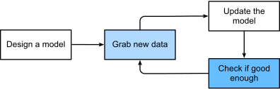

# Key concepts

To build traditional applications, we might **enumerate all the common events that our program should handle**. 

For example, whenever a customer clicks to add an item to their shopping cart, our program should add an entry to the shopping cart database table, associating that user’s ID with the requested product’s ID. 
We might then attempt to **step through every possible corner case, testing the appropriateness of our rules and making any necessary modifications**. What happens if a user initiates a purchase with an empty cart? 
While few developers ever get it completely right the first time (it might take some test runs to work out the kinks), for the most part we can write such programs and confidently launch them before ever seeing a real customer. 
Our ability to manually design automated systems that drive functioning products and systems, often in novel situations, is a remarkable cognitive feat. And when you are able to devise solutions that work 
 of the time, you typically should not be worrying about machine learning.

Fortunately for the growing community of machine learning scientists, many tasks that we would like to automate do not bend so easily to human ingenuity. 
Imagine huddling around the whiteboard with the smartest minds you know, but this time you are tackling one of the following problems:

* _Write a program that predicts tomorrow’s weather given geographic information, satellite images, and a trailing window of past weather._
* _Write a program that takes in a factoid question, expressed in free-form text, and answers it correctly._
* _Write a program that, given an image, identifies every person depicted in it and draws outlines around each._
* _Write a program that presents users with products that they are likely to enjoy but unlikely, in the natural course of browsing, to encounter._

For these problems, even elite programmers would struggle to code up solutions from scratch. The reasons can vary. 
Sometimes **the program that we are looking for follows a pattern that changes over time**, so there is no fixed right answer! In such cases, any successful solution must adapt gracefully to a changing world. At other times, the relationship (say between pixels, and abstract categories) may be too complicated, requiring thousands or millions of computations and following unknown principles. In the case of image recognition, the precise steps required to perform the task lie beyond our conscious understanding, even though our subconscious cognitive processes execute the task effortlessly.

> Machine learning is the study of algorithms that can learn from experience. As a machine learning algorithm accumulates more experience, typically in the form of observational data or interactions with an environment, its performance improves. Contrast this with our deterministic e-commerce platform, which follows the same business logic, no matter how much experience accrues, until the developers themselves learn and decide that it is time to update the software. In this book, we will teach you the fundamentals of machine learning, focusing in particular on deep learning, a powerful set of techniques driving innovations in areas as diverse as computer vision, natural language processing, healthcare, and genomics.
 
## A motivating example

We want an application being able to recognize the wake word ("Hello Siri") (Fig. 1.1.1). 
Every second, the microphone will collect roughly 44,000 samples. 
Each sample is a measurement of the amplitude of the sound wave. What rule could map reliably from a snippet of raw audio to confident predictions $\{yes, no\}$
 about whether the snippet contains the wake word? 
If you are stuck, do not worry. We do not know how to write such a program from scratch either. 
That is why we use machine learning.

*Figure 1.1.1*

Here is the trick. Often, even **when we do not know how to tell a computer explicitly how to map from inputs to outputs, we are nonetheless capable of performing the cognitive feat ourselves**. 
In other words, even if you do not know how to program a computer to recognize the word “Alexa”, you yourself are able to recognize it. 
Armed with this ability, we can **collect a huge dataset containing examples of audio snippets and associated labels, indicating which snippets contain the wake word**. 
In the currently dominant approach to machine learning, we do not attempt to design a system explicitly to recognize wake words. Instead, **we define a flexible program whose behavior is determined by a number of _parameters_**. 

Then we **use the dataset to determine the best possible parameter values, i.e., those that improve the performance of our program with respect to a chosen performance measure**.

> You can think of the _parameters_ **as knobs that we can turn, manipulating the behavior of the program**.

>Once the parameters are fixed, we call the program a **model**. The set of all distinct programs (input–output mappings) that we can produce just by manipulating the parameters is called a **family of models**. 

>And the “**meta-program**” that uses our dataset to choose the parameters is called a **learning algorithm**.

Before we can go ahead and engage the learning algorithm, we have to define the problem precisely, pinning down the exact nature of the inputs and outputs, and choosing an appropriate model family. 
In this case, **our model receives a snippet of audio as input, and the model generates a selection among 
$\{yes, no\}$ as output**. If all goes according to plan the model’s guesses will typically be correct as to whether the snippet contains the wake word.

If we choose the right family of models, there should exist one setting of the knobs such that the model fires “yes” every time it hears the word “Alexa”. 
Because the exact choice of the wake word is arbitrary, we will probably need a model family sufficiently rich that, via another setting of the knobs, it could fire “yes” only upon hearing the word “Apricot”. 

We expect that the same model family should be suitable for “Alexa” recognition and “Apricot” recognition because they seem, intuitively, to be similar tasks. 

However, we might need a different family of models entirely if we want to deal with fundamentally different inputs or outputs, say if we wanted to map from images to captions, or from English sentences to Chinese sentences.

As you might guess, if we just set all of the knobs randomly, it is unlikely that our model will recognize “Alexa”, “Apricot”, or any other English word. 

> In machine learning, the learning is the process by which we discover the right setting of the knobs for coercing the desired behavior from our model. 
 
In other words, we **train our model with data**. 

*Fig 1.1.2*

As shown in Fig. 1.1.2, the training process usually looks like the following:

1. Start off with a randomly initialized model that cannot do anything useful.

2. Grab some of your data (e.g., audio snippets and corresponding 
 labels).

3. Tweak the knobs to make the model perform better as assessed on those examples.

4. Repeat Steps 2 and 3 until the model is awesome.

To summarize, rather than code up a wake word recognizer, we **code up a program that can learn to recognize wake words**, 
if presented with a large labeled dataset. You can think of this act of determining a program’s behavior by presenting it with a dataset as programming with data. 
That is to say, we can “program” a cat detector by providing our machine learning system with many examples of cats and dogs. 
This way the detector will eventually learn to emit a very large positive number if it is a cat, a very large negative number if it is a dog, and something closer to zero if it is not sure. 
This barely scratches the surface of what machine learning can do. 
Deep learning, which we will explain in greater detail later, is just one among many popular methods for solving machine learning problems.

## Key components

In our wake word example, we described a dataset consisting of audio snippets and binary labels, and we gave a hand-wavy sense of how we might train a model to approximate a mapping from snippets to classifications. 
This sort of problem, where we try to predict a designated unknown label based on known inputs given a dataset consisting of examples for which the labels are known, is called **supervised learning**. 
This is just one among many kinds of machine learning problems. 
Before we explore other varieties, we would like to shed more light on some core components that will follow us around, no matter what kind of machine learning problem we tackle:

* The **data** that we can learn from.

* A **model** of how to transform the data.

* An **objective function** that quantifies how well (or badly) the model is doing.

* An **algorithm** to adjust the model’s parameters to optimize the objective function.

### Data

Generally, we are concerned with a collection of examples. In order to work with data usefully, we typically need to come up with a suitable numerical representation. 
Each example (or data point, data instance, sample) typically consists of a set of attributes called **features** (sometimes called **covariates** or **inputs**), based on which the model must make its predictions. 
In **supervised learning problems**, our goal is to **predict the value of a special attribute, called the label (or _target_)**, that is not part of the model’s input.

If we were working with image data, each example might consist of an individual photograph (the features) and a number indicating the category to which the photograph belongs (the label). 
The 200x200 photograph would be represented numerically as three grids of numerical values RGB so that $200x200x3 = 120.000$ different values.

Alternatively, we might work with electronic health record data and tackle the task of predicting the likelihood that a given patient will survive the next 30 days. 
Here, our features might consist of a collection of readily available attributes and frequently recorded measurements, including age, vital signs, comorbidities, current medications, and recent procedures. 
The label available for training would be a binary value indicating whether each patient in the historical data survived within the 30-day window.

> In such cases, **when every example is characterized by the same number of numerical features, we say that the inputs are _fixed-length vectors_** and we call the (constant) length of the vectors the **dimensionality of the data**. As you might imagine, fixed-length inputs can be convenient, giving us one less complication to worry about. 

However, not all data can easily be represented as fixed-length vectors. While we might expect microscope images to come from standard equipment, we cannot expect images mined from the Internet all to have the same resolution or shape. For images, we might consider cropping them to a standard size, but that strategy only gets us so far. 
We risk losing information in the cropped-out portions. Moreover, text data resists fixed-length representations even more stubbornly. Consider the customer reviews left on e-commerce sites such as Amazon, IMDb, and TripAdvisor. 
Some are short: “it stinks!”. Others ramble for pages. One major advantage of deep learning over traditional methods is the comparative grace with which modern models can handle varying-length data.

> Finally, it is not enough to have lots of data and to process it cleverly. We need the right data. If the data is full of mistakes, or if the chosen features are not predictive of the target quantity of interest, learning is going to fail. The situation is captured well by the cliché: garbage in, garbage out. 

Moreover, poor predictive performance is not the only potential consequence. In sensitive applications of machine learning, like predictive policing, resume screening, and risk models used for lending, we must be especially alert to the consequences of garbage data. One commonly occurring failure mode concerns datasets where some groups of people are unrepresented in the training data. 
Imagine applying a skin cancer recognition system that had never seen black skin before. Failure can also occur when the data does not only under-represent some groups but reflects societal prejudices. For example, if past hiring decisions are used to train a predictive model that will be used to screen resumes then machine learning models could inadvertently capture and automate historical injustices. 
Note that this can all happen without the data scientist actively conspiring, or even being aware.

### Models
Most machine learning involves transforming the data in some sense. 
We might want to build a system that ingests photos and predicts smiley-ness. 
Alternatively, we might want to ingest a set of sensor readings and predict how normal vs. anomalous the readings are. 

> By **model**, we denote the computational machinery for ingesting data of one type, and spitting out predictions of a possibly different type. 

In particular, we are interested in statistical models that can be estimated from data. 
While simple models are perfectly capable of addressing appropriately simple problems, the problems that we focus on in this book stretch the limits of classical methods. 
Deep learning is differentiated from classical approaches principally by the set of powerful models that it focuses on. 
These models consist of many successive transformations of the data that are chained together top to bottom, thus the name deep learning. 
On our way to discussing deep models, we will also discuss some more traditional methods.

### Objective Functions
Earlier, we introduced machine learning as learning from experience. By learning here, we mean improving at some task over time. 
But who is to say what constitutes an improvement? You might imagine that we could propose updating our model, and some people might disagree on whether our proposal constituted an improvement or not.

> In order to develop a formal mathematical system of learning machines, we need to have **formal measures of how good (or bad) our models are**. 
> In machine learning, and optimization more generally, we call these **objective functions**. 

By convention, we usually define objective functions so that **lower is better**. This is merely a convention. You can take any function for which higher is better, and turn it into a new function that is qualitatively identical but for which lower is better by flipping the sign. 

> Because we choose lower to be better, these functions are sometimes called **loss functions**.

When trying to predict numerical values, the most common loss function is squared error, i.e., the square of the difference between the prediction and the ground truth target. 
For classification, the most common objective is to minimize error rate, i.e., the fraction of examples on which our predictions disagree with the ground truth. 

Some objectives (e.g., squared error) are easy to optimize, while others (e.g., error rate) are difficult to optimize directly, owing to non-differentiability or other complications. 

In these cases, it is common instead to optimize a surrogate objective.

During optimization, we think of the loss as a function of the model’s parameters, and treat the training dataset as a constant. We learn the best values of our model’s parameters by minimizing the loss incurred on a set consisting of some number of examples collected for training. 
However, **doing well on the training data does not guarantee that we will do well on unseen data**. 

> So we will typically want to split the available data into two partitions: t**he training dataset** (or training set), for learning model parameters; and the **test dataset** (or test set), which is held out for evaluation.

At the end of the day, we typically report how our models perform on both partitions. 
You could think of training performance as analogous to the scores that a student achieves on the practice exams used to prepare for some real final exam. 
Even if the results are encouraging, that does not guarantee success on the final exam. Over the course of studying, the student might begin to memorize the practice questions, appearing to master the topic but faltering when faced with previously unseen questions on the actual final exam. 
When a model performs well on the training set but fails to generalize to unseen data, we say that it is **overfitting to the training data**.

### Optimization Algorithms
Once we have got some data source and representation, a model, and a well-defined objective function, we need an 

> algorithm capable of searching for the best possible parameters for minimizing the loss function. 

Popular optimization algorithms for deep learning are based on an approach called **gradient descent**. 
In brief, at each step, this method checks to see, for each parameter, how that training set loss would change if you perturbed that parameter by just a small amount. 
It would then update the parameter in the direction that lowers the loss.

