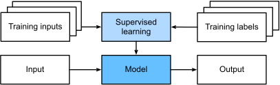
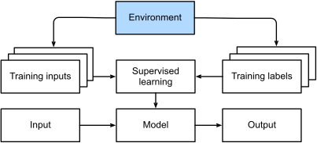
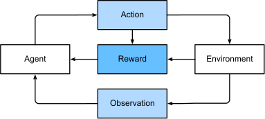

# Kind of machine learning problems

https://d2l.ai/chapter_introduction/index.html#kinds-of-machine-learning-problems

## Supervised learning

> <span style="color:red">Supervised learning</span> describes tasks where we are given a dataset containing both
> features (data attributes) and labels (assigned output) and asked to produce a model that predicts the labels when
> given
> input features.
> Each feature–label pair is called an <span style="color:red">example</span>.

Sometimes, when the context is clear, we may use the term examples to refer to a collection of inputs, even when the
corresponding labels are unknown.
The supervision comes into play because, for choosing the parameters, we (the supervisors) provide the model with a
dataset consisting of labeled examples.
In probabilistic terms, we typically are interested in estimating the conditional probability of a label given input
features.
While it is just one among several paradigms, supervised learning accounts for the majority of successful applications
of machine learning in industry.
Partly that is because many important tasks can be described crisply as estimating the probability of something unknown
given a particular set of available data:

* Predict cancer vs. not cancer, given a computer tomography image.
* Predict the correct translation in French, given a sentence in English.
* Predict the price of a stock next month based on this month’s financial reporting data.

While all supervised learning problems are captured by the simple description _“predicting the labels given input
features”,_ supervised learning itself can take diverse forms and require tons of modeling decisions, depending on (
among other considerations) the type, size, and quantity of the inputs and outputs.

For example, we use different models for processing sequences of arbitrary lengths and fixed-length vector
representations.
We will visit many of these problems in depth throughout this book.

Informally, the learning process looks something like the following:

1. First, <span style="color:red">create the training set</span>:  grab a big collection of examples for which the
   features are known and select from them a random subset, acquiring the ground truth labels for each.
    1. Sometimes these labels might be available data that have already been collected (e.g., did a patient die within
       the following year?) and other times we might need to employ human annotators to label the data, (e.g., assigning
       images to categories). Together, these inputs and corresponding labels comprise the training set.
1. We feed the training dataset into a <span style="color:red">supervised learning algorithm</span>, a function that
   takes as input a dataset and outputs another function: the learned model.
    2. $f(training\_set)=learned\_model$
1. Finally, we can feed previously unseen inputs to the <span style="color:red">learned model</span>, using its outputs
   as predictions of the corresponding label.
    1. $label(learned\_model(another\_known\_set)) <> label(another\_known\_set)$
    1. The full process is drawn in Fig. 1.3.1.


*Fig. 1.3.1: supervised learning*

### Regression (_how much?_ _how many?_)

Perhaps the simplest supervised learning task to wrap your head around is regression.

Consider, for example, a set of data harvested from a database of home sales.
We might construct a table, in which each row corresponds to a different house, and each column corresponds to some
relevant attribute, such as the square footage of a house, the number of bedrooms, the number of bathrooms, and the
number of minutes (walking) to the center of town.
In this dataset, each example would be a specific house, and the corresponding feature vector would be one row in the
table.
If you live in New York or San Francisco, and you are not the CEO of Amazon, Google, Microsoft, or Facebook, the (sq.
footage, no. of bedrooms, no. of bathrooms, walking distance) feature vector for your home might look something
like: $[600, 1, 1, 60]$.
However, if you live in Pittsburgh, it might look more like $[3200, 3, 5, 10]$. Fixed-length feature vectors like this
are essential for most classic machine learning algorithms.

> What makes a problem a regression is actually the form of the target.

Say that you are in the market for a new home. You might want to estimate the fair market value of a house, given some
features such as above.
The data here might consist of historical home listings and the labels might be the observed sales prices.

> When labels take on <span style="color:red">arbitrary numerical values</span> (even within some interval), we call
> this a <span style="color:red">**regression problem**</span>.
> The goal is to produce a model whose predictions closely approximate the actual label values.

> A good rule of thumb is that any _how much_? or _how many_? problem is likely to be regression.

Lots of practical problems are easily described as regression problems. Predicting the rating that a user will assign to
a movie can be thought of as a regression problem and if you designed a great algorithm to accomplish this feat in 2009,
you might have won the 1-million-dollar Netflix prize.
Predicting the length of stay for patients in the hospital is also a regression problem. For example:

* How many hours will this surgery take?

* How much rainfall will this town have in the next six hours?

### Loss function for regression - **squared error**

We will try to learn models that minimize the distance between our predictions and the observed values.
In most of our chapters, we will focus on minimizing the <span style="color:red">**squared error loss function**</span>.
As we will see later, this loss corresponds to the assumption that our data were corrupted by Gaussian noise.

### Classification (_which one?_)

While regression models are great for addressing how many? questions, lots of problems do not fit comfortably in this
template.

Consider, for example, a bank that wants to develop a check scanning feature for its mobile app.
Ideally, the customer would simply snap a photo of a check and the app would automatically recognize the text from the
image.
Assuming that we had some ability to segment out image patches corresponding to each handwritten character, then the
primary remaining task would be to determine which character among some known set is depicted in each image patch.
These kinds of which one? problems are called classification and require a different set of tools from those used for
regression, although many techniques will carry over.

> In classification, we want our model to look at features, e.g., the pixel values in an image, and
> then <span style="color:red">predict to which category (sometimes called a **class**) among some discrete set of
> options, an example belongs</span>.

For handwritten digits, we might have ten classes, corresponding to the digits 0 through 9.

The simplest form of classification is when there are only two classes, a problem which we call <span style="color:red">
binary classification</span>.

For example, our dataset could consist of images of animals and our labels might be the classes $\{cat,dog\}$.

> In these cases, **it is usually much easier to express our model in the language of probabilities**.
> Given features of an example, our model assigns a probability to each possible class. Returning to our animal
> classification example where the classes are  $\{cat,dog\}$, a classifier might see an image and output the
> probability
> that the image is a cat as 0.9.
> We can interpret this number by saying that the classifier is 90% sure that the image depicts a cat.

The magnitude of the probability for the predicted class conveys a notion of **uncertainty**.

When we have more than two possible classes, we call the problem <span style="color:red">multiclass
classification</span>.
Common examples include handwritten character recognition.

#### Loss function for classification - **cross-entropy**

While we attacked regression problems by trying to minimize the squared error loss function, the common loss function
for classification problems is called **cross-entropy**, whose name will be demystified when we introduce information
theory in later chapters.

Note that the most likely class is not necessarily the one that you are going to use for your decision.
This happens when the risk of accepting uncertainty is greater than the benefit of accepting the prediction.
For example, we don't accept the 80% of a mushroom to be lethat accepting the 20% risk of dying for just a dinner.

Classification can get much more complicated than just binary or multiclass classification. For instance, there are some
variants of classification addressing hierarchically structured classes.
In such cases not all errors are equal—if we must err, we might prefer to misclassify to a related class rather than a
distant class. Usually, this is referred to as hierarchical classification.

### Tagging

Some classification problems fit neatly into the binary or multiclass classification setups.
For example, we could train a normal binary classifier to distinguish cats from dogs.
Given the current state of computer vision, we can do this easily, with off-the-shelf tools.
Nonetheless, no matter how accurate our model gets, we might find ourselves in trouble when the classifier encounters an
image of the
Town Musicians of Bremen, a popular German fairy tale featuring four animals stacked one on the other
(a donkey, a dog, a cat, and a rooster).

If we anticipate encountering such images, **multiclass classification might not be the right problem formulation**.

> The problem of learning to predict classes that are not mutually exclusive is called <span style="color:red">
> multi-label classification</span>.
> Auto-tagging problems are typically best described in terms of multi-label classification.

Think of the tags people might apply to posts on a technical blog, e.g., “machine learning”, “technology”, “gadgets”,
“programming languages”, “Linux”, “cloud computing”, “AWS”.

A typical article might have 5–10 tags applied. Typically, tags will exhibit some correlation structure. Posts about
“cloud computing” are likely to mention “AWS” and posts about “machine learning” are likely to mention “GPUs”.

Sometimes such tagging problems draw on enormous label sets. The National Library of Medicine employs many professional
annotators who associate each article to be indexed in PubMed with a set of tags drawn from the Medical Subject
Headings (MeSH) ontology,
a collection of roughly 28,000 tags.
Correctly tagging articles is important because it allows researchers to conduct exhaustive reviews of the literature.
This is a time-consuming process and typically there is a one-year lag between archiving and tagging. Machine learning
can provide provisional tags until each article has a proper manual review. Indeed, for several years, the BioASQ
organization has hosted competitions for this task.

### Search

In the field of information retrieval, we often impose ranks on sets of items.
Take web search for example.

> The goal is less to determine whether a particular page is relevant for a query, but rather which, among a set of
> relevant results, should be shown most prominently to a particular user.

One way of doing this might be to first assign a score to every element in the set and then to retrieve the top-rated
elements. `PageRank`, the original secret sauce behind the Google search engine, was an early example of such a scoring
system.
`Weirdly`, the scoring provided by PageRank did not depend on the actual query. Instead, they relied on a simple
relevance filter to identify the set of relevant candidates and then used PageRank to prioritize the more authoritative
pages.

Nowadays, search engines use machine learning and behavioral models to obtain query-dependent relevance scores.
There are entire academic conferences devoted to this subject.

### Recommender Systems

Recommender systems are another problem setting that is related to search and ranking.

> The problems are similar insofar as the goal is to display a set of items relevant to the user.
> The main difference is the emphasis on <span style="color:red">personalization to specific users in the context of
> recommender systems<span style="color:red">.

In some cases, **customers provide explicit feedback**, communicating how much they liked a particular product (e.g.,
the product ratings and reviews on Amazon, IMDb, or Goodreads).
In other cases, they provide **implicit feedback**, e.g., by skipping titles on a playlist, which might indicate
dissatisfaction or maybe just indicate that the song was inappropriate in context.

In the simplest formulations, these systems are trained to estimate some score, such as an expected star rating or the
probability that a given user will purchase a particular item.

Despite their tremendous economic value, recommender systems naively built on top of predictive models suffer some
serious conceptual flaws.

To start, we only observe censored feedback: users preferentially rate movies that they feel strongly about. For
example, on a five-point scale, you might notice that items receive many one- and five-star ratings but that there are
conspicuously few three-star ratings.
Moreover, current purchase habits are often a result of the recommendation algorithm currently in place, but learning
algorithms do not always take this detail into account.
Thus it is possible for feedback loops to form where a recommender system preferentially pushes an item that is then
taken to be better (due to greater purchases) and in turn is recommended even more frequently.

### Sequence Learning

So far, we have looked at problems where we have some fixed number of inputs and produce a fixed number of outputs.

> So far we have seen that the trained model is able to make predictions based on the current input only: there is no
> need to
> memorize the results of previous tests to produce the current result

For instance in video streams, one prediction on a frame might be dependent on frames before and after it.

The same goes for context analysis in language or simply translation.

> Questions like these are among the most exciting applications of machine learning and they are instances
> of <span style="color:red">**sequence learning**</span>.
> They require a model either to ingest sequences of inputs or to emit sequences of outputs (or both).

Specifically, sequence-to-sequence learning considers problems where both inputs and outputs consist of variable-length
sequences.

Examples include machine translation and speech-to-text transcription.

Tagging and Parsing. This involves annotating a text sequence with attributes. Here, the inputs and outputs are aligned,
i.e., they are of the same number and occur in a corresponding order.
For instance, in part-of-speech (PoS) tagging, we annotate every word in a sentence with the corresponding part of
speech, i.e., “noun” or “direct object”. Alternatively, we might want to know which groups of contiguous words refer to
named entities, like people, places, or organizations.
In the cartoonishly simple example below, we might just want to indicate whether or not any word in the sentence is part
of a named entity (tagged as “Ent”).

```
Tom has dinner in Washington with Sally
Ent  -    -    -     Ent      -    Ent
```

Automatic Speech Recognition. With speech recognition, the input sequence is an audio recording of a speaker (Fig.
1.3.5), and the output is a transcript of what the speaker said.
The challenge is that there are many more audio frames (sound is typically sampled at 8kHz or 16kHz) than text, i.e.,
there is no 1:1 correspondence between audio and text, since thousands of samples may correspond to a single spoken
word.
These are sequence-to-sequence learning problems, where the output is much shorter than the input. While humans are
remarkably good at recognizing speech, even from low-quality audio, getting computers to perform the same feat is a
formidable challenge.
../_images/speech.png

## Unsupervised and Self-Supervised Learning

The previous examples focused on supervised learning, where we feed the model a giant dataset containing both the
features and corresponding label values.

> The input is here a huge amount of unlabelled data with the need of answer to a variery of questions.

To whet your appetite for now, we describe a few of the following questions you might ask.

There are examples of unsupervised learning problems

| Description                                                                                                                                                                                                                                                                                                                                                                                                                                                                                                                                                         | Type                                                                                   |
|---------------------------------------------------------------------------------------------------------------------------------------------------------------------------------------------------------------------------------------------------------------------------------------------------------------------------------------------------------------------------------------------------------------------------------------------------------------------------------------------------------------------------------------------------------------------|----------------------------------------------------------------------------------------|
| Group photos by type (landscapes, portraits etc...); extraxt user profiles by browser interactions                                                                                                                                                                                                                                                                                                                                                                                                                                                                  | Clustering                                                                             |  
| Extract number of parameters to capture the proprieties of the data, i.e. velocity, mass, trajectory for a moving ball, body sized for a tailor,                                                                                                                                                                                                                                                                                                                                                                                                                    | Subspace estimation or principal component analysis PCA (in case of linear dependency) |
| Extract symbolic properties (Known logical/relational facts between objects) from data allowing to match objects into vectors of Eucledian space, so that geometry ops can mirror the logical relationships  (vector("Rome") - vector("Italy") ≈ vector("Paris") - vector("France")) in the `isCapital` `isCountry` `isCity` relationship. This extraction is completerly unsupervised                                                                                                                                                                              | Embedding                                                                              |
| Given raw empirical data (no experiments, no labels), can we figure out why things are the way they are — i.e., the hidden causal structure? Given pollution, house prices, density, salaries, education data lead to answers to questions like: Does low education cause low salaries, or do both stem from poverty?Does high crime cause low house prices, or does pollution drive both crime and low prices? this can be represented with Bayesian networks with Nodes = variables (crime, salary, etc.) Edges = probabilistic dependencies or causal influences | Causal Discovery & Probabilistic Graphical Models                                      |

### Deep generative models

> The core idea: Instead of learning to classify or predict labels, a generative model tries to learn the underlying
> probability distribution of the data itself — i.e., what does data in this domain look like?

Once it learns this, it can:

* **Score examples** — how probable/realistic is this data point?
* **Sample** — generate brand new, synthetic examples that look like real data

There are four major families mentioned:

| Model                                      | Key Idea                                                                                                                                                 |
|--------------------------------------------|----------------------------------------------------------------------------------------------------------------------------------------------------------|
| **Variational Autoencoders (VAEs)**        | Encode data into a compressed latent space, then decode back. Learns an explicit distribution over a latent space                                        |
| **Generative Adversarial Networks (GANs)** | Two networks (generator vs. discriminator) compete — the generator learns to produce realistic samples implicitly, without modeling the density directly |
| **Normalizing Flows**                      | Learn an explicit, exact density by transforming a simple distribution (e.g. Gaussian) through a series of invertible mappings                           |
| **Diffusion Models**                       | Learn to denoise data step by step — the basis of modern image generators like Stable Diffusion and DALL·E                                               |

**Explicit** vs. **implicit** density estimation is an important distinction:

* Explicit (VAEs, Flows): the model directly computes a probability score for any input
* Implicit (GANs): the model can sample from the distribution but can't easily score arbitrary inputs


## Interacting with an Environment

So far, we have not discussed where data actually comes from, or what actually happens when a machine learning model
generates an output. That is because supervised learning and unsupervised learning do not address these issues in a very
sophisticated way. In each case, we grab a big pile of data upfront, then set our pattern recognition machines in motion
without ever interacting with the environment again. Because all the learning takes place after the algorithm is
disconnected from the environment, this is sometimes called o**ffline learning**. For example, supervised learning assumes
the simple interaction pattern depicted in Fig. 1.3.6.


*Fig. 1.3.6 Collecting data for supervised learning from an environment.*

This simplicity of offline learning has its charms. The upside is that we can worry about pattern recognition in
isolation, with no concern about complications arising from interactions with a dynamic environment. 

Considering the interaction with an environment opens a whole set of new modeling questions. The following are just a
few examples.

* Does the environment remember what we did previously?

* Does the environment want to help us, e.g., a user reading text into a speech recognizer?

* Does the environment want to beat us, e.g., spammers adapting their emails to evade spam filters?

* Does the environment have shifting dynamics? For example, would future data always resemble the past or would the patterns change over time, either naturally or in response to our automated tools?

These questions raise the problem of distribution shift, where training and test data are different. An example of this,
that many of us may have met, is when taking exams written by a lecturer, while the homework was composed by their
teaching assistants. Next, we briefly describe reinforcement learning, a rich framework for posing learning problems in
which an agent interacts with an environment.

### Reinforcement Learning RL

> In Reinforcement Learning (RL), the relationship between an agent and its environment is the core mechanism of learning. Unlike "offline" methods where models simply process static data,
> an RL agent is an active entity designed to take actions that directly impact its world.

The interaction follows a continuous loop:

* **Observation & Reward**: At each time step, the environment provides the agent with an observation of the current state and a reward signal (feedback).
* **Action**: The agent uses its policy —a function mapping observations to actions— to decide what to do.
* **Actuation**: The chosen action is sent back to the environment via an actuator, which then updates the state and produces a new observation and reward.



This dynamic creates unique challenges. 
* For instance, the agent must deal with <span style="color:red">credit assignment</span>, or determining which specific actions were responsible for a reward that might be delayed (in a game the reward is the victory known only at the end).
* Reinforcement learners may also have to deal with the problem of <span style="color:red">partial observability</span>. That is, the current observation might not tell you everything about your current state. Say your cleaning robot found itself trapped in one of many identical closets in your house. Rescuing the robot involves inferring its precise location which might require considering earlier observations prior to it entering the closet.
* It also faces the <span style="color:red">exploration vs. exploitation</span> dilemma: deciding whether to try new strategies or stick with the best-known path to maximize total rewards.


