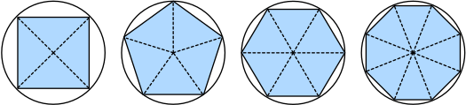
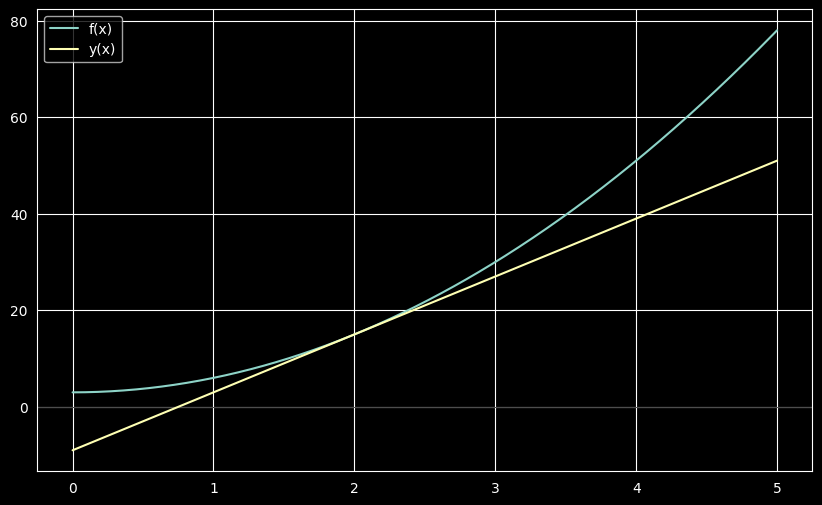
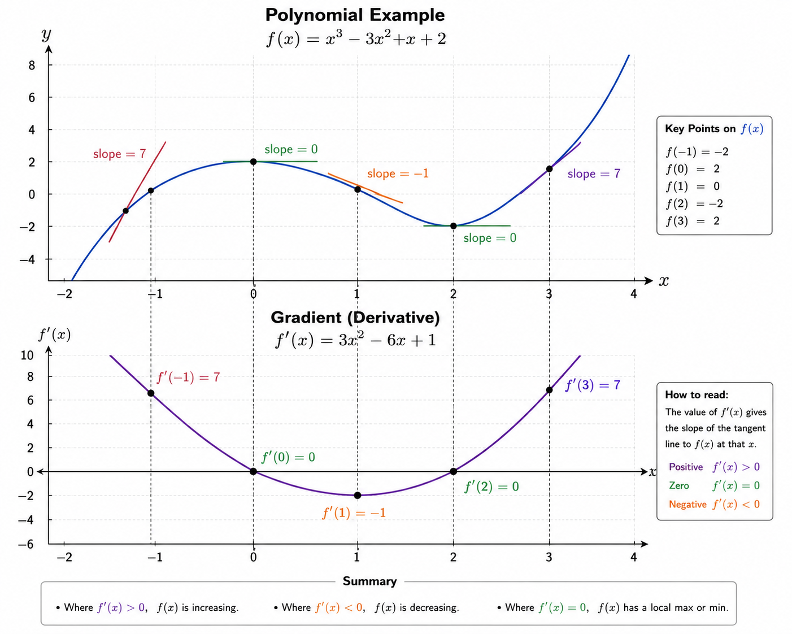
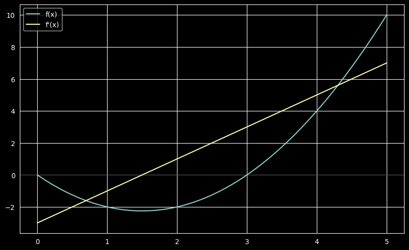
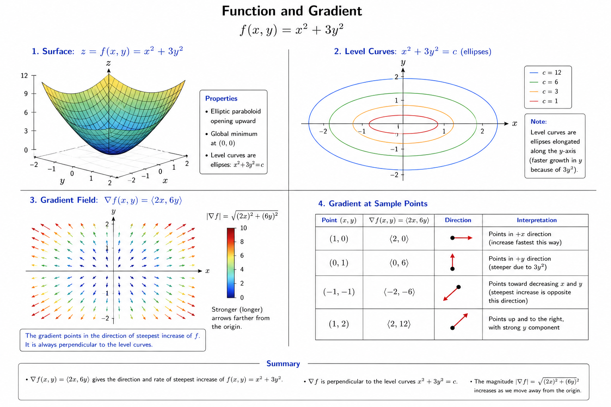

# Calculus

For a long time, how to calculate 
the area of a circle remained a mystery.
Then, in Ancient Greece, the mathematician Archimedes
came up with the clever idea 
to inscribe a series of polygons 
with increasing numbers of vertices
on the inside of a circle
(Fig. 2.4.1). 
For a polygon with $n$ vertices,
we obtain $n$ triangles.
The height of each triangle approaches the radius $r$ 
as we partition the circle more finely. 
At the same time, its base approaches $2 \pi r/n$, 
since the ratio between arc and secant approaches 1 
for a large number of vertices. 
Thus, the area of the polygon approaches
$n \cdot r \cdot \frac{1}{2} (2 \pi r/n) = \pi r^2$.


*Fig. 2.4.1*

This limiting procedure is at the root of both 
<span style="color:red">*differential calculus*</span> and <span style="color:red">*integral calculus*</span>. 

> The former can tell us how to increase
> or decrease a function's value by
> manipulating its arguments.
> This comes in handy for the *optimization problems*
> that we face in deep learning,
> where we repeatedly update our parameters
> in order to decrease the loss function.


Optimization addresses how to fit our models to training data,
and calculus is its key prerequisite.

However, do not forget that our ultimate goal is to perform well on *previously unseen* data.
That problem is called *generalization* and will be a key focus of other chapters.

## Derivatives and Differentiation

> Put simply, a *derivative* is <span style="color:red"> the rate of change
> in a function with respect to changes in its arguments</span>.

> Derivatives can tell us how rapidly a loss function
> would increase or decrease were we
> to *increase* or *decrease* each parameter
> by an infinitesimally small amount.

Formally, for functions $f: \mathbb{R} \rightarrow \mathbb{R}$,
that map from scalars to scalars,
[**the *derivative* of $f$ at a point $x$ is defined as**]

<span style="color:cyan">**$$f'(x) = \lim_{h \rightarrow 0} \frac{f(x+h) - f(x)}{h}.$$**</span>
:eqlabel:`eq_derivative`

This limit <span style="color:red">tells us what the ratio between a perturbation $h$
and the change in the function value $f(x + h) - f(x)$ converges to 
as we shrink its size to zero<span style="color:red">.

When $f'(x)$ exists, $f$ is said to be <span style="color:red">*differentiable*</span> at $x$

We say that $f$ is <span style="color:red">differentiable on a set $[a,b]$ </span> when

$$ \exists f'(x)  \forall x \in [a,b] $$


Not all functions are differentiable, including many that we wish to optimize,
such as accuracy and the area under the receiving operating characteristic (AUC).
However, because computing the derivative of the loss is a crucial step in nearly all 
algorithms for training deep neural networks, we often optimize a differentiable *surrogate* instead.


> We can interpret the derivative $f'(x)$ as the *instantaneous* rate of change of $f(x)$ with respect to $x$.

### Derivative function example

Let's develop some intuition with an example.
(**Define $u = f(x) = 3x^2-4x$.**)

```python
def f(x):
    return 3 * x ** 2 - 4 * x
```

and the derivative 

```python
def f_1(x, h):
    return (f(x+h)-f(x))/h
```

[**Setting $x=1$, we see that $\frac{f(x+h) - f(x)}{h}$**] (**approaches $2$
as $h$ approaches $0$.**)
While this experiment lacks 
the rigor of a mathematical proof,
we can quickly see that indeed $f'(1) = 2$.

```python
for h_v in 10.0**np.arange(-1, -6, -1):
    print(f'h={h_v:.5f}, numerical limit={f_1(1,h_v):.5f}')
```

Results in 
```text
h=0.10000, numerical limit=2.30000
h=0.01000, numerical limit=2.03000
h=0.00100, numerical limit=2.00300
h=0.00010, numerical limit=2.00030
h=0.00001, numerical limit=2.00003
```

### Notations

There are several equivalent notational conventions for derivatives.
Given $y = f(x)$, the following expressions are equivalent:

$$f'(x) = y' = \frac{dy}{dx} = \frac{df}{dx} = \frac{d}{dx} f(x) = Df(x) = D_x f(x),$$

### Common function derivatives

$$\begin{aligned} \frac{d}{dx} C & = 0 && \textrm{for any constant $C$} \\ \frac{d}{dx} x^n & = n x^{n-1} && \textrm{for } n \neq 0 \\ \frac{d}{dx} e^x & = e^x \\ \frac{d}{dx} \ln x & = x^{-1}. \end{aligned}$$

### Derivatives rules

> Functions composed from differentiable functions
> are often themselves differentiable.


The following rules come in handy for working with compositions of any differentiable functions 
$f$ and $g$, and constant $C$.

$$\begin{aligned} \frac{d}{dx} [C f(x)] & = C \frac{d}{dx} f(x) && \textrm{Constant multiple rule} \\ \frac{d}{dx} [f(x) + g(x)] & = \frac{d}{dx} f(x) + \frac{d}{dx} g(x) && \textrm{Sum rule} \\ \frac{d}{dx} [f(x) g(x)] & = f(x) \frac{d}{dx} g(x) + g(x) \frac{d}{dx} f(x) && \textrm{Product rule} \\ \frac{d}{dx} \frac{f(x)}{g(x)} & = \frac{g(x) \frac{d}{dx} f(x) - f(x) \frac{d}{dx} g(x)}{g^2(x)} && \textrm{Quotient rule} \end{aligned}$$

Using this, we can apply the rules 
to find the derivative of $3 x^2 - 4x$ via

$$\frac{d}{dx} [3 x^2 - 4x] = 3 \frac{d}{dx} x^2 - 4 \frac{d}{dx} x = 6x - 4.$$

Plugging in $x = 1$ shows that, indeed, the derivative equals $2$ at this location. 
Note that derivatives tell us the *slope* of a function at a particular location.

### Geometrical meaning of the derivative

> The derivative in a point $f'(x_0)$ is the slope $m$ of the tangent rect in $f(x_0)$

$$
f(x)=3x^2+3  \Rightarrow  f'(x)=m=6x \Rightarrow y=mx+q 
$$

So in $x_0$ we have

$$f(x_0)=f'(x_0)x_0 + q$$

So we have $q$

$$q=f(x_0) - f'(x_0)x_0$$

So per $x_0 = 2$ we have

$$f(x_0)=15 \Rightarrow f'(x_0)=m=12$$

$$q=15-12*2=-9 $$

$$y = 12x-9 $$


```python
from plotting.plotter import Plotter

import sympy as sp

# define function
plotter = Plotter(0, 5, (10,6), 500)
x = plotter.x
f = 3*x**2 + 3
y = 12*x-9
plotter.plot(f, label='f(x)')
f_prime = sp.diff(f, x)
plotter.plot(y, label='y(x)')
# plotter.plot(f_integral, label='f_int(x)')
plotter.show()
```





## Visualization

A module has been creted in `modules/plotting/plotter.py` which contains a `Plotter` class to plot one or more functions.

Example:

```python
from plotting.plotter import Plotter

import sympy as sp

# define function
plotter = Plotter(0, 5, (10,6), 500)
x = plotter.x
f = x**2 -3*x
plotter.plot(f, label='f(x)')
f_prime = sp.diff(f, x)
f_integral = sp.integrate(f, x)
plotter.plot(f_prime, label='f\'(x)')
# plotter.plot(f_integral, label='f_int(x)')
plotter.show()
```



> To use the class in a Juputer notebook, make sure to mark the `modules` class as **source root** and, if necessary, 
> restart the notebook kernel.

## Partial Derivatives and Gradients

> Derivative applied to _multivariate_ functions

Let $y = f(x_1, x_2, \ldots, x_n)$ be a function with $n$ variables. 

> The <span style="color:red">*partial derivative* of $y$
> with respect to its $i^\textrm{th}$ parameter $x_i$ is </span>

$$ \frac{\partial y}{\partial x_i} = \lim_{h \rightarrow 0} \frac{f(x_1, \ldots, x_{i-1}, x_i+h, x_{i+1}, \ldots, x_n) - f(x_1, \ldots, x_i, \ldots, x_n)}{h}.$$


To calculate $\frac{\partial y}{\partial x_i}$, we can treat $x_1, \ldots, x_{i-1}, x_{i+1}, \ldots, x_n$ as constants 
and calculate the derivative of $y$ with respect to $x_i$. 

The following notational conventions for partial derivatives 
are all common and all mean the same thing:

$$\frac{\partial y}{\partial x_i} = \frac{\partial f}{\partial x_i} = \partial_{x_i} f = \partial_i f = f_{x_i} = f_i = D_i f = D_{x_i} f.$$

> We can concatenate partial derivatives of a multivariate function
> with respect to all its variables to obtain a vector that is called
> the <span style="color:red">*gradient*</span> of the function.
 

Suppose that the input of function $f: \mathbb{R}^n \rightarrow \mathbb{R}$ 
is an $n$-dimensional vector $\mathbf{x} = [x_1, x_2, \ldots, x_n]^\top$ 
and the output is a scalar. 

The gradient of the function $f$ 
with respect to $\mathbf{x}$ 
is a vector of $n$ partial derivatives:

<span style="color:red">$$\nabla_{\mathbf{x}} f(\mathbf{x}) = \left[\partial_{x_1} f(\mathbf{x}), \partial_{x_2} f(\mathbf{x}), \ldots
\partial_{x_n} f(\mathbf{x})\right]^\top.$$</span>

When there is no ambiguity, $\nabla_{\mathbf{x}} f(\mathbf{x})$ 
is typically replaced 
by $\nabla f(\mathbf{x})$.

### Geometrical meaning

> The gradient is a $n$-dimensional vector pointing toward steepest ascent
> whose length equals the maximum rate of increase


_“The gradient is the multivariable version of slope.”_

### Examples

#### Basic Basic Polynomial $f(x,y)=x^2+3y^2$

If we build the gradient as a vector

$\nabla f(x,y)=\begin{bmatrix}\frac{\partial f}{\partial x} \\ \frac{\partial f}{\partial y}\end{bmatrix}=\begin{bmatrix}2x \\ 6y\end{bmatrix}$

for $(x,y)=(1,2) \Rightarrow \nabla f(1,2)=\begin{bmatrix}2 \\ 12\end{bmatrix}$

this means that the function on $(1,2)$ increasing x changes $f$ moderately
increasing y changes $f$ much faster

$ \Vert \nabla f(1,2) \Vert = \sqrt{2^2+12^2}$




### Gradient rules

* **Sum Rule**: $\nabla(f+g)=\nabla f+\nabla g$
* **Scalar multiplication:**$\nabla(cf)=c\nabla f$
* **Product rule:**$\nabla(fg)=f\nabla g+g\nabla f$
* **Chain rule**: given $z=f(g(x,y))$ then $\nabla z=f′(g)\nabla g$

### Gradient rules for matrix

Facilitate the gradient calculation for multivariate functions

>$$
\nabla(x^TAx)=(A+A^T)x
$$

Most optimization problems minimize functions like:

$ f(x)=x^TAx+b^Tx+c$

This appears everywhere:

* least squares
* regression
* neural networks
* control systems
* physics simulations

To find minima, set gradient to zero:

$∇f=0$

Using the rule:

$Ax−b=0$ 

which becomes a linear system:

$Ax=b$

So the gradient rule converts calculus into linear algebra.

Given

with $x=\begin{bmatrix}x_1 \\ x_2\end{bmatrix}$ 

and $A=\begin{bmatrix}1 & 2 \\ 3 & 4\end{bmatrix}$, $b=\begin{bmatrix}5 \\ 6\end{bmatrix}$  

So:

$f(x)= x^T\begin{bmatrix}1 & 2 \\ 3 & 4\end{bmatrix}x+\begin{bmatrix}5 & 6\end{bmatrix}x+c$

Expand it:

$f(x)= \begin{bmatrix}x_1 & x_2\end{bmatrix}\begin{bmatrix}1 & 2 \\ 3 & 4\end{bmatrix}\begin{bmatrix}x_1 \\ x_2\end{bmatrix}+\begin{bmatrix}5 & 6\end{bmatrix}\begin{bmatrix}x_1 \\ x_2\end{bmatrix}+c =$

$=\begin{bmatrix}x_1 & x_2\end{bmatrix}\begin{bmatrix}x_1 + 2x_2 \\ 3x_1 + 4x_2 \end{bmatrix} + 5x_1 + 6x_2 + c =$

$=x_1(x_1+2x_2)+x_2(3x_1+4x_2) + 5x_1 + 6x_2 + c $

So

$f(x_1, x_2)=x_1^2+5x_1x_2+4x_2^2+5x_1+6x_2+c$

Let's calculate the gradient

$\nabla f(x,y)=\begin{bmatrix}\frac{\partial f}{\partial x} \\ \frac{\partial f}{\partial y}\end{bmatrix}=\begin{bmatrix}2x_1+5x_2+5 \\ 5x_1+8x_2+6\end{bmatrix}$

The calculation can be made simpler by applying the rule

$\nabla f(x,y) = \nabla {x^TAx+b^Tx+c} = \nabla {x^TAx} + \nabla {b^Tx} + \nabla {c} = $

$=(A+A^T)x + b + 0 = \begin{bmatrix}2 & 5 \\ 5 & 8\end{bmatrix}\begin{bmatrix}x_1 \\ x_2\end{bmatrix} + \begin{bmatrix}5 \\ 6\end{bmatrix} = \begin{bmatrix}2x_1+5x_2+5 \\ 5x_1+8x_2+6\end{bmatrix}$


The following rules come in handy for differentiating multivariate functions:

* For all $\mathbf{A} \in \mathbb{R}^{m \times n}$ we have $\nabla_{\mathbf{x}} \mathbf{A} \mathbf{x} = \mathbf{A}^\top$ and $\nabla_{\mathbf{x}} \mathbf{x}^\top \mathbf{A}  = \mathbf{A}$.
* For square matrices $\mathbf{A} \in \mathbb{R}^{n \times n}$ we have that 
  * $\nabla_{\mathbf{x}} \mathbf{x}^\top \mathbf{A} \mathbf{x}  = (\mathbf{A} + \mathbf{A}^\top)\mathbf{x}$ and in particular
  $\nabla_{\mathbf{x}} \|\mathbf{x} \|^2 = \nabla_{\mathbf{x}} \mathbf{x}^\top \mathbf{x} = 2\mathbf{x}$.

Similarly, for any matrix $\mathbf{X}$, 
we have $\nabla_{\mathbf{X}} \|\mathbf{X} \|_\textrm{F}^2 = 2\mathbf{X}$. 
