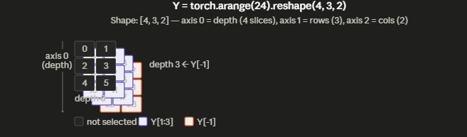
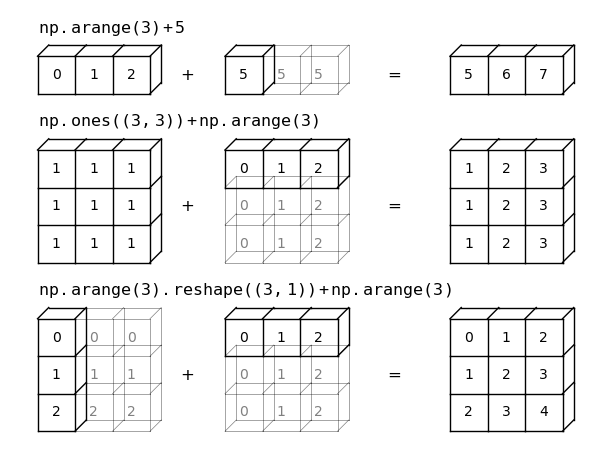

# Data manipulation

https://d2l.ai/chapter_preliminaries/ndarray.html

Start with $n-$-dimensional arrays, which we also call <span style="color:red">**tensors**</span>.
If you already know the NumPy scientific computing package, this will be a breeze.
For all modern deep learning frameworks, the tensor class (`ndarray` in MXNet, `Tensor` in PyTorch and `TensorFlow`)
resembles NumPy’s ndarray, with a few killer features added.
First, the tensor class supports automatic differentiation.
Second, **it leverages GPUs to accelerate numerical computation**, whereas NumPy only runs on CPUs.
These properties make neural networks both easy to code and fast to run.

> In this book we will follow the Pytorch code

## Installation

```python
import torch
```

A tensor represents a (possibly multidimensional) array of numerical values.
In the one-dimensional case, i.e., when only one axis is needed for the data, a tensor is called a _vector_.
With two axes, a tensor is called a _matrix_.
With $K > 2$ axes, we drop the specialized names and just refer to the object as a **$K^th$-order tensor**.

# Pytorch functions

# PyTorch Functions — Chapter 2.1: Data Manipulation

> Source: [d2l.ai/chapter_preliminaries/ndarray.html](https://d2l.ai/chapter_preliminaries/ndarray.html)

| Function                         | Sample Code                                                                           | Description                                                                                                                                                   |
|----------------------------------|---------------------------------------------------------------------------------------|---------------------------------------------------------------------------------------------------------------------------------------------------------------|
| `torch.arange(n)`                | `x = torch.arange(12, dtype=torch.float32)`                                           | Creates a 1D tensor of evenly spaced values from 0 (inclusive) to `n` (exclusive) with a default step of 1.                                                   |
| `x.numel()`                      | `x.numel()`                                                                           | Returns the total number of elements in a tensor.                                                                                                             |
| `x.shape`                        | `x.shape`                                                                             | Returns the shape (length along each axis) of the tensor as a `torch.Size` object.                                                                            |
| `x.reshape(m, n)`                | `X = x.reshape(3, 4)`                                                                 | Returns a new tensor with the same data but a different shape. Use `-1` to auto-infer one dimension (e.g., `x.reshape(-1, 4)`).                               |
| `torch.zeros(shape)`             | `torch.zeros((2, 3, 4))`                                                              | Creates a tensor of all zeros with the specified shape.                                                                                                       |
| `torch.ones(shape)`              | `torch.ones((2, 3, 4))`                                                               | Creates a tensor of all ones with the specified shape.                                                                                                        |
| `torch.randn(*shape)`            | `torch.randn(3, 4)`                                                                   | Creates a tensor with elements drawn from a standard Gaussian distribution (mean 0, std 1).                                                                   |
| `torch.tensor(data)`             | `torch.tensor([[2, 1, 4, 3], [1, 2, 3, 4], [4, 3, 2, 1]])`                            | Constructs a tensor directly from a Python list (or nested lists) of numerical values.                                                                        |
| Indexing `X[-1]`                 | `X[-1], X[1:3]`                                                                       | Accesses elements by index (0-based). Negative indices count from the end. Slices `[start:stop]` return elements from `start` up to but not including `stop`. |
| Element assignment `X[i, j] = v` | `X[1, 2] = 17`                                                                        | Writes a value to a specific element position in a mutable tensor.                                                                                            |
| Slice assignment `X[s1, s2] = v` | `X[:2, :] = 12`                                                                       | Assigns a scalar value to a slice (range of elements) of the tensor in-place.                                                                                 |
| `torch.exp(x)`                   | `torch.exp(x)`                                                                        | Applies the exponential function element-wise to each element of the tensor.                                                                                  |
| `+`, `-`, `*`, `/`, `**`         | `x + y, x - y, x * y, x / y, x ** y`                                                  | Standard arithmetic operators applied element-wise to two tensors of the same shape.                                                                          |
| `torch.cat(tensors, dim)`        | `torch.cat((X, Y), dim=0)`                                                            | Concatenates a sequence of tensors along a given axis (`dim=0` for rows, `dim=1` for columns).                                                                |
| `X == Y`                         | `X == Y`                                                                              | Creates a boolean tensor where each element is `True` if the corresponding elements of `X` and `Y` are equal, `False` otherwise.                              |
| `X.sum()`                        | `X.sum()`                                                                             | Sums all elements of the tensor and returns a scalar tensor.                                                                                                  |
| Broadcasting `a + b`             | `a = torch.arange(3).reshape((3,1))` / `b = torch.arange(2).reshape((1,2))` / `a + b` | Performs element-wise operations on tensors of different (but compatible) shapes by automatically expanding dimensions of size 1 to match the other tensor.   |
| `torch.zeros_like(Y)`            | `Z = torch.zeros_like(Y)`                                                             | Creates a tensor of all zeros with the same shape and dtype as the given tensor `Y`.                                                                          |
| In-place update `X += Y`         | `X += Y`                                                                              | Performs in-place addition, updating `X` without allocating new memory. Equivalent to `X[:] = X + Y`.                                                         |
| `X.numpy()`                      | `A = X.numpy()`                                                                       | Converts a PyTorch tensor to a NumPy `ndarray`. The tensor and array share the same underlying memory.                                                        |
| `torch.from_numpy(A)`            | `B = torch.from_numpy(A)`                                                             | Converts a NumPy `ndarray` to a PyTorch tensor. They share underlying memory.                                                                                 |
| `a.item()`                       | `a.item()`                                                                            | Converts a size-1 tensor to a standard Python scalar (float or int).                                                                                          |

## Indexing and Slicing

As with Python lists, we can access tensor elements by indexing (starting with 0). To access an element based on its position 
relative to the end of the list, we can use negative indexing. 

Finally, we can access whole ranges of indices via slicing (e.g., $X[start:stop]$), where the returned value includes the first index (start) 
but not the last (stop). 
Finally, when only one index (or slice) is specified for a $k^th$-order tensor, it is applied along axis 0. 


```python
import torch as t
X = t.arange(16).reshape(4,4)
print(X) 
# tensor([[ 0,  1,  2,  3],
#         [ 4,  5,  6,  7],
#         [ 8,  9, 10, 11],
#         [12, 13, 14, 15]])
```
Thus, in the following code, [-1] selects the last row and [1:3] selects the second and third rows.

```python
print(X[-1])
print(X[1:3])
```

```text
tensor([12, 13, 14, 15])
tensor([[ 4,  5,  6,  7],
        [ 8,  9, 10, 11]])
```

In a 3 row tensor it will select the second and third row sub tensor

> For $k^{th}$-dimension tensors, slicing will result in in $(k-1)^{th}$-dimension tensor where the slicing index is the first dimension

```python
import torch
Y=torch.arange(24).reshape(4,3,2)
Y[-1]

# tensor([[18, 19],
#         [20, 21],
#         [22, 23]])

Y[1:3]

# tensor([[[ 6,  7],
#          [ 8,  9],
#          [10, 11]],
# 
#         [[12, 13],
#          [14, 15],
#          [16, 17]]])

```



## Broadcasting

Broadcasting in PyTorch <span style="color:red">**allows tensors of different shapes to be used in arithmetic operations without explicitly reshaping or copying data**</span>. 

PyTorch automatically expands smaller tensors to match larger ones.

### Broadcasting rule

Two tensors are broadcastable if:

1. Their shapes are aligned from the rightmost dimension
2. For each dimension:
   1. The sizes are equal, OR
   1. One of them is 1, OR
   1. One dimension is missing

```python
import torch

A = torch.randn(3, 1)
B = torch.randn(1, 4)

C = A + B  # Result shape: (3, 4)
```

Alignment

```text
A: (3, 1)
B: (1, 4)
---------
C: (3, 4)
```

How expansion works



#### Scalar + Tensor

```python
A = torch.tensor([1, 2, 3])
B = 5

A + B  # [6, 7, 8]
```

#### Different dimensions

```python
A = torch.randn(2, 3, 4)
B = torch.randn(3, 4)

A + B  # B is broadcast to (2, 3, 4)
A, B, A+B
```
```text
(tensor([[[ 0,  1,  2,  3],
          [ 4,  5,  6,  7],
          [ 8,  9, 10, 11]],
 
         [[12, 13, 14, 15],
          [16, 17, 18, 19],
          [20, 21, 22, 23]]]),
 tensor([[ 0,  1,  2,  3],
         [ 4,  5,  6,  7],
         [ 8,  9, 10, 11]]),
 tensor([[[ 0,  2,  4,  6],
          [ 8, 10, 12, 14],
          [16, 18, 20, 22]],
 
         [[12, 14, 16, 18],
          [20, 22, 24, 26],
          [28, 30, 32, 34]]]))
```

### Incompatible dimensions

```python
A = torch.randn(2, 3)
B = torch.randn(4, 3)

A + B  # Error: shapes not compatible
```

