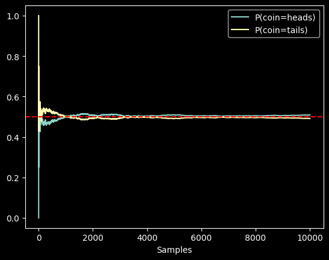

# Probability and statistics

https://d2l.ai/chapter_preliminaries/probability.html

In **supervised learning**, we want to predict something unknown (the _target_) given something known (the _features_).
Depending on our objective, we might

* **attempt to predict the most likely value of the target**.
* Or we might predict the **value with the smallest expected distance from the target**.
* And sometimes we wish not only to predict a specific value but to **quantify our uncertainty**.

For example, given some features describing a patient, we might want to know how likely they are to suffer a heart
attack
in the next year.

In **unsupervised learning**, we often care about uncertainty.
To determine whether a set of measurements are anomalous, it helps to know how likely one is to observe values in a
population of interest.

Furthermore, in **reinforcement learning**, we wish to develop agents that act intelligently in various environments.
This requires reasoning about **how an environment might be expected to change** and what **rewards one might expect to
encounter in response to each of the available actions**.

> <span style="color:red">Probability<span/> is the mathematical field concerned with reasoning under uncertainty.

Given a probabilistic model of some process, we can reason about the likelihood of various events.

## Bayesian probability

The use of probabilities to **describe the frequencies of repeatable events** (like coin tosses) is fairly
uncontroversial.

In fact, <span style="color:red">frequentist scholars adhere to an interpretation of probability that applies only to
such repeatable events<span style="color:red">.

By contrast <span style="color:red">Bayesian scholars use the language of probability more broadly to formalize
reasoning under uncertainty<span/>.

<span style="color:red">Bayesian probability <span/> is characterized by two unique features:

* (i) assigning degrees of **belief to non-repeatable events**, e.g., what is the probability that a dam will collapse?;
  and
* (ii) **subjectivity**.

> While Bayesian probability provides unambiguous rules for how one should **update their beliefs in light of new
evidence**,
> it allows for different individuals to **start off with different prior beliefs**.

## Statistics

> Statistics helps us to reason **backwards**, starting off with collection and organization of data and backing out to
> what inferences we might draw about the process that generated the data.

Whenever we analyze a dataset, hunting for patterns that we hope might characterize a broader population,
we are employing statistical thinking.

## A Simple Example: Tossing Coins

Imagine that we plan to toss a coin and want to quantify how likely we are to see heads (vs. tails).
If the coin is *fair*, then both outcomes (heads and tails), are equally likely.

Moreover, if we plan to toss the coin $n$ times then the fraction of heads that we *expect* to see
should exactly match the *expected* fraction of tails.

One intuitive way to see this is by symmetry:
for every possible outcome with

$n_\textrm{h}$ heads and $n_\textrm{t} = (n - n_\textrm{h})$ tails,

there is an equally likely outcome with $n_\textrm{t}$ heads and $n_\textrm{h}$ tails.

Note that this is only possible if on average we expect to see $1/2$ of tosses come up heads
and $1/2$ come up tails.

Of course, if you conduct this experiment many times with $n=1000000$ tosses each,
you might never see a trial where $n_\textrm{h} = n_\textrm{t}$ exactly.


> Formally, the quantity $1/2$ is called a <span style="color:red">*probability*</span>
> and here it captures the certainty with which any given toss will come up heads.
> Probabilities assign scores between $0$ and $1$ to outcomes of interest, called <span style="color:red">
*events*</span>.

> So the probabiliy of the event $\textrm{heads}$ is $P(\textrm{heads}) \in [0,1]$


A probability of $1$ indicates absolute certainty (imagine a trick coin where both sides were heads)
and a probability of $0$ indicates impossibility (e.g., if both sides were tails).

> The frequencies $n_\textrm{h}/n$ and $n_\textrm{t}/n$ are not probabilities but rather <span style="color:red">
*statistics*</span>.

<span style="color:red">Probabilities are *theoretical* quantities</span> that underly the data generating process.
Here, the probability $1/2$
is a property of the coin itself.

By contrast, <span style="color:red">statistics are *empirical* quantities </span> that are computed as functions of the
observed data.

### Estimators

Our interests in probabilistic and statistical quantities are inextricably intertwined.

> We often design special statistics called <span style="color:red">*estimators*</span> that, given a dataset, produce
*estimates*
> of model parameters such as probabilities.

> Moreover, when those estimators satisfy a nice property called <span style="color:red">*consistency*</span>, our
> estimates will converge
> to the corresponding probability.

In turn, these inferred probabilities tell about the likely statistical properties of data from the same population
that we might encounter in the future.

Suppose that we stumbled upon a real coin for which we did not know the true $P(\textrm{heads})$.
To investigate this quantity with statistical methods, we need to

* (i) collect some data (<span style="color:red">*sampling*</span>);
* (ii) design an estimator.

Data acquisition here is easy; we can toss the coin many times and record all the outcomes.
Formally, drawing realizations from some underlying random process is called .

As you might have guessed, one natural estimator is the ratio of the number of observed *heads*
to the total number of tosses.

Now, suppose that the coin was in fact fair, i.e., $P(\textrm{heads}) = 0.5$.

To simulate tosses of a fair coin, we can invoke any random number generator.
There are some easy ways to draw samples of an event with probability $0.5$.

For example Python's `random.random` yields numbers in the interval $[0,1]$
where the probability of lying in any sub-interval $[a, b] \subset [0,1]$ is equal to $b-a$,
for instance ($P(0.2≤X≤0.5)=0.5−0.2=0.3$).

Thus, we can get out `0` and `1` with probability `0.5` each by testing whether the returned float number is greater
than `0.5`:

```python
import random


def get_statistics_coin(num_experiments):
    num_heads = sum([random.random() > 0.5 for _ in range(num_experiments)])
    return num_heads, num_experiments - num_heads


print("heads, tails: ", get_statistics_coin(100))  # heads, tails:  (56, 44)
print("heads, tails: ", get_statistics_coin(10000))  # heads, tails:  (5042, 4958)
print("heads, tails: ", get_statistics_coin(100000))  # heads, tails:  (49794, 50206)
```

### The multinomial function

More generally, we can simulate multiple draws from any variable with a finite number
of possible outcomes (like the toss of a coin or roll of a die)
by calling the multinomial function, setting the first argument
to the number of draws and the second as a list of probabilities
associated with each of the possible outcomes.

To simulate ten tosses of a fair coin, we assign probability vector `[0.5, 0.5]`=$[P(heads), P(tails)]$.

The function returns a vector with length equal to the number of possible outcomes (here, 2),
where the first component tells us the number of occurrences of heads and the second component tells us
the number of occurrences of tails.

```python
from torch.distributions import Multinomial
import torch

fair_probs = torch.tensor([0.5, 0.5])
Multinomial(100, fair_probs).sample()  # Can vary ex. tensor([41., 59.])
```

To get the frequency (statistics)

```python
num_samples = 1000
freqency = Multinomial(num_samples, fair_probs).sample() / num_samples
print(freqency)  # tensor([0.4980, 0.5020])
```

### The law of the large numbers

> In general, for averages of repeated events (like coin tosses), as the number of repetitions grows,
> our estimates are guaranteed to converge to the true underlying probabilities.

> The mathematical formulation of this phenomenon is called the <span style="color:red">**law of large numbers**</span>
> and the **central limit theorem** tells us that in many situations, as the sample size  $n$  grows,
> these errors should go down at a rate of  $(1/\sqrt n)$ .

Let's get some more intuition by studying how our estimate evolves as we grow the number of tosses from 1 to 10,000.

```python
from torch.distributions import Multinomial
import torch

# estimated probs of head and tail
fair_probs = torch.tensor([0.5, 0.5])
# each sample chooses exactly one category and we repeat it 10000 times
# Possible outputs:
#    tensor([1., 0.])   # heads
#    tensor([0., 1.])   # tails
# So counts has shape: (10000, 2)
# head:
#   tensor([
#    [1., 0.],
#    [0., 1.],
#    [1., 0.],
#    ...
#   ])
counts = Multinomial(1, fair_probs).sample((10000,))
# Cumulative counts on dim=0: computes running totals down the rows
# so with the previus example is
#   [1,0]
#   [1,1]
#   [2,1]
cum_counts = counts.cumsum(dim=0)
# Convert counts into probability estimates
# estimate=(cumulative counts)/(total flips so far)
# if cumulative count = [2,1] then total flip is 3
# and estimates becomes [2/3,1/3]
estimates = cum_counts / cum_counts.sum(dim=1, keepdims=True)
# Converts the tensor into a NumPy array for easier plotting or analysis.
estimates = estimates.numpy()
```

Now we can plot the numpy array

```python
import matplotlib.pyplot as plt

plt.plot(estimates[:, 0], label=("P(coin=heads)"))
plt.plot(estimates[:, 1], label=("P(coin=tails)"))
plt.axhline(y=0.5, color='red', linestyle='dashed')

plt.gca().set_xlabel('Samples')
plt.gca().set_xlabel('Samples')
plt.legend()
plt.show()
```



The dashed red line gives the true underlying probability.
As we get more data by conducting more experiments, the curves converge towards the true probability.

### A more formal treatment

#### Sample space or outcome space $\mathcal{S}$

> The set of possible outcomes where each element is a distinct possible *outcome*.

In the case of rolling a single coin,
$\mathcal{S} = \{\textrm{heads}, \textrm{tails}\}$.

For a single die, $\mathcal{S} = \{1, 2, 3, 4, 5, 6\}$.

When flipping two coins, possible outcomes
are $\{(\textrm{heads}, \textrm{heads}), (\textrm{heads}, \textrm{tails}), (\textrm{tails}, \textrm{heads}),  (\textrm{tails}, \textrm{tails})\}$.

### Events

> *Events* are subsets of the sample space ("_seeing a $5$_" $\mathcal{A}$, "_seeing an odd number_" $\mathcal{B}$).

For instance, the event "_the first coin toss comes up heads_"
corresponds to the set $\{(\textrm{heads}, \textrm{heads}), (\textrm{heads}, \textrm{tails})\}$.

Whenever the outcome $z$ of a random experiment satisfies $z \in \mathcal{A}$, then event $\mathcal{A}$ has occurred.

For a single roll of a die, we could define the events "_seeing a $5$_" ($\mathcal{A} = \{5\}$)
and "_seeing an odd number_"  ($\mathcal{B} = \{1, 3, 5\}$).
In this case, if the die came up $5$, we would say that both $\mathcal{A}$ and $\mathcal{B}$ occurred.
On the other hand, if $z = 3$, then $\mathcal{A}$ did not occur but $\mathcal{B}$ did.

### Probability functions

> A *probability* function maps events onto real values ${P: \mathcal{A} \subseteq \mathcal{S} \rightarrow [0,1]}$.
> The probability, denoted $P(\mathcal{A})$, of an event $\mathcal{A}$
> in the given sample space $\mathcal{S}$
> has the following properties:

#### Probability properties

* The probability of any event $\mathcal{A}$ is a nonnegative real number,
  i.e., <span style="color:red">$P(\mathcal{A}) \geq 0$</span>;
* The probability of the entire sample space is $1$, i.e., <span style="color:red">$P(\mathcal{S}) = 1$</span>;
* For any countable sequence of events $\mathcal{A}_1, \mathcal{A}_2, \ldots$ that are *mutually exclusive* (
  i.e., $\mathcal{A}_i \cap \mathcal{A}_j = \emptyset$ for all $i \neq j$), the probability that any of them happens is
  equal to the sum of their individual probabilities,
  i.e., <span style="color:red">$P(\bigcup_{i=1}^{\infty} \mathcal{A}_i) = \sum_{i=1}^{\infty} P(\mathcal{A}_i)$</span>.

These axioms of probability theory, proposed by :citet:`Kolmogorov.1933`, can be applied to rapidly derive a number of
important consequences.

For instance, it follows immediately that the probability of any event $\mathcal{A}$
*or* its complement $\mathcal{A}'$ occurring is 1 (
because <span style="color:red">$\mathcal{A} \cup \mathcal{A}' = \mathcal{S}$</span>).

We can also prove that $P(\emptyset) = 0$ because:

$1 = P(\mathcal{S} \cup \mathcal{S}') = P(\mathcal{S} \cup \emptyset) = P(\mathcal{S}) + P(\emptyset) = 1 + P(\emptyset)$.

Consequently, the probability of any event $\mathcal{A}$ *and* its complement $\mathcal{A}'$ occurring simultaneously
is $P(\mathcal{A} \cap \mathcal{A}') = 0$.
Informally, this tells us that impossible events have zero probability of occurring.

## Random variables

A random variable is a function that assigns a numerical value to each outcome of a random experiment.

$$
X \in \mathcal{S} → \mathbb{R}
$$

For instance, the dice roll has

$$
\mathcal{S} = {1,2,3,4,5,6}
$$

Two examples or random variables are

* $X(w)=w$ the random variable equals the number rolled.
* $Y = \left\{ \begin{array}{rcl} 1 & \mbox{if roll is even} \\ 0 & \mbox{if roll is odd}
  \end{array}\right.$

Every value taken by a random variable corresponds to a subset of the underlying sample space.

* $X=v$ the random variable taking a value is called <span style="color:red">event<span/>
* $P(X=v)$ denotes <span style="color:red">event's probability<span/> .

## Discreate random variables

Take countable values.

Examples: (coin tosses, die rolls, number of emails received).

Example distribution: $P(X=k)$

## Continuous random variables

Take values in intervals.

Examples: (height, temperature, output of random.random()).

For continuous variables: $P(X=a)=0$ for any exact value $a \in \mathbb{R}$.

Instead, we measure probabilities over intervals: $P(a≤X≤b)$

## Multiple Random Variables

$$P(X,Y) = P(X) P(Y)$$

> Each random variable would represent the (unknown) value of a different attribute.

> Whenever we sample an individual from the population, we observe a realization of each of the random variables.

Because the values taken by random variables correspond to subsets of the sample space
that could be overlapping, partially overlapping, or entirely disjoint, knowing the value taken by one random variable
can cause us to update our beliefs about which values of another random variable are likely.

When working with multiple random variables, we can construct events corresponding
to every combination of values that the variables can jointly take.

The probability function that assigns probabilities to each of these combinations (e.g. $A=a$ and $B=b$)
is called the *joint probability* function and simply returns the probability assigned to the intersection of the
corresponding subsets
of the sample space.

### Joint probability

> The <span style="color:red">*joint probability*</span>  assigned to the event
> where random variables $A$ and $B$ take values $a$ and $b$, respectively, is denoted $P(A = a, B = b)$,
> where the comma indicates "**and**".

Note that for any values $a$ and $b$, it follows that:
$$P(A=a, B=b) \leq P(A=a) \textrm{ and } P(A=a, B=b) \leq P(B = b),$$

since for $A=a$ and $B=b$ to happen, $A=a$ has to happen *and* $B=b$ also has to happen.

#### Recovering the individual distributions $P(A)$ and $P(B)$

To recover $P(A=a)$ we simply sum up $P(A=a, B=v)$ over all values $v$
that the random variable $B$ can take:

$$P(A=a) = \sum_v P(A=a, B=v)$$.

### Conditional probability

$$P(B=b \mid A=a) = \frac{P(A=a, B=b)}{P(A=a)} \leq 1$$

> It tells us the new probability associated with the event $B=b$, once we condition on the fact $A=a$ took place.

We can think of this conditional probability as restricting attention only to the subset
of the sample space associated with $A=a$ and then renormalizing so that all probabilities sum to 1.

For instance, for disjoint events $\mathcal{B}$ and $\mathcal{B}'$, we have that
$P(\mathcal{B} \cup \mathcal{B}' \mid A = a) = P(\mathcal{B} \mid A = a) + P(\mathcal{B}' \mid A = a)$.

#### Notation

* $P(A \mid B)$ (<span style="color:red">**Posterior**</span>): The probability of $A$ occurring given that $B$ has
  happened.
* $P(B \mid A)$ (<span style="color:red">**Likelihood**</span>): The probability of observing $B$ if $A$ is true.
* $P(A)$ (<span style="color:red">Prior</span>): Our initial belief about the probability of $A$ before seeing any
  evidence.
* $P(B)$ (**<span style="color:red">Evidence**</span>): How common is the evidence overall? (normalizer)

For example:

* $A$ = HIV being positive ($A1$) or negative ($A0$)
* $B$ = HIV test either positive ($B1$ or $B=1$) or negative ($B0$)
* Our target is to estimate posterior probability $P(A \mid B)$ that is the probability of HIV, given test results

### Bayes' theorem

$$P(A \mid B) = \frac{P(B\mid A) P(A)}{P(B)}.$$

> This shows that <span style="color:red">New Belief = Prior Belief × How much the evidence supports it</span>

#### Proof

Inverting the conditional property we have

$$ P(A,B) = P(A \mid B) P(B) \:\:(\alpha)$$

If we do the same with $P(B|A)$, we get

$$P(B,A) = P(B \mid A)P(A) = P(A,B) \:\:(\beta)$$

combining both $(\alpha)$ and $(\beta)$, considering that $P(A,B)=P(B,A)$ we get the proof

$$P(A \mid B) P(B) = P(B \mid A)P(A) $$

$$P(B \mid A) = \frac {P(B \mid A)P(B)}{P(A)} $$

#### Theorem implication

> If we know how to estimate $P(B\mid A)$, $P(A)$, and $P(B)$, then we can estimate $P(A\mid B)$.

For instance, if we know the prevalence of symptoms $B$ for a given disease $A$ (so $P(B | A)$),
and the overall prevalences of the disease ($P(A)$) and symptoms ($P(B)$),
respectively, we can determine how likely someone is to have the disease based on symptoms ($P(A | B)$).

https://gemini.google.com/app/32b8ab6ca0bab778

### Simplified Bayes' theorem

Often, computing $P(B)$ is difficult.

* how common HIV is → $P(A)$
* how likely symptoms are if the disease exists → $P(B∣A)$

But you may not know $P(B)$ (the overall probability of seeing those symptoms in the population).

$$P(A \mid B) \propto P(B \mid A) P(A).$$

> Since $P(B)$ does not depend on $A$, we can treat $1/P(B)$ as a constant $k$, therefore the proportionality

$$Posterior = Likelihood * Prior  $$

#### Proof

Suppose we don't know the evidence $P(B)$. Given the base theorem

$$P(A=a \mid B) = \frac {P(B \mid A=a)P(A=a)}{P(B)} \:\:(\large\alpha)$$

we can caluculate the <span style="color:red">score</span> $s(a)=P(B∣A=a)P(A=a)$ $(\large\beta)$

we can do it for every possible value of $a_1, a_2, \dots a_n$ and we sum all values at both sizes of $(\large\alpha)$
which is called <span style="color:red">**marignalization**</span> to $P(A)$ (we remove the influence on $P(A)$)

$$\sum_a{P(A=a \mid B)} = \sum_a {\frac {P(B \mid A=a)P(A=a)}{P(B)}} \:\:(\large\gamma)$$

we now span style="color:red">**normalize**</span>, so that $\sum_a{P(A=a \mid B)} = 1$ and apply it
to $(\large\gamma)$, we find derive

$${P(B) = \sum_a { {P(B \mid A=a)P(A=a)}}} = \sum_a{s(a)} \:\:(\large\delta)$$

now $\:\:(\large\alpha)$ becomes

$$P(A=a \mid B) = \frac {P(B \mid A=a)P(A=a)}{\sum_a{s(a)}} \:\:(\large\epsilon)$$

> The posterior probability is proportional to the prior, the likelihood and the inverse of the sum of the scores.

## HIV tests examples

we want diagnose HIV on a random patient evaluating results of different HIV tests $B_1$ and $B_2$
when the test result is positive.

* **Prior** (overall HIV positive): $P(A=1) = 0.0015$ of the population

The features of the test $B_1$ are

| Conditional probability | $A=1$ | $A=0$ |
| :---------------------- | ----: | ----: |
| $P(B_1 = 1 \mid A)$     |     1 |  0.01 |
| $P(B_1 = 0 \mid A)$     |     0 |  0.99 |

So that

* **likelihood** $P(B_1=1 | A=1)=1$ test with no false negative (test positive, HIV)
* **likelihood** $P(B_1=1 | A=0)=0.01$ 1% of false positive (test positive, no HIV)

We calculate all scores of $B_1$ based on the fact if HIV is present or not:

* $s(A=1)=P(B_1=1|A=1)P(A=1)=1*0.0015=0.0015$
* $s(A=0)=P(B_1=1|A=0)P(A=0)=0.01*(1-0.0015)=0.009985$

so we can estimate the chance of the patient having actually HIV after the first test being positive (13%)

$$P(A=1 \mid B_1=1) = \frac {s(A=1)}{s(A=1) + s(A=0)} = 0.0015/(0.0015+0.009985)= 0.13060513713$$

In other words, there is only a 13.06% chance that the patient actually has HIV, despite the test being pretty accurate.
As we can see, probability can be counterintuitive.

The second test has different characteristics and it is not as good as the first one.

| Conditional probability | $A=1$ | $A=0$ |
| :---------------------- | ----: | ----: |
| $P(B_2 = 1 \mid H)$     |  0.98 |  0.03 |
| $P(B_2 = 0 \mid H)$     |  0.02 |  0.97 |


The test result is positive too. How much the chance of HIV positive change with this result?

$$P(A=1 | B_1=1,B_2=1) = \frac {P(B_1=1,B_2=1 \mid A=1)P(A=1)}{P(B_1=1,B_2=1)}=\frac{s(A=1)}{s(A=1)+S(A=0)}$$

where 

$$
s(A=1)=P(B_1=1,B_2=1 \mid A=1)P(A=1)=P(B_1=1\mid A=1)P(B_2=1\mid A=1)P(A=1)=1*0.98*0.0015=0.00147
$$
$$
s(A=0)=P(B_1=1,B_2=1 \mid A=0)P(A=0)=P(B_1=1\mid A=0)P(B_2=1\mid A=0)P(A=0)=0.01*0.03*(1-0.0015)=0.00029955
$$

So we can calculate the HIV chance of both tests being positive

$$
P(A=1 | B_1=1,B_2=1)=\frac{s(A=1)}{s(A=1)+S(A=0)}=\frac{0.00147}{0.00029955+0.00147}=0.83071967449
$$

That is, the second test allowed us to **gain much higher confidence that not all is well**.

Despite the second test being considerably less accurate than the first one,
it still significantly improved our estimate.

The assumption of both tests being conditionally independent of each other
was crucial for our ability to generate a more accurate estimate.

Take the extreme case where we run the same test twice.

In this situation we would expect the same outcome both times, hence no additional 
insight is gained from running the same test again.

> The most common mistake people make is ignoring the prior — assuming that because a test is "90% accurate," a positive result means 90% chance you have the disease.
> This because we tend to ignore the role of the prior probability into the picture.
> Bayes shows why that's wrong.

#### ADD SPAM TEST FILTER

We have a spam filter, we want to know what is the probability of an email containing the work "FREE"
will be considered spam.

What happen if there is an email with the word FREE

* **Prior probability $P(A)=0.23$**: the probability of an email assigned to SPAM
* **Evidence $P(B) = ?$**:  the probability of an email containing the word FREE is unknown
* **Likelihood $P(B|A) = 0.78$**:  the probability of the word FREE in a spam email
* **Likelihood $P(B|¬A) = 0.2$**: the probability of the word FREE in a spam email

Target: $P(A|B) = \frac{P(B | A)P(A)}{P(B)}=\frac{s(A)}{s(A)+s(¬A)}$

* **score of spam filter: $P(B|A)*P(A) = 0.78 * 0.23 = 0.1794$**: true positive contribution
* **score of spam filter: $P(B|¬A)*P(¬A) = 0.2 * (1-0.23) = 0.154$**: the false positive contribution

$P(B)=s(A)+s(¬A)=0.1794+0.154=0.3334$

Finally, we apply Beyes:

$$
P(A|B)=\frac{0.78*0.23}{0.3344}=0.538092382
$$ 

This 54% of an email with the word FREE to be spam, 
compared to the 23% of a random email.

## Random variables aggregations

### Expectation / expected value


> 🔴 **Expectation / Expected value**: the expected value "on everage" taken by random variables.
 
It answers the question: “What value should I expect on average?”

For **discrete random variables**:

$$
  E[X]=\sum_i​x_i​P(X=x_i​)
$$

For **continuos random variables** (If $X$ has a probability density function $f(x)$:

$$
  E[X]=\int_{\infty}^{\infty}xf(x)
$$

#### Interpretation

> I can be associated to a **wighted sum** where the value is the outcome and the weight is the probability of the outcome.

> It is not necessarily a value you can observe, but a **center of mass** of the distribution.

For example for a dice we have 

$E[X]=\frac{1+2+3+4+5+6}{6}=3.5$ which is not a value in the sample space

#### Properties

| Property  | Formula                                                        |
| --------- | -------------------------------------------------------------- |
| Linearity | $E[aX+bY]=aE[X]+bE[Y]$ (holds if $X$ and $Y $ are independent) |
| Constant  | $E[aX]=aE[X]$                                                  |
| Sum       | $E[X+Y]=E[X]+E[Y]$                                             |


### Variance

> 🔴**Variance** measures **how far a random variable typically deviates from its mean (expectation)**. While expectation tells you the “center,” variance tells you the **spread around that center**.

for a random variable $X$ with expected value $\mu=E[X] $

$$
Var = E[\sqrt{(X-\mu)^2}]
$$


> Variance is the **expected squared distance** from the mean

#### Equivalent formula 

An alternative and more easy to compute way of calculating it is

$$
Var = E[X^2]-(E[X])^2
$$

#### Interpretation

If the mean (expected value) is the center of mass of the random variable, 

> Then variance tells you how “tight” or “spread out” the mass is around that center

* **small variance** → values cluster near the mean
* **large variance** → values are widely spread
 
#### Calculation example

For dice toss the case space is $X \in \{1,2,3,4,5,6\}$

$E[X]=3.5$ and $E[X^2]=\frac{1^2+2^2 \dots+6^2}{6}=\frac{91}{6}$

So $Var(X)=\frac{91}{6}-(3.5)^2=\frac{35}{12} \approx 2.92$


#### Properties 

| Property                     | Formula                                                              |
| ---------------------------- | -------------------------------------------------------------------- |
| Scaling                      | $Var(aX) = aVAr(x)$                                                  |
| Shifting                     | $Var(X+c) = Var(X)$ shifting the values does not change the variance |
| Sum of independent variables | $Var[X+Y]=Var[X]+Var[Y]$                                             |

### Standard deviation 

Variance is in **squared units**, which is sometimes inconvenient.

$$
\sigma=\sqrt{Var(X)}
$$

It has the same units as X.

For the die: σ≈1.71

### Covariance

> 🔴**Covariance** measures how two random variables vary together — in other words, whether they tend to move in the same direction or in opposite directions.

It is the two-variable generalization of variance.

$$
Cov(X,Y)=E[(X−E[X])(Y−E[Y])]
$$

#### Interpretation

> how deviations from the mean of X and Y align

Each observation is a pair $(x,y)$:

If $X$ is above its mean and $Y$ is also above its mean → positive contribution

If one is above and the other below → negative contribution

So:

**Positive covariance** → they move together
**Negative covariance** → they move in opposite directions
**Zero covariance** → no linear relationship (not necessarily independent)

#### Equivalent formula 


$$
Cov(X,Y)=E[XY]−E[X]E[Y]
$$


#### Connection with variance

It is the covariance with itself

$$
Var(X)=Cov(X,X)
$$

#### Examples

* Example 1: **height and weight**
  * Taller people tend to weigh more
  * → **positive covariance**
* Example 2: **temperature and heating bill**
  * Higher temperature → lower heating cost
  * → **negative covariance**
* Example 3: **unrelated variables**
  * Dice roll and stock price
  * → **near zero covariance**

#### Correlation


Covariance is hard to interpret because:

it depends on units ($kg·cm$, $dollars·seconds$, etc.) magnitude is not standardized

That’s why we often use correlation:

$$
\rho(X,Y)=\frac{Cov(X,Y)}{\sigma_X\sigma_Y}
$$

with $\rho \in [-1,1]$

#### Covariance vs Correlation

* **covariance** = raw joint movement (unit-dependent)
* **correlation** = normalized strength of linear relationship


#### Example of correlation

Intuitively: taller → heavier. So we expect positive correlation.

| Person | Height (cm) (X) | Weight (kg) (Y) |
| ------ | --------------- | --------------- |
| A      | 160             | 55              |
| B      | 165             | 60              |
| C      | 170             | 65              |
| D      | 175             | 70              |
| E      | 180             | 75              |

$E[X]=\frac{160+165+170+175+180}{5}​=170$

$E[Y]=\frac{55+60+65+70+75}{5}​=65$

Deviations

| Person | (X - 170) | (Y - 65) |
| ------ | --------- | -------- |
| A      | -10       | -10      |
| B      | -5        | -5       |
| C      | 0         | 0        |
| D      | 5         | 5        |
| E      | 10        | 10       |


Covariance $Cov(X,Y)=\frac{1}{5}\sum_{i=1}^{5}(X_i​−μX​)(Y_i​−μY​)$

| Person | Product |
| ------ | ------- |
| A      | 100     |
| B      | 25      |
| C      | 0       |
| D      | 25      |
| E      | 100     |


So 

$$
Cov(X,Y)=250/5=50 > 0
$$

They grow together

$Var(X)=250/5=50 ⇒ σ_X​=\sqrt{50}$

$Var(Y)=50 ⇒ σ_Y​=\sqrt{50}$

Correlation

$$
\rho(X,Y)=\frac{Cov(X,Y)}{\sigma_X\sigma_Y}=\frac{50}{\sqrt{50}\sqrt{50}}=1
$$

> 1 means perfect positive linear relationship

> With more noisy values the correlation would be still positive but something around 0.95


### Covariance matrix

https://chatgpt.com/c/6a086f76-8e90-832d-a3b7-63b4ecf37789


As such, $\boldsymbol{\Sigma}$ allows us to compute the variance
for any linear function of $\mathbf{x}$
by a simple matrix multiplication.
The off-diagonal elements tell us how correlated the coordinates are:
a value of 0 means no correlation,
where a larger positive value
means that they are more strongly correlated.

## Discussion

In machine learning, there are many things to be uncertain about!
We can be uncertain about the value of a label given an input.
We can be uncertain about the estimated value of a parameter.
We can even be uncertain about whether data arriving at deployment
is even from the same distribution as the training data.

By *aleatoric uncertainty*, we mean uncertainty
that is intrinsic to the problem,
and due to genuine randomness
unaccounted for by the observed variables.
By *epistemic uncertainty*, we mean uncertainty
over a model's parameters, the sort of uncertainty
that we can hope to reduce by collecting more data.
We might have epistemic uncertainty
concerning the probability
that a coin turns up heads,
but even once we know this probability,
we are left with aleatoric uncertainty
about the outcome of any future toss.
No matter how long we watch someone tossing a fair coin,
we will never be more or less than 50% certain
that the next toss will come up heads.
These terms come from mechanical modeling,
(see e.g., :citet:`Der-Kiureghian.Ditlevsen.2009` for a review on this aspect
of [uncertainty quantification](https://en.wikipedia.org/wiki/Uncertainty_quantification)).
It is worth noting, however, that these terms constitute a slight abuse of language.
The term *epistemic* refers to anything concerning *knowledge*
and thus, in the philosophical sense, all uncertainty is epistemic.

We saw that sampling data from some unknown probability distribution
can provide us with information that can be used to estimate
the parameters of the data generating distribution.
That said, the rate at which this is possible can be quite slow.
In our coin tossing example (and many others)
we can do no better than to design estimators
that converge at a rate of $1/\sqrt{n}$,
where $n$ is the sample size (e.g., the number of tosses).
This means that by going from 10 to 1000 observations (usually a very achievable task)
we see a tenfold reduction of uncertainty,
whereas the next 1000 observations help comparatively little,
offering only a 1.41 times reduction.
This is a persistent feature of machine learning:
while there are often easy gains, it takes a very large amount of data,
and often with it an enormous amount of computation, to make further gains.
For an empirical review of this fact for large scale language models see :citet:`Revels.Lubin.Papamarkou.2016`.

We also sharpened our language and tools for statistical modeling.
In the process of that we learned about conditional probabilities
and about one of the most important equations in statistics---Bayes' theorem.
It is an effective tool for decoupling information conveyed by data
through a likelihood term $P(B \mid A)$ that addresses
how well observations $B$ match a choice of parameters $A$,
and a prior probability $P(A)$ which governs how plausible
a particular choice of $A$ was in the first place.
In particular, we saw how this rule can be applied
to assign probabilities to diagnoses,
based on the efficacy of the test *and*
the prevalence of the disease itself (i.e., our prior).

Lastly, we introduced a first set of nontrivial questions
about the effect of a specific probability distribution,
namely expectations and variances.
While there are many more than just linear and quadratic
expectations for a probability distribution,
these two already provide a good deal of knowledge
about the possible behavior of the distribution.
For instance, [Chebyshev's inequality](https://en.wikipedia.org/wiki/Chebyshev%27s_inequality)
states that $P(|X - \mu| \geq k \sigma) \leq 1/k^2$,
where $\mu$ is the expectation, $\sigma^2$ is the variance of the distribution,
and $k > 1$ is a confidence parameter of our choosing.
It tells us that draws from a distribution lie
with at least 50% probability
within a $[-\sqrt{2} \sigma, \sqrt{2} \sigma]$
interval centered on the expectation.
