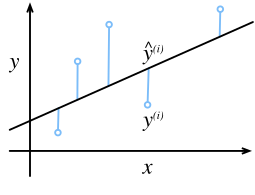
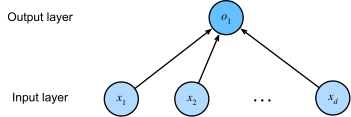

# Linear regression


><span style="color:red">**Regression**</span> problems pop up whenever we want to predict a numerical value.

Common examples include:
* predicting prices (of homes, stocks, etc.),
* predicting the length of stay (for patients in the hospital),
* forecasting demand (for retail sales), ....

Not every prediction problem is one of classical regression.
Later on, we will introduce classification problems,
where the goal is to predict membership among a set of categories.

As a running example, suppose that we wish to **estimate the prices of houses (in dollars)
based on their area (in square feet) and age (in years)**.

## Terminology

> In the terminology of machine learning, the dataset is called a <span style="color:red">**training dataset**</span> or <span style="color:red">**training set**</span>,
and each row (containing the data corresponding to one sale) is called an <span style="color:red">**example**</span> (or <span style="color:red">**data point**</span>, <span style="color:red">**instance**</span> or <span style="color:red">**sample**</span>).

>The value we are trying to predict (price) is called a <span style="color:red">**label**</span> (or <span style="color:red">**target**</span>).
The variables (age and area) upon which the predictions are based are called <span style="color:red">**features**</span> (or <span style="color:red">**covariates**</span>).

## Basics

<span style="color:red">**Linear regression**</span> is both the simplest
and most popular among the standard tools for tackling regression problems.


> First, we assume that the relationship between features $\mathbf{x}$ and target $y$
is approximately linear,
i.e., that the conditional mean $E[Y \mid X=\mathbf{x}]$
can be expressed as a weighted sum
of the features $\mathbf{x}$.
 

This setup allows that the target value may still deviate from its expected value
on account of observation noise.

> Next, we can impose the assumption that any such **noise is well behaved, following a Gaussian distribution**.

Typically, we will use $n$ to denote the number of examples in our dataset.

We use superscripts to enumerate samples and targets, and subscripts to index coordinates.
More concretely,
* $\mathbf{x}^{(i)}$ denotes the $i^{\textrm{th}}$ sample
* and $x_j^{(i)}$ denotes its $j^{\textrm{th}}$ coordinate (feature) of that sample.

### Model

> At the heart of every solution is a <span style="color:red">**model**</span> that describes how features can be transformed
into an estimate of the target.

The <span style="color:red">**assumption of linearity**</span> means that the expected value of the target (price) can be expressed
as a weighted sum of the features (area and age):

 $$\textrm{price} = w_{\textrm{area}} \cdot \textrm{area} + w_{\textrm{age}} \cdot \textrm{age} + b.$$


Here $w_{\textrm{area}}$ and $w_{\textrm{age}}$ are called *weights*, and $b$ is called a <span style="color:red">**bias**</span>
(or <span style="color:red">**offset**</span> or <span style="color:red">**intercept**</span>).


The weights determine the influence of each feature on our prediction.

The bias determines the value of the estimate when all features are zero.

Even though we will never see any newly-built homes with precisely zero area,
we still need the bias because it allows us to express all linear functions of our features
(rather than restricting us to lines that pass through the origin).

> Strictly speaking, the <span style="color:red">**linear regression model**</span> is an *affine transformation* of input features, which is characterized by a *linear transformation* of features via a weighted sum, combined with a *translation* via the added bias.

Given a dataset, our goal is to choose the weights $\mathbf{w}$ and the bias $b$
that, on average, make our model's predictions fit the true prices observed in the data as closely as possible.

When our inputs consist of $d$ features, we can assign each an index (between $1$ and $d$)
and express our prediction $\hat{y}$ (in general the "hat" symbol denotes an estimate) as

> $$\hat{y} = w_1  x_1 + \cdots + w_d  x_d + b.$$

Collecting all features into a vector $\mathbf{x} \in \mathbb{R}^d$
and all weights into a vector $\mathbf{w} \in \mathbb{R}^d$,
we can express our model compactly via the dot product
between $\mathbf{w}$ and $\mathbf{x}$:

> $$\hat{y} = \mathbf{w}^\top \mathbf{x} + b.$$


The vector $\mathbf{x}$ corresponds to the features of a single example.
We will often find it convenient
to refer to features of our entire dataset of $n$ examples
via the <span style="color:red">**design matrix**</span> $\mathbf{X} \in \mathbb{R}^{n \times d}$.

* one row per sample
* one column per feature

For a collection of features $\mathbf{X}$,
the predictions $\hat{\mathbf{y}} \in \mathbb{R}^n$
can be expressed via the matrix--vector product,  resulting in the vector $\hat{\mathbf{y}}$:

> $${\hat{\mathbf{y}}} = \mathbf{X} \mathbf{w} + b,$$


where broadcasting (:numref:`subsec_broadcasting`) is applied during the summation.


Given features of a training dataset $\mathbf{X}$
and corresponding (known) labels $\mathbf{y}$,
the goal of linear regression is to find
the weight vector $\mathbf{w}$ and the bias term $b$
such that, given features of a new data example
sampled from the same distribution as $\mathbf{X}$,
the new example's label will (in expectation)
be predicted with the smallest error (even if the real sistem is perfectly linear). 

For example, whatever instruments we use to observe
the features $\mathbf{X}$ and labels $\mathbf{y}$, there might be a small amount of measurement error.

Thus, even when we are confident
that the underlying relationship is linear,
we will incorporate a noise term to account for such errors.

Before we can go about searching for the best *parameters*
(or *model parameters*) $\mathbf{w}$ and $b$,
we will need two more things:
* (i) a measure of the quality of some given model;
* (ii) a procedure for updating the model to improve its quality.

### Loss Function

Naturally, fitting our model to the data requires that we agree on some measure of <span style="color:red">**fitness**</span>
(or, equivalently, of *unfitness*).

> <span style="color:red">**Loss functions**</span> quantify the distance
between the *real* and *predicted* values of the target.

The loss will usually be a nonnegative number where smaller values are better
and perfect predictions incur a loss of 0.

For regression problems, the most common loss function is the squared error.

> $$l^{(i)}(\mathbf{w}, b) = \frac{1}{2} \left(\hat{y}^{(i)} - y^{(i)}\right)^2.$$

* $l^{(i)}$: <span style="color:red">**squared error**</span>  of the sample $i$. It is a function of the model parameters.
* $\hat{y}^{(i)}$: prediction for sample $i$
* $y^{(i)}$: real value for the sample $i$


The constant $\frac{1}{2}$ makes no real difference
but proves to be notationally convenient,
since it cancels out when we take the derivative of the loss.


In *Fig. 3.1.1*, we visualize the fit of a linear regression model
in a problem with one-dimensional inputs.


*Fig. 3.1.1*


Note that large differences between estimates $\hat{y}^{(i)}$ and targets $y^{(i)}$
lead to even larger contributions to the loss, due to its quadratic form
(this quadraticity can be a double-edge sword; while it encourages the model to avoid large errors
it can also lead to excessive sensitivity to anomalous data).

To measure the quality of a model on the entire dataset of $n$ examples,
we simply average (or equivalently, sum) the losses on the training set:

$$L(\mathbf{w}, b) =\frac{1}{n}\sum_{i=1}^n l^{(i)}(\mathbf{w}, b) =\frac{1}{n} \sum_{i=1}^n \frac{1}{2}\left(\mathbf{w}^\top \mathbf{x}^{(i)} + b - y^{(i)}\right)^2.$$

> When training the model, we seek parameters ($\mathbf{w}^*, b^*$)
that minimize the total loss across all training examples:

>$$\mathbf{w}^*, b^* = \operatorname*{argmin}_{\mathbf{w}, b}\  L(\mathbf{w}, b).$$

### Analytic Solution

We can find the optimal parameters (as assessed on the training data)
analytically by applying a simple formula as follows.

First, we can subsume the bias $b$ into the parameter $\mathbf{w}$
by appending a column to the design matrix consisting of all 1s.

$$X'=\begin{bmatrix}
1 & x_{11} & \cdots & x_{1d} \\
1 & x_{21} & \cdots & x_{2d} \\
\vdots & \vdots & \ddots & \vdots \\
1 & x_{n1} & \cdots & x_{nd} \\
\end{bmatrix}$$

and the weights

$$
w'=
\begin{bmatrix}
b \\
w
\end{bmatrix}
$$

so this is the model $${\hat{\mathbf{y}}} = \mathbf{X'} \mathbf{w'}$$


Then our prediction problem is to minimize the total predition error:

$$L(w)=\|\mathbf{X}\mathbf{w} - \mathbf{y} \|^2 $$.


Taking the derivative of the loss with respect to $\mathbf{w}$
and setting it equal to zero yields:

$$\begin{aligned}
    ∇_{\mathbf{w}} \|\mathbf{X}\mathbf{w} - \mathbf{y} \|^2 =
    2 \mathbf{X}^\top (\mathbf{X} \mathbf{w} - \mathbf{y}) = 0 \end{aligned}$$

hence

$$
\mathbf{X}^\top \mathbf{y} = \mathbf{X}^\top \mathbf{X} \mathbf{w}
$$

Solving for $\mathbf{w}$ provides us with the optimal solution
for the optimization problem.

Note that this solution 

$$\mathbf{w}^* = (\mathbf X^\top \mathbf X)^{-1}\mathbf X^\top \mathbf{y}$$

exists if the $\mathbf X^\top \mathbf X$ matrix is invertible

#### Design matrix full rank requirement

* The $\mathbf X^\top \mathbf X$ matrix is <span style="color:red">**squared**</span> and <span style="color:red">**symmetric**</span> by construction
    * the norm $\|\mathbf{X}\mathbf{w}\|^2=\mathbf{X}^T\mathbf{w}^T\mathbf{X}\mathbf{w} \ge 0$ $\forall \mathbf{w}$
    * therefore $X^TX⪰0$ (<span style="color:red">**semidefinite positive**</span>)


* if $rank(X)=d$ (full rank) then
  * no feature is a linear combination of others
  * columns are linearly independent 
    * if there is a linear dependency i.e. $x_3=x_2w_2+3x_1w_1$
      * multiple  $w$ will result in the value of the loss function 
      * the loss function will have the same flat value in the sample space
      * the gradient will be zero in that area invalidating optimization 
  * the null space $\mathcal{N}(X)={0}$
    * so $\mathbf{X}\mathbf{w} = 0 ⟺ \mathbf{w}=0$
    * this makes the semidefinite positive $\mathbf X^\top \mathbf X$ a <span style="color:red">**definite positive**</span>

For a theorem 

> A symmetric matrix is invertible iff it is positive definite.
 
Therefore 
> the $\mathbf X^\top \mathbf X$ matrix is <span style="color:red">**invertible**</span>

#### Existence of optimal solution

> If the columns of $\mathbf{X}$ are linearly independent (full rank), then the loss function has exactly one stationary point, and that point is the unique global minimum.

The quadratic form of the loss function creates a curved surface.

For positive definite matrices:

* every direction curves upward
* the origin is a strict minimum
* shapes are ellipsoids

Think of a multidimensional bowl.

### Batch Gradient Descent

Fortunately, even in cases where we cannot solve the models analytically,
we can still often train models effectively in practice.

Moreover, for many tasks, those hard-to-optimize models
turn out to be so much better that figuring out how to train them
ends up being well worth the trouble.

> The key technique for optimizing nearly every deep learning model
consists of iteratively reducing the error
by updating the parameters in the direction
that incrementally lowers the loss function.
This algorithm is called <span style="color:red">**gradient descent**</span>.

#### Problem with the gradient descent

The most naive application of gradient descent
consists of taking the derivative of the loss function,
which is an average of the losses computed
on every single example in the dataset.

>In practice, this can be extremely slow:
we must pass over the entire dataset before making a single update,
even if the update steps might be very powerful :cite:`Liu.Nocedal.1989`.
Even worse, if there is a lot of redundancy in the training data,
the benefit of a full update is limited.

## Stochastic Gradient Descent - SGD
The other extreme is to consider only a single example at a time and to take
update steps based on one observation at a time.
The resulting algorithm, <span style="color:red">**stochastic gradient descent (SGD)**</span>
can be an effective strategy :cite:`Bottou.2010`, even for large datasets.


Unfortunately, SGD has drawbacks, both computational and statistical.

* Computational problems of SGD
  * processors are a lot faster multiplying and adding numbers than they are at moving data from main memory to processor cache
  * It is up to an order of magnitude more efficient to perform a matrix--vector multiplication than a corresponding number of vector--vector operations.
  * process a single sample at the time (vector) is slower than a full batch (matrix)

##  Minibatch Stochastic Gradient Descent

The solution is to pick an intermediate strategy:

> rather than taking a full batch or only a single sample at a time,
we take a *minibatch* of observations.

The specific choice of the size of the said minibatch depends on many factors,
such as the amount of memory, the number of accelerators,
the choice of layers, and the total dataset size.

> Despite all that, a number between 32 and 256,
preferably a multiple of a large power of $2$, is a good start.
This leads us to *minibatch stochastic gradient descent*.

### The forward step

Suppose the full dataset contains 1000 samples.

For a batch size of 32:

$$ B=[(x_1,y_1), ...,(x_{32},y_{32})] $$

Given the <span style="color:red">**linear regression model**</span>

$$\hat{y}=X@W+b$$

where 

* $n$ input features (2),

* $N$ total samples (1000),

* $B$ -> $|B|=m$ batch size (32)

* $X \in \mathbb{R}^{n,m}$

* $W \in \mathbb{R}^{n}$

* $b \in \mathbb{R}^{n}$

* $\eta$ learning rate 

> Frequently, minibatch size $m$ and learning rate $\eta$ are user-defined
so they are not updated in the training loop. 
For this reason they are called <span style="color:red">**hyperparameters**</span>.

### The backward step

Given the <span style="color:red">**loss function**</span> as the <span style="color:red">**MSE (Mean Squared error)**</span>

$$$$
L=\frac{1}{2m}||\hat{Y} - Y||^2=\frac{1}{2m}\sum_{i=1}^m{(\hat{y_i} - y_i)^2}=\frac{1}{2m}\sum_{i=1}^m{e_i^2}
$$$$

 the loss is normalized by $\frac{1}{s}$ so it does not scale with the number of samples in the minibatch.
 The 1/2 scalar helps the derivative calculation 

> For the linear regression we need to calculate the derivatives on weigths and bias

$$\frac{\delta{L}}{\delta{W}}=\frac{1}{m}X_m^Te$$

and

$$\frac{\delta{L}}{\delta{b}}=\frac{1}{m}\sum_{i=1}^m{e_i}$$

So we obtain the update of the backward step for the next epoch

$$W^{t+1}=W^{t}-\eta\frac{\delta{L}}{\delta{W^t}}$$

and

$$b^{t+1}=b^{t}-\eta\frac{\delta{L}}{\delta{b}}$$


### Adding the L2 regulation weight decay

L2 regularisation adds a penalty term to the loss proportional to the squared magnitude of every weight.

>A network with large weights is one that has learned to be extremely sensitive to specific input patterns — it carves out sharp, narrow decision regions perfectly fitted to the training data but brittle on anything new (<span style="color:red">**overfitting**</span>).

Concretely, a large weight $w$ in a hidden layer means a small change in an input feature causes a large swing in that neuron's activation. The network memorises the training spiral instead of learning its general shape.

We apply the regulation to the loss function

$$L_{total}=L_{MSE}+\frac{\lambda}{2}\|W\|^2$$

where $L_{MSE}=\frac{1}{2m}\sum_i e_i^2$ and  $L_{L2}=\frac{\lambda}{2}\sum_j w_j^2$

> $\lambda$ controls the regularization strength. 

> Bias is typically not regularized:

given 
$$\frac{\delta}{\delta W}\left(\frac{\lambda}{2}\|W\|^2\right)=\lambda W$$

We can adjust the weight backward step with L2 regulation

$$W^{t+1}=W^{t}-\eta\left(\frac{\delta{L}}{\delta{W^t}}+\lambda W^t\right)$$

expanding

$$W^{t+1}=(1-\eta\lambda)W^t-\eta\frac{\delta{L}}{\delta{W^t}}$$

> The factor (1−ηλ) shrinks the weights every step. This is why L2 regularization is often called <span style="color:red">**weight decay**</span>.

> In the end, the quality of the solution is
typically assessed on a separate <span style="color:red">**validation dataset**</span> (or *validation set*).

>After training for some predetermined number of iterations
(or until some other stopping criterion is met), we record the estimated model parameters,
denoted $\hat{\mathbf{w}}, \hat{b}$.

Note that even if our function is truly linear and noiseless,
**these parameters will not be the exact minimizers of the loss**, nor even deterministic.
Although the algorithm converges slowly towards the minimizers
it typically will not find them exactly in a finite number of steps.
Moreover, the minibatches $\mathcal{B}$
used for updating the parameters are chosen at random.
This breaks determinism.

Linear regression happens to be a learning problem
with a global minimum (whenever $\mathbf{X}$ is full rank, or equivalently,
whenever $\mathbf{X}^\top \mathbf{X}$ is invertible).
However, the loss surfaces for deep networks contain many saddle points and minima.

>Fortunately, we typically do not care about finding
an exact set of parameters but merely any set of parameters
that leads to accurate predictions (and thus low loss).

>The more formidable task is to find parameters
that lead to accurate predictions on previously unseen data (outside the training set),
a challenge called <span style="color:red">**generalization**</span>.

## Mini-Batch SGD Example with MSE Loss and L2 Regularization

This example demonstrates a complete **Mini-Batch Stochastic Gradient Descent (SGD)** update for a linear regression model with:

- 3 input features
- Mean Squared Error (MSE) loss
- L2 regularization (weight decay)
- Mini-batch size = 2

---

### Step 1: Define the Mini-Batch

Mini-batch inputs:

$ X = \begin{bmatrix} 1 & 2 & 3\\ 4 & 5 & 6 \end{bmatrix} $

Targets: $y=\begin{bmatrix}10\\20\end{bmatrix}$

Current model parameters:

$w=\begin{bmatrix}0.5\\-0.2\\0.3\end{bmatrix}$ $b=1.0$

Hyperparameters:

Learning rate: $\eta = 0.01$

L2 regularization coefficient: $\lambda = 0.1$

Mini-batch size: $m=2$

---

### Step 2: Forward Pass

The prediction formula is: $\hat y = Xw+b$

First sample 

$\hat y_1=1(0.5)+2(-0.2)+3(0.3)+1=0.5-0.4+0.9+1=2.0$

Second sample

$\hat y_2=4(0.5)+5(-0.2)+6(0.3)+1=2.0-1.0+1.8+1=3.8$

Predictions:

$\hat y=\begin{bmatrix}2.0\\3.8\end{bmatrix}$

---

### Step 3: Compute Errors

$e=\hat y-y =\begin{bmatrix}2.0\\3.8\end{bmatrix}-\begin{bmatrix}10\\20\end{bmatrix}
=\begin{bmatrix}-8.0\\-16.2\end{bmatrix}$

---

### Step 4: Compute MSE Loss

The mini-batch MSE is:

$L_{MSE}=\frac{1}{2m}\sum_i e_i^2$

Substituting the values:

$L_{MSE}=\frac{1}{4}\left((-8)^2+(-16.2)^2\right)=\frac{1}{4}(64+262.44)=81.61$

---

### Step 5: Compute L2 Penalty

L2 penalty:

$L_{L2}=\frac{\lambda}{2}\sum_j w_j^2$

First compute:

$||w||^2=0.5^2+(-0.2)^2+0.3^2=0.25+0.04+0.09=0.38$

Then:

$L_{L2}=\frac{0.1}{2}(0.38)=0.019$

---

### Step 6: Total Loss

$L=L_{MSE}+L_{L2}=81.61+0.019=81.629$

---

### Step 7: Compute Gradient of the MSE Term

For linear regression:

$\nabla_w L_{MSE}=\frac{1}{m}X^Te$

Compute $X^T$

$X^T=\begin{bmatrix}1 & 4\\2 & 5\\3 & 6\end{bmatrix}$

Multiply $X^Te$

$X^Te=\begin{bmatrix}1 & 4\\2 & 5\\3 & 6\end{bmatrix}\begin{bmatrix}-8\\-16.2\end{bmatrix}$

Feature 1:

$1(-8)+4(-16.2)=-72.8$

Feature 2:

$2(-8)+5(-16.2)=-97$

Feature 3:

$3(-8)+6(-16.2)=-121.2$

Thus:

$X^Te=\begin{bmatrix}-72.8\\-97\\-121.2\end{bmatrix}$

Divide by the batch size:

$\nabla_wL_{MSE}=\frac{1}{2}\begin{bmatrix}-72.8\\-97\\-121.2\end{bmatrix}=\begin{bmatrix}-36.4\\-48.5\\-60.6\end{bmatrix}$

---

### Step 8: Compute the L2 Gradient

The derivative of the regularization term is:

$\nabla_wL_{L2}=\lambda w$

Substituting:

$=0.1\begin{bmatrix}0.5\\-0.2\\0.3\end{bmatrix}=\begin{bmatrix}0.05\\-0.02\\0.03\end{bmatrix}$

---

### Step 9: Compute Total Weight Gradient

Add both gradients:

$\nabla_wL=\nabla_wL_{MSE}+\nabla_wL_{L2}$

$=\begin{bmatrix}-36.4\\-48.5\\-60.6\end{bmatrix}+\begin{bmatrix}0.05\\-0.02\\0.03\end{bmatrix}=\begin{bmatrix}-36.35\\-48.52\\-60.57\end{bmatrix}$

---

### Step 10: Compute Bias Gradient

The bias is not regularized.

$\nabla_bL=\frac{1}{m}\sum_i e_i=\frac{-8-16.2}{2}=-12.1$

---

### Step 11: SGD Parameter Update

Weight update 

$ w_{new}=w-\eta\nabla_wL=\begin{bmatrix}0.5\\-0.2\\0.3\end{bmatrix}-
0.01
\begin{bmatrix}
-36.35\\
-48.52\\
-60.57
\end{bmatrix}
$

$=\begin{bmatrix}
0.8635\\
0.2852\\
0.9057
\end{bmatrix}
$

### Bias update

$b_{new}=b-\eta\nabla_bL=1-0.01(-12.1)=1.121$

---

## Final Result After One Mini-Batch SGD Step

### Before update

$
w=
\begin{bmatrix}
0.5\\
-0.2\\
0.3
\end{bmatrix}
$

$
b=1.0
$

### After update

$
w=
\begin{bmatrix}
0.8635\\
0.2852\\
0.9057
\end{bmatrix}
$

$
b=1.121
$


## Vectorization for Speed

When training our models, we typically want to process
whole minibatches of examples simultaneously.
Doing this efficiently requires that (**we**) (~~should~~)
(**vectorize the calculations and leverage
fast linear algebra libraries
rather than writing costly for-loops in Python.**)

To see why this matters so much, let's (**consider two methods for adding vectors.**)
To start, we instantiate two 10,000-dimensional vectors containing all 1s.
In the first method, we loop over the vectors with a Python for-loop.
In the second, we rely on a single call to `+`. 

```python
import time
import torch
n = 10000
a = torch.ones(n)
b = torch.ones(n)

c = torch.zeros(n)
t = time.time()
#For loop method
for i in range(n):
    c[i] = a[i] + b[i]
print(f'{time.time() - t:.5f} sec') #0.05414 sec
#Vector sum
t = time.time()
d = a + b
print(f'{time.time() - t:.5f} sec') #0.00022 sec
```

> We see that the vector sum is 2 orders faster than the for loop sum.

## The Normal Distribution and Squared Loss

So far we have given a fairly functional motivation of the squared loss objective:

> the optimal parameters return the conditional expectation $E[Y\mid X]$
whenever the underlying pattern is truly linear, and the loss assigns large penalties for outliers.

We can also provide a more formal motivation for the squared loss objective
by making probabilistic assumptions about the distribution of noise.


$$p(x) = \frac{1}{\sqrt{2 \pi \sigma^2}} \exp\left(-\frac{1}{2 \sigma^2} (x - \mu)^2\right).$$

See [Gaussian distribution section](../002-preliminaries/probability_statistics.md#normal-gaussian-distribution)

>One way to motivate linear regression with squared loss
is to assume that observations arise from noisy measurements,
where the noise $\epsilon$ follows the normal distribution 
$\mathcal{N}(0, \sigma^2)$:

>$$y = \mathbf{w}^\top \mathbf{x} + b + \epsilon \textrm{ where } \epsilon \sim \mathcal{N}(0, \sigma^2).$$

Thus, we can now write out the <span style="color:red">**likelihood**</span> 
of seeing a particular $y$ for a given $\mathbf{x}$ via

$$P(y \mid \mathbf{x}) = \frac{1}{\sqrt{2 \pi \sigma^2}} \exp\left(-\frac{1}{2 \sigma^2} (y - \mathbf{w}^\top \mathbf{x} - b)^2\right).$$

As such, the likelihood factorizes.
According to <span style="color:red">**the principle of maximum likelihood**</span>, the best values of parameters $\mathbf{w}$ and $b$ are those
that maximize the *likelihood* of the entire dataset:

$$P(\mathbf y \mid \mathbf X) = \prod_{i=1}^{n} p(y^{(i)} \mid \mathbf{x}^{(i)}).$$

The equality follows since all pairs $(\mathbf{x}^{(i)}, y^{(i)})$
were drawn independently of each other.
Estimators chosen according to the principle of maximum likelihood
are called <span style="color:red">**maximum likelihood estimators**</span>.

While, maximizing the product of many exponential functions,
might look difficult,
we can simplify things significantly, without changing the objective,
by maximizing the logarithm of the likelihood instead.
For historical reasons, optimizations are more often expressed
as minimization rather than maximization.

>So, without changing anything,
we can <span style="color:red">***minimize* the *negative log-likelihood***</span>,
which we can express as follows:

>$$-\log P(\mathbf y \mid \mathbf X) = \sum_{i=1}^n \frac{1}{2} \log(2 \pi \sigma^2) + \frac{1}{2 \sigma^2} \left(y^{(i)} - \mathbf{w}^\top \mathbf{x}^{(i)} - b\right)^2.$$

If we assume that $\sigma$ is fixed,
we can ignore the first term,
because it does not depend on $\mathbf{w}$ or $b$.

The second term is identical
to the squared error loss introduced earlier,
except for the multiplicative constant $\frac{1}{\sigma^2}$.
Fortunately, the solution does not depend on $\sigma$ either.

>It follows that **minimizing the mean squared error
is equivalent to the maximum likelihood estimation
of a linear model under the assumption of additive Gaussian noise**.

> That means that even if we don't add the gaussian noise to our loss function 
> we don't loose likelihood of our estimation $\hat{y}$

## Linear Regression as a Neural Network

While linear models are not sufficiently rich
to express the many complicated networks
that we will introduce in this book,
(artificial) neural networks are rich enough
to subsume linear models as networks
in which every feature is represented by an input neuron,
all of which are connected directly to the output.

:numref:`fig_single_neuron` depicts
linear regression as a neural network.
The diagram highlights the connectivity pattern,
such as how each input is connected to the output,
but not the specific values taken by the weights or biases.


:label:`fig_single_neuron`

The inputs are $x_1, \ldots, x_d$. 

We refer to $d$ as the *number of inputs*
or the *feature dimensionality* in the input layer.
The output of the network is $o_1$.
Because we are just trying to predict
a single numerical value,
we have only one output neuron.
Note that the input values are all *given*.
There is just a single *computed* neuron.

>In summary, we can think of linear regression
as a single-layer fully connected neural network.
We will encounter networks
with far more layers
in later chapters.