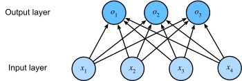

# Softmax regression

https://d2l.ai/chapter_linear-classification/softmax-regression.html

In this section, we focus on classification problems where we put aside how much? questions and instead focus on _which
category_? questions.

* Does this email belong in the spam folder or the inbox?
* Is this customer more likely to sign up or not to sign up for a subscription service?
* Does this image depict a donkey, a dog, a cat, or a rooster?
* Which movie is Aston most likely to watch next?
* Which section of the book are you going to read next?

Colloquially, machine learning practitioners overload the word classification to describe two subtly different problems:

> (i) those where we are interested only in **hard assignments of examples to categories (
classes)**;

> (ii) those where we wish to make **soft assignments**, i.e., to assess the probability
> that each category applies. The distinction tends to get blurred, in part, because often, even when we only care about
> hard assignments, we still use models that make soft assignments.

Even more, there are cases where more than one label might be true.

For instance, **a news article might simultaneously cover the topics of entertainment, business, and space flight, but
not the topics of medicine or sports**.

Thus, categorizing it into one of the above categories on their own would not be very useful.

This problem is commonly known as **multi-label classification**.

## Classification

Let's start with a simple **image classification problem**.

Here, each input consists of a $2\times2$ grayscale image.

We can represent **each pixel value** with a single scalar,
giving us four features $x_1, x_2, x_3, x_4$.

Further, let's assume that each image belongs to one
among the categories "cat", "chicken", and "dog".

Next, we have to choose how to represent the labels.

We have two obvious choices.

Perhaps the most natural impulse would be to choose $y \in \{1, 2, 3\}$, where the integers represent
$\{\textrm{dog}, \textrm{cat}, \textrm{chicken}\}$ respectively.

This is a great way of *storing* such information on a computer.
If the categories had some **natural ordering among them**,
say if we were trying to predict
$\{\textrm{baby}, \textrm{toddler}, \textrm{adolescent}, \textrm{young adult}, \textrm{adult}, \textrm{geriatric}\}$,
then it might even make sense to cast this as
an [ordinal regression](https://en.wikipedia.org/wiki/Ordinal_regression) problem
and keep the labels in this format.

In general, **classification problems do not come
with natural orderings among the classes**.

Fortunately, statisticians long ago invented a simple way
to represent categorical data: the *one-hot encoding*.

> A **one-hot encoding** is a vector
> with as many components as we have categories.
> The component corresponding to a particular instance's category is set to 1
> and all other components are set to 0.

In our case, a label $y$ would be a three-dimensional vector,
with $(1, 0, 0)$ corresponding to "cat", $(0, 1, 0)$ to "chicken",
and $(0, 0, 1)$ to "dog":

$$y \in \{(1, 0, 0), (0, 1, 0), (0, 0, 1)\}.$$

### Linear Model

In order to estimate the conditional probabilities
associated with all the possible classes,
**we need a model with multiple outputs**, one per class.

To address classification with linear models,
we will need **as many affine functions as we have outputs**.

Strictly speaking, we only need one fewer,
since the final category has to be the difference
between $1$ and the sum of the other categories,
but for reasons of symmetry
we use a slightly redundant parametrization.

Each output corresponds to its own affine function.

In our case, since we have 4 features and 3 possible output categories,
we need 12 scalars to represent the weights ($w$ with subscripts),
and 3 scalars to represent the biases ($b$ with subscripts).

This yields:

$$
\begin{aligned}
o_1 &= x_1 w_{11} + x_2 w_{12} + x_3 w_{13} + x_4 w_{14} + b_1,\\
o_2 &= x_1 w_{21} + x_2 w_{22} + x_3 w_{23} + x_4 w_{24} + b_2,\\
o_3 &= x_1 w_{31} + x_2 w_{32} + x_3 w_{33} + x_4 w_{34} + b_3.
\end{aligned}
$$

The corresponding neural network diagram is shown in :numref:`fig_softmaxreg`.

Just as in linear regression, we use a single-layer neural network.

And since the calculation of each output, $o_1, o_2$, and $o_3$,
depends on every input, $x_1$, $x_2$, $x_3$, and $x_4$,
the output layer can also be described as a *fully connected layer*.

For a more concise notation we use vectors and matrices:

$$\mathbf{o} = \mathbf{W} \mathbf{x} + \mathbf{b}$$

Note that we have gathered all of our weights into a $3 \times 4$ matrix and all biases
$\mathbf{b} \in \mathbb{R}^3$ in a vector.

To summerize

| Categories/classes (one-hot encoding vectors) | Input Features (#pixels)        | Weight matrix                     | Bias                            |
|-----------------------------------------------|---------------------------------|-----------------------------------|---------------------------------|
| $\mathbf{o} \in \mathbb{R}^{K}$               | $\mathbf{X} \in \mathbb{R}^{d}$ | $\mathbf{W} \in \mathbb{R}^{K,d}$ | $\mathbf{b} \in \mathbb{R}^{K}$ |

### The Softmax

The problem with this approach is that every single layer network output, called **logit**
will be of type $o=\left[2.5,0.3,−1.2\right]$

Therefore, **logits are not representation of probabilities**:
- $o_i \not\in \left[0,1\right] $
- $\sum_io_i \not= 1$

We want every vector $O$ to represent the classification probabilities for each category, given the input features $X$, 
excluding negative values too.

## The $softmax$ function

> Softmax transforms logits into probabilities:
> This does indeed satisfy the requirement
> that the conditional class probability
> increases with increasing $o_i$, it is monotonic,
> and all probabilities are nonnegative.

We can then transform these values so that they add up to $1$
by dividing each by their sum.
This process is called *normalization*.
Putting these two pieces together
gives us the *softmax* function:

$$\hat{\mathbf{y}} = \mathrm{softmax}(\mathbf{o}) \quad \textrm{where}\quad \hat{y}_i = \frac{\exp(o_i)}{\sum_{j=1}^K \exp(o_j)}.$$

> Note that the largest coordinate of $\mathbf{o}$
> corresponds to the most likely class according to $\hat{\mathbf{y}}$.

Moreover, because the softmax operation preserves the ordering among its arguments,
we do not need to compute the softmax to determine which class has been assigned the highest probability. 

Thus,

$$
\operatorname*{argmax}_j \hat y_j = \operatorname*{argmax}_j o_j.
$$

So, in terms of matrices

$$ \begin{aligned} \mathbf{O} &= \mathbf{X} \mathbf{W} + \mathbf{b}, \\ \hat{\mathbf{Y}} & = \mathrm{softmax}(\mathbf{O}). \end{aligned} $$
:eqlabel:`eq_minibatch_softmax_reg`

### Example

Suppose we have $o=\left[2.5,0.3,−1.2 \right]$, 

so $e^o=\left[e^{2.5},e^{0.3},e^{−1.2} \right]=\left[12.18,1.35,0.30\right]$

we have $\sum_{j=1}^Ko_i=13.83$

so  $\hat y=\operatorname*{softmax}(o)=\left[\frac{12.18}{13.83},\frac{1.35}{13.83},\frac{0.30}{13.83}\right]=\left[0.88,0.10,0.02\right]$

if the one hot vector categoris are

| Class | One-hot vector |
| ----- |----------------|
| Cat   | $[1,0,0]$      |
| Dog   | $[0,1,0]$      |
| Bird  | $[0,0,1]$      |

Now we have a probability vector saying that Cat is with the highest change of 88% and Dog is 10%.

## Loss Function

Now that we have a mapping from features $\mathbf{x}$
to probabilities $\mathbf{\hat{y}}$,
we need a way to optimize the accuracy of this mapping.

> We will rely on maximum likelihood estimation.

### Log-Likelihood

> The softmax function gives us a vector $\hat{\mathbf{y}}$,
> which we can interpret as the **(estimated) conditional probabilities of each class given any input $\mathbf{x}$**, such as 
 
$$\hat{y}_1 = P(y=\textrm{cat} \mid \mathbf{x})$$

We can compare the estimates with reality by checking how probable the actual classes are
according to our model, given the features:

$$
P(\mathbf{Y} \mid \mathbf{X}) = \prod_{i=1}^n P(\mathbf{y}^{(i)} \mid \mathbf{x}^{(i)}).
$$

We are allowed to use the factorization
since we assume that each label is drawn independently
from its respective distribution $P(\mathbf{y}\mid\mathbf{x}^{(i)})$.
Since maximizing the product of terms is awkward,
**we take the negative logarithm to obtain the equivalent problem
of minimizing the negative log-likelihood**:

$$
-\log P(\mathbf{Y} \mid \mathbf{X}) = \sum_{i=1}^n -\log P(\mathbf{y}^{(i)} \mid \mathbf{x}^{(i)})
= \sum_{i=1}^n l(\mathbf{y}^{(i)}, \hat{\mathbf{y}}^{(i)}),
$$

> where for any pair of label $\mathbf{y}$
> and model prediction $\hat{\mathbf{y}}$
> over $K$ classes, the loss function $l$ is called ***cross-entropy loss***

$$ l(\mathbf{y}, \hat{\mathbf{y}}) = - \sum_{j=1}^K y_j \log \hat{y}_j. $$

Since only one component of the one hot vector $y$ equals 1 it becomes:

$$(\mathbf{y}, \hat{\mathbf{y}}) =- \log \hat{y}_{correct}$$

If, for instance, for the $n-th$ sample we have $P[Y_{n Dog}|X_n]=-log(0.10)=2.30$

> The cross-entropy loss assigns higher lossees to classifications with low probabilities. 

### Softmax and Cross-Entropy Loss

There is a bit advantage in using the $\operatorname*{softmax}(o)$ as estimator/model in a 
maximum likelihood estimation because the minimization of the logarithm and the exponentiation of the softmax 
simplyfy a lot the calculation of the minimization of the function via the gradient:

$$
\begin{aligned}
l(\mathbf{y}, \hat{\mathbf{y}}) &=  - \sum_{j=1}^q y_j \log \frac{\exp(o_j)}{\sum_{k=1}^q \exp(o_k)} \\
&= \sum_{j=1}^q y_j \log \sum_{k=1}^q \exp(o_k) - \sum_{j=1}^q y_j o_j \\
&= \log \sum_{k=1}^q \exp(o_k) - \sum_{j=1}^q y_j o_j.
\end{aligned}
$$

To understand a bit better what is going on,
consider the derivative with respect to any logit $o_j$. We get

$$
\partial_{o_j} l(\mathbf{y}, \hat{\mathbf{y}}) = \frac{\exp(o_j)}{\sum_{k=1}^q \exp(o_k)} - y_j = \mathrm{softmax}(\mathbf{o})_j - y_j.
$$

> The derivative is the difference between the probability assigned by our model,
as expressed by the softmax operation,
and what actually happened, as expressed
by elements in the one-hot label vector.

In this sense, it is very similar to what we saw in regression,
where the gradient was the difference between the observation $y$ and estimate $\hat{y}$.
This is not a coincidence. 

For example:
    $$y=[0,1,0] \:\:\hat y=[0.88,0.10,0.02]$$

then
    $$\partial_{o_j} l(\mathbf{y}, \hat{\mathbf{y}})=[0.88,−0.90,0.02].$$

https://chatgpt.com/c/6a1b0e1b-93a0-83eb-b718-bdba89fb9166

Now consider the case where we observe not just a single outcome
but an entire distribution over outcomes.
We can use the same representation as before for the label $\mathbf{y}$.
The only difference is that rather
than a vector containing only binary entries,
say $(0, 0, 1)$, we now have a generic probability vector,
say $(0.1, 0.2, 0.7)$.
The math that we used previously to define the loss $l$
in :eqref:`eq_l_cross_entropy`
still works well,
just that the interpretation is slightly more general.
It is the expected value of the loss for a distribution over labels.

This loss is called the *cross-entropy loss* and it is
one of the most commonly used losses for classification problems.
We can demystify the name by introducing just the basics of information theory.
In a nutshell, it measures the number of bits needed to encode what we see, $\mathbf{y}$,
relative to what we predict that should happen, $\hat{\mathbf{y}}$.
We provide a very basic explanation in the following. 

