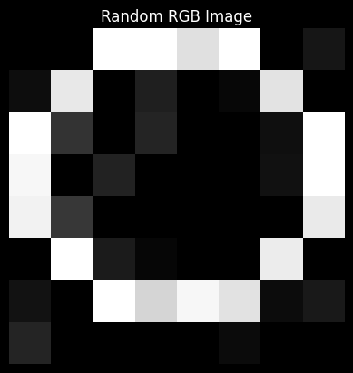
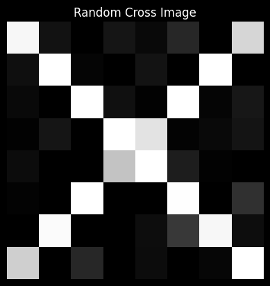
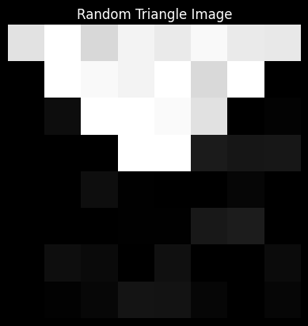
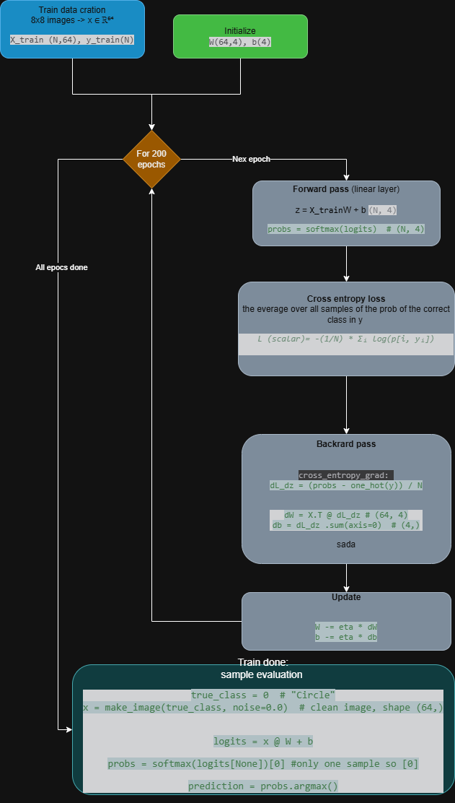

# Softmax regression

https://d2l.ai/chapter_linear-classification/softmax-regression.html

In this section, we focus on classification problems where we put aside how much? questions and instead focus on _which
category_? questions.

* Does this email belong in the spam folder or the inbox?
* Is this customer more likely to sign up or not to sign up for a subscription service?
* Does this image depict a donkey, a dog, a cat, or a rooster?
* Which movie is Aston most likely to watch next?
* Which section of the book are you going to read next?

Colloquially, machine learning practitioners overload the word classification to describe two subtly different problems:

> (i) those where we are interested only in <span style="color:red">**hard assignments of examples to categories (
classes)**</span>;


> (ii) those where we wish to make <span style="color:red">**soft assignments**</span>, i.e., to assess the probability
> that each category applies. The distinction tends to get blurred, in part, because often, even when we only care about
> hard assignments, we still use models that make soft assignments.

Even more, there are cases where more than one label might be true.

For instance, **a news article might simultaneously cover the topics of entertainment, business, and space flight, but
not the topics of medicine or sports**.

Thus, categorizing it into one of the above categories on their own would not be very useful.

This problem is commonly known as <span style="color:red">**multi-label classification**</span>.

## Classification

Let's start with a simple **image classification problem**.

Here, each input consists of a $2\times2$ grayscale image.

We can represent **each pixel value** with a single scalar,
giving us four features $x_1, x_2, x_3, x_4$.

Further, let's assume that each image belongs to one
among the categories "cat", "chicken", and "dog".

Next, we have to choose how to represent the labels.

We have two obvious choices.

Perhaps the most natural impulse would be to choose $y \in \{1, 2, 3\}$, where the integers represent
$\{\textrm{dog}, \textrm{cat}, \textrm{chicken}\}$ respectively.

This is a great way of *storing* such information on a computer.
If the categories had some **natural ordering among them**,
say if we were trying to predict
$\{\textrm{baby}, \textrm{toddler}, \textrm{adolescent}, \textrm{young adult}, \textrm{adult}, \textrm{geriatric}\}$,
then it might even make sense to cast this as
an [ordinal regression](https://en.wikipedia.org/wiki/Ordinal_regression) problem
and keep the labels in this format.

In general, **classification problems do not come
with natural orderings among the classes**.

Fortunately, statisticians long ago invented a simple way
to represent categorical data: the *one-hot encoding*.

> A <span style="color:red">**one-hot encoding**</span> is a vector
> with as many components as we have categories.
> The component corresponding to a particular instance's category is set to 1
> and all other components are set to 0.


In our case, a label $y$ would be a three-dimensional vector,
with $(1, 0, 0)$ corresponding to "cat", $(0, 1, 0)$ to "chicken",
and $(0, 0, 1)$ to "dog":

$$y \in \{(1, 0, 0), (0, 1, 0), (0, 0, 1)\}.$$

### Linear Model

In order to estimate the conditional probabilities
associated with all the possible classes,
**we need a model with multiple outputs**, one per class.

To address classification with linear models,
we will need **as many affine functions as we have outputs**.

Strictly speaking, we only need one fewer,
since the final category has to be the difference
between $1$ and the sum of the other categories,
but for reasons of symmetry
we use a slightly redundant parametrization.

Each output corresponds to its own affine function.

In our case, since we have 4 features and 3 possible output categories,
we need 12 scalars to represent the weights ($w$ with subscripts),
and 3 scalars to represent the biases ($b$ with subscripts).

This yields:

$$
\begin{aligned}
o_1 &= x_1 w_{11} + x_2 w_{12} + x_3 w_{13} + x_4 w_{14} + b_1,\\
o_2 &= x_1 w_{21} + x_2 w_{22} + x_3 w_{23} + x_4 w_{24} + b_2,\\
o_3 &= x_1 w_{31} + x_2 w_{32} + x_3 w_{33} + x_4 w_{34} + b_3.
\end{aligned}
$$

The corresponding neural network diagram is shown in :numref:`fig_softmaxreg`.

Just as in linear regression, we use a single-layer neural network.

And since the calculation of each output, $o_1, o_2$, and $o_3$,
depends on every input, $x_1$, $x_2$, $x_3$, and $x_4$,
the output layer can also be described as a *fully connected layer*.


For a more concise notation we use vectors and matrices:

$$\mathbf{o} = \mathbf{W} \mathbf{x} + \mathbf{b}$$

Note that we have gathered all of our weights into a $3 \times 4$ matrix and all biases
$\mathbf{b} \in \mathbb{R}^3$ in a vector.

To summerize

| Categories/classes (one-hot encoding vectors) | Input Features (#pixels)        | Weight matrix                     | Bias                            |
|-----------------------------------------------|---------------------------------|-----------------------------------|---------------------------------|
| $\mathbf{o} \in \mathbb{R}^{K}$               | $\mathbf{X} \in \mathbb{R}^{d}$ | $\mathbf{W} \in \mathbb{R}^{K,d}$ | $\mathbf{b} \in \mathbb{R}^{K}$ |

### The Softmax

The problem with this approach is that every single layer network output, called <span style="color: red">**logit
**</span>
will be of type $o=\left[2.5,0.3,−1.2\right]$

Therefore, <span style="color: red">**logits are not representation of probabilities**</span>:

* $o_i \not\in \left[0,1\right]$

* $\sum_io_i \not= 1$

We want every vector $O$ to represent the classification probabilities for each category, given the input features $X$,
excluding negative values too.

## The $softmax$ function

> Softmax transforms logits into probabilities:
> This does indeed satisfy the requirement
> that the conditional class probability
> increases with increasing $o_i$, it is monotonic,
> and all probabilities are nonnegative.

We can then transform these values so that they add up to $1$
by dividing each by their sum.
This process is called *normalization*.
Putting these two pieces together
gives us the *softmax* function:

$$\hat{\mathbf{y}} = \mathrm{softmax}(\mathbf{o}) \quad \textrm{where}\quad \hat{y}_i = \frac{\exp(o_i)}{\sum_{j=1}^K \exp(o_j)}.$$


> Note that the largest coordinate of $\mathbf{o}$
> corresponds to the most likely class according to $\hat{\mathbf{y}}$.

Moreover, because the softmax operation preserves the ordering among its arguments,
we do not need to compute the softmax to determine which class has been assigned the highest probability.

Thus,

$$
\operatorname*{argmax}_j \hat y_j = \operatorname*{argmax}_j o_j.
$$

So, in terms of matrices

$$ \begin{aligned} \mathbf{O} &= \mathbf{X} \mathbf{W} + \mathbf{b}, \\ \hat{\mathbf{Y}} & = \mathrm{softmax}(\mathbf{O}). \end{aligned} $$
:eqlabel:`eq_minibatch_softmax_reg`

### Example

Suppose we have $o=\left[2.5,0.3,−1.2 \right]$,

so $e^o=\left[e^{2.5},e^{0.3},e^{−1.2} \right]=\left[12.18,1.35,0.30\right]$

we have $\sum_{j=1}^Ko_i=13.83$

so  $\hat y=\operatorname*{softmax}(o)=\left[\frac{12.18}{13.83},\frac{1.35}{13.83},\frac{0.30}{13.83}\right]=\left[0.88,0.10,0.02\right]$

if the one hot vector categoris are

| Class | One-hot vector |
|-------|----------------|
| Cat   | $[1,0,0]$      |
| Dog   | $[0,1,0]$      |
| Bird  | $[0,0,1]$      |

Now we have a probability vector saying that Cat is with the highest change of 88% and Dog is 10%.

### Stable version of softmax

Directly computing exponentials can overflow, for instance $\exp(1000)$,
is too large for floating-point arithmetic.

Instead use:

$$\hat{y}_i = \frac{\exp(o_i-o_{max})}{\sum_{j=1}^K \exp(o_j-o_{max})}$$

where

$$o_{max}=\max_j(o_j)$$

Subtracting the same constant from every logit does not change the probabilities.

## Loss Function

Now that we have a mapping from features $\mathbf{x}$
to probabilities $\mathbf{\hat{y}}$,
we need a way to optimize the accuracy of this mapping.

> We will rely on maximum likelihood estimation.

### Log-Likelihood

> The softmax function gives us a vector $\hat{\mathbf{y}}$,
> which we can interpret as the <span style="color: red">**(estimated) conditional probabilities of each class given any
input $\mathbf{x}$**</span>, such as

$$\hat{y}_1 = P(y=\textrm{cat} \mid \mathbf{x})$$

We can compare the estimates with reality by checking how probable the actual classes are
according to our model, given the features:

$$
P(\mathbf{Y} \mid \mathbf{X}) = \prod_{i=1}^n P(\mathbf{y}^{(i)} \mid \mathbf{x}^{(i)}).
$$

We are allowed to use the factorization
since we assume that each label is drawn independently
from its respective distribution $P(\mathbf{y}\mid\mathbf{x}^{(i)})$.
Since maximizing the product of terms is awkward,
<span style="color: red">**we take the negative logarithm to obtain the equivalent problem
of minimizing the negative log-likelihood**</span>:

$$
-\log P(\mathbf{Y} \mid \mathbf{X}) = \sum_{i=1}^n -\log P(\mathbf{y}^{(i)} \mid \mathbf{x}^{(i)})
= \sum_{i=1}^n l(\mathbf{y}^{(i)}, \hat{\mathbf{y}}^{(i)}),
$$

> where for any pair of label $\mathbf{y}$
> and model prediction $\hat{\mathbf{y}}$
> over $K$ classes, <span style="color: red">the loss function $l$ is called ***cross-entropy loss***</span>

$$ l(\mathbf{y}, \hat{\mathbf{y}}) = - \sum_{j=1}^K y_j \log \hat{y}_j. $$

Since only one component of the one hot vector $y$ equals 1 it becomes:

$$(\mathbf{y}, \hat{\mathbf{y}}) =- \log \hat{y}_{correct}$$

If, for instance, for the $n-th$ sample we have $P[Y_{n Dog}|X_n]=-log(0.10)=2.30$

> The cross-entropy loss assigns higher lossees to classifications with low probabilities.

### Softmax and Cross-Entropy Loss

There is a bit advantage in using the $\operatorname*{softmax}(o)$ as estimator/model in a
maximum likelihood estimation because the minimization of the logarithm and the exponentiation of the softmax
simplyfy a lot the calculation of the minimization of the function via the gradient:

$$
\begin{aligned}
l(\mathbf{y}, \hat{\mathbf{y}}) &= - \sum_{j=1}^K y_j \log \frac{\exp(o_j)}{\sum_{k=1}^q \exp(o_k)} \\
&= \sum_{j=1}^K y_j \log \sum_{k=1}^K \exp(o_k) - \sum_{j=1}^K y_j o_j \\
&= \log \sum_{k=1}^K \exp(o_k) - \sum_{j=1}^K y_j o_j.
\end{aligned}
$$

### Derivative

To understand a bit better what is going on,
consider the derivative with respect to any logit $o_j$. We get

$$
\partial_{o_j} l(\mathbf{y}, \hat{\mathbf{y}}) = \frac{\exp(o_j)}{\sum_{k=1}^K \exp(o_k)} - y_j = \mathrm{softmax}(\mathbf{o})_j - y_j.
$$

> The derivative is the difference between the probability assigned by our model,
> as expressed by the softmax operation,
> and what actually happened, as expressed
> by elements in the one-hot label vector.


In this sense, it is very similar to what we saw in regression,
where the gradient was the difference between the observation $y$ and estimate $\hat{y}$.
This is not a coincidence.

For example:
$$y=[0,1,0] \:\:\hat y=[0.88,0.10,0.02]$$

then
$$\partial_{o_j} l(\mathbf{y}, \hat{\mathbf{y}})=[0.88,−0.90,0.02].$$

The gradient:

* decreases the logit of the wrongly favored class,
* increases the logit of the true class,
* leaves the probabilities moving toward the target one-hot vector.

### Meaning of cross-entropy loss in information technology

To understand why cross-entropy loss is named the way it is, we have to look at its roots in Information Theory (
pioneered by Claude Shannon) and how it perfectly translates to measuring the error in a classification neural network.

The name comes from the fact that it calculates the "**cross**" (or overlap) between two different probability
distributions: the true distribution (your labels) and the predicted distribution (your network's output).

#### The entropy

> The entropy measures the <span style="color:red">**average amount of uncertainty or surprise inherent in a set of
outcomes**</span>

$$H(p) = -\sum_{i} p_i \log(p_i)$$

The Intuition: $-\log(p_i)$ is the "surprise factor" of an event happening.

If an event is guaranteed ($p_i = 1$), its surprise is $-\log(1) = 0$.

Entropy is just the average surprise you get from the true distribution.

#### The "cross" entropy

> Cross-entropy $H(p, q)$ is the average surprise you experience when you try to predict events from $p$ using your
> flawed model $q$.

$$H(p, q) = -\sum_{i} p_i \log(q_i)$$

It is called cross-entropy because it combines two different distributions across the same set of events.

* $p_i$: The probability of event $i$ occurring in the true world.
* $\log(q_i)$: The surprise you feel based on your predicted model.

In classification problems we use the cross entropy loss with the following

* True distribution ($p$): [0, 1, 0] (It is 100% a cat)
* Predicted distribution ($q$): [0.1, 0.7, 0.2] (The network thinks there is a 70% chance it's a cat)

$$H(p, q) = -(0 \cdot \log(0.1) + 1 \cdot \log(0.7) + 0 \cdot \log(0.2))$$$$H(p, q) = -\log(0.7) = 0.1549$$

Because the true distribution $p$ is a one-hot vector, the "cross" calculation collapses entirely onto the specific
class you care about.
It penalizes you based on how far your prediction ($q_{cat} = 0.7$) is from the absolute truth ($p_{cat} = 1$).

If your network predicted a $0.99$ chance for the cat, $-\log(0.99)$ would be very close to 0 (low loss).

If it predicted a $0.01$ chance, $-\log(0.01)$ would rocket upward (high loss).

### Implementation

We want to classify 8x8 images of four figures:

|          |                                   |
|----------|-----------------------------------|
| Circle   |      |
| Cross    |        |
| Square   |        |
| Triangle |  |


```python
"""
Linear Network Classification with Cross-Entropy Loss
======================================================
A complete from-scratch example using only NumPy.
Network: Input(64) -> Linear(4) -> Softmax -> CrossEntropy
         (single layer — no hidden layer, no activation)
"""

import numpy as np

# ── Reproducibility ──────────────────────────────────────────────────────────
np.random.seed(42)

# ── Constants ─────────────────────────────────────────────────────────────────
CLASSES = ["Circle", "Cross", "Triangle", "Square"]
N_CLASSES = 4
IMG_SIZE = 8  # 8×8 pixels
INPUT_DIM = IMG_SIZE * IMG_SIZE  # 64
LR = 0.05
EPOCHS = 200


# ═══════════════════════════════════════════════════════════════════════════════
# 1.  DATASET  —  synthetic 8×8 shape images
# ═══════════════════════════════════════════════════════════════════════════════

def make_image(class_idx: int, noise: float = 0.1) -> np.ndarray:
    """Return a flat 64-d vector for one shape (values in [-1, 1])."""
    img = np.zeros((8, 8))

    if class_idx == 0:  # Circle — ring of pixels
        for x, y in [(2, 0), (3, 0), (4, 0), (5, 0), (1, 1), (6, 1), (0, 2), (7, 2),
                     (0, 3), (7, 3), (0, 4), (7, 4), (1, 5), (6, 5), (2, 6), (3, 6), (4, 6), (5, 6)]:
            img[y, x] = 1.0

    elif class_idx == 1:  # Cross — two diagonals
        for i in range(8):
            img[i, i] = 1.0
            img[i, 7 - i] = 1.0

    elif class_idx == 2:  # Triangle — upper half-triangle
        for row in range(4):
            for col in range(row, 8 - row):
                img[row, col] = 1.0

    else:  # Square — filled rectangle with border
        img[1:7, 1:7] = 1.0
        img[0, :] = img[7, :] = img[:, 0] = img[:, 7] = 1.0

    img += np.random.randn(8, 8) * noise
    img = np.clip(img, 0, 1)
    return img.flatten() * 2 - 1  # normalise to [-1, 1]


def make_dataset(n_per_class: int = 32):
    X, y = [], []
    for c in range(N_CLASSES):
        for _ in range(n_per_class):
            X.append(make_image(c))
            y.append(c)
    X = np.array(X)  # (N, 64)
    y = np.array(y)  # (N,)
    idx = np.random.permutation(len(y))
    return X[idx], y[idx]


# ═══════════════════════════════════════════════════════════════════════════════
# 2.  SOFTMAX
# ═══════════════════════════════════════════════════════════════════════════════

def softmax(z: np.ndarray) -> np.ndarray:
    """Numerically stable softmax over the last axis."""
    z_shift = z - z.max(axis=-1, keepdims=True)
    exp_z = np.exp(z_shift)
    return exp_z / exp_z.sum(axis=-1, keepdims=True)


# ═══════════════════════════════════════════════════════════════════════════════
# 3.  LOSS FUNCTION
# ═══════════════════════════════════════════════════════════════════════════════

def cross_entropy_loss(probs: np.ndarray, y: np.ndarray) -> float:
    """
    L = -(1/N) * Σᵢ log(p[i, yᵢ])

    probs : (N, N_CLASSES)  — softmax output
    y     : (N,)    — integer class labels
    """
    #this selects the probs
    p_true = probs[np.arange(len(y)), y].clip(1e-9) #clip 0.0 -> 1e-19 to prevent log(0) = -∞
    return float(-np.mean(np.log(p_true)))


def cross_entropy_grad(probs: np.ndarray, y: np.ndarray) -> np.ndarray:
    """
    Combined softmax + cross-entropy gradient w.r.t. logits:
        dL/dz = (probs - one_hot(y)) / N
    """
    grad = probs.copy()
    grad[np.arange(len(y)), y] -= 1
    return grad / len(y)


# ═══════════════════════════════════════════════════════════════════════════════
# 4.  NETWORK PARAMETERS  (single layer only)
# ═══════════════════════════════════════════════════════════════════════════════

def init_params():
    """Xavier initialisation for W, zeros for b."""
    W = np.random.randn(INPUT_DIM, N_CLASSES) * np.sqrt(1.0 / INPUT_DIM)
    b = np.zeros(N_CLASSES)
    return W, b


# ═══════════════════════════════════════════════════════════════════════════════
# 5.  FORWARD PASS
# ═══════════════════════════════════════════════════════════════════════════════

def forward(X: np.ndarray, W, b):
    """
    X      : (N, 64)
    logits : (N, 4)   = X @ W + b
    probs  : (N, 4)   = softmax(logits)
    """
    logits = X @ W + b  # (N, 4)
    probs = softmax(logits)  # (N, 4)
    return probs, logits


# ═══════════════════════════════════════════════════════════════════════════════
# 6.  BACKWARD PASS
# ═══════════════════════════════════════════════════════════════════════════════

def backward(X: np.ndarray, probs: np.ndarray, y: np.ndarray):
    """
    dL/dW = Xᵀ · dL/dz        shape (64, 4)
    dL/db = Σ dL/dz            shape (4,)
    """
    dz = cross_entropy_grad(probs, y)  # (N, 4)
    dW = X.T @ dz  # (64, 4)
    db = dz.sum(axis=0)  # (4,)
    return dW, db


# ═══════════════════════════════════════════════════════════════════════════════
# 7.  TRAINING LOOP
# ═══════════════════════════════════════════════════════════════════════════════

def train():
    X_train, y_train = make_dataset(n_per_class=32)
    W, b = init_params()

    print(f"\n{'─' * 52}")
    print(f"  Single-Layer Linear Classification")
    print(f"{'─' * 52}")
    print(f"  Architecture : {INPUT_DIM} → {N_CLASSES} (Softmax)")
    print(
        f"  Parameters   : {INPUT_DIM * N_CLASSES} weights + {N_CLASSES} biases = {INPUT_DIM * N_CLASSES + N_CLASSES} total")
    print(f"  Dataset      : {len(y_train)} samples, {N_CLASSES} classes")
    print(f"  Learning rate: {LR}")
    print(f"{'─' * 52}\n")

    for epoch in range(1, EPOCHS + 1):
        probs, _ = forward(X_train, W, b)
        loss = cross_entropy_loss(probs, y_train)
        accuracy = (probs.argmax(axis=1) == y_train).mean()
        dW, db = backward(X_train, probs, y_train)

        W -= LR * dW
        b -= LR * db

        if epoch % 20 == 0 or epoch == 1:
            print(f"  Epoch {epoch:>4d}/{EPOCHS}  |  Loss: {loss:.4f}  |  Acc: {accuracy * 100:.1f}%")

    return W, b


# ═══════════════════════════════════════════════════════════════════════════════
# 8.  SINGLE-SAMPLE TRACE — step-by-step cross-entropy calculation
# ═══════════════════════════════════════════════════════════════════════════════

def trace_single_sample(W, b):
    """Print every intermediate value for one sample."""
    true_class = 0  # "Circle"
    x = make_image(true_class, noise=0.0)  # clean image, shape (64,)

    print(f"\n{'═' * 52}")
    print(f"  Step-by-step trace — true class: {CLASSES[true_class]}")
    print(f"{'═' * 52}")

    # Step 1 — input
    print(f"\n  [1] Input vector x ∈ ℝ⁶⁴")
    print(f"      x[:8] = {x[:8].round(3)}")

    # Step 2 — single linear layer
    logits = x @ W + b
    print(f"\n  [2] logits = Wx + b  →  shape {logits.shape}")
    for c, val in zip(CLASSES, logits):
        print(f"      {c:<10s}: {val:+.6f}")

    # Step 3 — softmax
    probs = softmax(logits[None])[0]
    exp_s = np.exp(logits - logits.max())
    print(f"\n  [3] Softmax probabilities")
    print(f"      exp(logits − max) = {exp_s.round(4)}")
    print(f"      sum               = {exp_s.sum():.6f}")
    for c, p in zip(CLASSES, probs):
        bar = "█" * int(p * 30)
        marker = " ← true class" if c == CLASSES[true_class] else ""
        print(f"      {c:<10s}: {p:.6f}  {bar}{marker}")

    # Step 4 — cross-entropy
    p_true = probs[true_class]
    loss = -np.log(p_true)
    print(f"\n  [4] Cross-entropy loss")
    print(f"      L = −log(p[{true_class}])")
    print(f"        = −log({p_true:.6f})")
    print(f"        = {loss:.6f} nats")

    # Step 5 — gradient
    dz = probs.copy()
    dz[true_class] -= 1
    print(f"\n  [5] Gradient dL/dz = probs − one_hot(y)")
    for c, g in zip(CLASSES, dz):
        marker = " ← (p − 1)" if c == CLASSES[true_class] else " ← (p − 0)"
        print(f"      {c:<10s}: {g:+.6f}{marker}")

    pred = probs.argmax()
    print(f"\n  Predicted: {CLASSES[pred]}  |  {'✓ Correct' if pred == true_class else '✗ Wrong'}")
    print(f"{'═' * 52}\n")


# ═══════════════════════════════════════════════════════════════════════════════
# 9.  MAIN
# ═══════════════════════════════════════════════════════════════════════════════

if __name__ == "__main__":
    W, b = train()
    trace_single_sample(W, b)
```





