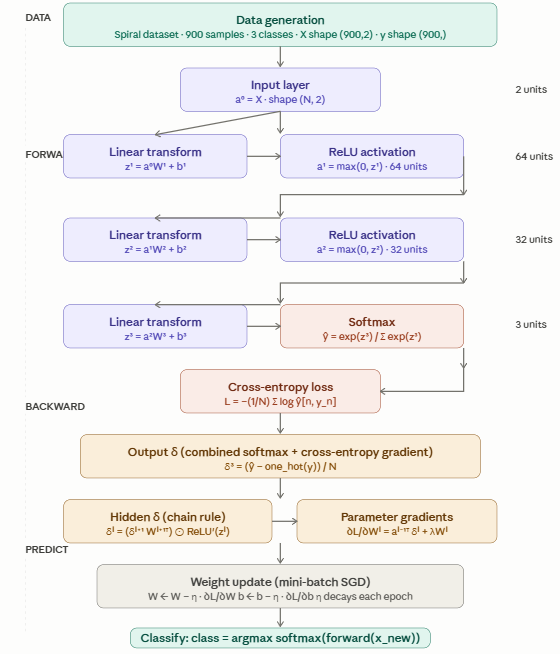
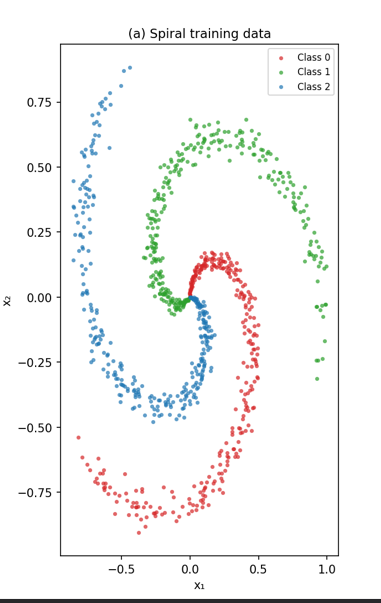
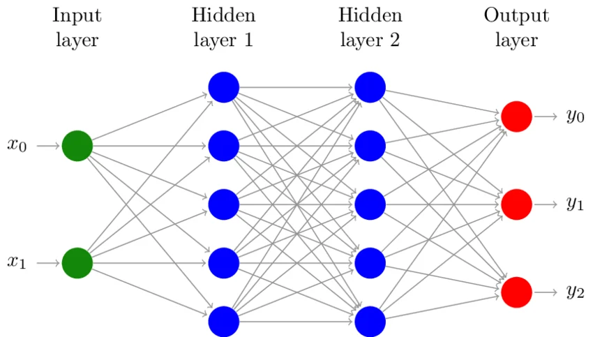

# MLP implementation




## Data generation 
`generate_spiral_data()` builds a 3-class interleaved spiral (900 samples), a classic dataset
that's impossible to separate linearly and forces the MLP to learn curved boundaries.

```python
# ─────────────────────────────────────────────────────────────
# 1. TRAINING SAMPLE GENERATION
#    Spiral dataset — 3 classes, 300 samples each
# ─────────────────────────────────────────────────────────────

def generate_spiral_data(n_samples_per_class: int = 300, n_classes: int = 3,
                         noise: float = 0.15, seed: int = 42) -> tuple:
    """
    Generates a spiral dataset with `n_classes` interleaved spirals.

    Returns:
        X : (N, 2)  float64 — 2-D feature vectors
        y : (N,)    int     — class labels 0 … n_classes-1
    """
    rng = np.random.default_rng(seed)
    N = n_samples_per_class * n_classes
    X = np.zeros((N, 2))
    y = np.zeros(N, dtype=int)

    for c in range(n_classes):
        ix = slice(c * n_samples_per_class, (c + 1) * n_samples_per_class)
        r = np.linspace(0.0, 1.0, n_samples_per_class)            # radius
        t = np.linspace(c * 4, (c + 1) * 4, n_samples_per_class)  # angle
        #adds noise to angle
        t += rng.standard_normal(n_samples_per_class) * noise
        # It takes a sequence of 1-D arrays and stack them as columns to make a single 2-D array. 
        # 1st Input array : 
        #  [1 2 3]
        # 2nd Input array : 
        #  [4 5 6]
        # Output stacked array: np.column_stack((in_arr1, in_arr2))
        #   [[1 4]
        #  [2 5]
        #  [3 6]]
        X[ix] = np.column_stack([r * np.sin(t), r * np.cos(t)])
        y[ix] = c

    # Shuffle
    perm = rng.permutation(N)
    return X[perm], y[perm]


X, y = generate_spiral_data()
n_classes = len(np.unique(y))
n_features = X.shape[1]

print(f"Dataset: {X.shape[0]} samples, {n_features} features, {n_classes} classes")
# Dataset: 900 samples, 2 features, 3 classes
```

The resulting data set is and it is not linearly separable



## Architecture and initialization

* 2 input features
* 3 target (class assignment probabilities)
* 2 hidden layers 64 then 32: 
  * a funnel pattern. The first hidden layer expands capacity: going from 2 to 64 gives the network plenty of neurons to detect diverse low-level features (curves, orientations). The second layer compresses back to 32, forcing it to consolidate those features into higher-level representations. This is a common heuristic, not a strict rule — you could use 128→64, or even two equal layers.
* He initialisation on all weight matrices (the right choice for ReLU layers)
    

> Architecture: 2 → 64 → 32 → 3
  * Layer 1: $W(2, 64)$  $b(64,)$
  * Layer 2: $W(64, 32)$  $b(32,)$
  * Layer 3: $W(32, 3)$  $b(3,)$




```python
# ─────────────────────────────────────────────────────────────
# 2. NETWORK ARCHITECTURE
#    Input(2) → Hidden1(64, ReLU) → Hidden2(32, ReLU) → Output(3, Softmax)
# ─────────────────────────────────────────────────────────────

def he_init(fan_in: int, fan_out: int, rng: np.random.Generator) -> np.ndarray:
    """He (Kaiming) initialisation — good default for ReLU activations."""
    std = np.sqrt(2.0 / fan_in)
    return rng.standard_normal((fan_in, fan_out)) * std


rng = np.random.default_rng(0)

architecture = [n_features, 64, 32, n_classes]   # layer sizes

# Weights and biases stored as lists (index i → layer i)
weights = []
biases  = []
for i in range(len(architecture) - 1):
    fan_in, fan_out = architecture[i], architecture[i + 1]
    weights.append(he_init(fan_in, fan_out, rng))
    biases.append(np.zeros(fan_out))

print(f"\nArchitecture: {' → '.join(str(s) for s in architecture)}")
for i, (W, b) in enumerate(zip(weights, biases)):
    print(f"  Layer {i+1}: W{W.shape}  b{b.shape}")
```

### Training loop (mini-batch SGD)

* 300 epochs
* SGD batch size 128
* learning rate $\eta=0.05$
* weigths & bias: list of 3 layers, each index is the matrix for the layer 


```python
# ─────────────────────────────────────────────────────────────
# 6. TRAINING LOOP  (mini-batch SGD)
# ─────────────────────────────────────────────────────────────

def train(X: np.ndarray, y: np.ndarray,
          weights: list, biases: list,
          n_epochs: int   = 300,
          batch_size: int = 128,
          lr: float       = 0.05,
          l2_lambda: float = 1e-4,
          decay: float    = 0.995) -> tuple:
    """
    Mini-batch SGD with learning-rate decay and L2 regularisation.

    Returns loss and accuracy history (one entry per epoch).
    """
    N = len(y)
    rng_loop = np.random.default_rng(7)
    loss_hist, acc_hist = [], []

    for epoch in range(n_epochs):
        # Shuffle training data each epoch
        perm = rng_loop.permutation(N)
        X_shuf, y_shuf = X[perm], y[perm]

        for start in range(0, N, batch_size):
            end    = min(start + batch_size, N)
            X_b    = X_shuf[start:end]
            y_b    = y_shuf[start:end]

            # Forward
            cache, probs = forward(X_b, weights, biases)

            # Backward
            dW, db = backward(cache, y_b, weights, biases, l2_lambda)

            # SGD update
            for i in range(len(weights)):
                weights[i] -= lr * dW[i]
                biases[i]  -= lr * db[i]

        # Epoch metrics on full training set
        _, probs_all = forward(X, weights, biases)
        loss = cross_entropy_loss(probs_all, y)
        acc  = accuracy(probs_all, y)
        loss_hist.append(loss)
        acc_hist.append(acc)

        # Learning-rate decay
        lr *= decay

        if (epoch + 1) % 50 == 0:
            print(f"  Epoch {epoch+1:4d}/{n_epochs}  "
                  f"loss={loss:.4f}  acc={acc*100:.1f}%  lr={lr:.5f}")

    return loss_hist, acc_hist


print("\n─── Training ───────────────────────────────────────")
loss_history, acc_history = train(X, y, weights, biases,
                                  n_epochs=300, batch_size=128,
                                  lr=0.05, l2_lambda=1e-4)
```

### Forward pass
Through the entire network

* $L=3$ number of layers
* $W(layers,)$ 
* $\sigma = Relu()$ 

$\forall \: l \in [1, L] $ and 
$a_0=X$ $z_{l}=a_lW_l+b_l$ and $a_{l+1}=\sigma(z_l)$ 

$z_{L}=a_{L}W_{L}+b_{L}$

$\hat{y}=softmax(z_{L})$

`forward()` caches every pre-activation z and post-activation a at each layer. 
That cache is what backprop reads back — without it you'd have to recompute everything.

```python
# ─────────────────────────────────────────────────────────────
# 4. FORWARD PASS
# ─────────────────────────────────────────────────────────────

def forward(X: np.ndarray, weights: list, biases: list) -> tuple:
    """
    Full forward pass through the network.

    Returns:
        cache : dict holding pre-activations (z) and activations (a)
                for every layer — needed by backward pass.
        probs : (N, C) softmax output probabilities
    """
    cache = {"a0": X}

    a = X
    n_hidden = len(weights) - 1   # all layers except the final softmax layer

    # Hidden layers with ReLU
    for i in range(n_hidden):
        z = a @ weights[i] + biases[i]          # linear transform
        a = relu(z)                              # ReLU activation
        cache[f"z{i+1}"] = z
        cache[f"a{i+1}"] = a

    # Output layer — linear then softmax
    last = n_hidden
    z_out = a @ weights[last] + biases[last]
    probs = softmax(z_out)
    cache[f"z{last+1}"] = z_out
    cache[f"a{last+1}"] = probs                 # a_{last+1} == softmax probs

    return cache, probs
```

### Backward pass


```python
# ─────────────────────────────────────────────────────────────
# 5. BACKWARD PASS  (backpropagation)
# ─────────────────────────────────────────────────────────────

def backward(cache: dict, y: np.ndarray,
             weights: list, biases: list,
             l2_lambda: float = 1e-4) -> tuple:
    """
    Backpropagation through the network.

    Derivation outline
    ──────────────────
    Let L = number of weight layers.

    Output layer gradient (combined softmax + cross-entropy):
        δ_L = (probs - one_hot(y)) / N

    Hidden layer gradients (chain rule):
        δ_l = (δ_{l+1} @ W_{l+1}.T) * relu'(z_l)

    Parameter gradients:
        dW_l = a_{l-1}.T @ δ_l  +  λ * W_l   (L2 regularisation)
        db_l = sum(δ_l, axis=0)

    Returns:
        dW : list of weight gradients
        db : list of bias gradients
    """
    N   = len(y)
    L   = len(weights)              # number of weight layers
    dW  = [None] * L
    db  = [None] * L

    # ── Output layer δ (softmax cross-entropy combined gradient) ──────────
    probs = cache[f"a{L}"].copy()
    probs[np.arange(N), y] -= 1.0   # subtract 1 from the true-class slot
    delta = probs / N               # shape (N, C)

    # ── Iterate backwards from L down to 1 ───────────────────────────────
    for l in reversed(range(L)):
        a_prev = cache[f"a{l}"]                     # activation from layer below
        dW[l]  = a_prev.T @ delta + l2_lambda * weights[l]
        db[l]  = delta.sum(axis=0)

        if l > 0:
            # Propagate δ through the weight matrix, then through ReLU
            delta = delta @ weights[l].T * relu_grad(cache[f"z{l}"])

    return dW, db
```

`backward()` implements the full chain rule from scratch:


The output layer gradient collapses softmax + cross-entropy into a single clean formula: δ = (ŷ − one_hot(y)) / N
Hidden layers propagate δ through the transpose weights, then gate it through ReLU′(z) = (z > 0)
L2 regularisation is added to each weight gradient (λW)

Training loop — mini-batch SGD with per-epoch learning-rate decay (lr *= 0.995). Mini-batches of 128 make each update noisier but faster to converge than full-batch GD.
Classification — forward(new_samples, ...) on three hand-picked points; the network returns calibrated class probabilities and a confident argmax prediction for each.