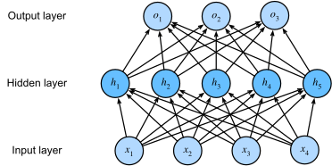
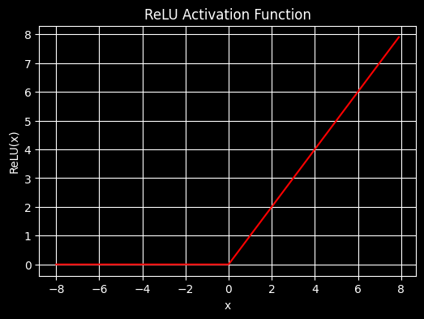
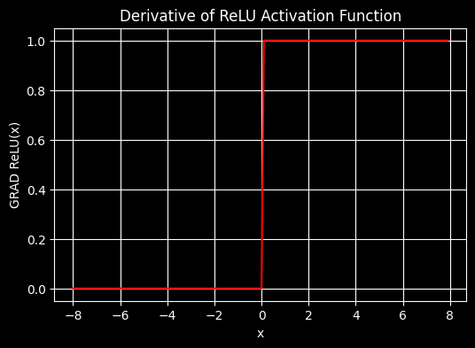
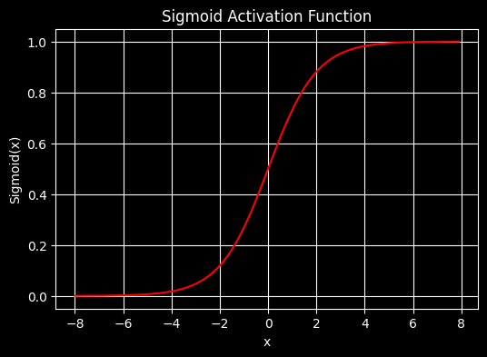
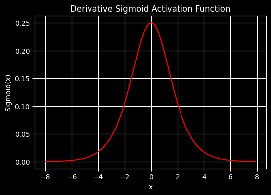
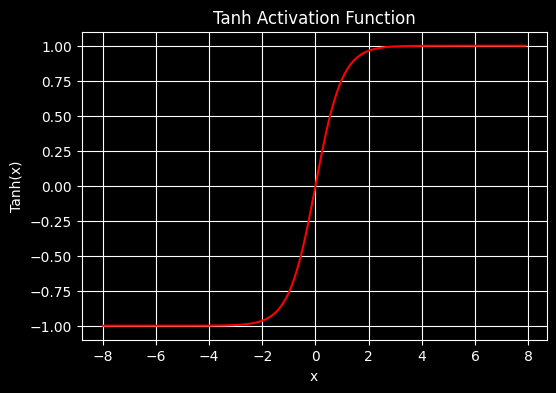
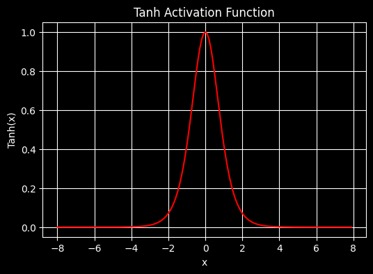

# Multilayer Perceptrons

https://d2l.ai/chapter_multilayer-perceptrons/mlp.html

## Hidden layers

In linear network classification/regression we have seen so far, the target is calculated as <span style="color:red">**linear transformation with a bias**</span>.
But linearity is usually a **strong** assumption.

### Limitations of linear models

### Limitations of Linear Models

For example, linearity implies the *weaker* assumption of *monotonicity*, i.e., that any increase in our feature 
must either always cause an increase in our model's output (if the corresponding weight is positive),
or always cause a decrease in our model's output (if the corresponding weight is negative).

Sometimes that makes sense.
For example, if we were trying to predict whether an individual will repay a loan, we can assume that the repay probability
is dependent on the applicant income. Maybe not exactly linearly (an income increas from \$0 to $50k might have a bigger impact 
than one from \$1m to \$1m+50k)

But what about classifying images of cats and dogs?
Should increasing the intensity of the pixel at location (13, 17) always increase (or always decrease)
the likelihood that the image depicts a dog?

Reliance on a linear model corresponds to the implicit assumption that the only requirement
for differentiating cats and dogs is to assess the brightness of individual pixels.

This approach is doomed to fail in a world
where inverting an image preserves the category.

>Nonlinearity is also something that the brain solves
quite naturally. After all, neurons feed into other neurons which,
in turn, feed into other neurons again :cite:`Cajal.Azoulay.1894`.

Consequently, we have a sequence of relatively simple transformations.

### Incorporating Hidden Layers

>We can overcome the limitations of linear models
by incorporating one or more hidden layers.
The easiest way to do this is to stack many fully connected layers on top of one another.

Each layer feeds into the layer above it, until we generate outputs.

We can think of the first $L-1$ layers as our representation and the final layer as our linear predictor.

> This architecture is commonly called a <span style="color:red">**multilayer perceptron**</span>, often abbreviated as <span style="color:red">**MLP**</span> (:numref:`fig_mlp`).


:label:`fig_mlp`

This MLP has four inputs, three outputs, and its hidden layer contains five hidden units.
Note that both layers are fully connected.
Every input influences every neuron in the hidden layer, and each of these in turn influences
every neuron in the output layer. 

### From Linear to Nonlinear

As before, we denote by the matrix $\mathbf{X} \in \mathbb{R}^{n \times d}$ a minibatch of $n$ examples where each example has $d$ inputs (features).

For a one-hidden-layer MLP whose hidden layer has $h$ hidden units, we denote by $\mathbf{H} \in \mathbb{R}^{n \times h}$
the outputs of the hidden layer, which are <span style="color:red">**hidden representations**</span>.

Since the hidden and output layers are both fully connected,
we have hidden-layer weights $\mathbf{W}^{(1)} \in \mathbb{R}^{d \times h}$ and biases $\mathbf{b}^{(1)} \in \mathbb{R}^{1 \times h}$
and output-layer weights $\mathbf{W}^{(2)} \in \mathbb{R}^{h \times q}$ and biases $\mathbf{b}^{(2)} \in \mathbb{R}^{1 \times q}$.

This allows us to calculate the outputs $\mathbf{O} \in \mathbb{R}^{n \times q}$
of the one-hidden-layer MLP as follows:

$$
\begin{aligned}
    \mathbf{H} & = \mathbf{X} \mathbf{W}^{(1)} + \mathbf{b}^{(1)}, \\
    \mathbf{O} & = \mathbf{H}\mathbf{W}^{(2)} + \mathbf{b}^{(2)}.
\end{aligned}
$$

Note that after adding the hidden layer, our model now requires us to track and update
additional sets of parameters.

> This will not solve the problem on non linearity: the hidden units above are given by an affine function of the inputs, and the outputs (pre-softmax) 
are just an affine function of the hidden units. Since an affine function of an affine function is itself an affine function, 
> our linear model was already capable of representing any affine function


To see this formally we can just collapse out the hidden layer in the above definition,
yielding an equivalent single-layer model with parameters
$\mathbf{W} = \mathbf{W}^{(1)}\mathbf{W}^{(2)}$ and $\mathbf{b} = \mathbf{b}^{(1)} \mathbf{W}^{(2)} + \mathbf{b}^{(2)}$:

$$
\mathbf{O} = (\mathbf{X} \mathbf{W}^{(1)} + \mathbf{b}^{(1)})\mathbf{W}^{(2)} + \mathbf{b}^{(2)} = \mathbf{X} \mathbf{W}^{(1)}\mathbf{W}^{(2)} + \mathbf{b}^{(1)} \mathbf{W}^{(2)} + \mathbf{b}^{(2)} = \mathbf{X} \mathbf{W} + \mathbf{b}.
$$


> In order to realize the potential of multilayer architectures, we need one more key ingredient: 
a nonlinear <span style="color:red">**activation function $\sigma$**</span> to be applied to each hidden unit
following the affine transformation. 
 
For instance, a popular choice is the <span style="color:red">**ReLU (rectified linear unit)**</span> activation function :cite:`Nair.Hinton.2010`
$\sigma(x) = \mathrm{max}(0, x)$ operating on its arguments elementwise.

> The outputs of activation functions $\sigma(\cdot)$ are called <span style="color:red">**activations**</span>.
In general, with activation functions in place,
it is no longer possible to collapse our MLP into a linear model:

$$
\begin{aligned}
    \mathbf{H} & = \sigma(\mathbf{X} \mathbf{W}^{(1)} + \mathbf{b}^{(1)}), \\
    \mathbf{O} & = \mathbf{H}\mathbf{W}^{(2)} + \mathbf{b}^{(2)}.\\
\end{aligned}
$$

Since each row in $\mathbf{X}$ corresponds to an example in the minibatch,
with some abuse of notation, we define the nonlinearity
$\sigma$ to apply to its inputs in a rowwise fashion,
i.e., one example at a time.
Note that we used the same notation for softmax
when we denoted a rowwise operation in :numref:`subsec_softmax_vectorization`.

Quite frequently the activation functions we use apply not merely rowwise but
elementwise. That means that after computing the linear portion of the layer,
we can calculate each activation
without looking at the values taken by the other hidden units.

To build more general MLPs, we can continue stacking
such hidden layers,
e.g., 

$\mathbf{H}^{(1)} = \sigma_1(\mathbf{X} \mathbf{W}^{(1)} + \mathbf{b}^{(1)})$
and 

$\mathbf{H}^{(2)} = \sigma_2(\mathbf{H}^{(1)} \mathbf{W}^{(2)} + \mathbf{b}^{(2)})$,
one atop another, yielding ever more expressive models.

## Activation functions

## Activation Functions
:label:`subsec_activation-functions`

Activation functions decide whether a neuron should be activated or not by
calculating the weighted sum and further adding bias to it.
They are differentiable operators for transforming input signals to outputs,
while most of them add nonlinearity.
Because activation functions are fundamental to deep learning,
(**let's briefly survey some common ones**).

### ReLU Function

The most popular choice, due to both simplicity of implementation and
its good performance on a variety of predictive tasks, is the *rectified linear unit* (*ReLU*).

> <span style="color:red">**ReLU provides a very simple nonlinear transformation**</span>

Given an element $x$, the function is defined
as the maximum of that element and $0$:

$$\operatorname{ReLU}(x) = \max(x, 0).$$

Informally, the ReLU function retains only positive
elements and discards all negative elements
by setting the corresponding activations to 0.
To gain some intuition, we can plot the function.
As you can see, the activation function is piecewise linear.



#### Derivative

With the gradient which becomes a positive input selector



### Sigmoid Function

> The *sigmoid function* transforms those inputs
whose values lie in the domain $\mathbb{R}$,
(to outputs that lie on the interval (0, 1).)
 
For that reason, the sigmoid is
often called a *squashing function*:

$$x \in \mathbb{R} -> f(x) \in [0,1]$$

$$\operatorname{sigmoid}(x) = \frac{1}{1 + \exp(-x)}.$$

In the earliest neural networks, scientists
were interested in modeling biological neurons
that either *fire* or *do not fire*.
Thus the pioneers of this field, going all the way back to McCulloch and Pitts,
the inventors of the artificial neuron, focused on thresholding units :cite:`McCulloch.Pitts.1943`.
A thresholding activation takes value 0 when its input is below some threshold and value 1 when the input exceeds the threshold.

When attention shifted to gradient-based learning, the sigmoid function was a natural choice
because it is a smooth, differentiable approximation to a thresholding unit.

Below, we plot the sigmoid function. 
Note that when the input is close to 0, the sigmoid function approaches a linear transformation.

```python
x = torch.arange(-8.0, 8.0, 0.1, requires_grad=True)
y = torch.sigmoid(x)

plt.figure(figsize=(6, 4))
plt.plot(x.detach().numpy(), y.detach().numpy(),color='r')
plt.xlabel("x")
plt.ylabel("Sigmoid(x)")
plt.title("Sigmoid Activation Function")
plt.grid(True)
plt.show()
```


#### Derivative

The derivative of the sigmoid function is given by the following equation:

$$\frac{d}{dx} \operatorname{sigmoid}(x) = \frac{\exp(-x)}{(1 + \exp(-x))^2} = \operatorname{sigmoid}(x)\left(1-\operatorname{sigmoid}(x)\right).$$


The derivative of the sigmoid function is plotted below.
Note that when the input is 0, the derivative of the sigmoid function reaches a maximum of 0.25. 

As the input diverges from 0 in either direction,
the derivative approaches 0.



### Tanh Function
:label:`subsec_tanh`

> Like the sigmoid function, [**the tanh (hyperbolic tangent)
function also squashes its inputs**],
transforming them into elements on the interval (**between $-1$ and $1$**):

$$x \in \mathbb{R} -> f(x) \in [-1,1]$$

$$\operatorname{tanh}(x) = \frac{1 - \exp(-2x)}{1 + \exp(-2x)}.$$
 
Note that as input nears 0, the tanh function approaches a linear transformation. 
Although the shape of the function is similar to that of the sigmoid function, 
the `tanh` function exhibits point symmetry about the origin of the coordinate system.



#### Derivative

The derivative of the tanh function is:

$$\frac{d}{dx} \operatorname{tanh}(x) = 1 - \operatorname{tanh}^2(x).$$

It is plotted below.
As the input nears 0,
the derivative of the tanh function approaches a maximum of 1.
And as we saw with the sigmoid function,
as input moves away from 0 in either direction,
the derivative of the tanh function approaches 0.




## MLP classification algorithm

### Architecture

* $L$ number of layers ($L-1$) hidden layers
* input features $n$ 
* The number of features can variate through the layers following a <span style="color:red">**funnel approach**</span>:
  * The first hidden layer expands capacity: going from $n$ to, usually, a power of 2 (64 or 128). This gives the network plenty of neurons to detect diverse low-level features (curves, orientations). 
  * The second layer compresses back to a lower power of two (16 or 32), forcing it to consolidate those features into higher-level representations. 
  * This is a common heuristic, not a strict rule — you could use 128→64, or even two equal layers.

Therefore, we have in the implementation example 


* $L=3$ total layers ($L-1$ hidden layers)
* 2 input features 
* 3 targets/labels (3 possible classes) $K=3$
* learning rate $\eta$
*  SGD batch size $N$
* Network 2->64->32->3
  * Layer 1: $W(2, 64)$  $b(64,)$
  * Layer 2: $W(64, 32)$  $b(32,)$
  * Layer 3: $W(32, 3)$  $b(3,)$

### Initialization


$W_i, b_i$ initialized $\forall i \in [1,L]$

### Training loop 

* Epochs: $T$

The loop of forward/backward is $\forall t \in [1,T]$

The inner loop is a mini-batch of $N$ samples:

#### Forward step minibatch

$\forall i \in [1,N]$
 
$a_0=X_i$ the 2 dim input

$\forall l \in [1,L]$

$z_l=a_{l-1}W_l^t+b_l^t$ <span style="color:red">**Pre activation step**</span>

$a_l=\sigma(z_l)=RELU(z_l)$ <span style="color:red">**post activation step**</span> for inner layer logits

For the estimated training output we need the probabilities via the $softmax$

$a_L=\hat{y_i}=softmax(z_l)$ output probabilities.

#### Backward step for the minibatch samples

* Calculate the loss

Calculate the <span style="color:red">**cross entropy loss** for the minibatch</span>

$$L=-\frac{1}{N}\sum_{i=1}^Nlog(\hat{y_i}_{y_n})$$ 

Where $\hat{y_i}_{y_n}$ is the estimated probability of the correct class in the real one-hot $y$ vector

$\hat{y_i}=\begin{bmatrix}0.1 & 0.7 & 0.2\end{bmatrix}$ and $y_i=\begin{bmatrix}0 & 1 & 0\end{bmatrix}$ then

${y_i}_{y_n}=0.7$

* calculate the gradient of the output layer

based on: [Cross-entropy loss Derivative](../../004-linear_neural_networks_for_classification/softmax_regression/#derivative) 

Al layer $l$ we have 

$\delta_l=\frac{\delta L}{\delta z_L}=\frac{softmax(z_L)-y}{N}$ with shape $(N,K)$

#### Example N=4, K=3

```python
probs = [[0.7,  0.2,  0.1],   # sample 0
         [0.1,  0.8,  0.1],   # sample 1
         [0.3,  0.3,  0.4],   # sample 2
         [0.2,  0.1,  0.7]]   # sample 3
```

```python
y = [0, 1, 2, 1] #the indexes of the true class (the 1 index in the one-hot vector)
# sample 0 → class 0
# sample 1 → class 1
# sample 2 → class 2
# sample 3 → class 1
```

```python
#equivalent to probs[[0,1,2,3], [0,1,2,1]] #picks the 2 dim coordinates of probs 1 by 1

probs[np.arange(N), y] -=1 #subtracts 1 from the selected positions which are the ones selected by the one-hot vector 

probs[0, 0] = 0.7 -1  ← sample 0, true class 0
probs[1, 1] = 0.8 -1  ← sample 1, true class 1
probs[2, 2] = 0.4 -1  ← sample 2, true class 2
probs[3, 1] = 0.1 -1  ← sample 3, true class 1
```

so that 

```python
probs = [[ 0.7-1,  0.2,    0.1  ],    →   [[-0.3,  0.2,  0.1],
         [ 0.1,    0.8-1,  0.1  ],    →    [ 0.1, -0.2,  0.1],
         [ 0.3,    0.3,    0.4-1],    →    [ 0.3,  0.3, -0.6],
         [ 0.2,    0.1-1,  0.7  ]]    →    [ 0.2, -0.9,  0.7]]

```
Now, each row sums 0 because it was giving 1 before since it is a probability sum given by $softmax$ 

Now we can calculate the mean dividing by $N$

```python
delta = probs / N #shape (N,K)=(4,3)

delta = [[-0.075,  0.05,   0.025],
         [ 0.025, -0.05,   0.025],
         [ 0.075,  0.075, -0.15 ],
         [ 0.05,  -0.225,  0.175]]
```

The sign tells the network which direction to push each logit:

* Negative entry → the network should increase this logit (it's the true class, currently under-confident)
* Positive entry → the network should decrease this logit (it's a wrong class, currently stealing probability)

Now we want to calculate for the <span style="color:red">**chain rule**</span> $\frac{\delta y}{\delta x}=\frac{\delta y}{\delta u}\frac{\delta u}{\delta x}$

$\frac{\delta L}{\delta W_l}$ and since $z_l=a_{l-1}W_l+b_l$ 

we have 

$$\frac{\delta L}{\delta W_l}=\frac{\delta z_l}{\delta W_l}\frac{\delta L}{\delta z_l}= a_{l-1}^T\delta_l$$ 

and 

$$\frac{\delta L}{\delta b_l}=\frac{\delta z_l}{\delta b_l}\frac{\delta L}{\delta z_l}=\sum_{i=1}^N\delta_{l,i}$$ (sum over samples)


