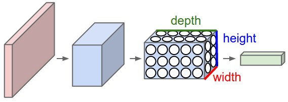
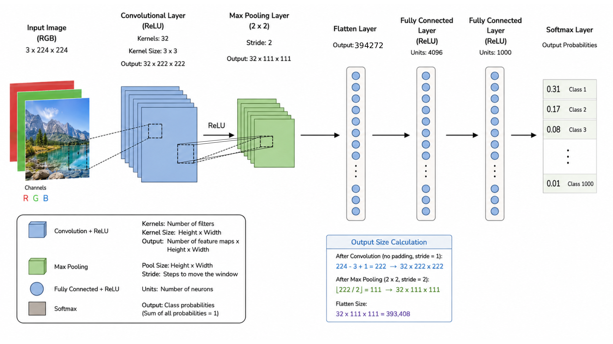
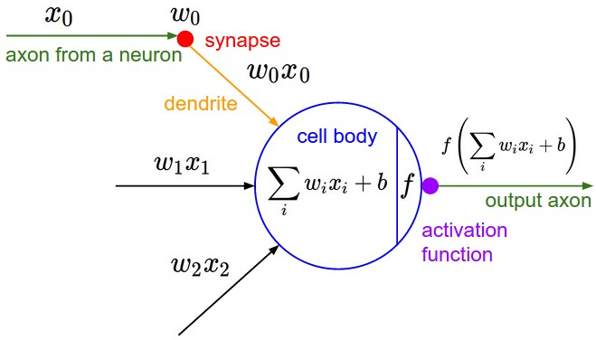
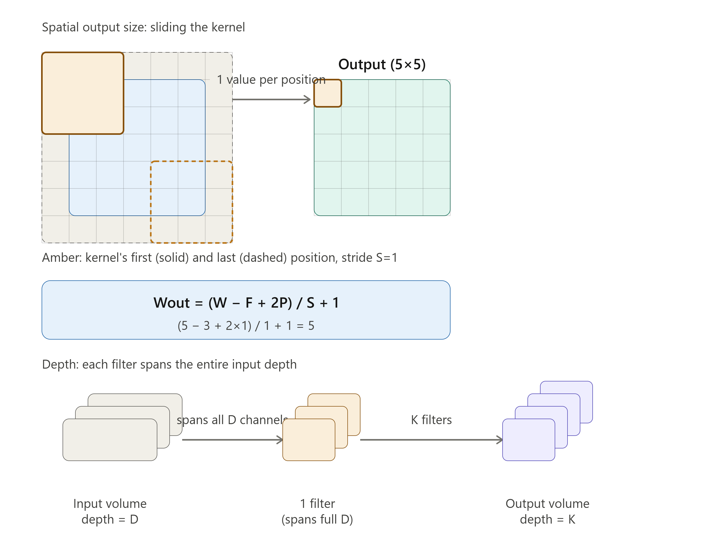
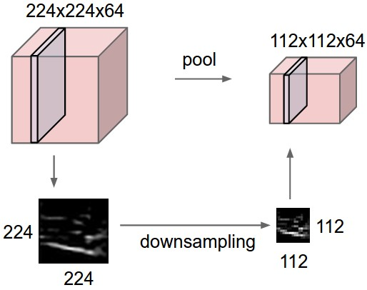

# Convolutional Neural Networks (CNNs / ConvNets)

https://cs231n.github.io/convolutional-networks/

## Convolutional Neural Networks (CNNs / ConvNets)

So far, we have seen neural networks that are organized as:

* input layer with $n$ features
* $L$ hidden, fully connected layers
* a final output layer with $K$ targets / labels (classification class probabilities)

### The overfitting problem for big neural networks

ConvNet architectures make the explicit assumption that the **inputs are images**, which allows us to encode
certain properties into the architecture.

> Traditional neural networks do not scale well with image dimension

* RGB Img 32x32x3 -> the first layer of the neural network has 3072 weights
* 200x200x3, would lead to neurons that have 200x200x3 = 120,000 weights

> This full connectivity is wasteful and the **huge number of parameters would quickly lead to
overfitting**.
> This because it has enough capacity to memorize the training data instead of learning the underlying patterns that
> generalize to unseen examples

In linear Regression
$y=w_0+w_1x$ Only two parameters. Cannot memorize arbitrary data.

Polynomial Regression
$y=a_0+a_1x+a_2x^2+⋯+a_{20}x^{20}$ Can fit every training point exactly.

* Neural networks are essentially extremely flexible nonlinear function approximators.
* Increasing the number of weights increases the complexity of functions they can represent.

> That's what solutions like **L2 weight decay** and **dropout
** are used
> to reduce the overfitting

> The most effective solution is to increase the training data, so that the network must explain more examples and
> cannot memorize as easily.

### Spatial invariance

> A feature detector (say, an edge) that works at position (10, 10) should also work at (200, 100). A CNN bakes in this
> translation equivariance by design.

### CNNs / ConvNets architecture

**3D volumes of neurons**.

Convolutional Neural Networks take advantage of the fact that the input consists of images: unlike a regular Neural
Network,
the layers of a ConvNet have neurons arranged in 3 dimensions: **width, height, depth**.

**NB**: (Note that the word depth here refers to the third dimension of an activation volume, not to the depth of a full
Neural Network)

For example, the input images in CIFAR-10 are an input volume of activations, and the volume has dimensions 32x32x3 (
width, height, depth respectively).
As we will soon see, the neurons in a layer will only be connected to a small region of the layer before it, instead of
all of the neurons in a fully-connected manner.

Moreover, the final output layer would for CIFAR-10 have dimensions 1x1x10, because by the end of the ConvNet
architecture we will reduce the full image into a single vector of class scores, arranged along the depth dimension.

|  |                                                                                                                                                                                                                                                                                                                         |
|-------------------------------------------|--------------------------------------------------------------------------------------------------------------------------------------------------------------------------------------------------------------------------------------------------------------------------------------------------------------------------------------------------|
| Traditional neural network                | Convolutional neural network: A ConvNet arranges its neurons in three dimensions (width, height, depth), as visualized in one of the layers. Every layer of a ConvNet transforms the 3D input volume to a 3D output volume of neuron activations.  The final output is the classification vector, so the 3D matrix shrinks to a 1x1xK vector |

## CNNs flow

* `INPUT` [HxWx3] [224x224x3] will hold the raw pixel values of the image with three color channels R,G,B.
* `CONV` layer will compute the output of neurons that are connected to local regions in the input, each computing a dot
  product between their weights and a small region they are connected to in the input volume. This may result in volume
  such as [HxWx32] if we decided to use 32 filters.
* `RELU` layer will apply an elementwise activation function, such as the $max(0,x)$ thresholding at zero. This leaves
  the size of the volume unchanged.
* `POOL` layer will perform a downsampling operation along the spatial dimensions (H,W) (e.g. max pool 2×2 and S=2 halves H and
  W), making the representation progressively more spatially invariant.
* `FC` After several conv+pool blocks, the spatial dimensions collapse and the representation is flattened into a vector
  for a standard classifier head $[1,1,H \times W \times D]$. The vector is then the input of a fully connected neural network 
  (with possible dropout) where the $softmax$ output is the classification vector. $[1,1,K]$ 

There are a few distinct types of Layers (e.g. `CONV/FC/RELU/POOL` are by far the most popular)

### Convolution layer

The `CONV` layer’s parameters consist of a **set of learnable filters**.

Every filter is small spatially (along width and height), but extends through the full depth of the input volume.

For example, a typical filter on a first layer of a ConvNet might have size 5x5x3 (i.e. 5 pixels width and height, and 3
because images have depth 3, the color channels).

During the forward pass, we **slide** (more precisely, **convolve**) each filter across the width and height of the
input volume and compute dot products between the entries of the filter and the input at any position.

The result of this convolution operation is an **2-dimensional activation map** of how
the
input reacts to the filter in the specific (x,y) position considering that the convolution in one position is

* filter $K \in \mathbb{R}^{a,b,3}$
* input $I \in \mathbb{R}^{h,w,3}$

The convolution is $O \in \mathbb{R}^{h,w,3}$ where the single position is a scalar given by three sums

$$O(x,y)=\sum_{i=0}^{a-1}\sum_{j=0}^{b-1}\sum_{c=0}^{2}I(x+i,y+j,c)K(i,j,c)$$

#### Convolution in neural notation

> The convolution can be interpreted as an **output of a neuron that looks at only a small
region in the input and shares parameters with all neurons to the left and right spatially**
(since these numbers all result from applying the same filter).

> Intuitively, the network will learn filters that activate when they see **some type of visual
feature such as an edge of some orientation or a blotch of some color on the first layer, or eventually entire honeycomb
or wheel-like patterns on higher layers of the network**.

Now, we will have an entire set of filters in each CONV layer (e.g. 32 filters), and each of them will produce a
separate 2-dimensional activation map.

#### Local Connectivity.

When dealing with high-dimensional inputs such as images, as we saw above it is impractical to connect neurons to all
neurons in the previous volume.
Instead, we will connect each neuron to only a local region of the input volume.
The spatial extent of this connectivity is a hyperparameter called the **receptive field
** of the neuron (equivalently this is the filter size).
The extent of the connectivity along the depth axis is always equal to the depth of the input volume.

> The connections are local in 2D space (along width and height), but always full along the entire depth of the input
> volume.

|                                                                                                                                                                                                                                             |                                                                                                                                                                                  |
|--------------------------------------------------------------------------------------------------------------------------------------------------------------------------------------------------------------------------------------------------------------------------------|-----------------------------------------------------------------------------------------------------------------------------------------------------------------------------------------------------------------------------|
| An example input volume in red (e.g. a 32x32x3), and an example volume of neurons in the first Convolutional layer. Each neuron in the convolutional layer is connected only to a local region in the input volume spatially, but to the full depth (i.e. all color channels). | The neurons from the Neural Network chapter remain unchanged: They still compute a dot product of their weights with the input followed by a non-linearity, but their connectivity is now restricted to be local spatially. |

Note, there are multiple neurons (5 in this example) along the depth, all looking at the same region in the input (the
lines connecting the input the the first convolutional layer).

#### The output volume

Three hyperparameters control the size of the output volume: the **depth**, **stride** and **zero-padding**.

> **Depth**: it corresponds to the **number of filters we would like to use**, each
> learning to look for something different in the input (5 neurons in the sample image above).

For example, if the first Convolutional Layer takes as input the raw image, then different neurons along the depth
dimension may activate in presence of various oriented edges, or blobs of color.
We will refer to a set of neurons that are all looking at the same region of the input as a depth column (some people
also prefer the term fibre).

> **Stride**: the stride (step, walk) with which we slide the filter. When the stride is
> 1 then we move the filters one pixel at a time. When the stride is 2 (or uncommonly 3 or more, though this is rare in
> practice) then the filters jump 2 pixels at a time as we slide them around. This will produce smaller output volumes
> spatially.

> **pad** the input volume with zeros around the border. The size of this zero-padding is
> a hyperparameter. The nice feature of zero padding is that it will allow us to control the spatial size of the output
> volumes (most commonly as we’ll see soon we will use it to exactly preserve the spatial size of the input volume so the
> input and output width and height are the same).

The formula is

The formula
For an input of size $W \times H \times D$ (width, height, depth/channels), with:

* $F$ = filter (kernel) size ($F \times F$)

* $S$ = stride

* $P$ = padding (applied to each side)

* $K$ = number of filters

The output spatial dimensions are:
$$W_{out}=\frac{W - F + 2P}{S} + 1$$

$$H_{out} = \frac{H - F + 2P}{S} + 1$$

And the output depth is just:
$D_{out} = K$

So the full output volume is $$W_{out} \times H_{out} \times K$$

### Summary

Every Convolutional layer:

* Accepts a volume of size $W_{i} \times H_{i}\times D{i}$
* Requires four hyperparameters:
    * Number of filters $K$ of spatial extent $F \times F$
    * the stride $S$
    * the amount of zero padding $P$

Produces a volume of size $W_{i+1} \times H_{i+1}\times D{i+1}$
where:

$$W_{i+1}=(W_{i}−F+2P)/S+1$$

$$H_{i+1}=(H_{i}−F+2P)/S+1$$

(i.e. width and height are computed equally by symmetry)
and
$$D_{i+1}=K$$

* With **parameter sharing**, it introduces $F⋅F⋅D_{i}$
  weights per filter, for a total of $(F⋅F⋅D1)⋅K$ weights and $K$ biases.

* In the output volume, the $d-th$ depth slice (of size $W_{i+1}×H_{i+1}$) is the result of performing a valid
  convolution of the
  $d-th$ filter over the input volume with a stride of $S$ , and then offset by $d-th$ bias.

### Pooling layer

The pooling layer in between convolutional layer is used to progressively reduce the spatial size of the representation
to **reduce the amount of parameters and computation in the network, and hence to also control
overfitting**.

The pooling layer applies at every depth slice of the input, resizing it.

The resize is done by appliying a $2 \times 2$ ($F=2$) filter with a stride $S=2$, usually discarding the 75% of the
activations.
This is the same as applying a MAX function to the result of the filter at every position.
There are other sampling alternatives (average, norm2, etc...)

Every Pooling layer:

* Accepts a volume of size $W_{i} \times H_{i}\times D{i}$
* Requires four hyperparameters:
    * the spatial extent $F \times F$
    * the stride $S$
    * zero padding is usually not used

Produces a volume of size $W_{i+1} \times H_{i+1}\times D{i+1}$
where:

$$W_{i+1}=(W_{i}−F+2P)/S+1$$

$$H_{i+1}=(H_{i}−F+2P)/S+1$$

$$ D_{i+1}=D_{i}$$

#### Example

|                                                                                                                                       |                                                                                                                                             |
|------------------------------------------------------------------------------------------------------------------------------------------------------------------|------------------------------------------------------------------------------------------------------------------------------------------------------------------------------|
| the input volume of size [224x224x64] is pooled with filter size 2, stride 2 into output volume of size [112x112x64]. Notice that the volume depth is preserved. | The most common downsampling operation is max, giving rise to **max pooling**, here shown with a stride of 2. That is, each max is taken over 4 numbers (little 2x2 square). |

#### Variations

Pooling
* $F=2$,$S=2$
* $F=3$,$S=2$ -> overlapping pooling
* Pooling sizes with larger receptive fields are too destructive.

Sampling

* max pooling
* average
* L2-norm

### Normalization layer

Many types of normalization layers have been proposed for use in ConvNet architectures, sometimes with the intentions of implementing inhibition schemes observed in the biological brain. However, these layers have since fallen out of favor because in practice their contribution has been shown to be minimal, if any. 
For various types of normalizations, see the discussion in Alex Krizhevsky’s cuda-convnet library API.

### Fully-connected layer
Neurons in a fully connected layer have full connections to all activations in the previous layer, as seen in regular Neural Networks. 

> Their activations can hence be computed with a matrix multiplication followed by a bias offset. 

## ConvNet Architectures

We have seen that Convolutional Networks are commonly made up of only three layer types: 
* `CONV`
* `POOL` (we assume Max pool unless stated otherwise)
* `FC` (short for fully-connected). 
* `RELU` add a activation function as a layer, which applies elementwise non-linearity

> These layers can be organized differently to create multiple implementations of CNNs

### Layer Patterns
The most common form of a ConvNet architecture stacks a few CONV-RELU layers, follows them with POOL layers, and repeats this pattern until the image has been merged spatially to a small size. At some point, it is common to transition to fully-connected layers. The last fully-connected layer holds the output, such as the class scores. In other words, the most common ConvNet architecture follows the pattern:

`INPUT -> [[CONV -> RELU]*N -> POOL?]*M -> [FC -> RELU]*K -> FC`

where the `*` indicates repetition, and the `POOL?` indicates an optional pooling layer. 
Moreover, `N >= 0` (and usually `N <= 3`), `M >= 0`, `K >= 0` (and usually `K < 3`). 

For example, here are some common ConvNet architectures you may see that follow this pattern:

* `INPUT -> FC`, implements a linear classifier. Here `N = M = K = 0`.
* `INPUT -> CONV -> RELU -> FC`
* `INPUT -> [CONV -> RELU -> POOL]*2 -> FC -> RELU -> FC`. Here we see that there is a single CONV layer between every POOL layer.
* `INPUT -> [CONV -> RELU -> CONV -> RELU -> POOL]*3 -> [FC -> RELU]*2` -> FC Here we see two CONV layers stacked before every POOL layer. This is generally a good idea for larger and deeper networks, because multiple stacked CONV layers can develop more complex features of the input volume before the destructive pooling operation.

Prefer a stack of small filter `CONV` to one large receptive field `CONV` layer. 

Suppose that you stack three 3x3 CONV layers on top of each other (with non-linearities in between, of course). 
In this arrangement, each neuron on the first CONV layer has a 3x3 view of the input volume.
A neuron on the second CONV layer has a 3x3 view of the first CONV layer, and hence by extension a 5x5 view of the input volume.
Similarly, a neuron on the third CONV layer has a 3x3 view of the 2nd CONV layer, and hence a 7x7 view of the input volume. 

Suppose that instead of these three layers of 3x3 CONV, we only wanted to use a single CONV layer with 7x7 receptive fields. 
These neurons would have a receptive field size of the input volume that is identical in spatial extent (7x7), but with several disadvantages. 
  * First, the neurons would be computing a linear function over the input, while the three stacks of CONV layers contain non-linearities that make their features more expressive. 
  * Second, if we suppose that all the volumes have $C$ channels, then it can be seen that the single 7x7 `CONV` layer would contain $C×(7×7×C)=49C^2$
 parameters, while the three 3x3 `CONV` layers would only contain $3×(C×(3×3×C))=27C^2$
 parameters. 

> Intuitively, stacking `CONV` layers with tiny filters as opposed to having one `CONV` layer with big filters allows us to express more powerful features of the input, 
> and with fewer parameters. 

> As a practical disadvantage, we might need more memory to hold all the intermediate CONV layer results if we plan to do backpropagation.

