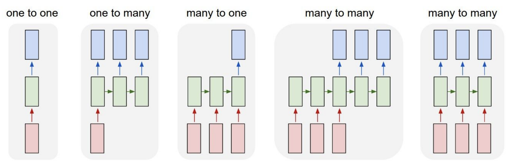
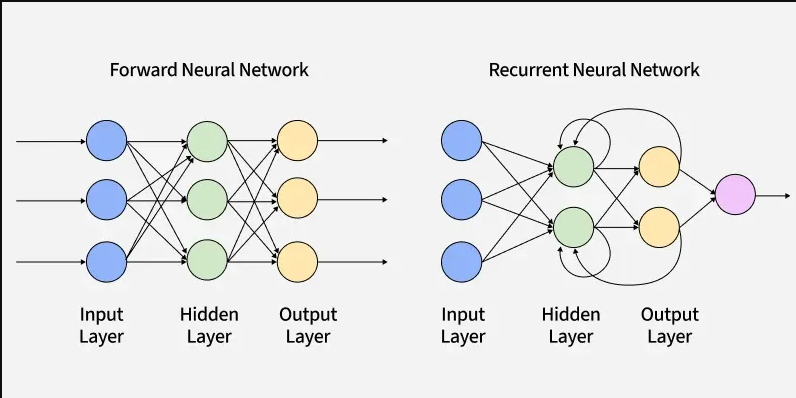
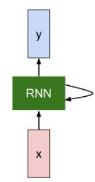
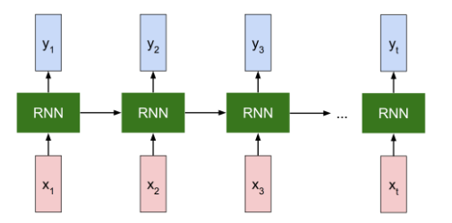
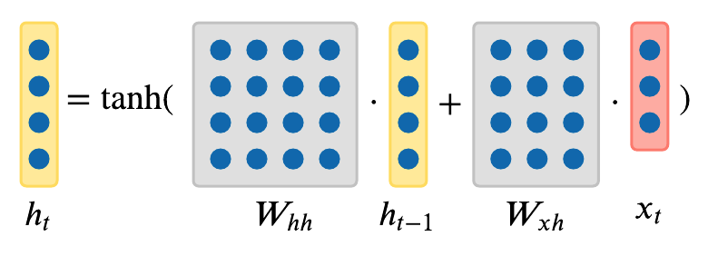
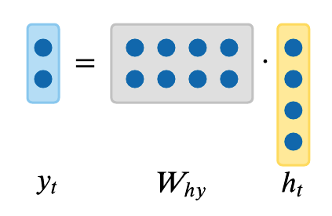
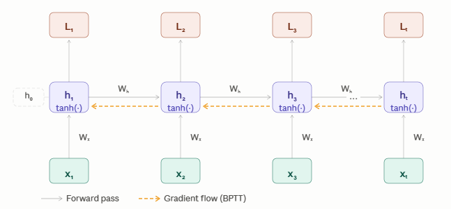
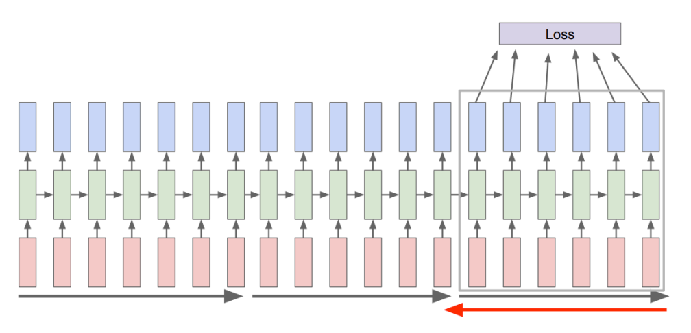
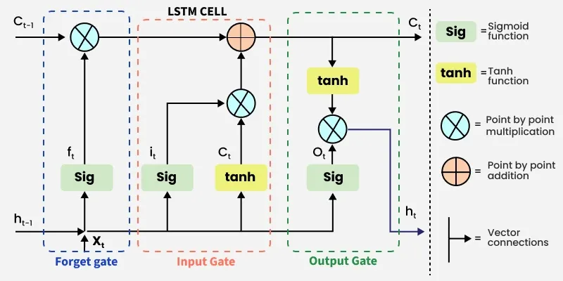

# Recurrent neural networks RNNs

https://www.geeksforgeeks.org/machine-learning/introduction-to-recurrent-neural-network/
https://www.geeksforgeeks.org/machine-learning/ml-back-propagation-through-time/
https://chatgpt.com/c/6a3fd898-4f8c-83ed-88d1-984508f0cdde
https://cs231n.github.io/rnn/
https://srdas.github.io/DLBook/RNNs.html

A great many learning tasks require **dealing with sequential data**.

| Problems with sequence output                        | Problems with sequence input                                              |
|------------------------------------------------------|---------------------------------------------------------------------------|
| Image captioning, speech synthesis, music generation | time series prediction, video analysis, and musical information retrieval |

Sometimes problems have

| Problems with sequence for both I/O                                                                 |
|-----------------------------------------------------------------------------------------------------|
| translating text from one natural language to another, engaging in dialogue, or controlling a robot |

> **Recurrent neural networks (RNNs)** are deep learning models that capture the dynamics
> of sequences via recurrent
> connections, which can be thought of as cycles in the network of nodes.

> Recurrent Neural Networks (RNNs) were specifically designed for sequential data, where the order of the inputs
> matters.

Example: "A dog bites a man" or "A man bites a dog"

This might seem counterintuitive at first. After all, it is the feedforward nature of neural networks that makes the
order of computation unambiguous.

| Forward neural networks                                                                                                   | RNNs                                                                              |
|---------------------------------------------------------------------------------------------------------------------------|-----------------------------------------------------------------------------------|
| connections are applied synchronously to propagate each layer’s activations to the subsequent layer at the same time step | recurrent connections are dynamic, passing information across adjacent time steps |

### Hidden state

With this approach a RNN can keep memory of the sequence of inputs deriving a context out of it.
For example a specific word can change its meaning based on the place or the context where it is used.

Taking the language translation as example, the encoder RNN reads one word of a sentence at a time .

| Time | Input  | Hidden state    | $h_t$ |
|------|--------|-----------------|-------|
| 1    | I      | I               | $h_1$ |
| 2    | am     | I am            | $h_2$ |
| 3    | eating | I am eating     | $h_3$ |
| 4    | an     | I am eating an  | $h_4$ |
| 5    | apple  | Entire sentence | $h_5$ |

After reading the last word, the hidden state summarizes the sentence. A decoder RNN can then generate the French
translation:

`Je mange une pomme`

Each generated word is conditioned on both:

* the encoded meaning of the input sentence, and
* the words already generated.

## RNN architecture

Seen as a black box, at every time step, we submit an input to the RNN, which enters the network internal state and
combines with the internal state of the previous time step; the outputs is connected to this combination.

The unrolled schema shows this in a sequence of a time series imput $x_1, x_2, \dots, x_t$ (i.e. frames in a video).

> We can represent the hidden state as a function of the input vector at the given time and of the hidden state (as
> vector) at the $t-1$ time step

$$h_t=f(h_{t-1}, x_t)$$

We are not committed to the size of the input sequence (the number of frames in the video)

## Single hidden state RNNs - Vanilla RNNs

Example:

Dimensions for this example: input $D=2$, hidden $H=2$, classes $K=4$, sequence length $T=3$.

$$
W_{xh} = \begin{pmatrix} 0.5 & -0.3 \\ 0.1 & 0.8 \end{pmatrix}
\qquad
W_{hh} = \begin{pmatrix} 0.2 & 0.4 \\ -0.5 & 0.3 \end{pmatrix}
$$

$$
W_{hy} = \begin{pmatrix} 0.3 & -0.2 \\ 0.1 & 0.4 \\ -0.3 & 0.2 \\ 0.2 & 0.1 \end{pmatrix}
\qquad
b_h = \begin{pmatrix} 0.1 \\ -0.1 \end{pmatrix}
\qquad
b_y = \begin{pmatrix} 0 \\ 0 \\ 0 \\ 0 \end{pmatrix}
$$

Inputs and one-hot targets (class index, $K=4 \Rightarrow$ classes $\{0,1,2,3\}$):

| $t$ | $x_t$          | target class $k^*_t$ |
|-----|----------------|----------------------|
| 1   | $(1.0,\ 0.5)$  | 2                    |
| 2   | $(0.5,\ -1.0)$ | 0                    |
| 3   | $(-1.0,\ 1.0)$ | 3                    |

Initial hidden state $h_0 = (0,0)$.

### Forward step

To represent the hidden state update we need to wight matrices $W_{xh}$ and $W_{hh}$ both projecting, respectively, the
projection of the input and the previous time step state to the current state  (squished by the activation
function $\sigma$, usually $sigmoid$ or $tanh$):

$$a_t=W_{hh}h_{t-1}+ W_{xh}x{t} + b_h \:\: (\circledast)$$

$$h_t=\tanh\left(a_t\right) \:\: (\star)$$

We can also calculate the derivative, for instance in respect of $a_t$

$$\frac{\partial h_t}{\partial a_t}=1-\tanh^2(a_t)=1-h^2_t \:\:(\wr)$$

The preditction then becomes a function of the state accordingly, based on a wight matrix $W_{hy}$ projecting the hidden
state onto the prediction

$$z_t=W_{hy}h_t+b_y \:\: (\circ)$$

$$ \hat y_t=softmax(z_t) \:\: (\bigcirc)$$

where $y,\hat y \in \mathbb{R}^K$

and $\hat y_i =\frac{e^{z_i}}{\sum_{j=1}^{K}e^j}$

#### Example

**t = 1** 

$$a_1 = W_{xh}x_1 + W_{hh}h_0 + b_h = (0.45,\ 0.40)$$

$$h_1 = \tanh(a_1) = (0.421899,\ 0.379949)$$

$$z_1 = W_{hy}h_1 + b_y = (0.050580,\ 0.194169,\ -0.050580,\ 0.122375)$$

$$\hat y_1 = \text{softmax}(z_1) = (0.241976,\ 0.279340,\ 0.218696,\ 0.259988)$$

$$L_1 = -\log \hat y_1[2] = -\log(0.218696) = 1.520075$$

### t = 2

$$z_2 = W_{xh}x_2 + W_{hh}h_1 + b_h = (0.886359,\ -0.946965)$$

$$h_2 = \tanh(z_2) = (0.709591,\ -0.738406)$$

$$y_2 = W_{hy}h_2 + b_y = (0.360558,\ -0.224403,\ -0.360558,\ 0.068078)$$

$$\hat y_2 = \text{softmax}(y_2) = (0.358456,\ 0.199705,\ 0.174284,\ 0.267555)$$

$$L_2 = -\log p_2[0] = -\log(0.358456) = 1.025950$$

### t = 3

$$z_3 = W_{xh}x_3 + W_{hh}h_2 + b_h = (-0.853444,\ 0.023683)$$

$$h_3 = \tanh(z_3) = (-0.692865,\ 0.023678)$$

$$y_3 = W_{hy}h_3 + b_y = (-0.212595,\ -0.059815,\ 0.212595,\ -0.136205)$$

$$\hat y_3 = \text{softmax}(y_3) = (0.209453,\ 0.244027,\ 0.320439,\ 0.226080)$$

$$L_3 = -\log p_3[3] = -\log(0.226080) = 1.486864$$

### Loss (cross-entropy) calculation

For each time step $t$ the cross entropy loss is calculated as

$$L_t=-\sum_{i=1}^{K}y_i\log(\hat y_i)$$

since $y$ is a one-hot vector, it becomes the logarithm of the estimation of the true class

In the example 

$$
L = L_1 + L_2 + L_3 = 1.520075 + 1.025950 + 1.486864 = 4.032889
$$

> So the total loss becomes the **scalar** given by the sum of all those $L_t$

$$L=\sum_{t=1}^{T}L_t$$

### Backward step

#### Matrix derivative chain rule

> $$\frac{\partial f}{\partial u}=\left(\frac{\partial v}{\partial u}\right)^\mathsf{T}\frac{\partial f}{\partial v} \:\:(\Game)$$

#### Error signals calculations

We define three error signals to represent how the loss changes depending on the main leverages of the RNN.

$$\delta^{z}_{t}=\frac{\partial L}{\partial z_{t}}$$

$$\delta^{h}_{t}=\frac{\partial L}{\partial h_{t}}$$

$$\delta^{a}_{t}=\frac{\partial L}{\partial a_{t}}$$

##### Error signal from the pre-activation output 

from the [Derivative of the cross entrory loss](../004-linear_neural_networks_for_classification/softmax_regression/#derivative-of-the-loss-function)
we have 

>$$\delta^{z}_{t}=\frac{\partial L_t}{\partial z_t}=\hat y_t - y_t$$

##### Error signal from the pre-activation hidden state

We use the chain rule to introduce the activated hidden state

$$\delta^{a}_{t}=\frac{\partial h_{t}}{\partial a_{t}}^\mathsf{T}\frac{\partial L}{\partial h_{t}}$$

To calculate $\frac{\partial h_{t}}{\partial a_{t}}$ we calculate the Jacobian which is 

$$J\left(\frac{\partial h_{t}}{\partial a_{t}}\right)=\frac{\partial h_{t}^i}{\partial a_{t}^j}=
\left\{
\begin{array}{rcl}
\tanh'(a_t^i) & if & i=j \\
0 & if & i\not=j
\end{array}
\right.=diag(\tanh'(a_t))$$

Therefore (If we multiplicate a diagonal matrix to a vector is it the element-wise - Hadamand product $\odot$).

Furthermore, using $(\wr)$ for the $\tanh$ derivative we have 

> $$\delta^{a}_{t}=diag(\tanh'(a_t))\delta^{h}_{t}=(1-h^2_t)\odot\delta^{h}_{t}$$

##### Error signal from the hidden state

The hidden state influences the loss with two contribution

* _Local contribution_ $(\delta^{h}_{t})_{local}$: depends on how hidden state influences the pre activation output $h_t \rightarrow z_t$
* _Recursive contribution_ $(\delta^{h}_{t})_{rec}$: depends on how the hidden state influences the future pre activation inner state  $h_t \rightarrow a_{t+1}$

$$\delta^{h}_{t}=\frac{\partial L}{\partial h_{t}}=(\delta^{h}_{t})_{local}+(\delta^{h}_{t})_{rec}$$

Using the chain rule to introduce the pre-activation output at the current time step

$$(\delta^{h}_{t})_{local}=\frac{\partial z_t}{\partial h_{t}}^\mathsf{T}\frac{\partial L}{\partial z_{t}}=W_{hy}^\mathsf{T}\delta^{z}_{t}$$

For the recursive contribution, we use the chain rule to introduce the pre activation hidden state in the future time step

$$(\delta^{h}_{t})_{rec}=\frac{\partial a_{t+1}}{\partial h_{t}}^\mathsf{T}\frac{\partial L}{\partial a_{t+1}}=W_{hh}^\mathsf{T}\delta^{a}_{t+1}$$

Extracting $\delta^{a}_{t+1}=(1-h^2_{t+1})\odot\delta^{h}_{t+1}$

>$$\delta^{h}_{t}=(\delta^{h}_{t})_{local}+(\delta^{h}_{t})_{rec}=W_{hy}^\mathsf{T}\delta^{z}_{t}+W_{hh}^\mathsf{T}(1-h^2_{t+1})\odot\delta^{h}_{t+1}$$

### Backpropagation BTT (Backpropagation Through Time)

> To calculate the error signal of the hidden state we need to start from the last time step output, going back in time

We start with  $$\delta^{h}_{T+1}:=0 \rightarrow \delta^{h}_{T}=W_{hy}^\mathsf{T}\delta^{z}_{T}$$

So we can go back in time as 

$$\delta^{h}_{T-1}=W_{hy}^\mathsf{T}\delta^{z}_{T-1}+W_{hh}^\mathsf{T}(1-h^2_{T})\odot\delta^{h}_{T}$$

and so on.

Note that we can store the hidden state arrays $h_t$ from the forward step calculations

**FROM HERE IT IS THE OLD IMPLEMENTATION**
https://deeplearningnotes.com/rnns-attention/rnns-basics/bptt#parameter-gradients-as-outer-product-sums

The error signals from 

For the output layer we can easily calculate the derivatives with the chain rule at the given time step t

$$\frac{\partial L}{\partial W_{hy}}=\frac{\partial L_t}{\partial z_{t}}\frac{\partial z_t}{\partial W_{hy}}$$

and deriving $(\circ)$ we get

> $$\frac{\partial L}{\partial W_{hy}}=\sum_{t=1}^{T}\delta_{z_t}h_t^T \:\:,\frac{\partial L}{\partial b_{y}}=\sum_{t=1}^{T}\delta_{z_t} \:\: (\lhd)$$

In the example we process t=3→2→1

$$\delta_{y_3}=\delta_{z_3}h_3^T=$$

$$\frac{\partial L}{\partial W_{hy}}=$$

### Backpropagation BTT (Backpropagation Through Time)

We update the weights $W_{hh}$ by getting the derivative of the loss at the very last time step $L_T$ with respect
to $W_{hh}$

> The matrix update is unique for all time steps $W_{hh}$ does not depend on the time $t$.

> See in the backpropagation, how the output at the very last timestep affects the weights backward to the previous
> steps

The loss function cumulates the time step contributions

$$\frac{\partial L}{\partial W_{hh}}=\sum_{t=1}^{T}\frac{\partial L_t}{\partial W_{hh}}$$

using the chain rule

$$=\sum_{t=1}^{T}\frac{\partial L_t}{\partial a_t}\frac{\partial a_t}{\partial W_{hh}} \:\:(\sqcap)$$

We call **ERROR SIGNAL** or **GRADIENT at t**

$$\delta_t=\frac{\partial L_t}{\partial a_t}$$

Then, we can calculate the derivative of $(\circledast)$

$$\frac{\partial a_t}{\partial  W_{hh}}=h^T_{t-1}$$

So $(\sqcap)$ becomes

$$\frac{\partial L}{\partial W_{hh}}=\sum_{t=1}^{T}\delta_th^T_{t-1} \:\:(\circledcirc)$$

#### Calculation at the output time step $T$

Calculate the error signal at the output with the chain rule

$$\delta_T=\frac{\partial L}{\partial a_T}=\frac{\partial L}{\partial h_T}\frac{\partial h_T}{\partial a_T}=$$

we can apply the chain rule again

$$=\frac{\partial L}{\partial z_T}\frac{\partial z_T}{\partial h_T}\frac{\partial h_T}{\partial a_T}=$$

Using $(\cup)$, $(\circ)$ and $(\wr)$ it is

$$\delta_T=(\hat y-y)W_{hy}\odot (1-h^2_t)$$

#### Calculate the previous time step loss

This is not directly calculated, we can do it for the time step before $T$ and proceed backword in time.

That is what BTT does.

First we need to express the error signal at $t$ depending on the one from the future time step $t+1$

$$\delta_{t+1}=\frac{\partial L}{\partial a_{t+1}}=\frac{\partial L}{\partial h_{t}}\frac{\partial h_t}{\partial a_{t+1}} \:\: (\curlywedge)$$

and

$$a_{t+1}=W_{hh}h_t+W_{hx}x_{t+1}\:\Rightarrow\:h_t=\frac{a_{t+1}}{W_{hh}}-W_{hx}x_{t+1} $$

so

$$\frac{\partial h_t}{\partial a_{t+1}}=\frac{1}{{W_{hh}}}\:\: (\backsim)$$

so we can express from $(\curlywedge)$ and $(\backsim)$

$$\frac{\partial L}{\partial h_{t}}=W_{hh}^\mathsf{T}\delta_{t+1} \:\: (\ddagger) $$

Using $(\ddagger)$ we can express $\delta_t$ using the chain rule for $h_t$ depending on $\delta_{t+1}$

> $$\delta_t=\frac{\partial L}{\partial a_{t}}=\frac{\partial L}{\partial h_{t}}\frac{\partial h_t}{\partial a_{t}}=W_{hh}^\mathsf{T}\delta_{t+1}\odot(1-h_t^2)$$

We can iterate for all time stamps in $(\circledcirc)$ obtainig

> $$\delta_T=(\hat y-y)W_{hy}^\mathsf{T}\odot(1-h^2_T)$$

> $$\frac{\partial L}{\partial W_{hh}}=\delta_Th_{T-1}^\mathsf{T}+\dots+\delta_kh_{k-1}^\mathsf{T}+\dots+\delta_1h_{0}^\mathsf{T}=\sum_{t=1}^\mathsf{T}W_{hh}^\mathsf{T}[\delta_{t+1}\odot(1-h_t^2)]h^\mathsf{T}_{t-1} \:\:(\rhd)$$

> $$\frac{\partial L}{\partial W_{hx}}=\sum_{t=1}\delta_Tx_{T}^\mathsf{T}+\dots+\delta_kx_{k}^\mathsf{T}+\dots+\delta_1x_{1}^\mathsf{T}$$

### Update stepSGD

With plain SGD (learning rate $\eta$):

Using $(\lhd)$

> $$W_{hy}^{new}=W_{hy}^{old}-\eta \delta_{z_t}h_t^T, \:\: b_{y}^{new}=b_{y}^{old}-\eta\delta_{z_t}$$

And the hidden state matrix update from $(\rhd)$

> $W_{hh}^{new}=W_{hh}^{old}-\eta\frac{\partial L}{\partial W_{hh}}$

#### Issue with the sequence length

The longer the time sequence is, the more contributions it requires. For this reason:

* Run forward and backward through chunks of the sequence instead of whole sequence

* Carry hidden states forward in time forever, but only backpropagate for some smaller
  number of time steps ($T$ in the derivative formula)

### Limitations of BTT in vanilla RNNs

if we write the inverse forumula of the loss of the derivative to obtain the generic form of $\delta_t$:

$$\delta_t=(W_{hh}^T)^{T-t}\left(\prod_{k=t}^T(1-h_k^2)\right)W_{hy}^T(\hat y -y)$$

Notice that the gradient is repeatedly multiplied by:

* the recurrent weight matrix $W_{hh}$
* the derivative of the $\tanh$ activation $(1-h_k^2)$

Since

$$0\lt1-h_k^2\leqslant 1$$

each multiplication tends to shrink the gradient. After many time steps, these products can become extremely small,
causing the vanishing gradient problem. Conversely, if the recurrent weights have large eigenvalues, repeated
multiplication can cause the gradient to grow rapidly, leading to the exploding gradient problem.

This mathematical behavior is precisely what motivated the development of LSTMs and GRUs, whose gating mechanisms help
preserve gradients over much longer sequences.

* **Vanishing gradient**:
    * since the $tanh^{'}$ function can have very small values (the function will go from -1 to 1), the more elements we
      add to the products the smaller the final derivative will become. The reduction is **exponential**
    * The network will become less sensible to changes in the past (loosing memory), considering that we need memory of
      the sequence for the training.
    * The backpropagation will create very little variations of the wight matrix, making the network very "stubborn" to
      changes

* **Exploding gradient**:
    * unstable training and updates due to big variations of the weight matrix related to small variations of the
      input/hidden state

In practice, we can **treat the exploding gradient problem through gradient clipping**, which is clipping large gradient
values to a maximum threshold.
However, since vanishing gradient problem still exists in cases where largest singular value of $W_{hh}$ matrix is less
than one, LSTM was designed to avoid this problem.

## Long-Short Term Memory (LSTM)

https://www.geeksforgeeks.org/deep-learning/deep-learning-introduction-to-long-short-term-memory/ well done

https://cs231n.github.io/rnn/#lstm-formulation

claude (LSTM architecture and gradient problems) for the equations
https://chatgpt.com/c/6a4f47b4-9174-83eb-9bdf-bb406ca47940 (for the gate picture)

In practice, we actually will rarely ever use Vanilla RNN formula; we have seen that the hidden state calculation
takes the sequence as a whole, being a computational problem. Furthermore we have the problems of vanishing gradient,
meaning a short memory for the network, or the exploding gradient, meaning a instable network behavior.

Instead, we will use what we call a **Long-Short Term Memory (LSTM) RNN**.

> What the LSTM RNN adds is an internal memory component $c$ next to the hidden state $h$. The memory represents
> the contribution of the past to the output, as a long term memory, while the hidden state is the short term memory.

### Gates in LSTM

The memory $c$ influences the network behavior through three gates.

#### Forget gate

$$f_t=\sigma(W_{hf}h_{t_1} + W_{xf}x_t)$$

* The gate depends on the input and the previous step hidden state to "filter" the previus memory cell $c_{t-1}$
* The sigmoid output creates a filter from 0 (that memory component is forgotten) to 1 (that filtered memory cell
  component is kept)

#### Input gate

* This gate controls how much information needs to be “added” to the next cell state $c_t$

* First the information is regulated using the sigmoid function and filter the values to be remembered similar to the
  forget gate using inputs $h_{t_1}$ and $x_t$

$$i_t = \sigma(W_{hi}h_{t_1} + W_{xi}x_t)$$

* Then a "memory cell candidate" (or "estimated memory cell") is created

$$\hat c_t = \text{tanh}(W_{hg}h_{t_1} + W_{xg}x_t)$$

* The new memory cell value will be the combination of the forget gate plus (elment wise addition - Hadamand sum)
  the $c_{t-1}$ and the input gate plus the cell candidate

$$c_t = f_t \odot c_{t-1} + i_t \odot \hat c_t$$

#### Output gate

* The output gate determines which information from the current cell state should be passed as the hidden state (output)
  at the current time step. It uses the previous hidden state
  $h_{t-1}$ and the current input $x_t$ followed by a sigmoid function to control the output flow.

$$o_t = \sigma(W_{ho}h_{t_1} + W_{xo}x_t)$$

* the new hidden state will become

$$h_t = o_t \odot \text{tanh}(c_t)$$

### Sequence processing

LSTM architecture makes it easier for the RNN to preserve information over many recurrent time steps. For example, if
the forget gate is set to 1, and the input gate is set to 0, then the infomation of the cell state will always be
preserved over many recurrent time steps. For a Vanilla RNN, in contrast, it’s much harder to preserve information in
hidden states in recurrent time steps by just making use of a single weight matrix.

LSTMs do not guarantee that there is no vanishing/exploding gradient problems, but it does provide an easier way for the
model to learn long-distance dependencies.

## Example of Vanilla RNN with training and LSTM

https://cs231n.github.io/rnn/#rnn-example-as-character-level-language-model

