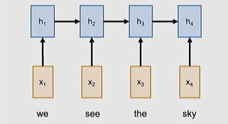

# Transformers and attention mechanisms

## Documentation

STANFORD: https://www.youtube.com/watch?v=RQowiOF_FvQ
https://arxiv.org/html/2604.00965v1

https://jalammar.github.io/visualizing-neural-machine-translation-mechanics-of-seq2seq-models-with-attention/
https://jalammar.github.io/illustrated-transformer/

## RNNs Vs Transformers

We have seen that RNNs are able to solve many kind of problem 
* one-to-one: 
* one-to-many: from a work to an image that represents that word
* many-to-one: image classification problem
* many-to-many: from a video to a description of it

For instance, for image classification we have also CNN.

>After a very important article, **[Attention is all you need](https://arxiv.org/abs/1706.03762)**, 
the concept of attention and transformers are considered a valid solution for all the mentioned 
problems taking over the traditional CNN and RNN operators

> Nowaday transformers (often in combination with sel-attention) are used **everywhere**

## Sequence to sequence with RNNs: DECODER-ENCODER

Based on the example of language translation from English to Italian

* **Input**: sequence $x_1,x_2,\dots,x_T$
* **Output**: sequence $y_1,y_2,\dots,y_T$. The number of words in the input language can be different from the number of words in the translation

The encoder is a RNN where the inner state sequence is a function of the input and the 
previous hidden state

> **ENCODER**: $h_t=f_w\left(x_{t},h_{t-1}\right)$

The decoder produces an internal state from the input. We move towards the output with 
a DECODER. 

All the processing of the input sequence in the decoder is represented in a the 
**CONTEXT VECTOR** $C$ 

Often $C=h_T$ considering that the hidden state at the final time step incorporates information form all the previous hidden states in the past. 

The same way for the decoder, the ENCODER is a RNN with its **decoder hidden state** $s_t$

> **ENCODER**: $s_t=g_u\left(y_{t-1},c,s_{t-1}\right)$

We see that the 4 input words generate 3 distinct output value.

### The problem of the fixed lenght of $C$

The only connection between the input sequence and the output sequence it **the fixed length of the context vector $C$**
which might be not enough for very long sequences (a paragraph, a book) or overidimensioned for small sequences (small sentences).

> The **solution** is to look back at the entire input sequence at every time step to generate the output

**T:8:29**

