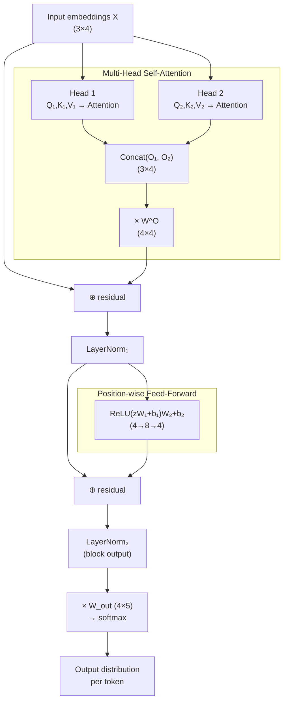
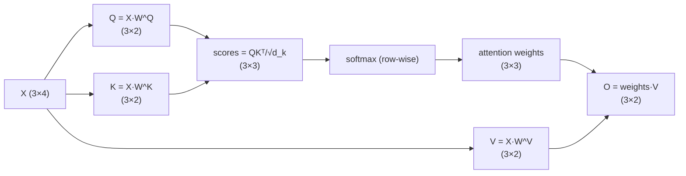

# Transformer Encoder Block — Multi-Head Self-Attention Walkthrough

Worked numeric example: 3 tokens, $d_{model}=4$, $h=2$ heads, $d_k=d_v=2$.

## 1. High-level block architecture



## 2. Inside one attention head




```python
import numpy as np
from mpmath import sqrt
import scipy as sp
```

## 3. Step-by-step formulas with the numeric example

**Input embeddings**

$$X = \begin{bmatrix} 1&0&1&0\\0&2&0&2\\1&1&1&1 \end{bmatrix} \in \mathbb{R}^{3\times 4}$$


```python
X=np.array([[1, 0, 1, 0],
            [0, 2, 0, 2],
            [1, 1, 1, 1],
            ])
print(f"X={X}")
```

    X=[[1 0 1 0]
     [0 2 0 2]
     [1 1 1 1]]


**Per-head projections** ($i \in \{1,2\}$)

$$Q_i = XW_i^Q, \qquad K_i = XW_i^K, \qquad V_i = XW_i^V, \qquad W_i^{(\cdot)}\in\mathbb{R}^{4\times2}$$

$$Q_1=\begin{bmatrix}1&0\\0&2\\1&1\end{bmatrix}\;\; K_1=\begin{bmatrix}0.5&0.5\\1&1\\1&1\end{bmatrix}\;\; V_1=\begin{bmatrix}1&0.5\\1&2\\1.5&1.5\end{bmatrix}$$

$$Q_2=\begin{bmatrix}0.5&1\\1&0\\1&1\end{bmatrix}\;\; K_2=\begin{bmatrix}1&0.5\\0&1\\1&1\end{bmatrix}\;\; V_2=\begin{bmatrix}0&0.5\\2&1\\1&1\end{bmatrix}$$


```python
print("Self-attention Head1")
Q1=np.array([
    [1, 0],
    [0, 2],
    [1, 1],
])
print(f"Q1={Q1}")
K1=np.array([
    [0.5, 0.5],
    [1, 1],
    [1, 1],
])
print(f"K1={K1}")
V1=np.array([
    [1, 0.5],
    [1, 2],
    [1.5, 1.5],
])
print(f"V1={V1}")
print("Self-attention Head2")
Q2=np.array([
    [0.5, 1],
    [1, 0],
    [1, 1],
])
print(f"Q1={Q1}")
K2=np.array([
    [1, 0.5],
    [0, 1],
    [1, 1],
])
print(f"K2={K2}")
V2=np.array([
    [0, 0.5],
    [2, 1],
    [1, 1],
])
print(f"V2={V2}")

def self_attention_head(Q: np.array, K: np.array, V: np.array):
    E_mpf=np.matmul(Q,np.transpose(K))/sqrt(2)
    # 2. Convert mpf matrix to a standard NumPy float64 array
    #similarities
    E = np.array(E_mpf, dtype=np.float64)
    print(f"similarities E={E}")
    A=sp.special.softmax(E,axis=1)
    print(f"attention weights A={A}")
    O=np.matmul(A,V)
    return O

```

    Self-attention Head1
    Q1=[[1 0]
     [0 2]
     [1 1]]
    K1=[[0.5 0.5]
     [1.  1. ]
     [1.  1. ]]
    V1=[[1.  0.5]
     [1.  2. ]
     [1.5 1.5]]
    Self-attention Head2
    Q1=[[1 0]
     [0 2]
     [1 1]]
    K2=[[1.  0.5]
     [0.  1. ]
     [1.  1. ]]
    V2=[[0.  0.5]
     [2.  1. ]
     [1.  1. ]]


**Scaled dot-product attention**

$$\text{Attn}(Q,K,V) = \text{softmax}\!\left(\frac{QK^\top}{\sqrt{d_k}}\right)V, \qquad d_k = 2$$

Head 1:

$$\frac{Q_1K_1^\top}{\sqrt2} = \begin{bmatrix}0.3536&0.7071&0.7071\\0.7071&1.4142&1.4142\\0.7071&1.4142&1.4142\end{bmatrix} \xrightarrow{\text{softmax}} \begin{bmatrix}0.2599&0.3701&0.3701\\0.1978&0.4011&0.4011\\0.1978&0.4011&0.4011\end{bmatrix} = A_1$$

$$O_1 = A_1V_1 = \begin{bmatrix}1.1850&1.4252\\1.2006&1.5028\\1.2006&1.5028\end{bmatrix}$$


```python
# Similarities Heas1

O1=self_attention_head(Q1, K1, V1)
print(f"O1={O1}")

```

    similarities E=[[0.35355339 0.70710678 0.70710678]
     [0.70710678 1.41421356 1.41421356]
     [0.70710678 1.41421356 1.41421356]]
    attention weights A=[[0.25985918 0.37007041 0.37007041]
     [0.19777581 0.40111209 0.40111209]
     [0.19777581 0.40111209 0.40111209]]
    O1=[[1.1850352  1.42517602]
     [1.20055605 1.50278023]
     [1.20055605 1.50278023]]


Head 2:

$$\frac{Q_2K_2^\top}{\sqrt2} = \begin{bmatrix}0.7071&0.7071&1.0607\\0.7071&0&0.7071\\1.0607&0.7071&1.4142\end{bmatrix} \xrightarrow{\text{softmax}} \begin{bmatrix}0.2920&0.2920&0.4159\\0.4011&0.1978&0.4011\\0.3199&0.2246&0.4555\end{bmatrix} = A_2$$

$$O_2 = A_2V_2 = \begin{bmatrix}1.0000&0.8540\\0.7967&0.7994\\0.9047&0.8401\end{bmatrix}$$


```python
O2=self_attention_head(Q2, K2, V2)
print(f"O2={O2}")
```

    similarities E=[[0.70710678 0.70710678 1.06066017]
     [0.70710678 0.         0.70710678]
     [1.06066017 0.70710678 1.41421356]]
    attention weights A=[[0.29204592 0.29204592 0.41590815]
     [0.40111209 0.19777581 0.40111209]
     [0.31986617 0.22460634 0.45552749]]
    O2=[[1.         0.85397704]
     [0.79666372 0.79944395]
     [0.90474018 0.84006692]]


**Concatenate + output projection**

$W^O=\begin{bmatrix}0.5 & 0 & 0 & 0.5\\0 & 0.5 & 0.5 & 0\\0.5 & 0.5 & 0 & 0\\0 & 0 & 0.5 & 0.5 \end{bmatrix}$

$$\text{MHA}(X) = \big[O_1 \,\Vert\, O_2\big]\,W^O = \begin{bmatrix}1.0925&1.2126&1.1396&1.0195\\0.9986&1.1497&1.1511&1.0000\\1.0526&1.2038&1.1714&1.0203\end{bmatrix}$$


```python
WO=np.array([
    [0.5, 0, 0, 0.5],
    [0, 0.5, 0.5, 0],
    [0.5, 0.5, 0, 0],
    [0, 0, 0.5, 0.5],
])
O1_2=np.concatenate((O1, O2), axis=1)
MHA=np.matmul(O1_2,WO)
print(f"MHA={MHA}")
```

    MHA=[[1.0925176  1.21258801 1.13957653 1.01950612]
     [0.99860988 1.14972198 1.15111209 1.        ]
     [1.05264811 1.2037602  1.17142357 1.02031148]]


**Residual + LayerNorm**

$$\text{LN}_1 = \text{LayerNorm}\big(X + \text{MHA}(X)\big) = \begin{bmatrix}0.9437&-0.7991&1.0369&-1.1815\\-1.0732&1.0718&-0.9211&0.9225\\-0.7680&1.1861&0.7680&-1.1861\end{bmatrix}$$


```python
#Layer normalization parameters
epsilon=1e-8
beta=0
gamma=1

residual1=X+MHA
print(f"residual={residual1}")
def layer_norm(input, print_intermediates=False):
    #mean
    mu=np.mean(input, axis=1, keepdims=True) #mean along rows (per vector)
    #variance
    var=np.var(input, axis=1, keepdims=True)
    norm=gamma * (input - mu)/np.sqrt(var+epsilon)+beta
    if print_intermediates:
        print(f"mu={mu}")
        print(f"var={var}")
        print(f"norm={norm}")
    return norm
LN1=layer_norm(residual1)
print(f"ln1={LN1}")
```

    residual=[[2.0925176  1.21258801 2.13957653 1.01950612]
     [0.99860988 3.14972198 1.15111209 3.        ]
     [2.05264811 2.2037602  2.17142357 2.02031148]]
    ln1=[[ 0.94366902 -0.79906685  1.03687111 -1.18147328]
     [-1.07319193  1.07180576 -0.9211232   0.92250936]
     [-0.76860721  1.18711398  0.76860721 -1.18711398]]


**Position-wise feed-forward** ($d_{ff}=8$) (MLP layer)

$$\text{FFN}(z) = \text{ReLU}(zW_1+b_1)\,W_2+b_2$$

From input to hidden state (dim 8)

$$W_1 = \begin{bmatrix}
0.15 & -0.52 & 0.38 & 0.47 & -0.98 & -0.65 & 0.06 & -0.16 \\
-0.01 & -0.43 & 0.44 & 0.39 & 0.03 & 0.56 & 0.23 & -0.43 \\
0.18 & -0.48 & 0.44 & -0.02 & -0.09 & -0.34 & 0.61 & -0.08 \\
-0.21 & -0.18 & 0.27 & 0.18 & 0.21 & 0.22 & 1.07 & -0.20
\end{bmatrix} \in \mathbb{R}^{4\times8}$$

$$b_1 = \begin{bmatrix} 0 & 0 & 0 & 0 & 0 & 0 & 0 & 0 \end{bmatrix} \in \mathbb{R}^{8}$$

From hidden state to output

$$W_2 = \begin{bmatrix}
-0.26 & -0.41 & 0.31 & 0.56 \\
-0.06 & -0.42 & -0.41 & 0.33 \\
0.37 & 0.27 & -0.33 & 0.12 \\
0.06 & 0.11 & 0.44 & 0.11 \\
0.34 & 0.03 & 0.14 & 0.32 \\
-0.73 & -0.16 & -0.24 & -0.32 \\
-0.14 & 0.75 & -0.43 & 0.48 \\
-0.84 & -0.17 & 0.08 & 0.29
\end{bmatrix} \in \mathbb{R}^{8\times4}$$

$$b_2 = \begin{bmatrix} 0 & 0 & 0 & 0 \end{bmatrix} \in \mathbb{R}^{4}$$

$$\text{FFN}(\text{LN}_1) = \begin{bmatrix}-0.3891&-0.2594&0.1612&0.4448\\-0.9631&0.0601&-0.6159&0.2804\\-0.2844&-0.1283&-0.0892&0.1206\end{bmatrix}$$


```python
W1 = np.array([
    [ 0.15, -0.52,  0.38,  0.47, -0.98, -0.65,  0.06, -0.16],
    [-0.01, -0.43,  0.44,  0.39,  0.03,  0.56,  0.23, -0.43],
    [ 0.18, -0.48,  0.44, -0.02, -0.09, -0.34,  0.61, -0.08],
    [-0.21, -0.18,  0.27,  0.18,  0.21,  0.22,  1.07, -0.20],
])  # shape (4, 8)

b1 = np.zeros(8)

W2 = np.array([
    [-0.26, -0.41,  0.31,  0.56],
    [-0.06, -0.42, -0.41,  0.33],
    [ 0.37,  0.27, -0.33,  0.12],
    [ 0.06,  0.11,  0.44,  0.11],
    [ 0.34,  0.03,  0.14,  0.32],
    [-0.73, -0.16, -0.24, -0.32],
    [-0.14,  0.75, -0.43,  0.48],
    [-0.84, -0.17,  0.08,  0.29],
])  # shape (8, 4)

b2 = np.zeros(4)


# ---------------------------------------------------------
# Feed-forward network: d_model -> d_ff -> d_model, ReLU
# ---------------------------------------------------------

def relu(x):
    return np.maximum(0, x)

def mlp_fnn(input):
    h=relu(np.matmul(input,W1)+b1)

    # print(f"h={h}")
    return np.matmul(h,W2)+b2

FNN1=mlp_fnn(LN1)
print(f"FNN1={FNN1}")
```

    FNN1=[[-0.38915306 -0.2594282   0.16120956  0.44483591]
     [-0.96312491  0.06009575 -0.61590513  0.28039224]
     [-0.28464085 -0.12844777 -0.08926609  0.1207382 ]]
    LN2=[[ 0.61249779 -1.13565022  1.30997994 -0.78682751]
     [-1.16059132  0.96893117 -0.82499384  1.01665398]
     [-0.98371659  1.18524334  0.79567216 -0.99719891]]


**Second residual + LayerNorm → block output**

$$\text{LN}_2 = \text{LayerNorm}\big(\text{LN}_1+\text{FFN}(\text{LN}_1)\big) = \begin{bmatrix}0.6125&-1.1356&1.3100&-0.7868\\-1.1606&0.9689&-0.8250&1.0167\\-0.9837&1.1852&0.7957&-0.9972\end{bmatrix}$$


```python
residual2=LN1+FNN1
LN2=layer_norm(residual2)
print(f"LN2={LN2}")
```

    LN2=[[ 0.61249779 -1.13565022  1.30997994 -0.78682751]
     [-1.16059132  0.96893117 -0.82499384  1.01665398]
     [-0.98371659  1.18524334  0.79567216 -0.99719891]]


**Final projection + softmax** (vocab size 5)

$$W_{out} = \begin{bmatrix}
0.36 & 0.40 & -0.17 & -0.23 & 0.43 \\
-0.10 & -0.64 & -0.57 & -0.46 & 0.25 \\
0.07 & 0.35 & -0.21 & 0.08 & 0.31 \\
-0.15 & 0.23 & -0.33 & -0.18 & -0.19
\end{bmatrix} \in \mathbb{R}^{4\times5}$$

$$b_{out} = \begin{bmatrix} 0 & 0 & 0 & 0 & 0 \end{bmatrix} \in \mathbb{R}^{5}$$


$$\text{logits} = \text{LN}_2\,W_{out}+b_{out} = \begin{bmatrix}0.5438&1.2493&0.5278&0.6279&0.5350\\-0.7250&-1.1393&-0.5172&-0.4278&-0.7057\\-0.2674&-1.1029&-0.3464&-0.0758&0.3094\end{bmatrix}$$

$$P = \text{softmax}(\text{logits}) = \begin{bmatrix}0.1643&0.3326&0.1616&0.1787&0.1628\\0.1902&0.1257&0.2341&0.2560&0.1939\\0.1869&0.0811&0.1727&0.2264&0.3328\end{bmatrix}$$

Argmax predictions: token 1 → class 1, token 2 → class 3, token 3 → class 4.


```python
W_out = np.array([
    [ 0.36,  0.40, -0.17, -0.23,  0.43],
    [-0.10, -0.64, -0.57, -0.46,  0.25],
    [ 0.07,  0.35, -0.21,  0.08,  0.31],
    [-0.15,  0.23, -0.33, -0.18, -0.19],
])  # shape (4, 5)

b_out = np.zeros(5)

logits=np.matmul(LN2,W_out)+b_out
print(f"logits={logits}")
P=sp.special.softmax(logits,axis=1) #per row
print(f"P={P}")
```

    logits=[[ 0.54378695  1.24933791  0.52775329  0.62795196  0.5350525 ]
     [-0.72495366 -1.1392699  -0.51723735 -0.42776956 -0.70573382]
     [-0.26738542 -1.10291287 -0.3463724  -0.07580754  0.30943886]]
    P=[[0.16425302 0.33260613 0.16164044 0.17867581 0.16282461]
     [0.19021805 0.12569455 0.23413254 0.25604549 0.19390937]
     [0.18694271 0.0810669  0.17274478 0.22641738 0.33282822]]


## 4. Dimension summary

| Stage | Shape |
|---|---|
| Input $X$ | $3\times4$ |
| $Q_i, K_i, V_i$ (per head) | $3\times2$ |
| Attention weights (per head) | $3\times3$ |
| Head output $O_i$ | $3\times2$ |
| Concat heads | $3\times4$ |
| $W^O$ | $4\times4$ |
| MHA output | $3\times4$ |
| $W_1$ / $W_2$ (FFN) | $4\times8$ / $8\times4$ |
| Block output ($\text{LN}_2$) | $3\times4$ |
| $W_{out}$ | $4\times5$ |
| Final logits / probs | $3\times5$ |
