# Mermaid Flowchart Diagrams — Quick Reference Cheatsheet

A comprehensive guide to creating flowcharts, diagrams, and process workflows
using [Mermaid.js](https://mermaid.js.org/).

---

## 1. Core Syntax & Direction

Flowcharts start with the `flowchart` (or `graph`) keyword followed by the direction indicator.

| Keyword      | Direction                | Description                |
|--------------|--------------------------|----------------------------|
| `TB` or `TD` | Top to Bottom / Top Down | Default vertical layout    |
| `BT`         | Bottom to Top            | Inverted vertical layout   |
| `RL`         | Right to Left            | Inverted horizontal layout |
| `LR`         | Left to Right            | Standard horizontal layout |

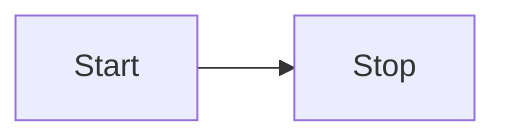

---

## 2. Node Shapes & Geometry

Define nodes using various bracket types around the node label.

| Syntax         | Output Shape           | Rendered Preview |
|----------------|------------------------|------------------|
| `id[Text]`     | Rectangle (Default)    | `[Text]`         |
| `id(Text)`     | Rounded Rectangle      | `(Text)`         |
| `id([Text])`   | Stadium / Pill shape   | `([Text])`       |
| `id[[Text]]`   | Subroutine             | `[[Text]]`       |
| `id[(Text)]`   | Cylindrical / Database | `[(Database)]`   |
| `id((Text))`   | Circle                 | `((Text))`       |
| `id>Text]`     | Asymmetric / Flag      | `>Text]`         |
| `id{Text}`     | Rhombus / Decision     | `{Text}`         |
| `id{{Text}}`   | Hexagon                | `{{Text}}`       |
| `id[/Text/]`   | Parallelogram          | `[/Text/]`       |
| `id[\Text\]`   | Parallelogram Alt      | `[\Text\]`       |
| `id[/Text\]`   | Trapezoid              | `[/Text\]`       |
| `id[\Text/]`   | Inverted Trapezoid     | `[\Text/]`       |
| `id(((Text)))` | Double Circle          | `(((Text)))`     |

### Code Example


---

## 3. Link Styles & Arrowheads

Connect nodes using different line types, lengths, and arrow styles.

| Type                  | Line Style    | Arrowhead      | Syntax     |
|-----------------------|---------------|----------------|------------|
| **Solid**             | Standard line | Directed arrow | `A --> B`  |
| **Open**              | Standard line | No arrow       | `A --- B`  |
| **Dotted**            | Dashed line   | Directed arrow | `A -.-> B` |
| **Dotted Open**       | Dashed line   | No arrow       | `A -.- B`  |
| **Thick**             | Bold line     | Directed arrow | `A ==> B`  |
| **Thick Open**        | Bold line     | No arrow       | `A === B`  |
| **Multi-directional** | Solid line    | Both ends      | `A <--> B` |
| **Circle End**        | Solid line    | Circle tip     | `A --o B`  |
| **Cross End**         | Solid line    | Cross tip      | `A --x B`  |

### Text on Links

Text can be added mid-link using pipes or dashed notation.

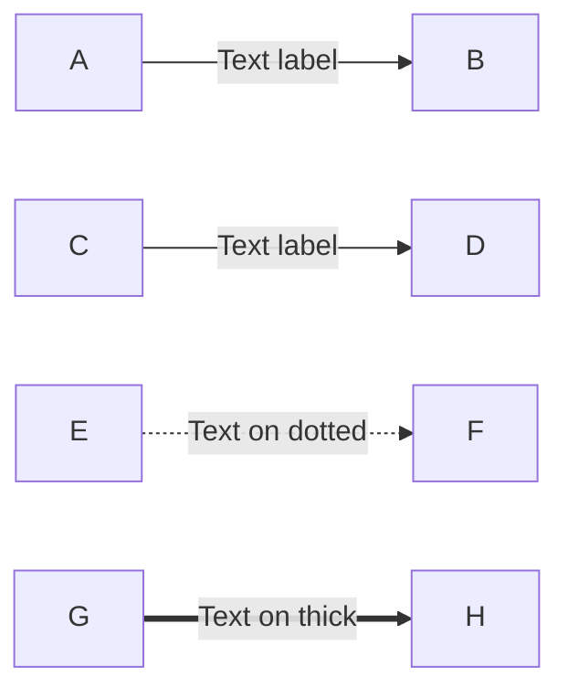

### Link Length Adjustments

Extend line length by repeating character symbols (`-`, `=`, `.`).

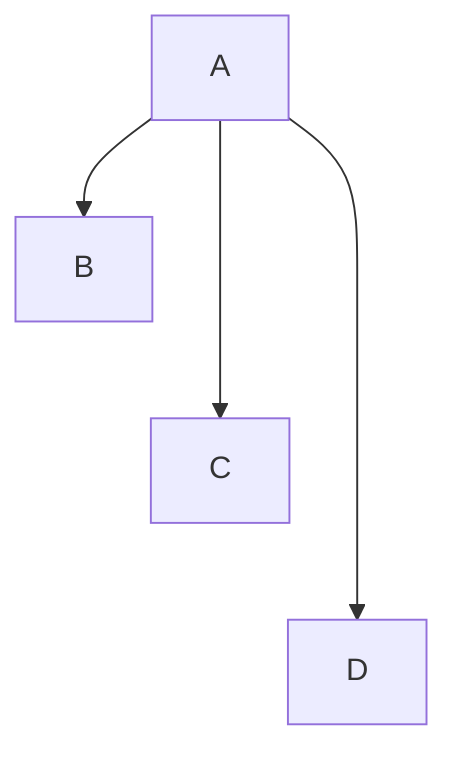

---

## 4. Subgraphs & Layout Containment

Group related nodes within labelled boundary boxes.

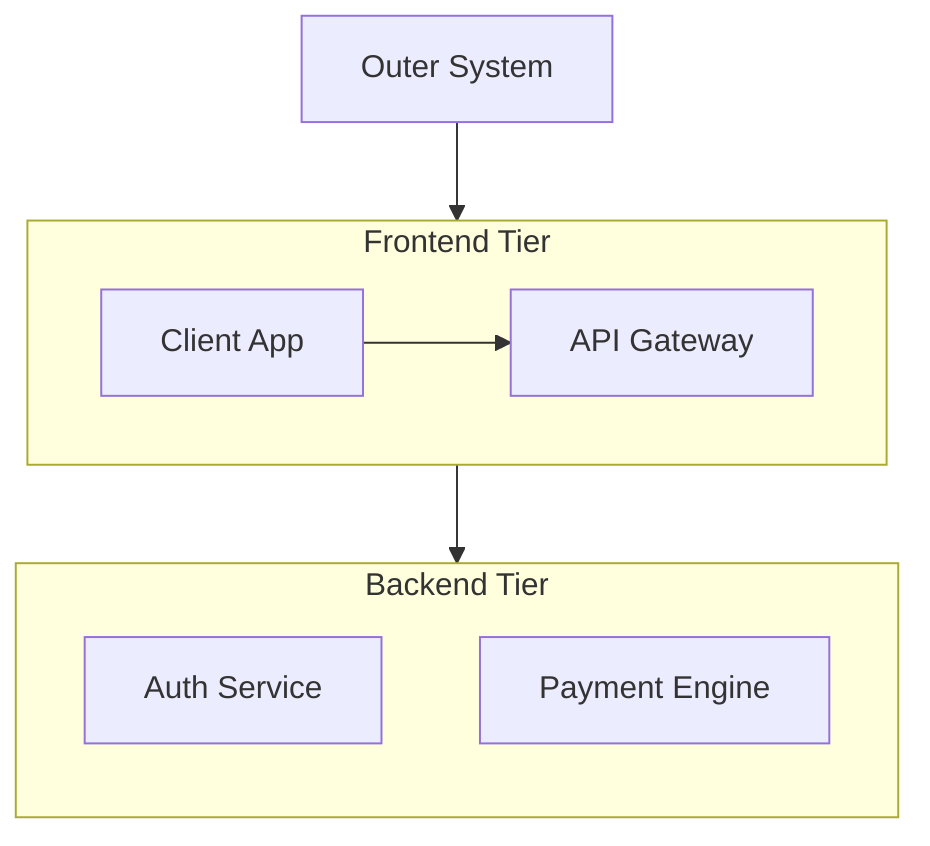

---

## 5. Node Styling & CSS Customization

### Inline Styling (`style`)

Apply inline CSS properties directly to specific nodes.

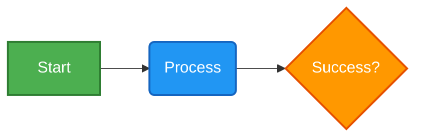

### Reusable Style Classes (`classDef`)

Define reusable style templates for multi-node styling.

```mermaid
flowchart LR
    classDef success fill: #d4edda, stroke: #28a745, color: #155724;
    classDef danger fill: #f8d7da, stroke: #dc3545, color: #721c24;
    classDef warning fill: #fff3cd, stroke: #ffc107, color: #856404;
    Node1[Passed]:::success --> Node2[Warning State]:::warning
    Node2 --> Node3[Critical Fail]:::danger

```

---

## 6. Interaction & Tooltips

Add click handlers, hyperlinks, or hover tooltips to flowchart nodes.

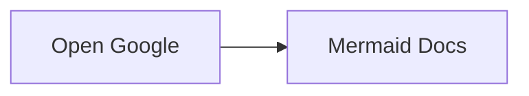

---

## 7. Advanced Syntax Features

### Special Characters & HTML Formatting

Enclose strings in quotes to include special formatting inside labels.

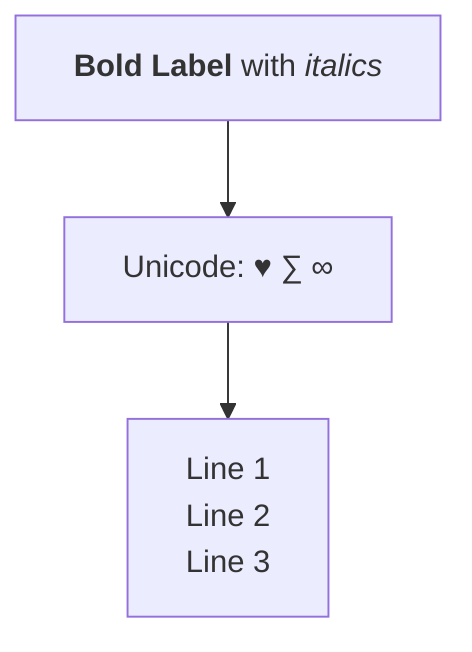

---

## 8. Complete Real-World Workflow Example

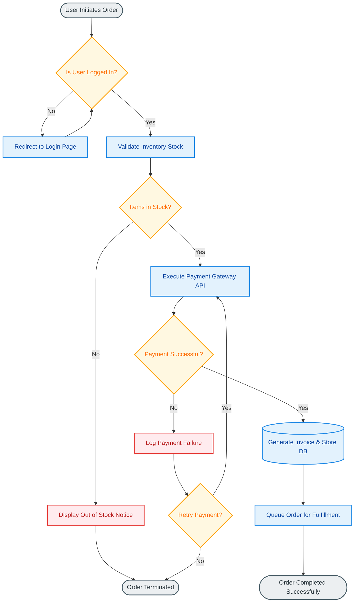

# Mermaid Sequence Diagrams — A Practical Tutorial

Mermaid lets you create diagrams using plain text. A **sequence diagram** is particularly useful for showing how different components interact over time.

This tutorial starts with the basics and gradually introduces more advanced features.

---

## 1. Your first sequence diagram

A Mermaid sequence diagram starts with:

```mermaid
sequenceDiagram
```

Participants are then declared and messages are exchanged between them.

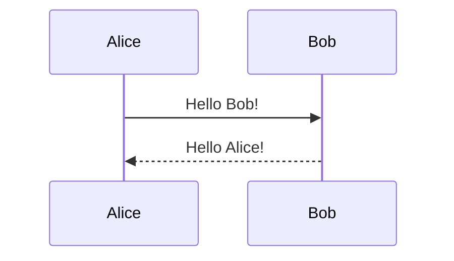

This represents:

```text
Alice                 Bob
  |                    |
  |---- Hello Bob! --->|
  |<--- Hello Alice! --|
  |                    |
```

The direction of the arrow shows who sends the message.

---

## 2. Participants

You can explicitly declare participants:

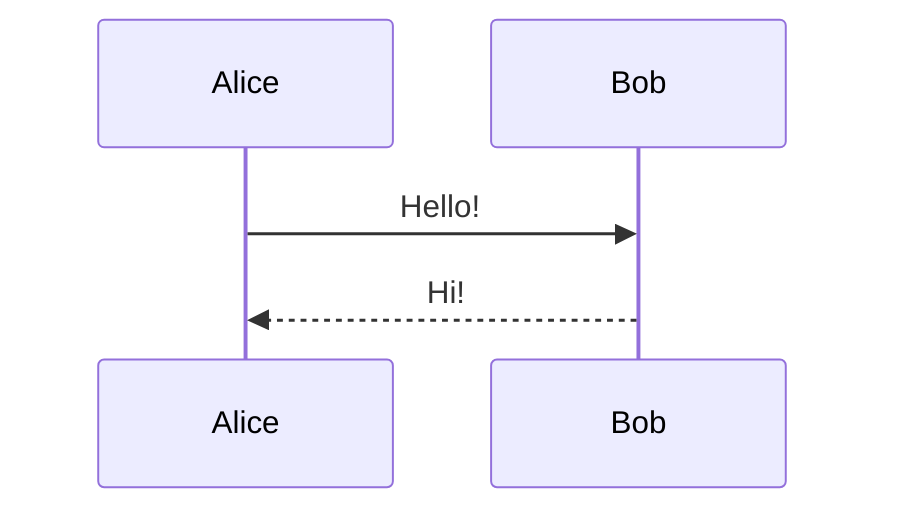

The syntax is:

```text
participant <identifier> as <display name>
```

The identifier is used in the rest of the diagram, while the display name appears in the diagram.

For example:

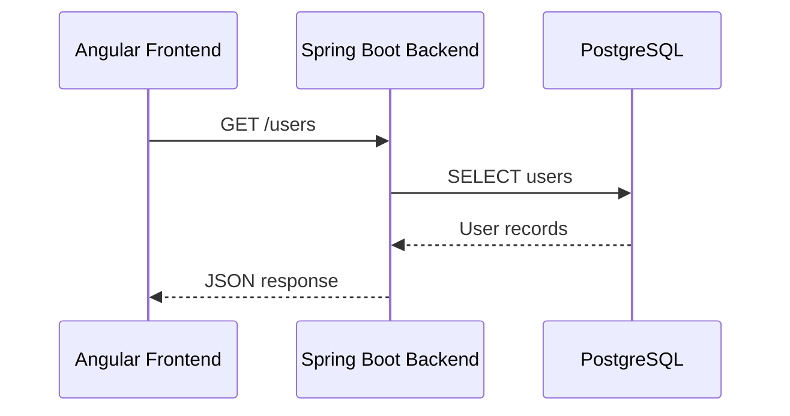

This is often much easier to understand than using the full names in every message.

---

## 3. Message arrows

Mermaid provides several arrow styles.

### Solid arrow

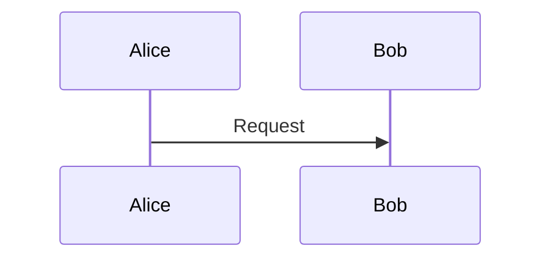

`->>` represents a solid message arrow.

### Dotted return arrow

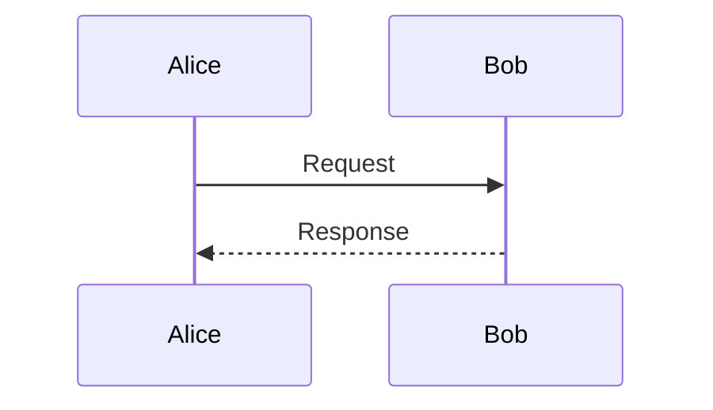

`-->>` is commonly used for responses.

### Other useful arrows

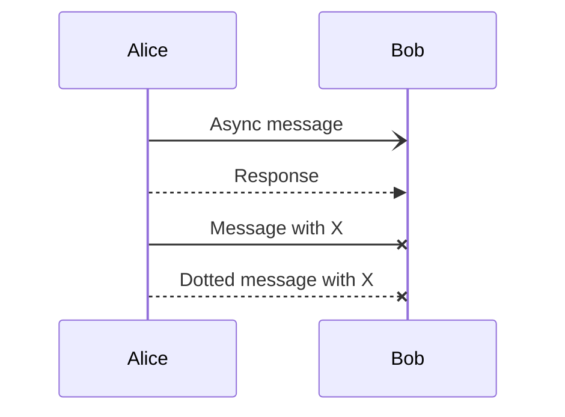

The most common combination is:

```text
A->>B: Request
B-->>A: Response
```

---

## 4. Activation bars

Activation bars show that a participant is actively processing something.

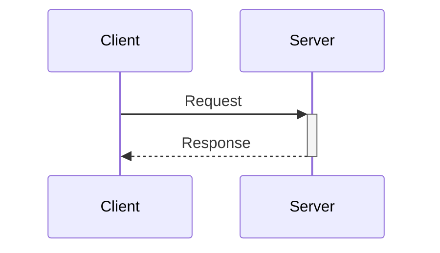

The `+` activates the participant and `-` deactivates it.

You can also explicitly use `activate` and `deactivate`:

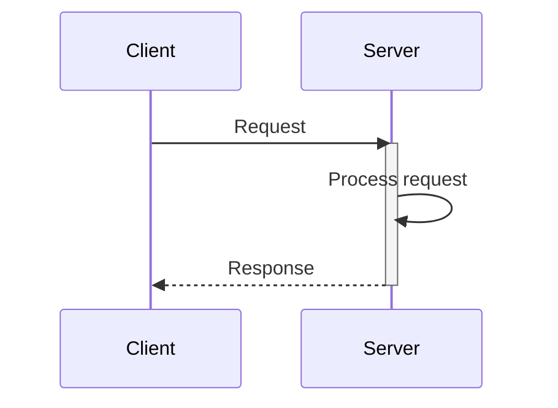

This becomes particularly useful when a request triggers several operations.

---

## 5. Self messages

A participant can send a message to itself.

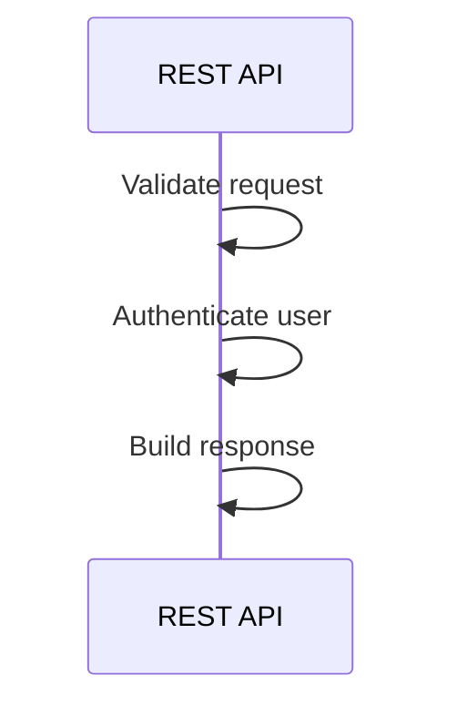

This is useful for showing internal processing.

---

## 6. Notes

You can add explanatory notes.

```mermaid
sequenceDiagram
    participant FE as Frontend
    participant API as Backend

    FE->>API: POST /login

    Note right of API: Authenticate user

    API-->>FE: 200 OK
```

You can position notes on either side:

```mermaid
sequenceDiagram
    participant A as Client
    participant B as Server

    Note left of A: User clicks Login

    A->>B: POST /login

    Note right of B: Validate credentials

    B-->>A: Authentication result
```

You can also place a note over multiple participants:

```mermaid
sequenceDiagram
    participant FE as Frontend
    participant API as Backend

    Note over FE,API: HTTPS communication

    FE->>API: Request
    API-->>FE: Response
```

---

# 7. `alt` — conditional flows

Use `alt` when there are different possible outcomes.

For example, a login operation:

```mermaid
sequenceDiagram
    participant FE as Frontend
    participant API as Backend

    FE->>API: POST /login

    alt Credentials valid
        API-->>FE: 200 OK + session
    else Credentials invalid
        API-->>FE: 401 Unauthorized
    end
```

This is one of the most useful constructs for real-world sequence diagrams.

You can think of it as:

```text
if credentials are valid
    ...
else
    ...
```

---

# 8. `opt` — optional operations

Use `opt` when an operation may happen but there isn't necessarily an alternative.

```mermaid
sequenceDiagram
    participant FE as Frontend
    participant API as Backend
    participant DB as Database

    FE->>API: GET /users
    API->>DB: SELECT users

    opt Cache enabled
        API->>API: Store result in cache
    end

    DB-->>API: Users
    API-->>FE: JSON
```

`opt` represents an optional section.

---

# 9. `loop` — repeated operations

Use `loop` for repeated operations.

```mermaid
sequenceDiagram
    participant Client
    participant Server

    loop Every 30 seconds
        Client->>Server: GET /health
        Server-->>Client: 200 OK
    end
```

You can also describe a condition:

```mermaid
sequenceDiagram
    participant Client
    participant Server

    loop Until request succeeds
        Client->>Server: Retry request
        Server-->>Client: Error
    end
```

---

# 10. `par` — parallel operations

Use `par` when multiple operations happen concurrently.

```mermaid
sequenceDiagram
    participant API
    participant DB
    participant Cache

    API->>DB: Query users

    par Update cache
        API->>Cache: Update users
    and Send metrics
        API->>API: Record metric
    end

    DB-->>API: Users
```

The `par` block indicates that the operations are conceptually concurrent.

---

# 11. `critical` — critical operations

`critical` can be used to describe an operation that must succeed.

```mermaid
sequenceDiagram
    participant API
    participant DB

    critical Create transaction
        API->>DB: BEGIN
        API->>DB: INSERT user
        API->>DB: COMMIT
    option Database unavailable
        API->>API: Retry
    end
```

---

# 12. `break` — aborting a flow

Use `break` when an exceptional condition causes the normal sequence to stop.

```mermaid
sequenceDiagram
    participant FE as Frontend
    participant API as Backend

    FE->>API: GET /account

    break Authentication failed
        API-->>FE: 401 Unauthorized
    end

    API->>API: Load account
    API-->>FE: Account data
```

---

# 13. Grouping interactions

You can visually group parts of a sequence using `rect`.

```mermaid
sequenceDiagram
    participant FE as Frontend
    participant API as Backend
    participant DB as Database

    rect rgb(230, 240, 255)
        FE->>API: POST /login
        API->>DB: Find user
        DB-->>API: User
        API-->>FE: Login successful
    end
```

This is useful for highlighting logical phases such as:

* Authentication
* Authorization
* Database processing
* External API communication

---

# 14. Creating a realistic REST API example

Consider an Angular application communicating with a Spring Boot backend.

```mermaid
sequenceDiagram
    participant User
    participant FE as Angular
    participant API as Spring Boot
    participant DB as PostgreSQL

    User->>FE: Click Login

    FE->>API: POST /authentication/login
    activate API

    API->>DB: Find user
    DB-->>API: User data

    API->>API: Validate credentials

    alt Authentication successful
        API-->>FE: 200 OK + session
        FE-->>User: Show dashboard
    else Authentication failed
        API-->>FE: 401 Unauthorized
        FE-->>User: Show error
    end

    deactivate API
```

This demonstrates several concepts together:

* participants
* requests
* responses
* activation
* self-processing
* conditional flows

---

# 15. Showing HTTP requests more clearly

For API documentation, I recommend putting the HTTP method and endpoint directly in the message.

```mermaid
sequenceDiagram
    participant FE as Angular
    participant API as Spring Boot
    participant DB as PostgreSQL

    FE->>API: POST /authentication/login
    API->>DB: SELECT user WHERE username = ?
    DB-->>API: User
    API-->>FE: 200 OK

    FE->>API: GET /account
    API->>DB: SELECT account
    DB-->>API: Account
    API-->>FE: 200 OK + JSON
```

You can also include important details:

```mermaid
sequenceDiagram
    participant FE as Angular
    participant API as Spring Boot

    FE->>API: POST /authentication/login<br/>username + password
    API-->>FE: 200 OK<br/>Set-Cookie: SESSION=...
```

`<br/>` creates a line break inside the message.

---

# 16. Showing asynchronous communication

Sequence diagrams are also useful for asynchronous messaging.

For example, an application sending a JMS message:

```mermaid
sequenceDiagram
    participant API as Spring Boot
    participant MQ as IBM MQ
    participant Worker as Message Consumer
    participant DB as PostgreSQL

    API->>MQ: Send JMS message
    MQ-->>API: Message accepted

    MQ->>Worker: Deliver message
    activate Worker

    Worker->>DB: Process message
    DB-->>Worker: Success

    Worker-->>MQ: Message acknowledged
    deactivate Worker
```

This makes the difference between the synchronous HTTP interaction and asynchronous message processing much clearer.

---

# 17. Showing nested processing

Sequence diagrams become especially useful when one operation triggers another.

```mermaid
sequenceDiagram
    participant FE as Frontend
    participant API as API
    participant AUTH as Authentication Service
    participant DB as Database

    FE->>+API: POST /login

    API->>+AUTH: Authenticate credentials
    AUTH->>DB: Load user
    DB-->>AUTH: User

    alt Valid credentials
        AUTH-->>API: Authentication successful
        API-->>FE: 200 OK
    else Invalid credentials
        AUTH-->>API: Authentication failed
        API-->>FE: 401 Unauthorized
    end

    deactivate AUTH
    deactivate API
```

Activation bars make nested processing particularly easy to visualize.

---

# 18. Creating a complete authentication example

Here is a more complete example combining several Mermaid features:

```mermaid
sequenceDiagram
    actor User
    participant FE as Angular
    participant API as Spring Boot
    participant AUTH as LDAP
    participant DB as PostgreSQL

    User->>FE: Enter username/password
    FE->>+API: POST /authentication/login

    Note right of API: Create authentication request

    API->>+AUTH: Bind with credentials

    alt Authentication successful
        AUTH-->>API: User authenticated
        deactivate AUTH

        API->>DB: Load user roles
        DB-->>API: Roles

        API->>API: Create HTTP session
        API-->>FE: 200 OK + session cookie

        deactivate API

        FE-->>User: Display dashboard

    else Authentication failed
        AUTH-->>API: Invalid credentials
        deactivate AUTH

        API-->>FE: 401 Unauthorized
        deactivate API

        FE-->>User: Display login error
    end
```

This is close to the kind of diagram you might use in technical architecture documentation.

---

# 19. Actors

For users or external systems, use `actor`.

```mermaid
sequenceDiagram
    actor User
    participant API as Backend

    User->>API: Login
    API-->>User: Login result
```

You can mix actors and participants:

```mermaid
sequenceDiagram
    actor User
    participant FE as Angular
    participant API as Backend
    participant DB as Database

    User->>FE: Login
    FE->>API: POST /login
    API->>DB: Find user
    DB-->>API: User
    API-->>FE: 200 OK
    FE-->>User: Logged in
```

---

# 20. Creating reusable architecture diagrams

For larger systems, give participants meaningful aliases.

```mermaid
sequenceDiagram
    participant Browser as Web Browser
    participant Gateway as API Gateway
    participant Orders as Order Service
    participant Payment as Payment Service
    participant DB as PostgreSQL

    Browser->>Gateway: POST /orders
    Gateway->>Orders: Create order

    Orders->>Payment: Authorize payment
    Payment-->>Orders: Payment authorized

    Orders->>DB: Save order
    DB-->>Orders: Order saved

    Orders-->>Gateway: Order created
    Gateway-->>Browser: 201 Created
```

This gives you a high-level architecture view while still showing the interaction sequence.

---

# 21. Comments

You can put comments in Mermaid using:

```text
%% This is a comment
```

For example:

```mermaid
sequenceDiagram
    %% Authentication flow
    participant FE as Frontend
    participant API as Backend

    FE->>API: POST /login
    API-->>FE: 200 OK
```

Comments are useful for documenting the Mermaid source without appearing in the diagram.

---

# 22. Useful syntax cheat sheet

| Syntax            | Meaning                          |
| ----------------- | -------------------------------- |
| `sequenceDiagram` | Starts a sequence diagram        |
| `participant A`   | Defines a participant            |
| `actor A`         | Defines an actor                 |
| `A->>B`           | Solid message                    |
| `A-->>B`          | Dotted response                  |
| `A-xB`            | Message ending with X            |
| `A->>+B`          | Activate B                       |
| `A-->>-B`         | Deactivate B                     |
| `activate A`      | Start activation                 |
| `deactivate A`    | End activation                   |
| `Note right of A` | Note beside A                    |
| `Note left of A`  | Note beside A                    |
| `Note over A,B`   | Note over A and B                |
| `alt`             | Alternative/conditional flow     |
| `else`            | Alternative branch               |
| `opt`             | Optional operation               |
| `loop`            | Repeated operation               |
| `par`             | Parallel operations              |
| `and`             | Another parallel branch          |
| `critical`        | Critical section                 |
| `option`          | Alternative for critical section |
| `break`           | Abort the flow                   |
| `rect`            | Highlight a region               |
| `end`             | Ends a control block             |
| `%%`              | Comment                          |

---

# 23. A good pattern for software documentation

For application architecture documentation, I recommend this general structure:

```mermaid
sequenceDiagram
    actor User
    participant FE as Frontend
    participant API as Backend
    participant Service as Business Service
    participant DB as Database

    User->>FE: User action

    FE->>+API: HTTP request

    API->>+Service: Execute operation
    Service->>DB: Query/update data
    DB-->>Service: Result
    Service-->>-API: Business result

    alt Operation successful
        API-->>FE: 200 OK
        FE-->>User: Display result
    else Operation failed
        API-->>FE: 4xx/5xx
        FE-->>User: Display error
    end

    deactivate API
```

This separates the **actors**, **technical components**, **business processing**, and **error paths** without putting too much implementation detail into the diagram.

---

# 24. Mermaid in Markdown

If your Markdown renderer supports Mermaid, put the diagram inside a `mermaid` fenced code block:

````markdown
```mermaid
sequenceDiagram
    participant A as Client
    participant B as Server

    A->>B: Request
    B-->>A: Response
```
````

For example, **MkDocs Material** supports Mermaid diagrams when Mermaid support is configured.

The important distinction is that the Mermaid source remains text:

```text
sequenceDiagram
    A->>B: Request
```

while the Markdown renderer turns it into the visual diagram.

---

# 25. Recommended approach

When creating a sequence diagram, start with the simplest representation:

```mermaid
sequenceDiagram
    Client->>Server: Request
    Server-->>Client: Response
```

Then progressively add:

1. **Participants** — identify the systems involved.
2. **Messages** — describe the interactions.
3. **Activation bars** — show processing.
4. **`alt`** — show different outcomes.
5. **`loop`** — show repeated operations.
6. **`par`** — show concurrent operations.
7. **Notes** — explain important details.
8. **`rect`** — visually group major phases.

Avoid putting every implementation detail into the diagram. A good sequence diagram should make the **order and responsibility of interactions immediately obvious**.

## Quick reference example

```mermaid
sequenceDiagram
    actor User
    participant FE as Frontend
    participant API as Backend
    participant DB as Database

    User->>FE: Login

    FE->>+API: POST /login
    API->>DB: Find user
    DB-->>API: User

    alt Valid credentials
        API-->>FE: 200 OK
        FE-->>User: Show dashboard
    else Invalid credentials
        API-->>FE: 401 Unauthorized
        FE-->>User: Show error
    end

    deactivate API
```

This small example covers most of the constructs you will use in day-to-day Mermaid sequence diagrams.
