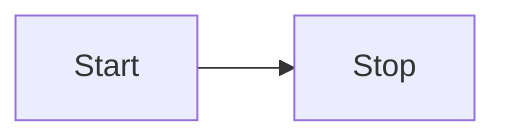
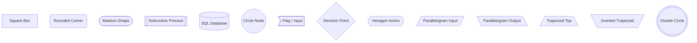
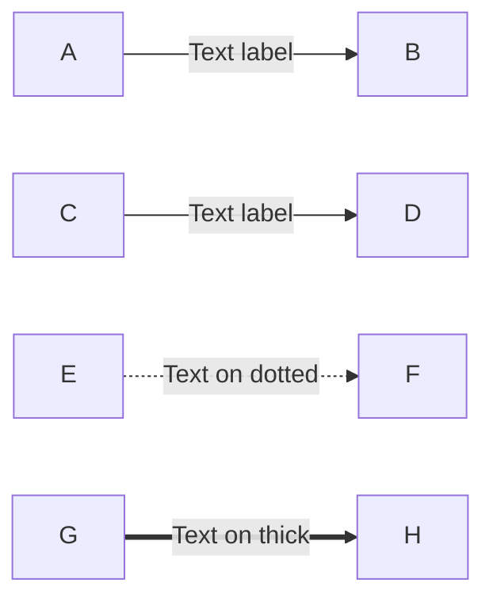
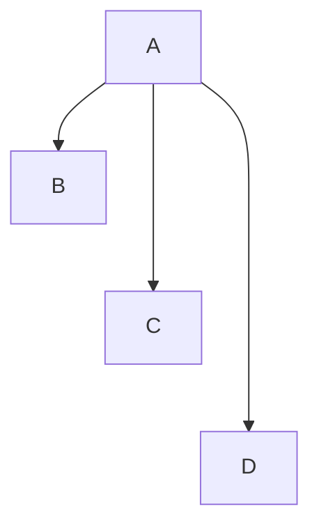
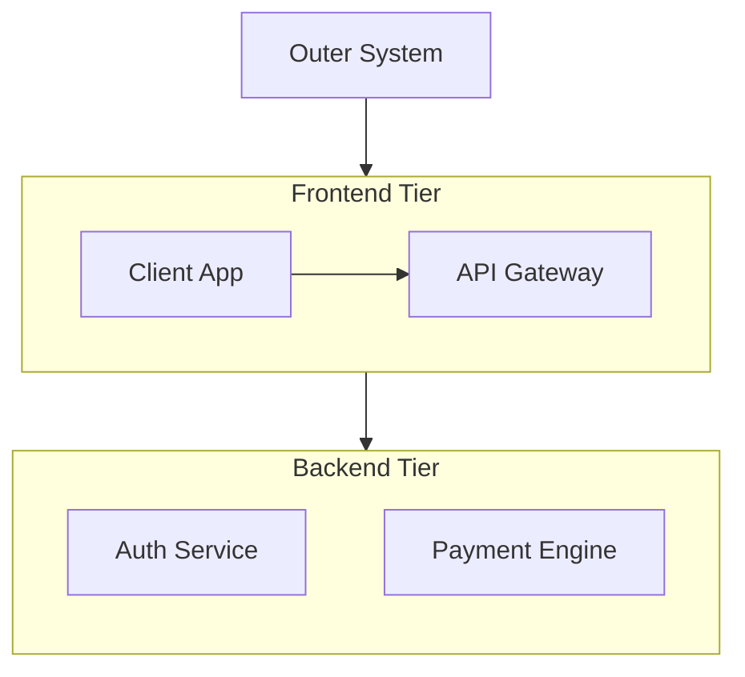
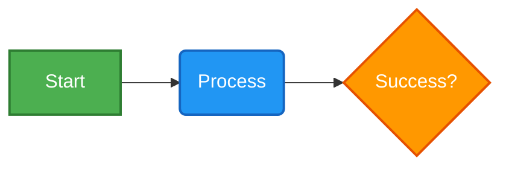
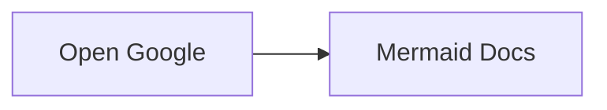
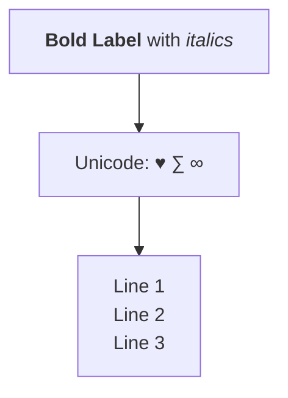
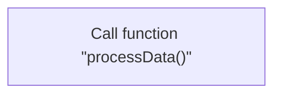

```python
md_content = """# Mermaid Flowchart Diagrams — Quick Reference Cheatsheet

A comprehensive guide to creating flowcharts, diagrams, and process workflows using [Mermaid.js](https://mermaid.js.org/).

---

## 1. Core Syntax & Direction

Flowcharts start with the `flowchart` (or `graph`) keyword followed by the direction indicator.

| Keyword | Direction | Description |
| :--- | :--- | :--- |
| `TB` or `TD` | Top to Bottom / Top Down | Default vertical layout |
| `BT` | Bottom to Top | Inverted vertical layout |
| `RL` | Right to Left | Inverted horizontal layout |
| `LR` | Left to Right | Standard horizontal layout |



---

## 2. Node Shapes & Geometry

Define nodes using various bracket types around the node label.

| Syntax         | Output Shape           | Rendered Preview |
|----------------|------------------------|------------------|
| `id[Text]`     | Rectangle (Default)    | `[Text]`         |
| `id(Text)`     | Rounded Rectangle      | `(Text)`         |
| `id([Text])`   | Stadium / Pill shape   | `([Text])`       |
| `id[[Text]]`   | Subroutine             | `[[Text]]`       |
| `id[(Text)]`   | Cylindrical / Database | `[(Database)]`   |
| `id((Text))`   | Circle                 | `((Text))`       |
| `id>Text]`     | Asymmetric / Flag      | `>Text]`         |
| `id{Text}`     | Rhombus / Decision     | `{Text}`         |
| `id{{Text}}`   | Hexagon                | `{{Text}}`       |
| `id[/Text/]`   | Parallelogram          | `[/Text/]`       |
| `id[\Text\]`   | Parallelogram Alt      | `[\Text\]`       |
| `id[/Text\]`   | Trapezoid              | `[/Text\]`       |
| `id[\Text/]`   | Inverted Trapezoid     | `[\Text/]`       |
| `id(((Text)))` | Double Circle          | `(((Text)))`     |

### Code Example



---

## 3. Link Styles & Arrowheads

Connect nodes using different line types, lengths, and arrow styles.

| Type                  | Line Style    | Arrowhead      | Syntax     |
|-----------------------|---------------|----------------|------------|
| **Solid**             | Standard line | Directed arrow | `A --> B`  |
| **Open**              | Standard line | No arrow       | `A --- B`  |
| **Dotted**            | Dashed line   | Directed arrow | `A -.-> B` |
| **Dotted Open**       | Dashed line   | No arrow       | `A -.- B`  |
| **Thick**             | Bold line     | Directed arrow | `A ==> B`  |
| **Thick Open**        | Bold line     | No arrow       | `A === B`  |
| **Multi-directional** | Solid line    | Both ends      | `A <--> B` |
| **Circle End**        | Solid line    | Circle tip     | `A --o B`  |
| **Cross End**         | Solid line    | Cross tip      | `A --x B`  |

### Text on Links

Text can be added mid-link using pipes or dashed notation.



### Link Length Adjustments

Extend line length by repeating character symbols (`-`, `=`, `.`).



---

## 4. Subgraphs & Layout Containment

Group related nodes within labelled boundary boxes.



---

## 5. Node Styling & CSS Customization

### Inline Styling (`style`)

Apply inline CSS properties directly to specific nodes.



### Reusable Style Classes (`classDef`)

Define reusable style templates for multi-node styling.

```mermaid
flowchart LR
    classDef success fill: #d4edda, stroke: #28a745, color: #155724;
    classDef danger fill: #f8d7da, stroke: #dc3545, color: #721c24;
    classDef warning fill: #fff3cd, stroke: #ffc107, color: #856404;
    Node1[Passed]:::success --> Node2[Warning State]:::warning
    Node2 --> Node3[Critical Fail]:::danger
%% Alternative assignment:
%% class Node1 success
%% class Node2 warning
%% class Node3 danger

```

---

## 6. Interaction & Tooltips

Add click handlers, hyperlinks, or hover tooltips to flowchart nodes.



---

## 7. Advanced Syntax Features

### Special Characters & HTML Entities

Enclose strings in quotes to include special characters or markdown elements inside labels.



### Escape Quotes inside Labels

Use `#quot;` or backslash escaping for quotes inside node text.



---

## 8. Complete Real-World Workflow Example

```mermaid
flowchart TD
%% Global Class Definitions
    classDef startEnd fill: #eceff1, stroke: #455a64, stroke-width: 2px, color: #263238;
    classDef process fill: #e3f2fd, stroke: #1e88e5, stroke-width: 2px, color: #0d47a1;
    classDef decision fill: #fff8e1, stroke: #ffa000, stroke-width: 2px, color: #ff6f00;
    classDef error fill: #ffebee, stroke: #e53935, stroke-width: 2px, color: #b71c1c;
    Start([User Initiates Order]):::startEnd --> AuthCheck{Is User Logged In?}:::decision
    AuthCheck -- No --> PromptLogin[Redirect to Login Page]:::process
    PromptLogin --> AuthCheck
    AuthCheck -- Yes --> ValidateStock[Validate Inventory Stock]:::process
    ValidateStock --> StockCheck{Items in Stock?}:::decision
    StockCheck -- No --> OutOfStock[Display Out of Stock Notice]:::error
    OutOfStock --> EndFailure([Order Terminated]):::startEnd
    StockCheck -- Yes --> ProcessPayment[Execute Payment Gateway API]:::process
    ProcessPayment --> PayCheck{Payment Successful?}:::decision
    PayCheck -- No --> LogError[Log Payment Failure]:::error
    LogError --> RetryPrompt{Retry Payment?}:::decision
    RetryPrompt -- Yes --> ProcessPayment
    RetryPrompt -- No --> EndFailure
    PayCheck -- Yes --> GenInvoice[(Generate Invoice & Store DB)]:::process
    GenInvoice --> Dispatch[Queue Order for Fulfillment]:::process
    Dispatch --> EndSuccess([Order Completed Successfully]):::startEnd

```

"""

with open("mermaid_flowchart_cheatsheet.md", "w", encoding="utf-8") as f:
f.write(md_content)

print("FILE_CREATED: mermaid_flowchart_cheatsheet.md")

```

```text?code_stdout&code_event_index=1
FILE_CREATED: mermaid_flowchart_cheatsheet.md


```

Your Markdown cheatsheet for Mermaid flowchart diagrams is ready.


---

# Mermaid Flowchart Diagrams — Quick Reference Cheatsheet

A comprehensive guide to creating flowcharts, diagrams, and process workflows
using [Mermaid.js](https://mermaid.js.org/).

---

## 1. Core Syntax & Direction

Flowcharts start with the `flowchart` (or `graph`) keyword followed by the direction indicator.

| Keyword      | Direction                | Description                |
|--------------|--------------------------|----------------------------|
| `TB` or `TD` | Top to Bottom / Top Down | Default vertical layout    |
| `BT`         | Bottom to Top            | Inverted vertical layout   |
| `RL`         | Right to Left            | Inverted horizontal layout |
| `LR`         | Left to Right            | Standard horizontal layout |


---

## 2. Node Shapes & Geometry

Define nodes using various bracket types around the node label.

| Syntax         | Output Shape           | Rendered Preview |
|----------------|------------------------|------------------|
| `id[Text]`     | Rectangle (Default)    | `[Text]`         |
| `id(Text)`     | Rounded Rectangle      | `(Text)`         |
| `id([Text])`   | Stadium / Pill shape   | `([Text])`       |
| `id[[Text]]`   | Subroutine             | `[[Text]]`       |
| `id[(Text)]`   | Cylindrical / Database | `[(Database)]`   |
| `id((Text))`   | Circle                 | `((Text))`       |
| `id>Text]`     | Asymmetric / Flag      | `>Text]`         |
| `id{Text}`     | Rhombus / Decision     | `{Text}`         |
| `id{{Text}}`   | Hexagon                | `{{Text}}`       |
| `id[/Text/]`   | Parallelogram          | `[/Text/]`       |
| `id[\Text\]`   | Parallelogram Alt      | `[\Text\]`       |
| `id[/Text\]`   | Trapezoid              | `[/Text\]`       |
| `id[\Text/]`   | Inverted Trapezoid     | `[\Text/]`       |
| `id(((Text)))` | Double Circle          | `(((Text)))`     |

### Code Example


---

## 3. Link Styles & Arrowheads

Connect nodes using different line types, lengths, and arrow styles.

| Type                  | Line Style    | Arrowhead      | Syntax     |
|-----------------------|---------------|----------------|------------|
| **Solid**             | Standard line | Directed arrow | `A --> B`  |
| **Open**              | Standard line | No arrow       | `A --- B`  |
| **Dotted**            | Dashed line   | Directed arrow | `A -.-> B` |
| **Dotted Open**       | Dashed line   | No arrow       | `A -.- B`  |
| **Thick**             | Bold line     | Directed arrow | `A ==> B`  |
| **Thick Open**        | Bold line     | No arrow       | `A === B`  |
| **Multi-directional** | Solid line    | Both ends      | `A <--> B` |
| **Circle End**        | Solid line    | Circle tip     | `A --o B`  |
| **Cross End**         | Solid line    | Cross tip      | `A --x B`  |

### Text on Links

Text can be added mid-link using pipes or dashed notation.


### Link Length Adjustments

Extend line length by repeating character symbols (`-`, `=`, `.`).


---

## 4. Subgraphs & Layout Containment

Group related nodes within labelled boundary boxes.


---

## 5. Node Styling & CSS Customization

### Inline Styling (`style`)

Apply inline CSS properties directly to specific nodes.


### Reusable Style Classes (`classDef`)

Define reusable style templates for multi-node styling.

```mermaid
flowchart LR
    classDef success fill: #d4edda, stroke: #28a745, color: #155724;
    classDef danger fill: #f8d7da, stroke: #dc3545, color: #721c24;
    classDef warning fill: #fff3cd, stroke: #ffc107, color: #856404;
    Node1[Passed]:::success --> Node2[Warning State]:::warning
    Node2 --> Node3[Critical Fail]:::danger

```

---

## 6. Interaction & Tooltips

Add click handlers, hyperlinks, or hover tooltips to flowchart nodes.


---

## 7. Advanced Syntax Features

### Special Characters & HTML Formatting

Enclose strings in quotes to include special formatting inside labels.


---

## 8. Complete Real-World Workflow Example

```mermaid
flowchart TD
%% Global Class Definitions
    classDef startEnd fill: #eceff1, stroke: #455a64, stroke-width: 2px, color: #263238;
    classDef process fill: #e3f2fd, stroke: #1e88e5, stroke-width: 2px, color: #0d47a1;
    classDef decision fill: #fff8e1, stroke: #ffa000, stroke-width: 2px, color: #ff6f00;
    classDef error fill: #ffebee, stroke: #e53935, stroke-width: 2px, color: #b71c1c;
    Start([User Initiates Order]):::startEnd --> AuthCheck{Is User Logged In?}:::decision
    AuthCheck -- No --> PromptLogin[Redirect to Login Page]:::process
    PromptLogin --> AuthCheck
    AuthCheck -- Yes --> ValidateStock[Validate Inventory Stock]:::process
    ValidateStock --> StockCheck{Items in Stock?}:::decision
    StockCheck -- No --> OutOfStock[Display Out of Stock Notice]:::error
    OutOfStock --> EndFailure([Order Terminated]):::startEnd
    StockCheck -- Yes --> ProcessPayment[Execute Payment Gateway API]:::process
    ProcessPayment --> PayCheck{Payment Successful?}:::decision
    PayCheck -- No --> LogError[Log Payment Failure]:::error
    LogError --> RetryPrompt{Retry Payment?}:::decision
    RetryPrompt -- Yes --> ProcessPayment
    RetryPrompt -- No --> EndFailure
    PayCheck -- Yes --> GenInvoice[(Generate Invoice & Store DB)]:::process
    GenInvoice --> Dispatch[Queue Order for Fulfillment]:::process
    Dispatch --> EndSuccess([Order Completed Successfully]):::startEnd

```