# NLP Natural Language Processing overview

https://www.youtube.com/watch?v=Ub3GoFaUcds&t=1503s
https://cme295.stanford.edu/slides/fall25-cme295-lecture1.pdf

Natual Language Processing has many tasks

## NLP classification tasks

### Classification

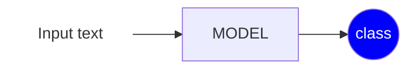

The input text is given to a model that produces a classification value for the entire input.

* Sentiment: `The bear is so CUTE` $\rightarrow$ $+$
* Intent: `Alexa wake me up at 7 tomorrow morning` $\rightarrow$ `set alarm`
* Language detection

### Multi-Classification

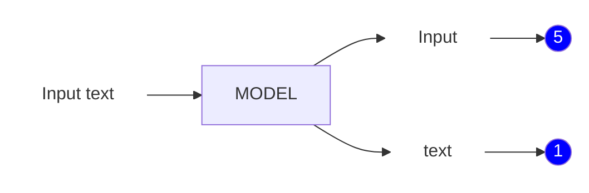

* Part of speech tagging
* Named entity recognition: nouns, verbs, adjectives etc...

### Generation

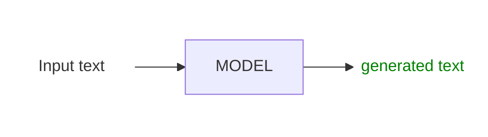

* chatgpt

## NLP evaluation metrics

Say you have 100 emails: 20 are actually spam, 80 are actually not spam. Your classifier makes these predictions:

this is the composition of false/true positive/negative

|                   | Predicted Spam | Predicted Not Spam |
|-------------------|----------------|--------------------|
| Actually Spam     | TP = 15        | FN = 5             |
| Actually Not Spam | FP = 10        | TN = 70            |

* <span style="color:red">**ACCURACY**</span>: % of observation correctly predicted across every class. It's a **global
  measure**

$$$$\text{ACCURACY}=\frac{TP}{TP+FP+FN+TN}=\frac{15}{100}=0.15$$$$

* <span style="color:red">**PRECISION**</span>: This is class-specific (or averaged across classes). Everything the
  model predicted as a given class, how much was actually correct

$$$$\text{PRECISION}_{SPAM}=\frac{TP}{TP+FP}=0.60$$$$

$$$$\text{PRECISION}_{NO-SPAM}=\frac{TN}{FN+TN}=0.93$$$$

* <span style="color:red">**RECALL**</span>: how much of the actual classification (TP+FN) has been actually classified
  correctly (TP)

$$\text{RECALL}=\frac{TP}{TP+FN}=0.75$$

* <span style="color:red">**F1**</span>: score that is a function (harmonic mean) of precision and recall

$$\text{F1}_{spam}=2\frac{\text{PRECISION} \times \text{RECALL}}{\text{PRECISION} + \text{RECALL}}=2\frac{0.6 \times 0.75}{0.6+0.75}=0.667$$

$$\text{F1}_{no-spam}=0.903$$

### Technology timeline

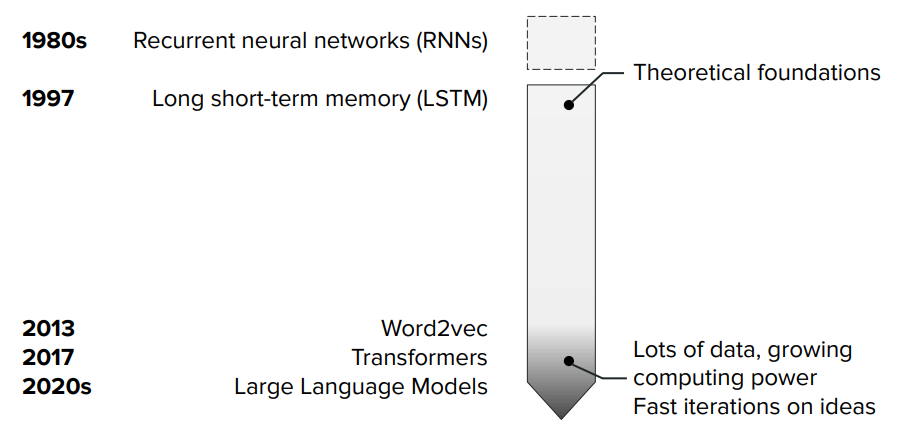

## Tokenization

A way to translate text input in numeric data a neural network can process.
Regards how to cut the text.

### Word tokenization

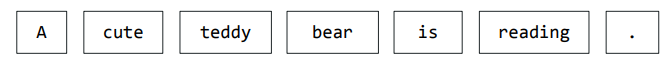

It is easy to implement but it consider different entities that should be the same, like verb declinations

`run` and `runs` for instance.

Furthermore there is a high risk of <span style="color:red">**OOV**</span> (Out-Of-Vocabulary) because the token
must be somehow be present in the training set with its specific declination (gender, number etc...)

### Sub-word tokenization

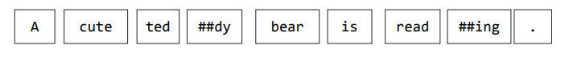

It extracts the words root, but it creates longer sequences of tokens, where the sequence lenght is proportional to
processing time.

Lower risk of OOV compared to the word tokenization

### character level tokenization

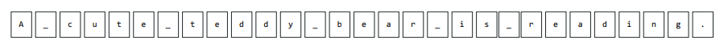

Can mitigate words mistype, but it generates very long token sequences.

## Token representation

The token representation regards the translation of tokens into vectors that can be processed by neural networks.

We need to distinguish two concept:

> <span style="color:red">**VOCABULARY**</span>: the set of tokens (words, sub-words, etc...)

```text
vocab = {the, cat, sat, on, mat, dog, ran, ...}
```

> <span style="color:red">**CORPUS**</span>: is the actual training text — many sentences (or documents). This is where
> the sentences live.

```text
corpus = [
  "the cat sat on the mat",
  "the dog ran in the park",
  "a cat and a dog played together",
  ...
]
```

### One-hot vector

The one hot vector represent a token as a all-zeros vector except one.

> That means that we need $N$ sized vectors with $N$ is the number of words in the vocabulary

This has two main issues:

* **High Dimensionality & Extreme Sparsity**: 99.999% of the values are zeros, very inefficient, no information content
* **Orthogonality**: in the vector space, all vectors are orthogonal to each other, giving no embedding (similarity)
  representation between words

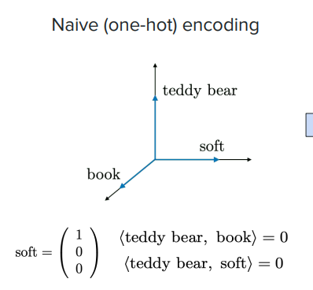

### Learned embedding

In the cosin representation, the embedding (similarity) which is derived from the corpus is represented as
the $\cos\left({\widehat{\overrightarrow{t_1}\overrightarrow{t_2}}}\right)$ the cos of the angle between two token
vectors
in the vector space

Narrower vectors are considered more similar (embedded)

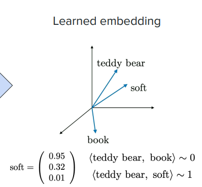

## Word representation: `Word2Vec` for

From the article https://arxiv.org/pdf/1301.3781

Word2Vec is a method for turning words into <u style="color:red">**dense numeric vectors**</u> (embeddings) such that
words with similar meanings end up close together in vector space.

Instead of representing a word as a one-hot vector (huge, sparse, and carrying no notion of similarity), Word2Vec learns
a compact vector (say, 100–300 dimensions)
for each word from raw text, with <span style="color:red"><u>**no labels needed**</u></span> — the "supervision" comes
from word co-occurrence patterns learned from the corpus.

> It's based on the distributional hypothesis: **words that appear in similar contexts tend to have similar meanings
** ("you shall know a word by the company it keeps").

### Training mechanism

`Word2Vec` is trained as a shallow neural network doing a fake prediction task — the point isn't the prediction itself,
it's the weights learned along the way.

It uses two approaches

1. **`CBOW` (Continuous Bag of Words)**: predict the center word from its surrounding context words.
   Input: **context words** (`the` `cat` `?` `on` `the` `mat`) → Output: `sat`

2. **`Skip-gram`**: predict the surrounding context tokens from the center token (works better on smaller datasets /
   rare words) in a token window of a certain dimension.
   Input: target word → Output: context words

The training procedure is done via a simple one-layer neural network with a hidden state of dimension many factors lower
than
the one-hot vector dimension of the input token.

In the image $D_T=10000$, $D_h=300$

So we have one transformation matrix  $W_{xh} \in \mathbb{R}^{D_x,D_h}$

so that $h=xW_{xh} \in \mathbb{R}^{D_h}$.

To produce the ouptut  $\hat y=sofmax(hW_{hy})$

we get the probability distribution, to be compared with the true UOV $y$ to produce the error.

The back-propagation on the SGD step will update $W_{xh}$ and $W_{hy}$

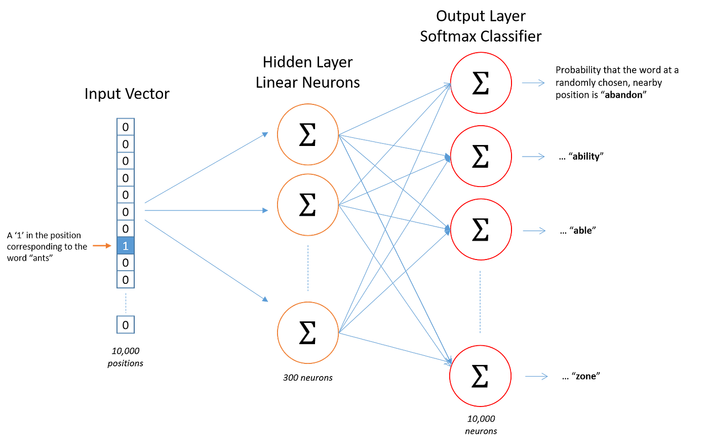

### Example of training with `Skip-gram`

Let, in case of `Skip-gram` training with **window size 1** (look 1 word left and 1 word right of the center word).

The **corpus** is

```text
"the cat sat on the mat"
```

With the following vocabulary (5 tokens for 6 words - `the` for 2 words )

```text
0: the
1: cat
2: sat
3: on
4: mat
```

We create the **(center, context) pairs** set for each word, indicating the 1 distance surrounding

| Center word | Contex words (window=1) |
|-------------|-------------------------|
| `the`       | `cat`                   |
| `cat`       | `the`,`sat`             |
| `sat`       | `cat`,`on`              |
| `on`        | `sat`,`the`             |
| `the`       | `on`,`mat`              |
| `mat`       | `the`                   |

From that we create training set of input, target pairs $(x,y)$.

(skip-gram splits each context word into its own pair)

```text
(cat, the)
(cat, sat)
(sat, cat)
(sat, on)
(on, sat)
(on, the)
...
```

Example $(x,y)=$(`sat`,
`on`), $x_{sat}=\begin{bmatrix}0 & 0 & 1 & 0 & 0\end{bmatrix}$, $y_{on}=\begin{bmatrix}0 & 0 & 0 & 1 & 0\end{bmatrix}$

We design the network to have a hidden state dimension $D_h=3$

Therefore  $W_{xh} \in \mathbb{R}^{5,3}$

Example:

```text
W_xh = [[0.2, 0.1, 0.4],   # the
       [0.5, 0.9, 0.2],   # cat
       [0.1, 0.3, 0.8],   # sat  ← this row gets selected by x
       [0.7, 0.6, 0.1],   # on
       [0.3, 0.2, 0.5]]   # mat
```

so $h=\begin{bmatrix}0.1 & 0.3 & 0.8 \end{bmatrix}$ (this is <span style="color:red"><u>**the current embedding
for $x_{sat}$**</u></span>)

* Hidden layer → output layer via a second matrix  $W_{xh} \in \mathbb{R}^{3,5}$, then $\hat y=sofmax(hW_{hy})$.

* Compare predicted probabilities to the true target y = [0,0,0,1,0] (i.e., "on" should get probability 1) using
  cross-entropy loss.

* Backpropagate the error to update both $W_{xh}$ and $W_{hy}$ — this moves the `sat` row of $W_{xh}$ slightly toward
  directions that make `on` more likely to be predicted, and slightly away from directions for words that don't co-occur
  with `sat`.

* At the end of the training the matrix $W_{xh}$ settles into vectors that capture meaningful relationships between
  words — that's the "<span style="color:red">**embedding matrix**</span>" you extract and use afterward

### Tokens embedding

The embedding of a token $t$ can be extracted from the embedding matrix $W$ (former $W_{xh}$) at the index corresponding
to the token

If the element 1 of the OHV of $t$ is $i$ the embedding will be the $i-th$ row of $W$

> $$E(t)=W[t_i,:]$$

If we use the example above we have

$E(\text{sat})=W[2,:]=\begin{bmatrix}0.1 & 0.3 & 0.8\end{bmatrix}$

$E(\text{on})=W[3,:]=\begin{bmatrix}0.7 & 0.6 & 0.1\end{bmatrix}$

#### Embedding 1: Cosin similarity (most commonly used - How similar are w1, w2?)

> <span style="color:red">**Cosin similarity**</span> between to vectors $t_1$ and $t_2$ is
> 
> $$\text{sim}(t_1,t_2)=\frac{t_1t_2}{\Vert t_1\Vert\Vert t_2\Vert} \in [-1,1]$$

Example:

```text
dot product = (0.1)(0.7) + (0.3)(0.6) + (0.8)(0.1) = 0.07 + 0.18 + 0.08 = 0.33
||v1|| = sqrt(0.1² + 0.3² + 0.8²) = sqrt(0.01+0.09+0.64) = sqrt(0.74) ≈ 0.860
||v2|| = sqrt(0.7² + 0.6² + 0.1²) = sqrt(0.49+0.36+0.01) = sqrt(0.86) ≈ 0.927

sim(sat, on) = 0.33 / (0.860 × 0.927) ≈ 0.33 / 0.797 ≈ 0.414
```

A value near 1 means the tokens point in nearly the same direction in embedding space (very related/interchangeable in
context);
near 0 means unrelated; negative means opposite. Here, 0.414 is mild positive similarity.

#### Embedding 2:Relationship (used for analogies - What's the relationship/direction)

> The relationship between two words (e.g., the "royalty" direction between king/queen)
> $$\text{relation}(t_1,t_2)=E(t_1)-E(t_2)$$

The famous emergent property

```text
E("king") - E("man") + E("woman") ≈ E("queen")
```

## Word representation with RNN (LSTM) - Query, Key and Value

|                                    | Description                                                                                                                                                                          | Analogy with investigation                                                                                                       |
|------------------------------------|--------------------------------------------------------------------------------------------------------------------------------------------------------------------------------------|----------------------------------------------------------------------------------------------------------------------------------|
| $Q$ What are you looking for?      | The Query vector represents what a specific word (or token) is "looking for" in other words within the sequence.                                                                     | Each detective has a specific question they want answered, like “Who was at the scene of the crime?”                             |
| $K$ How do I identify information? | The Key vector encodes information about a word in a way that makes it "searchable." Think of it as metadata for each token, indicating what kind of information this word provides. | The evidence they have is labeled with tags like “time of arrival” or “fingerprints.” These labels make the evidence searchable. |
| $V$ What information do I provide? | The Value vector represents the actual content or information that the word contributes to the overall representation.                                                               | Each piece of evidence also contains the actual content: the fingerprint report, timestamps, or alibi details.                   |


### Calculation

Given the <span style="color:red">**embedding matrix**</span> $E \in \mathbb{R}^{N,D}$

* $N$ number of tokens in the input sequence
* $D$ the number of featured for each token

$Q=E\cdot W_Q$ $K=E\cdot W_K$ $V=E\cdot W_V$

The weight matrices are <span style="color:red">**learned**</span> and they represent a transformation of the embedding. 

This transformation essentially **adjusts the importance or emphasis assigned to each dimension of the token's representation** for the specific role (Query, Key, or Value). 

Self-Attention can also be used

### Q: weighted questions

> These weights essentially tell the model, "For this token, these specific features are most relevant when determining its relationship with other tokens."

> The weight matrix learns to transform the token embeddings into a space where they encode "questions" about the input.

So essentially the query matrix $Q$ represents all the questions that are being asked about the input sequence. These questions aim to determine:

* Which tokens are important for understanding the sequence.

* Which properties (dimensions) of these tokens are relevant to answering the questions.

Think of it as: <span style="color:red">**"What do I need to focus on to understand this input?"**</span>

### K: metadata for retrieval

The weight matrix 
 adjusts the embedding to represent how the token provides information that others might find relevant. 

For instance, it might highlight dimensions like syntactic roles or semantic cues.

> The Key(K) matrix represents the metadata about each token, explaining:
>
>* What kind of information each token provides.
>
>* How the dimensions of the token’s embedding describe this information.

Think of it as: <span style="color:red">**"Here’s my profile—this is what I can contribute and how to interpret me."**</span>

### V: the content

> Represents the actual content or information that each token contributes to the input sequence. 
> This information is what the model ultimately uses after determining relevance via Query and Key interactions. 

This transformation adjusts the embedding to emphasize dimensions that are relevant for the specific task or the context of the input sequence.

Think of it as: <span style="color:red">**"Here’s the actual information I hold that can help you understand the sequence."**</span>

The matrix is 
* context aware of the token within the sequence
* task specific relevance: for example, in a translation task, certain dimensions might focus on semantic roles (e.g., subject-object relationships), while in a summarization task, different dimensions might emphasize sentence importance.
* preserves core information: The Value vector retains the core information from the embedding vector but filters and highlights the most task-relevant and context-relevant features.

## The role of Q,K,V in transformers
In a transformer, every token in a sequence acts like a detective:

* Each token uses its **Query** to ask questions.

* Every token presents its **Key** to show what kind of information it holds.

* The token’s **Value** provides the actual content used after relevance is determined.

* The alignment score $E=KQ$ is the relevance between Queries and Keys to determine how much attention each token should pay to others.

This process enables dynamic, context-aware information sharing across the sequence.

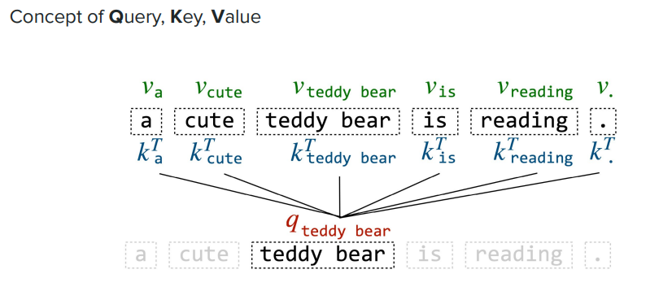

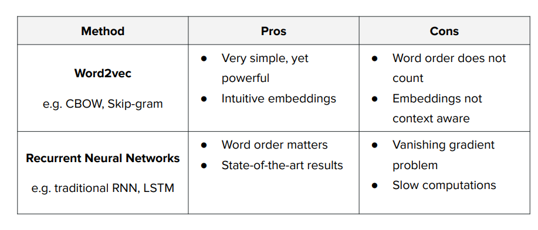

