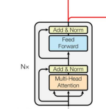

# BERT - Bidirectional Encoder Representations from Transformers

https://chatgpt.com/c/6a86a5a2-64dc-83eb-805d-3b6aa52c6113

> It is a Transformer model designed primarily to understand text rather than generate it for <span style="color:red">*
*classification task**</span>

Use cases:

* sentiment extraction
* question answering

The name reports

* **Encoder from Transformers** because it does not use the decoder part of the traditional transformer
* **Bidirectional Representation** the output of the encoder for one token makes it attend all other tokens. We are
  missing the decoder part here where the masked self attention makes the attention layer <span style="color:red">*
  *causal**</span> (every token attends only the preceeding tokens in the input sequence)

## Pipeline

```text
                 Raw text
                    │
                    ↓
              Tokenization
                    │
                    ↓
       [CLS] The bank approved ...
                    │
                    ↓
       Token embeddings
                    +
       Position embeddings
                    +
       Segment embeddings
                    │
                    ↓
          Transformer Encoder
                    │
          ┌─────────┴─────────┐
          ↓                   ↓
    Multi-head             Feed-forward
    self-attention           network
          │                   │
          └─────────┬─────────┘
                    ↓
               Layer Norm
                    │
                    ↓
             next Transformer
                 layer
                    │
                   ...
                    │
                    ↓
            Final contextual
              representations
                    │
          ┌─────────┼─────────┐
          ↓         ↓         ↓
       [CLS]      tokens    other
          │
          ↓
    Task-specific head layer
          │
          ↓
      prediction
```

## Training

BERT training has two main stages:

1. <span style="color:red">**Pre-training**</span> — BERT learns general language understanding from a huge text corpus.
2. <span style="color:red">**Fine-tuning**</span> — the pretrained BERT is adapted to a specific task such as
   classification or question answering.

### Pre-training: MLM (Masked Language Model) and NSP (Next Sentence Prediction)

> In <span style="color:red">**MLM**</span> an input sentece has random words replaced with `[MASK]`. BERT tries to
> guess
> the missing words (the target words are known so it is used as training set)

BERT is essentially learning:

"How does language work?"

by solving enormous numbers of masked-token prediction problems.

```text
"The cat sat on the [MASK]."
                 ↓
               mat
```

Due to the <u>BERT's self-attention mechanism</u>, the `[MASK]` token will contain attention information from his
neighbours and thanks to the training from other sentences will
derive the prediction, considering the sorrounding words.

The known original text provides the answer.
That's why this is called <span style="color:red">**self-supervised learning**</span>.

> In <span style="color:red">**NSP**</span>  a training set of (`sentenceA`,`sentenceB`,`isNext`) is given, when
`isNext` indicates whether sentences logically follow one another.

for instance

```text
(`The bank approved my loan.`, `I received the money yesterday.`, true)
(`The bank approved my loan.`, `The weather in Amsterdam was sunny.`, false)
```

BERT receives the input `[CLS] Sentence A [SEP] Sentence B [SEP]` and predicts the value of `isNExt`

The training cycle is then

```text
BERT training
                       │
              ┌────────┴────────┐
              ↓                 ↓
       Masked Language    Next Sentence
          Modeling          Prediction
              │                 │
              ↓                 ↓
       predict masked       predict whether
          tokens             B follows A
              │                 │
              └────────┬────────┘
                       ↓
                  total loss
                       ↓
                 backpropagation
```

### Fine-tuning based on the specific task

So far BERT has learnt how the used language "works". But the actual usage of it can be:

* question answering
* sentiment extraction
* named entities extraction
* ...

> The concept here is to train BERT and a specific sub layer added to it for the specific target

Suppose we want sentiment extraction `input->positive,negative`

For instance, the input `[CLS] I absolutely loved this movie ! [SEP]` has `positive` target.

BERT processes the whole sequence and produces a vector of dimension 768 for every token, including `[CLS]` and `[SEP]`

```text
#this is what BERT classifies CLS based on the input sentence

[CLS] → [0.21, -0.73, 0.45, ..., 0.18]   
         └──────── 768 values ────────┘
```

> We need to convert this vector into a classification: we postpone a 768->2 FNN layer to bert to produce the sentiment
> classification

> The output of FNN is the cardinality of the classification classes

So the structure becomes

```text
                   BERT
                    │
                    ↓
                 [CLS] 768 dimenstional vector
                    │
                    ↓
             ┌──────────────┐
             │ Linear layer │  z=W[CLS]+b=logits [3.2, 0.7]
             │              │  W(2,768)
             │ 768 → 2      │  b(2)
             └──────┬───────┘
                    ↓
               [2 numbers]   softmax(z)=[0.924, 0.076] -> positive
                │        │
                ↓        ↓
            positive   negative
```

The linear layer is trained with a training set and the backpropagation goes into BERT itself

```text
                    Loss
                      ↑
                      │
              Classification
                  layer
                      ↑
                      │
                    [CLS]
                      ↑
                      │
               BERT layer 12
                      ↑
               BERT layer 11
                      ↑
                     ...
                      ↑
               BERT layer 1
```

Therefore, during normal BERT fine-tuning:

> Both the new classification layer AND BERT's pretrained parameters are updated.

The classification layer learns:

> "Which characteristics of BERT's representation indicate positive vs. negative?"

> While BERT itself slightly adjusts its representations to become better for the particular task.

## Input processing

We will follow an example

```text
The bank approved my loan.
The money was transferred yesterday.
```

### `WordPiece` tokenizer

* tokens are taken from a vocabulary (~30.000 words)
* if the token does not match a word in the vocabulary it is split into matching words using `##`

Example

```text
[The] [bank] [approv] [##ed] [my] [loan]
```

### Special token addition

BERT adds <span style="color:red">**special tokens**</span>

```text
[CLS] The bank approved my loan . [SEP]
The money was transferred yesterday . [SEP]
```

* `[CLS]`: placed at the beginning, its final representation is commonly used for <u>classification</u>.
* `[SEP]`: marks the separation between sentences

### Token ID conversion

BERT converts token to a numeric representation given by the vocabulary.

The ID is not a qualitative representation, they are just IDs

For example

```text
[CLS]       → 101
The         → 1996
bank        → 2924
approved    → 12345
my          → 2026
loan        → 5414
.           → 1012
[SEP]       → 102
```

### Token ID to embeddings (~30,000 × 768)

> BERT keeps a <span style="color:red">**trainable embedding matrix**</span> with vectors of dimension 768, for each ID
> in the vocabulary

```text
             Token embedding matrix
        ┌─────────────────────────────┐
ID 101  │ [ 0.12, -0.31, 0.72, ... ]  │ ← [CLS]
ID 1996 │ [ 0.44,  0.18, 0.03, ... ]  │ ← The
ID 2924 │ [-0.12,  0.73, 0.41, ... ]  │ ← bank
ID 2026 │ [ 0.31, -0.22, 0.82, ... ]  │ ← my
ID 5414 │ [ 0.72,  0.12, 0.51, ... ]  │ ← loan
        └─────────────────────────────┘
```

so that

```text
bank -> token ID 2924 -> row 2924 of embedding matrix -> 768-dimensional vector
```

### Position embedding (512 × 768)

The token vectors does not contain any info about the position of the token in the input sequence

> BERT uses a differentiable position embedding matrix where the key is the position

```text
Position embedding matrix

position 0 → [ ... 768 values ... ]
position 1 → [ ... 768 values ... ]
position 2 → [ ... 768 values ... ]
position 3 → [ ... 768 values ... ]
```

### Segment embedding (2 × 768)

BERT needs information about which token belongs to which input segment

<span style="color:red">**NOTE**:</span> the original paper uses the misleading word _sentence_ instead of _segment_.
The reason of this is explained below

> BERT uses a differentiable segment embedding matrix for two segment types

```text
segment ID
     ↓
┌──────────────────────┐
│ 0 → Segment A vector │
│ 1 → Segment B vector │
└──────────────────────┘
```

```text
[CLS] The bank approved my loan . [SEP]
  A    A   A     A       A   A A   A

The money was transferred yesterday . [SEP]
 A    B    B       B          B     B   B
```

Every token receive a vector corresponding to a sentence

```text
Segment A → vector A → [0.15, -0.32, 0.41, ...] #Every token in sentence A receives the first vector.
Segment B → vector B → [0.72,  0.11, 0.03, ...] ##Every token in sentence B receives the second vector.
```

> The original BERT supports only to segment ID/types

#### Segment Vs Sentence

for long inputs three approaches can be used in BERT

* **concatenate sentences** in two segments, to split two separate contexts of the input (group1 ID0, group2 ID2).
* **Use `[SEP]` tokens as the actual sentence boundary markers**
* **Alternate/cycle segment IDs** (some later variants, <u>not vanilla BERT</u>) — assign 0,1,0,1... per sentence

### Final token embedding

For every token $E_i=E_{token}+E_{pos}+E_{seg}$

```text
                  bank
                   │
        ┌──────────┼───────────┐
        ↓          ↓           ↓
     Token      Position     Segment
    embedding   embedding    embedding
        │          │           │
        ↓          ↓           ↓
     [768]       [768]        [768]
        └──────────┼───────────┘
                   ↓
                 ADD
                   ↓
              [768 vector]
                   ↓
          Transformer layer 1
```

## Transformer encoder

each transformer layer in BERT is for <span style="color:red">**encoder-only**</span> part of the transformer



### Self-attention: bidirectionality

BERT asks, effectively:

> "Which other tokens are important for understanding bank?"

The actual model doesn't explicitly say "bank means financial institution".

> Instead, its <span style="color:red">**attention and subsequent neural-network transformations produce a <u>contextual
representation</u> that captures this relationship**</span>.

For instance, self-attention scores produced for the token `bank` could be like:

```text
token:  The     bank    approved    my      loan
scores: 0.05    0.10    0.3         0.05    0.5
```

The important information for interpreting `bank` is therefore coming especially from `approved` and `loan`

> Self-attention layer in BERT <span style="color:red">**bidirectional**</span>: each token attend to eny other token in
> the input.

There is no causal mask that limits attention only to previous tokens in the input.

**GPT (causal mask)** — attention matrix, rows = query token, cols = key token, ✓ = attendable (from left to right, used
for token prediction):

```text
            The  bank  raised  interest  rates
The         ✓    ·     ·       ·         ·
bank        ✓    ✓     ·       ·         ·
raised      ✓    ✓     ✓       ·         ·
interest    ✓    ✓     ✓       ✓         ·
rates       ✓    ✓     ✓       ✓         ✓
```

**BERT (no mask)** — every row is fully open:

```text
            The  bank  raised  interest  rates
The         ✓    ✓     ✓       ✓         ✓
bank        ✓    ✓     ✓       ✓         ✓
raised      ✓    ✓     ✓       ✓         ✓
interest    ✓    ✓     ✓       ✓         ✓
rates       ✓    ✓     ✓       ✓         ✓
```

> <span style="color:red">**Multi head self-attention**</span> allows to represent different kind of relationship
> between words

For instance one head could create context relationship based on semantic meaning `bank ↔ loan`, on entity-capability
`approved ↔ bank` or also syntactic relationship `bank ↔ subject`

```text
                  BERT layer
                      │
          ┌───────────┼───────────┐
          ↓           ↓           ↓
       Head 1       Head 2      Head 3
          │           │           │
     semantic     syntax       other
     relation     relation     relation
          └───────────┼───────────┘
                      ↓
                 concatenated
                      ↓
                  projection
```

### The FFN FeedForward Neural Network

The self attention layer produces relationships between tokens.

> The FFN layer adds <span style="color:red">**non-linear processing**</span> (due to the activation function)  for each
> token, <span style="color:red">**independently**</span>

As an <span style="color:red">**analogy**</span> with a talk involving many people

1. Self-attention: every person talk to each other (_"Which information from the other people is relevant to me?"_).
   Every token represents how it relates to other tokens

```text
Person A ──┐
Person B ──┼──→ Person C
Person D ──┘
```

2. FFN : After listening, each person processes what they heard internally: (_"Given all this information, what should I
   conclude or represent?"_)

```text
information received -> processing -> new idea
```

The BERT FFN function expands to 3072 dimensions:

```text
             768 (dimensional representation from self-attention - after residual and norm)
              │
              ↓
          Linear (expand into richer 3072-dimensional feature space)
              │
              ↓
            3072 
              │
              ↓
            GELU (non linear processing with activation function)
              │   Gaussian Error Linear Unit (GELU)
              ↓
            Linear (compression to the original dimension)
              │
              ↓
             768
```

### Model layers

> by going through the model layers more sophisticated and complex features can be extracted by the input and used to
> produce the output

## Output

https://chatgpt.com/c/6a8865a5-7944-83eb-900f-c09764b9fe07


## Specifications

| Specification                     |                **BERT-Base** |               **BERT-Large** |
|-----------------------------------|-----------------------------:|-----------------------------:|
| Transformer encoder layers        |                       **12** |                       **24** |
| Hidden size / embedding dimension |                      **768** |                     **1024** |
| Attention heads                   |                       **12** |                       **16** |
| Dimension per attention head      |            768 / 12 = **64** |           1024 / 16 = **64** |
| FFN / intermediate size           |                     **3072** |                     **4096** |
| Parameters                        |                     **110M** |                     **340M** |
| Maximum sequence length           |               **512 tokens** |               **512 tokens** |
| Vocabulary size                   |                   **30,522** |                   **30,522** |
| Model type                        |     Encoder-only Transformer |     Encoder-only Transformer |
| Attention type                    | Bidirectional self-attention | Bidirectional self-attention |
| Pre-training objectives           |                    MLM + NSP |                    MLM + NSP |
| Original hidden representation    |              768-dimensional |             1024-dimensional |
