# Transformers and attention mechanisms

## Documentation

STANFORD: https://www.youtube.com/watch?v=RQowiOF_FvQ
https://arxiv.org/html/2604.00965v1

https://jalammar.github.io/visualizing-neural-machine-translation-mechanics-of-seq2seq-models-with-attention/
https://jalammar.github.io/illustrated-transformer/

## RNNs Vs Transformers

We have seen that RNNs are able to solve many kind of problem

* one-to-one:
* one-to-many: from a work to an image that represents that word
* many-to-one: image classification problem
* many-to-many: from a video to a description of it

For instance, for image classification we have also CNN.

> After a very important article, *
*[Attention is all you need](https://arxiv.org/abs/1706.03762)**,
> the concept of attention and transformers are considered a valid solution for all the mentioned
> problems taking over the traditional CNN and RNN operators

> Nowaday transformers (often in combination with sel-attention) are used **everywhere**

## Sequence to sequence with RNNs: DECODER-ENCODER

Based on the example of language translation from English to Italian

* **Input**: sequence $x_1,x_2,\dots,x_T$
* **Output**: sequence $y_1,y_2,\dots,y_T$. The number of words in the input language can be different from the number
  of words in the translation

The encoder is a RNN where the inner state sequence is a function of the input and the
previous hidden state

> **ENCODER**: $h_t=f_w\left(x_{t},h_{t-1}\right)$

The decoder produces an internal state from the input. We move towards the output with
a DECODER.

All the processing of the input sequence in the decoder is represented in a the
**CONTEXT VECTOR** $C$

Often $C=h_T$ considering that the hidden state at the final time step incorporates information form all the previous
hidden states in the past.

The same way for the decoder, the ENCODER is a RNN with its **decoder hidden state
** $s_t$

> **DECODER**: $s_t=g_u\left(y_{t-1},c,s_{t-1}\right)$

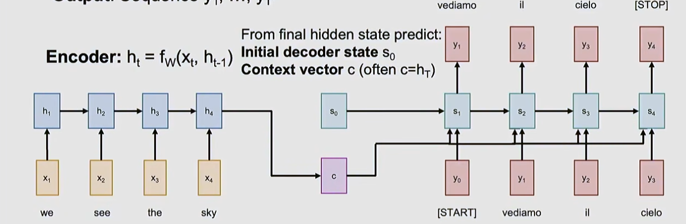

We see that the 4 input words generate 3 distinct output value.

### The problem of the fixed lenght of $C$

The only connection between the input sequence and the output sequence it **the fixed length of
the context vector $C$**
which might be not enough for very long sequences (a paragraph, a book) or overidimensioned for small sequences (small
sentences).

> The **solution** is to look back at the entire input sequence at every time step to generate the output

## Attention in RNN based sequence-to-sequence

Compared to the previous setup, we still have an encoder RNN and the second decoder RNN with the
hidden state $s_t$

> This time the decoder hidden state at time stamp $t$ will be the scalar result of the linear activation  
> of a combination of the encoder hidden state and the previous decoder hidden state called *
*alignment scores**

$$e_{t,i}=f_{att}\left(s_{t-1},h_i\right) \:(scalar)$$

where

* $t$ is the decoder time step
* $i$ is the encoder time step

Among all possible ways to have $f_{att}$ combine the vectors a linear transformation is ofter used

The alignent scores are arbitrary scalar, so we need to bound their values using the $softmax$ function in order
to obtain a probability distribution from them called **attention weight**.

$$a_{t,i}=softmax(e_{t,i})$$

$0 \lt a_{t,i} \lt 1$ and $\sum_{i}a_{t,i}=1$ for each time step

> the attention score is best understood as **how much attention the decoder should pay to the i-th input word
> when generating the t-th output word**.

We can now compute a new **context vector** as the weighted some of all attention
weights over the corresponding encoder
hidden state.

> The context vector becomes dependent on all the hidden states (past and future) of the encoder RNN

$$c_{t}=\sum_ia_{t,i}h_i$$

So, the **decoder RNN hidden state**  becomes

$$s_t=g_u(y_{t-1},s_{t-1},c_t)$$

> INTUITION: the context vector attends to relevant part of the input sequence to generate the current output
> through $a_{i,t}$

An example is the generation of $y_1=vediamo$ which might have the following attention weights

$a_{1,1}=a_{1,2}=0.45$ for ($x_1=$_we_ and $x_2=$_see_) and $a_{1,3}=a_{1,4}=0.05$ for ($x_3=$_the_ and $x_4=$_sky_)

This makes the first two imputs the most relevant to generate the first output, therefore the "attention" focuses on
those.

> INTUITION: all this mechansm is "differentiable" we don't need to pass the architecture any grammar of sentence
> construction rule,to produce translation.
> The network is trained as any normal other network with a training set using the cross entropy output loss . The
> attention addition
> created the capability of the network to include the "context" in the elaboration of each and every output in time.
> Furthermore, by looking at the attention weight we can observe what the network is looking at while producing the
> output

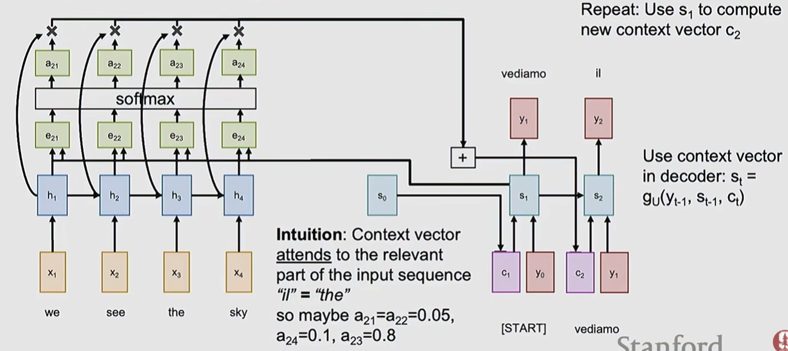

We see here the process of generating the context vector for the time step 2 $c_2$

all the alignment scores $e_{2,t}$, the probability $a_{2,t}$, combined with the decoder hidden states.

### Benefits of attention in encode-decoder architecture

> One context vector for each time step of the decoder generation time step

> At every time step, the context vector "looks" at different parts of the input sequence

> the input sequence is not bottlenecked by the fixed length context vector as seen before

### Visualization of attention weights

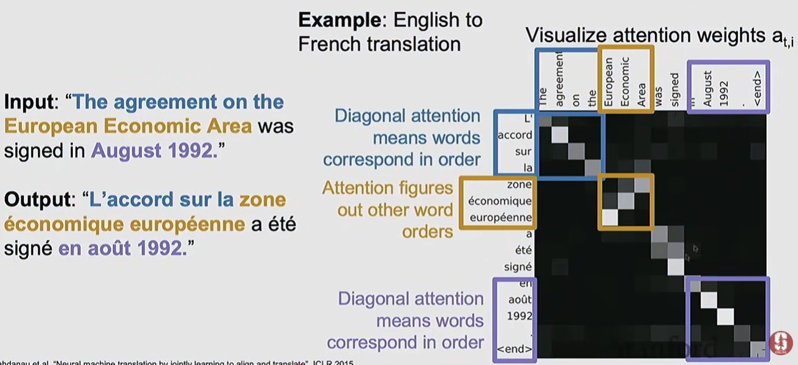

The weight matrix shows how the weights are distributed: the $t$ on the row shows how the $i$ column inputs have
contributed
to the output at the same $t$ time step.

## Extract attention as a separated operator

We try to pull out the structures of attention from the encoder-decoder architecture. Here are the elements
that we can isolate from the RNNs parts:

* **query vectors** a sequence of vectors to use to produce the output (the hidden
  states of the encoder RNN)
* **data vectors** the data we want to summerize query vectors. Is a sequence of
  vectors (the decoder RNN hidden state vectors)
* **output vectors** the output produced (the context vector in the encoder-decoder)

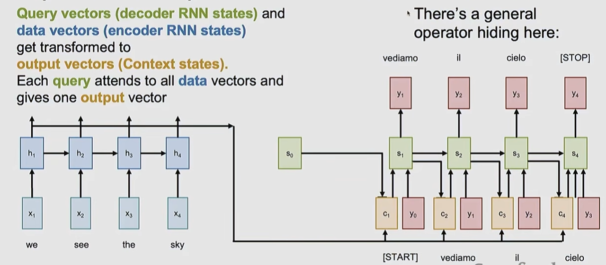

We can generalize it to extract the attention layer

We first get the **inputs**

* one **query vector** $ q \in \mathbb{R}[D_Q] $
* **data vectors** $X \in \mathbb{R}[N_X \times D_Q]$

We do the **computations**:

* **similarities**: we need to combine the query and the data vector and get the score. The easiest is the **dot product
  ** that we need to scale in order to avoid vanishing gradients when we calculate the softmax.
    * Remember the dot product of two
      vectors $a,b \in \mathbb{R}^{D}$ $a \cdot b = \vert a \vert\vert b\vert\cos(\hat{ab}) \Rightarrow \vert a \vert = \sqrt{\sum_ia_i^2}=a\sqrt{D}$
    * similarity  $e_i=q \cdot X_i \frac{1}{\sqrt{Q}} \in \mathbb{R}[N_X]$

* **attention weights**: $a=softmax(e) \in \mathbb{R}[N_X]$
* **output vector**: $y=\sum_ia_iX_i \in \mathbb{R}[D_X]$

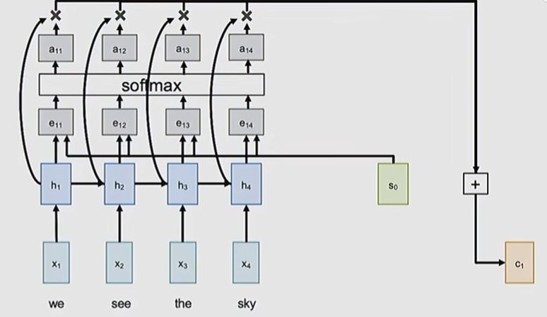

### Matrix formulation of attention layer

A next generalization is to process multiple query vectors at the same time by concatenating them into a
matrix, in order to parallelize the computation and improve efficiency.

We first get the **inputs**

* multiple **query vectors** $ Q \in \mathbb{R}[N_Q \times D_Q] $
    * every row is a vector of dimension $D_Q$)

* **data vectors** $X \in \mathbb{R}[N_X \times D_Q]$

We do the **computations**:

* **similarities**: $E=Q X^\mathsf{T} \frac{1}{\sqrt{D_Q}} \in \mathbb{R}[N_Q \times N_X]$
    * we compute similarities for all query vectors where every single vector is a dot product with all data vectors
    * $E_{ij}=Q_i X_j \frac{1}{\sqrt{D_Q}}$
    * this is very fast to implement matrix products

* **attention weights**: $A=softmax(E, dim=1) \in \mathbb{R}[N_Q \times N_X]$
    * we want to compute the probability distribution for each query vector independently
    * we do it for the dimension 1 (by row) resulting in the number of data vectors times the number of data vectors
    * each row is the distribution of probabilities of a data vector

* **output vectors**: $Y=AX \in \mathbb{R}[N_Q \times D_X]$
    * each row element is the weighted sum of the attention weights multiplied the data vectors
    * $y_i=\sum_jA_{i,j}X_j$ this is the i-th output vector that is the row of $Y$

## Cross-Attention

The data matrix $X$ is involved in two places:

* in the input for the calculation of similarities
* in the output as the apllication of the attention weight matrix

We can split these usages by letting the network train separately the way the data matrix is used.
We do this by **projecting (with linear transformations) the data vectors into two vectors ($K$ for keys and $V$ for
values)** using two differentiable dedicated
weight matrices (those matrices are inputs of the attention operator).

**INPUTS**

* **query vectors** $ Q \in \mathbb{R}[N_Q \times D_Q] $
* **data vectors** $X \in \mathbb{R}[N_X \times D_Q]$
* **key weight matrix** $W_K \in \mathbb{R}[D_X \times D_Q]$
* **value weight matrix** $W_V \in \mathbb{R}[D_X \times D_V]$

**COMPUTATION**

* **key matrix** $K=XW_K \in \mathbb{R}[N_X \times D_Q]$
* **value matrix** $V=XW_V \in \mathbb{R}[N_X \times D_V]$

* **similarities**: $E=Q K^\mathsf{T} \frac{1}{\sqrt{D_Q}} \in \mathbb{R}[N_Q \times N_X]$
    * we compute similarities for all query vectors where every single vector is a dot product with all data vectors
    * $E_{ij}=Q_i K_j \frac{1}{\sqrt{D_Q}}$
    * this is very fast to implement matrix products

* **attention weights**: $A=softmax(E, dim=1) \in \mathbb{R}[N_Q \times N_X]$
    * we want to compute the probability distribution for each query vector independently
    * we do it for the dimension 1 (by row) resulting in the number of data vectors times the number of data vectors
    * each row is the distribution of probabilities of a data vector

* **output vectors**: $Y=AV^\mathsf{T} \in \mathbb{R}[N_Q \times D_X]$
    * each row element is the weighted sum of the attention weights multiplied the data vectors
    * $y_i=\sum_jA_{i,j}V_j$ this is the i-th output vector that is the row of $Y$

In principle $D_Q \not= D_V$

> INTUITION: Learning $W_K$ and $W_V$ as separate matrices gives the model two independent degrees of freedom to shape
> these two very different tasks,
> which empirically gives much richer representational capacity than tying them together.
>
> Taking a book store as example, through this separation we can differentiate what of the data is most relevant to
> identify the KEYs to be used
> in the search (title, subject tags, keywords), which are optimized for searching.
> Only after matching, it can be decided what to retrieve (the value), which might be verbose, high-dimensional, or
> structured very differently from the key
> (the book content)

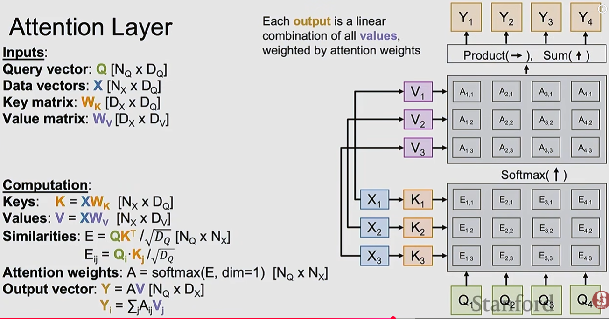

> The vector are organized by row, so each row in the query matrix produces attention weight distribution
> on the corresponding row (values sum up to 1) and the same row is the output in the $Y$ matrix

> We have achieved a reusable network component with its own inputs and output. This is called
> **Cross-Attention layer** because it is based on two inputs, data and query vectors
> (the layer is cross attending two different inputs

## Self-attention layer

> Here we have only one set of inputs, the data vectors **$X$**, therefore the query
> vector matrix **$Q$** via a linear transformation of the data vectors
> via **$W_Q$**

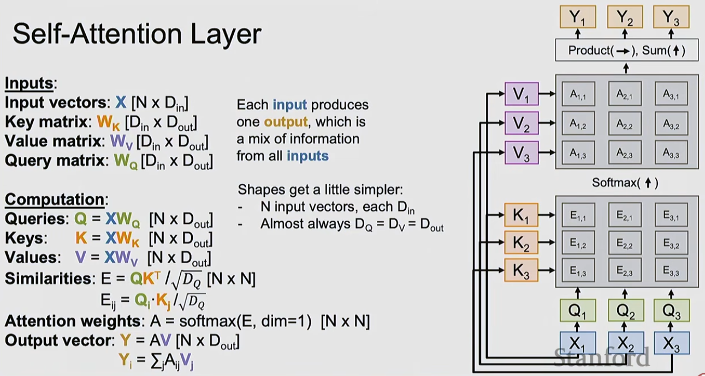

### More efficient version

There is a second version of the layer when the matrices are merged for computation efficiency

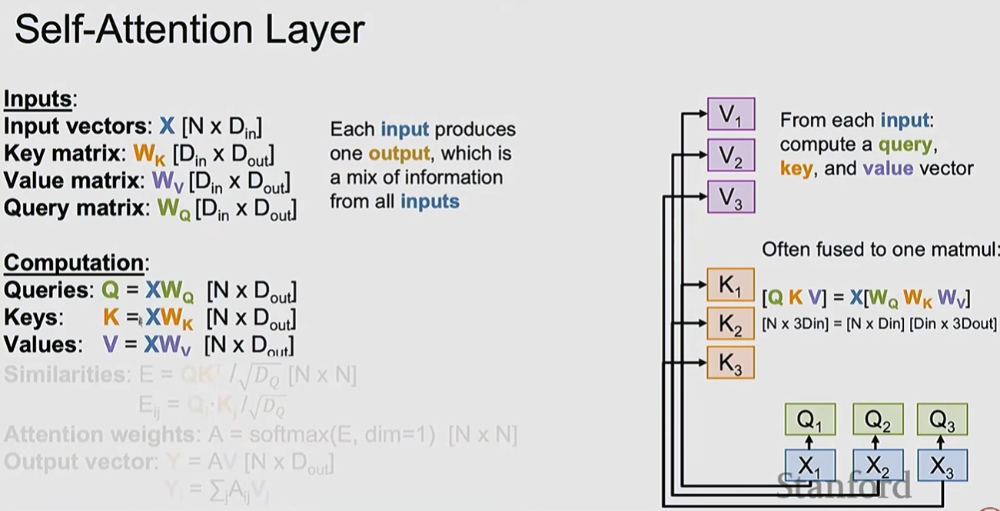

### Masked self attention

We might want that the attention mechanism is somehow limited to not involve all the data over time steps.

For instance, we might want attention to apply only on present and past time step inputs, meaning **"a no look ahead
approach"**

In this case we can add a **mask matrix**

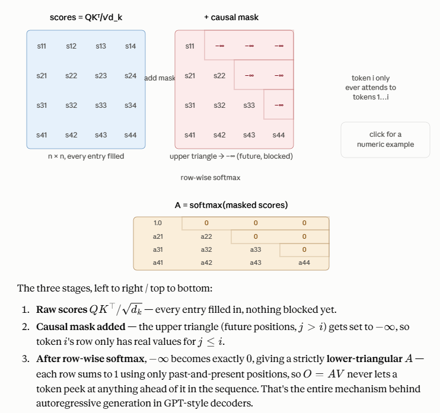

### Multiheaded self-attention layer

in order to make the attention layer more powerful and have more capacity we parallelize multiple self-attention layers

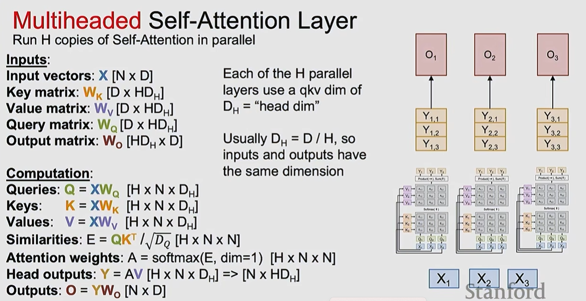

* the input is projected to all heads, single self-attention layers
* each "head" will produce its own output
* usually each head has different weight initialization in order to way differently
* the single output is stacked and fused with some linear transformation to produce the outer
  output **$O$**

> **This is the most used version of attention layers in real applications**

> This structure is also easy to implement because, it can be done by just 4 (big) matrix multiplication that is
> highly performant and scalable operation.

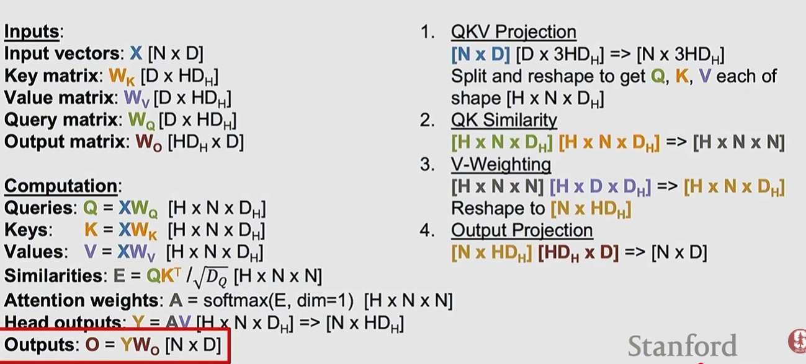

## Difference between sel-attention and cross-attention layers

Think of **self-attention** as a group of people having a discussion — everyone talks to everyone, and each person's
opinion gets updated based on the others in the same room.

Think of **cross-attention** as one person consulting a reference book while writing something — the book (the memory,
K/V) doesn't change or attend to anything; it just sits there as a fixed resource. The writer (the query) is the only
one doing the "looking," and can look up whatever's relevant regardless of how the book is organized internally.

## Ways of processing sequences

### RNN

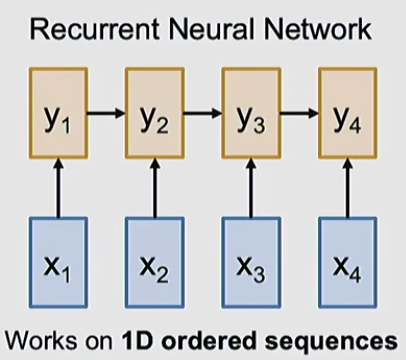

| Pros                                               | Cons                                                                              |
|----------------------------------------------------|-----------------------------------------------------------------------------------|
| performant: $O(n)$ for memory and computation  | the hiddent state dependent on previous hidden states makes it a serial algorithm |
| scales good on long sequences                      | not parallelizable                                                                |

### Convolution

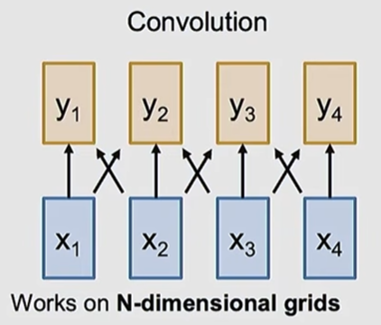

| Pros                      | Cons                                                                                                                                  |
|---------------------------|---------------------------------------------------------------------------------------------------------------------------------------|
| good at processing images | parallelizable: the same kernel can be applied in parallel on different area of the input image                                       |
|                           | does not scale well with the input size: bigger images require larger kernels and more computation or stack many convolutional layers |

### Self-attention

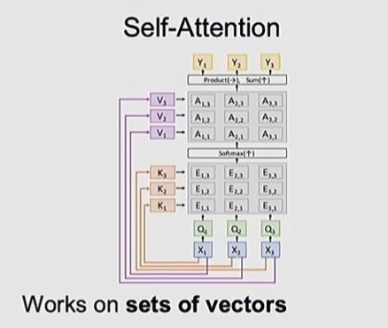

| Pros                                                                  | Cons                                                                              |
|-----------------------------------------------------------------------|-----------------------------------------------------------------------------------|
| works on sets of vectors                                              | computational heavy: $O(n^2)$ compute, $O(n^2)$ memory for sequence of length $n$ |
| easy to scale to long sequences                                       | the computational problem can be mitigated increasing the computation capacity    |
| parallelizable: only 4 matmuls                                        |                                                                                   |
| with parallel processing we can mitigate the computational complexity |                                                                                   |

> The drowback of the higher computational requirement can be seen as a benefit in the sense that the network
> performs more computation so that can produce more elaborated precise results

## Transformers

A transformer is build from concatenation of **transformer blocks**

### Transformer Blocks

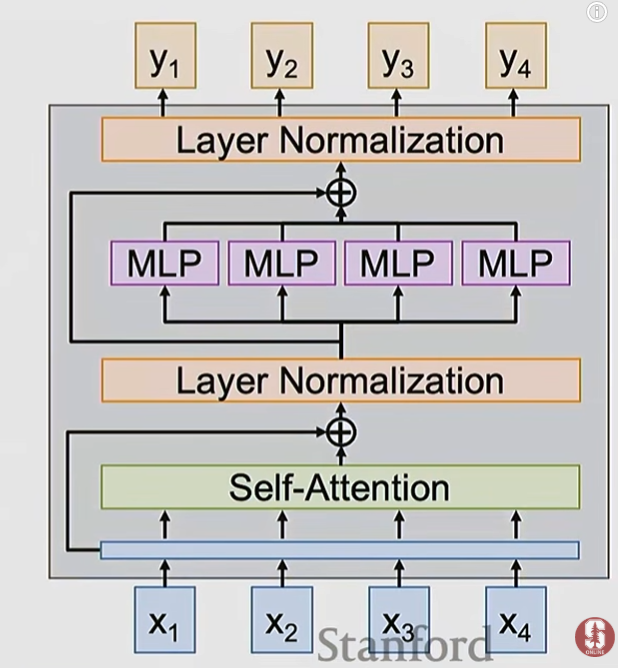

#### Input

The input is a **set of vectors $X$**

#### Self-attention layer

The input is transferred to a multihead self-attention layer that manipulates the input *
*identifying
relationships among the input vectors** themselves that are useful to produce the output

#### Residual connection

This is

$$Z=X+\text{selfAtt}(X)$$

Using the self attention output directly with no residual, every layer would be forced to rebuild all the information
from the previous layer using only weighted averages of $𝑉$.

Anything not well-represented in that particular attention pattern would simply be lost.

> The residual instead reframes attention's job as computing a correction term added to what's already in the output

#### Layer normalization

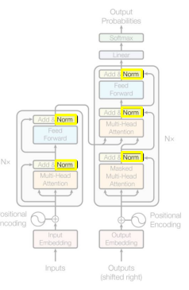

LayerNorm's job is to **stabilize the scale and distribution of activations flowing through each token**,
independently for every token, so that deep stacks of attention + FFN layers don't suffer from exploding/vanishing
activations or wildly different feature scales across dimensions.

The normalization is applied on both the attention and the feed forward network layer.

being $Z=X+\text{subLayer}(X)$ where $\text{subLayer}$ can be either the $\text{multiHeadAttention}$ or $\text{FFN}$

1) **Main across input vectors**

For the row $i$, being the $i-\text{th}$ input vector of dimension $D$ the mean is

$$\mu_i=\frac{1}{D}\sum_{k=1}^{D}z_{ik}$$

2) **Variance across input vectors**

$$\sigma_i=\frac{1}{D}\sum_{k=1}^{D}\left(z_{ik}-\mu_i\right)^2$$

3) **normalize (zero mean, unit variance), with ϵ a small constant for numerical stability**

$$\hat z_{ik}=\frac{z_{ik}-\mu_i}{\sqrt{\mu_i^2+\epsilon}}$$

4) **learnable affine transform (scale $\gamma \in \mathbb{R}^D$, shift $\beta \in \mathbb{R}^D$, both learned
   parameters, applied elementwise**

$$y_{i,k}=\gamma_k\hat z_{ik}+\beta_k$$

We distinguish to type of applications of NL

Nowadays the common usage of normalization is based on $RootMeanSquare=\sqrt{\frac{1}{N}\sum_i{x_i^2}}$

| As in the transform paper           | More used nowadays                                                                |
|-------------------------------------|-----------------------------------------------------------------------------------|
| 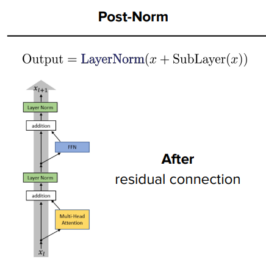 | 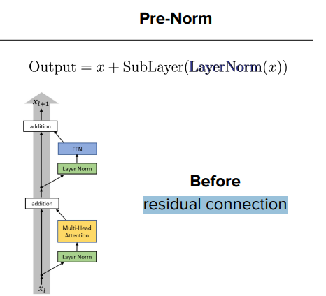                                                 |
| $\gamma_k\hat z_{ik}+\beta_k$       | $\gamma_k\frac{x_{ik}}{RMS(x_{ik})}$                                              |
|                                     | Same convergence as the other approach but one less learnable parameter ($\beta$) |

#### MLP layer

the **vectors are now processed independently** in a Multi level perceptor layer
which is the perfect combination of the interleaved processing performed by the self-attention layer.

> Usually is it a standard two-layer MLP $D \rightarrow 4D \rightarrow D$ running independently on each vector

**1:03:09**

#### Last residual connection and normalization

Residual connection and normalization are executed again before the output is returned.

### Transformer composition

A transformer is a sequence of transformer blocks

|                                         |                                                                   |
|-----------------------------------------|-------------------------------------------------------------------|
| 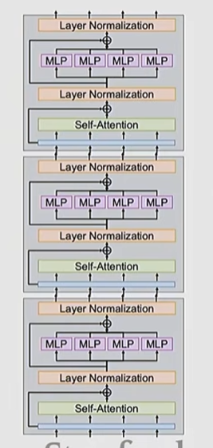 | 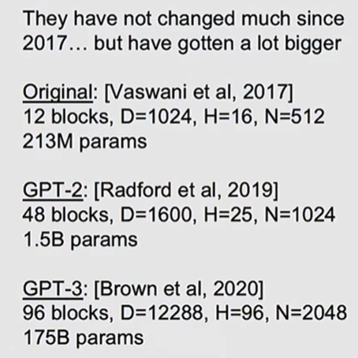 |

## Transformer application examples

### In LLM

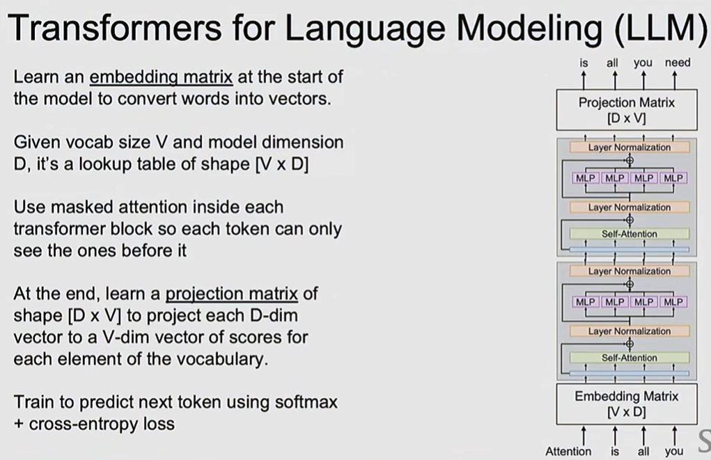

### In image processing

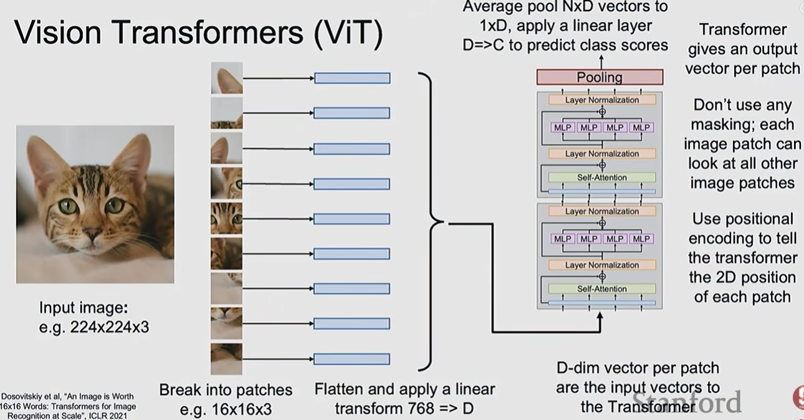

## Transformer parameter count (example in LLM application)

Notation:

* $d = d_{model}$ (vector dimension)

* $h$ = number of heads in multihead self-attention layer

* $d_k=d_v=d/h$ (Key and value dimensions)

* $d_{ff}$ = FFN hidden dim (typically $4d$)

* $L$ =number of blocks

* $V$ = vocabulary size

* $n_{max}$ = max sequence length (only relevant if positional embeddings are learned).

## Per-component parameter counts

| Component                             | Formula                              | With $d_{ff}=4d$              |
|---------------------------------------|--------------------------------------|-------------------------------|
| $W_Q, W_K, W_V$ (combined, all heads) | $3\,(d\cdot d + d)$                  | $3d^2+3d$                     |
| $W_O$ (output projection)             | $d\cdot d + d$                       | $d^2+d$                       |
| **Attention total**                   | $4d^2+4d$                            | $4d^2+4d$                     |
| $W_1, b_1$ (FFN layer 1)              | $d\cdot d_{ff}+d_{ff}$               | $4d^2+4d$                     |
| $W_2, b_2$ (FFN layer 2)              | $d_{ff}\cdot d+d$                    | $4d^2+d$                      |
| **FFN total** (MLP)                   | $2d\,d_{ff}+d_{ff}+d$                | $8d^2+5d$                     |
| LayerNorm ×2 ($\gamma,\beta$ each)    | $2(d+d)$                             | $4d$                          |
| **Per-block total**                   | $12d^2+13d$                          | $\approx 12d^2$ for large $d$ |
| $L$ stacked blocks                    | $L\,(12d^2+13d)$                     | —                             |
| Token embeddings (tied with output)   | $V\cdot d$                           | —                             |
| Positional embeddings (if learned)    | $n_{max}\cdot d$                     | —                             |
| **Full model total**                  | $L\,(12d^2+13d) + Vd\,(+\,n_{max}d)$ | —                             |

## Worked example: GPT-2 small

$d=768,\ L=12,\ V=50257,\ n_{max}=1024$

| Component                          | Calculation               | Parameters (≈) |
|------------------------------------|---------------------------|----------------|
| Per-block ($12d^2+13d$)            | $12\cdot768^2+13\cdot768$ | 7,087,872      |
| All 12 blocks                      | $12 \times 7{,}087{,}872$ | 85.1M          |
| Token embeddings ($Vd$)            | $50257\times768$          | 38.6M          |
| Positional embeddings ($n_{max}d$) | $1024\times768$           | 0.8M           |
| **Total**                          | sum of the above          | **≈124.5M**    |

Matches GPT-2 small's documented ~124M parameters, confirming the formula. The $12d^2$ per-block term dominates and
scales quadratically with $d_{model}$, while embeddings scale only linearly with $d$ (times $V$) — which is why
increasing $d_{model}$ grows the model far faster than adding more layers $L$.

