# Transformer based models

[Lecture 2 video](https://www.youtube.com/watch?v=yT84Y5zCnaA&list=PLoROMvodv4rOCXd21gf0CF4xr35yINeOy&index=2)

We have seen tranformers in

* [Lesson](../../../dive-into-deep-learning/docs/011-transformers_and_attention_mechanisms/index.md)
* [Transofmer section](/011-transformers_and_attention_mechanisms/#transformers)

## Encoder-decode architecture for NLP

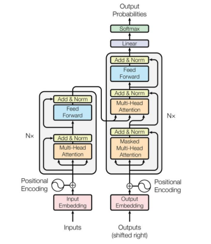

The left part is the encoder which receives the input, to the right we have the decoder part which produces
the output.

In case of language translation, the encoder processes the English input and the decoder produces the Franch
translation.

## Position embeddings

In the attention weights matrix we have seen how every Q token relates to the K values for all the other tokens in the
sequence

> How the attention mechanism relates a query token to the other tokens in the sequence to represent how that query is
> linked to other elements in the sequence in a weighted manner

The self-attention mechanism analyses the sequence all together to produce Key, Values and attention, but it loses
the relative position the single token had compared to the sequence.

For instance, the RNNs represent positioning very well with the BTT analysis.

### Approach 1: learned position embeddings

> We want to <span style="color:red">**add position-specific embedding to the token vector**</span> learned during
> training.


PROS:

* good performance

CONS:

* sensible to training set bias (if the trainig data contains always important tokens in the second position)
* the learned values are up to the maximum sequence length in the training data: if, at inference time, there is a
  sequence longer than the max in the training data it is a problem.

## Approach 2: calculate embeddings from a formula

> We find an arbitrary formula to calculate the embedding based on the position from a predicted formula.
> We create an additional position embedding vector which is added to the token embedding vector in a regular way

https://www.youtube.com/watch?v=IHu3QehUmrQ

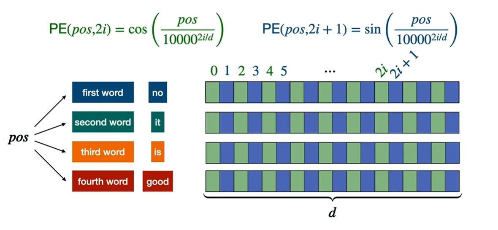

* Suppose we have an embedding vector size of $d$ (we need the same size as the input vector to make the addition)
* $pos$ is the position of the token in the sequence
* $i$ is the currently calculated dimension of the embedding vector
* the even positions are filled with $PE(pos, 2i)=cos\left(\frac{pos}{n^{2i/d}}\right)$
* the odd positions are filled with $PE(pos, 2i+1)=sin\left(\frac{pos}{n^{2i/d}}\right)$
* $n$ is a user-defined scalar, set to 10,000 by the authors of Attention Is All You Need.
* the divisor factor of $\frac{pos}{n^{2i/d}}$ makes the $PE$ functions to hav high frequency changes for lower values
  of $i$ and slower changes for higher $i$

### Frequency / wavelenght intuition

* When <span style="color:red">**$i=0$**</span> (the first dimension pair - consecutive values of $sin$ and $cosin$),
  the denominator is $1000^0=1$
  so we compute $sin(pos)$ and $cos(pos)$. <span style="color:red">**This oscillates rapidly:moving from position 0 to
  position 6 covers roughly one full cycle**</span>.

* When <span style="color:red">**$i=d/2-1$**</span> (the last dimension pair), the denominator is
  approximately $1000^1$, so we compute $sin(\frac{pos}{1000})$ and $cosin(\frac{pos}{1000})$. This
  oscillates <span style="color:red">**extremely slowly: you need 62,832 positions to complete one full cycle**</span>.

the wavelength and the frequency are

$\lambda = 2\pi \cdot 1000^{2i/d}$ so the frequency is $f=1/\lambda=\frac{1}{2\pi \cdot 1000^{2i/d}}$

The choice of 10000 as the base constant is also deliberate.

A smaller base would cluster the wavelengths too close together.

This provides redundant information in nearby dimensions.

A larger base would spread them out but might leave some scale ranges uncovered.

With 10000 and typical embedding dimensions of 256 or 512, the wavelengths range from about 6 positions up to 63,000
positions,
which comfortably covers sequences of any practical length at the time the paper was written.

The exponent $2i/d$ creates a <span style="color:red">**geometric progression of frequencies**</span>.
As $i$ increases from 0 to $d/2−1$, the exponent increases from 0 to approximately 1, and the denominator
grows from 1 to 10000.

> This exponential scaling ensures that each dimension pair captures position information at a different resolution.

The spacing between frequencies is not arbitrary: it is chosen so that the wavelengths span a wide enough range to cover
practical sequence lengths while keeping the total number of dimensions manageable.

### How token position embeddings are calculated

See how dimensions are represented as pairs of $sin$ (**solid line**) and $cosin$ (**dotten line**).

They represent the same <span style="color:red">**decomposition of sound in harmonics**</span> or
like <span style="color:red">**binary representation**</span>
(where least significant bits change with high frequency and rightmost with lower frequency)

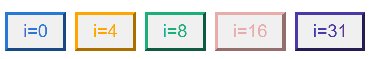

Here's the table using the same dimension pairs as the widget ($d_{model}=64$), with $\omega_i = 1/10000^{2i/64}$ and
angle $= pos \times \omega_i$:
Same data, reordered so position is the primary sort key (increasing), with all five dimension pairs grouped under each
position:

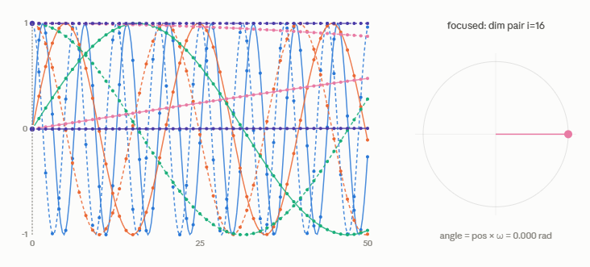

| position | i  | dims (sin, cos) | ω_i      | angle (rad) | sin(angle) | cos(angle) |
|----------|----|-----------------|----------|-------------|------------|------------|
| 0        | 0  | 0, 1            | 1.000000 | 0.000000    | 0.0000     | 1.0000     |
| 0        | 4  | 8, 9            | 0.316228 | 0.000000    | 0.0000     | 1.0000     |
| 0        | 8  | 16, 17          | 0.100000 | 0.000000    | 0.0000     | 1.0000     |
| 0        | 16 | 32, 33          | 0.010000 | 0.000000    | 0.0000     | 1.0000     |
| 0        | 31 | 62, 63          | 0.000133 | 0.000000    | 0.0000     | 1.0000     |


| position | i  | dims (sin, cos) | ω_i      | angle (rad) | sin(angle) | cos(angle) |
|----------|----|-----------------|----------|-------------|------------|------------|
| 1        | 0  | 0, 1            | 1.000000 | 1.000000    | 0.8415     | 0.5403     |
| 1        | 4  | 8, 9            | 0.316228 | 0.316228    | 0.3110     | 0.9504     |
| 1        | 8  | 16, 17          | 0.100000 | 0.100000    | 0.0998     | 0.9950     |
| 1        | 16 | 32, 33          | 0.010000 | 0.010000    | 0.0100     | 0.9999     |
| 1        | 31 | 62, 63          | 0.000133 | 0.000133    | 0.0001     | 1.0000     |

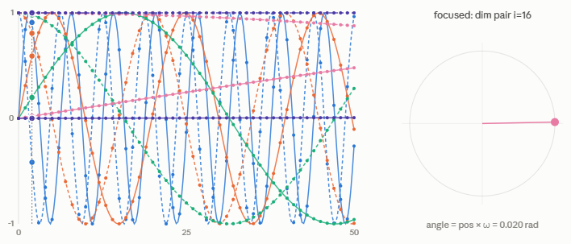

| position | i  | dims (sin, cos) | ω_i      | angle (rad) | sin(angle) | cos(angle) |
|----------|----|-----------------|----------|-------------|------------|------------|
| 2        | 0  | 0, 1            | 1.000000 | 2.000000    | 0.9093     | -0.4161    |
| 2        | 4  | 8, 9            | 0.316228 | 0.632456    | 0.5911     | 0.8066     |
| 2        | 8  | 16, 17          | 0.100000 | 0.200000    | 0.1987     | 0.9801     |
| 2        | 16 | 32, 33          | 0.010000 | 0.020000    | 0.0200     | 0.9998     |
| 2        | 31 | 62, 63          | 0.000133 | 0.000267    | 0.0003     | 1.0000     |

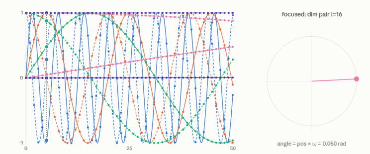

| position | i  | dims (sin, cos) | ω_i      | angle (rad) | sin(angle) | cos(angle) |
|----------|----|-----------------|----------|-------------|------------|------------|
| 5        | 0  | 0, 1            | 1.000000 | 5.000000    | -0.9589    | 0.2837     |
| 5        | 4  | 8, 9            | 0.316228 | 1.581139    | 1.0000     | -0.0103    |
| 5        | 8  | 16, 17          | 0.100000 | 0.500000    | 0.4794     | 0.8776     |
| 5        | 16 | 32, 33          | 0.010000 | 0.050000    | 0.0500     | 0.9988     |
| 5        | 31 | 62, 63          | 0.000133 | 0.000667    | 0.0007     | 1.0000     |

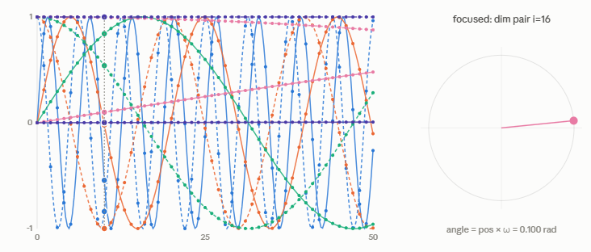

| position | i  | dims (sin, cos) | ω_i      | angle (rad) | sin(angle) | cos(angle) |
|----------|----|-----------------|----------|-------------|------------|------------|
| 10       | 0  | 0, 1            | 1.000000 | 10.000000   | -0.5440    | -0.8391    |
| 10       | 4  | 8, 9            | 0.316228 | 3.162278    | -0.0207    | -0.9998    |
| 10       | 8  | 16, 17          | 0.100000 | 1.000000    | 0.8415     | 0.5403     |
| 10       | 16 | 32, 33          | 0.010000 | 0.100000    | 0.0998     | 0.9950     |
| 10       | 31 | 62, 63          | 0.000133 | 0.001334    | 0.0013     | 1.0000     |

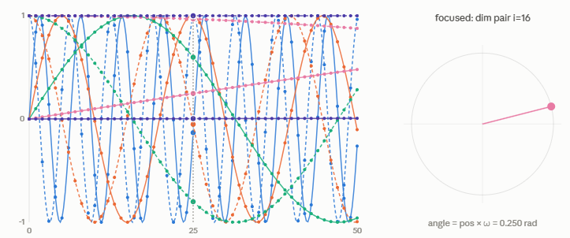

| position | i  | dims (sin, cos) | ω_i      | angle (rad) | sin(angle) | cos(angle) |
|----------|----|-----------------|----------|-------------|------------|------------|
| 25       | 0  | 0, 1            | 1.000000 | 25.000000   | -0.1324    | 0.9912     |
| 25       | 4  | 8, 9            | 0.316228 | 7.905694    | 0.9987     | -0.0517    |
| 25       | 8  | 16, 17          | 0.100000 | 2.500000    | 0.5985     | -0.8011    |
| 25       | 16 | 32, 33          | 0.010000 | 0.250000    | 0.2474     | 0.9689     |
| 25       | 31 | 62, 63          | 0.000133 | 0.003334    | 0.0033     | 1.0000     |

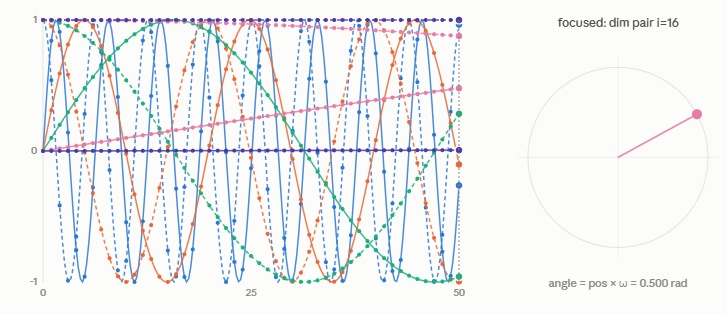

| position | i  | dims (sin, cos) | ω_i      | angle (rad) | sin(angle) | cos(angle) |
|----------|----|-----------------|----------|-------------|------------|------------|
| 50       | 0  | 0, 1            | 1.000000 | 50.000000   | -0.2624    | 0.9650     |
| 50       | 4  | 8, 9            | 0.316228 | 15.811388   | -0.1032    | -0.9947    |
| 50       | 8  | 16, 17          | 0.100000 | 5.000000    | -0.9589    | 0.2837     |
| 50       | 16 | 32, 33          | 0.010000 | 0.500000    | 0.4794     | 0.8776     |
| 50       | 31 | 62, 63          | 0.000133 | 0.006668    | 0.0067     | 1.0000     |

This grouping is closer to how you'd read a single token's actual PE vector: for a fixed position, scan down through `i`
and you can see the full spread — dims near `i=0` already look essentially random/uncorrelated between nearby positions,
while dims near `i=31` change so gradually that cos stays at 1.0000 out to 4 decimals across the entire range shown.

### Angle representation

From the image we can see that the $i-th$ <span style="color:red">**position pair**</span> can be expressed as the $sin$
and $cos$ of a certain angle in radiants.

$$PE(pos,\omega_i)=\begin{bmatrix}sin(pos\omega_i) & cos(pos\omega_i) \end{bmatrix}$$

### Intuition

> If, for each position of a token in the input sequence we add a vector with values from sin and cosin from many
> harmonics
> we will add every time different vectors (the values will repeat after 10000 positions) so that the neural network can
> learn the positioning info inside the input (each first token in every sequence will take the same position embedding
> vector)

### Similarity

> The position embedding generates high similarity for close positions

IF we calculate the embedding similarity for two position embeddings $PE_m$ amd $PE_n$ ($n=m+k$), with **cosin
similarity** we have

$$\text{sim}(PE_m,PE_m)=\frac{PE_m \cdot PE_n}{\Vert PE_m\Vert\Vert PE_n\Vert} \in [-1,1]$$

if we ignore the module at the denominator we have the dot product of the angle notation of the position embedding

At a single position $i$

$PE_m \cdot PE_{m+k}^\mathsf{T}=\begin{bmatrix}sin(m \omega_i) & cos(m \omega_i) \end{bmatrix}\cdot\begin{bmatrix}sin(m+k \omega_i) \\ cos(m+k \omega_i) \end{bmatrix}=$

$=sin(m \omega_i)sin(m+k \omega_i)+cos(m \omega_i)cos(m+k \omega_i)$

Recalling the trigonometric rule $cos(A-B)=sin(A)sin(B)+cosin(A)cosin(B)$

$PE_m \cdot PE_{m+k}^\mathsf{T}=cos((m+k)\omega_i-m\omega_i)=cos(k\omega_i)$

* for values of $K \rightarrow 0$ we have $PE_m \cdot PE_{m+k} \rightarrow 1$ <span style="color:red">**high similarity
  **</span>
* for opposite angles $K \rightarrow \pi$ we have $PE_m \cdot PE_{m+k} \rightarrow -1$ <span style="color:red">**min
  similarity**</span>

We can extend this to the full vector

> $$PE(pos)⋅PE(pos+k)=\sum_{i=0}^{dmodel/2−1}cos(k\omega_i)$$

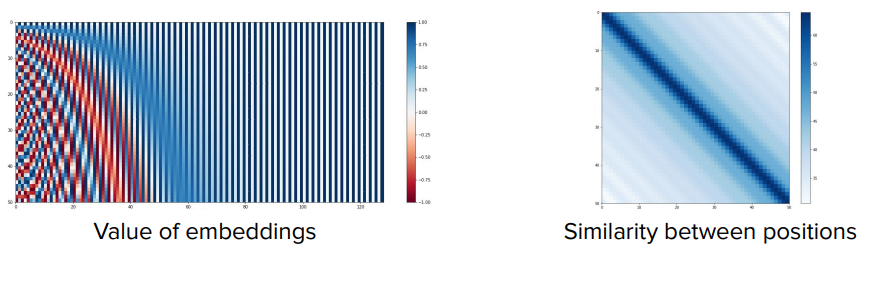

On the embedding picture we see the high frequency in low values of dimension and positions and how the corresponding
similarity
is higher on the diagonal.

### Advantage compared to learned embedding

> We can calculate the position embeddign for any sequence length

## Relative position embedding

* Position embedding represents positions over the whole sequence.
* Position embedding vectors are added to the $X$ vector, as input to the entire transformer

In transformer NLP we are more interested in the context.

| We are more interested in token relative positioning in the sequence in the self-attention computation in the attention layer | 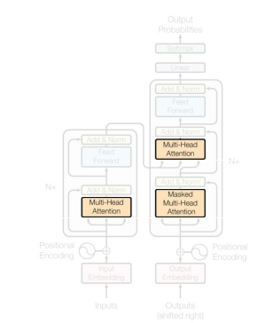                                                                       |
|-------------------------------------------------------------------------------------------------------------------------------|-------------------------------------------------------------------------|

We change the attention formula to represent that close token have larger similarity

### Self-attention layer formula bias

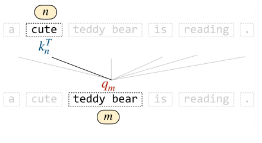

We add a bias term to the sel-atention layer output to represent relative positions

$$softmax\left(\frac{\langle q_m,k_n\rangle}{\sqrt{d_k}}+bias(m,n)\right)$$

We add a bias proportional to the relative distance between positions $m$ and $n$

There are two possible solutions:

* **T5 bias**: bucket values of bias learnable by the network for each self-attention head $bias(m,n)=\beta_{bucket(m,n)}$
* **ALiBi**. Bias is linear, deterministic, not bounded $bias(m,n)=\mu(n-m)$

## RoPE = Rotary Position Embeddings

We can also epress the relative positions in terms of a rotation of a vector to a certain angle. 

```text
y
   ^
   |
   |          V = (x, y)
   |         /|
   |        / |
   |       /  |
 r |      /   | y = r sin(φ)
   |     /    |
   |    /     |
   |   /      |
   |  / φ     |
   | /_)______|________________> x
   O          x = r cos(φ)

  Cartesian:  V = (x, y)
  Angular:    V = (r, φ)      r = sqrt(x² + y²)
                               φ = atan2(y, x)

  Conversion:  x = r·cos(φ)
               y = r·sin(φ)
```

so that a vector $V(x,y) \rightarrow V(r,\varphi)$ so that $V=\begin{pmatrix}   r\cdot cos(\varphi) &&   r\cdot sin(\varphi)   \end{pmatrix}$

> <span style="color:red">**Vector in angular coordinates**</span> $V(r,\varphi)=\begin{pmatrix}   r\cdot cos(\varphi) ,   r\cdot sin(\varphi)   \end{pmatrix}$

### Vector rotation

> <span style="color:red">**Rotation matrix**</span>: $R_\alpha=\begin{pmatrix}   cos(\alpha) & -sin(\alpha) \\   sin(\alpha) & cos(\alpha) \end{pmatrix}$

We apply the rotation $R_{m,\theta}$ (we apply of an angle dependent on the position) to $V$

$V\cdot R_{m,\theta}=\begin{pmatrix}   r\cdot cos(\varphi) &&   r\cdot sin(\varphi)   \end{pmatrix}\begin{pmatrix}   cos(m\theta) & -sin(m\theta) \\   sin(m\theta) & cos(m\theta) \end{pmatrix}=$

$=\begin{pmatrix}   r\cdot cos(\varphi)cos(m\theta)+r\cdot sin(\varphi)sin(m\theta) &&   -r\cdot cos(\varphi)sin(m\theta)+r\cdot sin(\varphi)cos(m\theta)   \end{pmatrix}$

If we remember the trigonometric properties

> <span style="color:red">**cosin of difference**</span> 
> $cos(A-B)=sin(A)sin(B)+cos(A)cos(B)$

> <span style="color:red">**sin of difference**</span> 
> $sin(A-B)=sin(A)cos(B)-cos(A)sin(B)$

then we have 

>$$V\cdot R_{m,\theta}=\begin{pmatrix}   r\cdot cos(\varphi-m\theta) &&   r\cdot sin(\varphi-m\theta)   \end{pmatrix}$$


### Intuition: benefit

The idea is to apply a rotation (applying the matrix above) to the query and key vectors. 

The advantage is that it is still a matrix operation that is computationally efficient

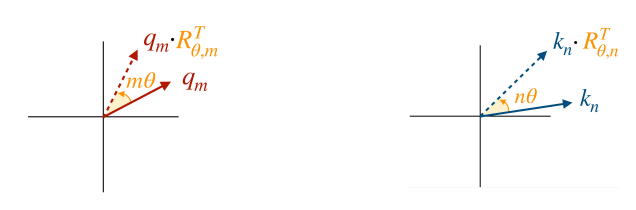

> we want to represent similarity in terms of rotations, so <span style="color:red">**$rotation \propto similarity $**</span> .

If we recall the self attention layer formula:

$\text{Attention}(Q,K,V)=\text{softmax}(\frac{QK^\mathsf{T}}{\sqrt{d_k}})V$

and we focus on the score part, dependent on the input query and key vectors:

$Q_mK_n^\mathsf{T}=$ and, as in the picture above we rotate the two vectors by $m\theta$ and
$n\theta$ respectively, we have

$Q'_m=Q_mR(m\theta)$ and $K'_n=K_nR(n\theta)$ and we recalculate the score

$$Q'_mK^{'{\mathsf{T}}}_n=Q_mR(m\theta)(K_nR(n\theta))^{\mathsf{T}}=Q_mR(m\theta)R(n\theta)^{\mathsf{T}}K_n^{\mathsf{T}}$$

Since we know that $R(\alpha)R(\beta)=R(\alpha+\beta)$ and $R(\alpha)^{\mathsf{T}}=R(-\alpha)$

we have [from gemini last question]


### RoPE multi-dimension

In case of multidimension for dimension $d$ vectors, the rotation is applied to blocks of 2, so $d/2$ blocks are processed

$\textbf{R}_{\theta,m}=
\begin{bmatrix}
\textbf{block}_1 & 0 & \cdots & 0 \\
0 & \textbf{block}_2 & \cdots & 0 \\
\vdots & \vdots & \ddots & \vdots \\
0 & 0 & \cdots & \textbf{block}_{d_k/2} \\
\end{bmatrix}$

where

$\textbf{block}_i=
\begin{pmatrix}
cos(m\theta_i) & -sin(m\theta_i) \\
sin(m\theta_i) & cos(m\theta_i) 
\end{pmatrix}$

The rotation matrix is applicable to the input vectors to add a bias to the self-attention layer 
as described in the article, attention is all you need.

