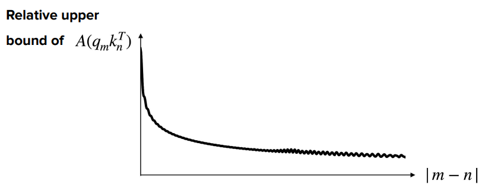
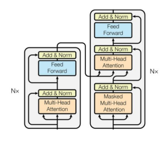
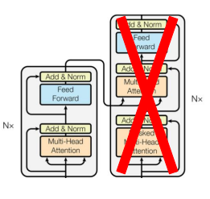
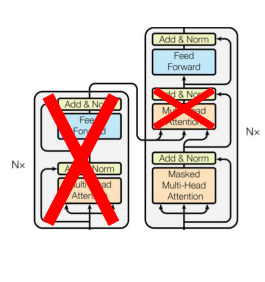

# Transformer based models

[Lecture 2 video](https://www.youtube.com/watch?v=yT84Y5zCnaA&list=PLoROMvodv4rOCXd21gf0CF4xr35yINeOy&index=2)

We have seen tranformers in

* [Lesson](../../../dive-into-deep-learning/docs/011-transformers_and_attention_mechanisms/index.md)
* [Transofmer section](/011-transformers_and_attention_mechanisms/#transformers)

## Encoder-decode architecture for NLP


The left part is the encoder which receives the input, to the right we have the decoder part which produces
the output.

In case of language translation, the encoder processes the English input and the decoder produces the Franch
translation.

## Position embeddings

In the attention weights matrix we have seen how every Q token relates to the K values for all the other tokens in the
sequence

> How the attention mechanism relates a query token to the other tokens in the sequence to represent how that query is
> linked to other elements in the sequence in a weighted manner

The self-attention mechanism analyses the sequence all together to produce Key, Values and attention, but it loses
the relative position the single token had compared to the sequence.

For instance, the RNNs represent positioning very well with the BTT analysis.

### Approach 1: learned position embeddings

> We want to <span style="color:red">**add position-specific embedding to the token vector**</span> learned during
> training.


PROS:

* good performance

CONS:

* sensible to training set bias (if the trainig data contains always important tokens in the second position)
* the learned values are up to the maximum sequence length in the training data: if, at inference time, there is a
  sequence longer than the max in the training data it is a problem.

## Approach 2: calculate embeddings from a formula

> We find an arbitrary formula to calculate the embedding based on the position from a predicted formula.
> We create an additional position embedding vector which is added to the token embedding vector in a regular way

https://www.youtube.com/watch?v=IHu3QehUmrQ


* Suppose we have an embedding vector size of $d$ (we need the same size as the input vector to make the addition)
* $pos$ is the position of the token in the sequence
* $i$ is the currently calculated dimension of the embedding vector
* the even positions are filled with $PE(pos, 2i)=cos\left(\frac{pos}{n^{2i/d}}\right)$
* the odd positions are filled with $PE(pos, 2i+1)=sin\left(\frac{pos}{n^{2i/d}}\right)$
* $n$ is a user-defined scalar, set to 10,000 by the authors of Attention Is All You Need.
* the divisor factor of $\frac{pos}{n^{2i/d}}$ makes the $PE$ functions to hav high frequency changes for lower values
  of $i$ and slower changes for higher $i$

### Frequency / wavelenght intuition

* When <span style="color:red">**$i=0$**</span> (the first dimension pair - consecutive values of $sin$ and $cosin$),
  the denominator is $1000^0=1$
  so we compute $sin(pos)$ and $cos(pos)$. <span style="color:red">**This oscillates rapidly:moving from position 0 to
  position 6 covers roughly one full cycle**</span>.

* When <span style="color:red">**$i=d/2-1$**</span> (the last dimension pair), the denominator is
  approximately $1000^1$, so we compute $sin(\frac{pos}{1000})$ and $cosin(\frac{pos}{1000})$. This
  oscillates <span style="color:red">**extremely slowly: you need 62,832 positions to complete one full cycle**</span>.

the wavelength and the frequency are

$\lambda = 2\pi \cdot 1000^{2i/d}$ so the frequency is $f=1/\lambda=\frac{1}{2\pi \cdot 1000^{2i/d}}$

The choice of 10000 as the base constant is also deliberate.

A smaller base would cluster the wavelengths too close together.

This provides redundant information in nearby dimensions.

A larger base would spread them out but might leave some scale ranges uncovered.

With 10000 and typical embedding dimensions of 256 or 512, the wavelengths range from about 6 positions up to 63,000
positions,
which comfortably covers sequences of any practical length at the time the paper was written.

The exponent $2i/d$ creates a <span style="color:red">**geometric progression of frequencies**</span>.
As $i$ increases from 0 to $d/2−1$, the exponent increases from 0 to approximately 1, and the denominator
grows from 1 to 10000.

> This exponential scaling ensures that each dimension pair captures position information at a different resolution.

The spacing between frequencies is not arbitrary: it is chosen so that the wavelengths span a wide enough range to cover
practical sequence lengths while keeping the total number of dimensions manageable.

### How token position embeddings are calculated

See how dimensions are represented as pairs of $sin$ (**solid line**) and $cosin$ (**dotten line**).

They represent the same <span style="color:red">**decomposition of sound in harmonics**</span> or
like <span style="color:red">**binary representation**</span>
(where least significant bits change with high frequency and rightmost with lower frequency)


Here's the table using the same dimension pairs as the widget ($d_{model}=64$), with $\omega_i = 1/10000^{2i/64}$ and
angle $= pos \times \omega_i$:
Same data, reordered so position is the primary sort key (increasing), with all five dimension pairs grouped under each
position:


| position | i  | dims (sin, cos) | ω_i      | angle (rad) | sin(angle) | cos(angle) |
|----------|----|-----------------|----------|-------------|------------|------------|
| 0        | 0  | 0, 1            | 1.000000 | 0.000000    | 0.0000     | 1.0000     |
| 0        | 4  | 8, 9            | 0.316228 | 0.000000    | 0.0000     | 1.0000     |
| 0        | 8  | 16, 17          | 0.100000 | 0.000000    | 0.0000     | 1.0000     |
| 0        | 16 | 32, 33          | 0.010000 | 0.000000    | 0.0000     | 1.0000     |
| 0        | 31 | 62, 63          | 0.000133 | 0.000000    | 0.0000     | 1.0000     |


| position | i  | dims (sin, cos) | ω_i      | angle (rad) | sin(angle) | cos(angle) |
|----------|----|-----------------|----------|-------------|------------|------------|
| 1        | 0  | 0, 1            | 1.000000 | 1.000000    | 0.8415     | 0.5403     |
| 1        | 4  | 8, 9            | 0.316228 | 0.316228    | 0.3110     | 0.9504     |
| 1        | 8  | 16, 17          | 0.100000 | 0.100000    | 0.0998     | 0.9950     |
| 1        | 16 | 32, 33          | 0.010000 | 0.010000    | 0.0100     | 0.9999     |
| 1        | 31 | 62, 63          | 0.000133 | 0.000133    | 0.0001     | 1.0000     |


| position | i  | dims (sin, cos) | ω_i      | angle (rad) | sin(angle) | cos(angle) |
|----------|----|-----------------|----------|-------------|------------|------------|
| 2        | 0  | 0, 1            | 1.000000 | 2.000000    | 0.9093     | -0.4161    |
| 2        | 4  | 8, 9            | 0.316228 | 0.632456    | 0.5911     | 0.8066     |
| 2        | 8  | 16, 17          | 0.100000 | 0.200000    | 0.1987     | 0.9801     |
| 2        | 16 | 32, 33          | 0.010000 | 0.020000    | 0.0200     | 0.9998     |
| 2        | 31 | 62, 63          | 0.000133 | 0.000267    | 0.0003     | 1.0000     |


| position | i  | dims (sin, cos) | ω_i      | angle (rad) | sin(angle) | cos(angle) |
|----------|----|-----------------|----------|-------------|------------|------------|
| 5        | 0  | 0, 1            | 1.000000 | 5.000000    | -0.9589    | 0.2837     |
| 5        | 4  | 8, 9            | 0.316228 | 1.581139    | 1.0000     | -0.0103    |
| 5        | 8  | 16, 17          | 0.100000 | 0.500000    | 0.4794     | 0.8776     |
| 5        | 16 | 32, 33          | 0.010000 | 0.050000    | 0.0500     | 0.9988     |
| 5        | 31 | 62, 63          | 0.000133 | 0.000667    | 0.0007     | 1.0000     |


| position | i  | dims (sin, cos) | ω_i      | angle (rad) | sin(angle) | cos(angle) |
|----------|----|-----------------|----------|-------------|------------|------------|
| 10       | 0  | 0, 1            | 1.000000 | 10.000000   | -0.5440    | -0.8391    |
| 10       | 4  | 8, 9            | 0.316228 | 3.162278    | -0.0207    | -0.9998    |
| 10       | 8  | 16, 17          | 0.100000 | 1.000000    | 0.8415     | 0.5403     |
| 10       | 16 | 32, 33          | 0.010000 | 0.100000    | 0.0998     | 0.9950     |
| 10       | 31 | 62, 63          | 0.000133 | 0.001334    | 0.0013     | 1.0000     |


| position | i  | dims (sin, cos) | ω_i      | angle (rad) | sin(angle) | cos(angle) |
|----------|----|-----------------|----------|-------------|------------|------------|
| 25       | 0  | 0, 1            | 1.000000 | 25.000000   | -0.1324    | 0.9912     |
| 25       | 4  | 8, 9            | 0.316228 | 7.905694    | 0.9987     | -0.0517    |
| 25       | 8  | 16, 17          | 0.100000 | 2.500000    | 0.5985     | -0.8011    |
| 25       | 16 | 32, 33          | 0.010000 | 0.250000    | 0.2474     | 0.9689     |
| 25       | 31 | 62, 63          | 0.000133 | 0.003334    | 0.0033     | 1.0000     |


| position | i  | dims (sin, cos) | ω_i      | angle (rad) | sin(angle) | cos(angle) |
|----------|----|-----------------|----------|-------------|------------|------------|
| 50       | 0  | 0, 1            | 1.000000 | 50.000000   | -0.2624    | 0.9650     |
| 50       | 4  | 8, 9            | 0.316228 | 15.811388   | -0.1032    | -0.9947    |
| 50       | 8  | 16, 17          | 0.100000 | 5.000000    | -0.9589    | 0.2837     |
| 50       | 16 | 32, 33          | 0.010000 | 0.500000    | 0.4794     | 0.8776     |
| 50       | 31 | 62, 63          | 0.000133 | 0.006668    | 0.0067     | 1.0000     |

This grouping is closer to how you'd read a single token's actual PE vector: for a fixed position, scan down through `i`
and you can see the full spread — dims near `i=0` already look essentially random/uncorrelated between nearby positions,
while dims near `i=31` change so gradually that cos stays at 1.0000 out to 4 decimals across the entire range shown.

### Angle representation

From the image we can see that the $i-th$ <span style="color:red">**position pair**</span> can be expressed as the $sin$
and $cos$ of a certain angle in radiants.

$$PE(pos,\omega_i)=\begin{bmatrix}sin(pos\omega_i) & cos(pos\omega_i) \end{bmatrix}$$

### Intuition

> If, for each position of a token in the input sequence we add a vector with values from sin and cosin from many
> harmonics
> we will add every time different vectors (the values will repeat after 10000 positions) so that the neural network can
> learn the positioning info inside the input (each first token in every sequence will take the same position embedding
> vector)

### Similarity

> The position embedding generates high similarity for close positions

IF we calculate the embedding similarity for two position embeddings $PE_m$ amd $PE_n$ ($n=m+k$), with **cosin
similarity** we have

$$\text{sim}(PE_m,PE_m)=\frac{PE_m \cdot PE_n}{\Vert PE_m\Vert\Vert PE_n\Vert} \in [-1,1]$$

if we ignore the module at the denominator we have the dot product of the angle notation of the position embedding

At a single position $i$

$PE_m \cdot PE_{m+k}^\mathsf{T}=\begin{bmatrix}sin(m \omega_i) & cos(m \omega_i) \end{bmatrix}\cdot\begin{bmatrix}sin(m+k \omega_i) \\ cos(m+k \omega_i) \end{bmatrix}=$

$=sin(m \omega_i)sin(m+k \omega_i)+cos(m \omega_i)cos(m+k \omega_i)$

Recalling the trigonometric rule $cos(A-B)=sin(A)sin(B)+cosin(A)cosin(B)$

$PE_m \cdot PE_{m+k}^\mathsf{T}=cos((m+k)\omega_i-m\omega_i)=cos(k\omega_i)$

* for values of $K \rightarrow 0$ we have $PE_m \cdot PE_{m+k} \rightarrow 1$ <span style="color:red">**high similarity
  **</span>
* for opposite angles $K \rightarrow \pi$ we have $PE_m \cdot PE_{m+k} \rightarrow -1$ <span style="color:red">**min
  similarity**</span>

We can extend this to the full vector

> $$PE(pos)⋅PE(pos+k)=\sum_{i=0}^{dmodel/2−1}cos(k\omega_i)$$


On the embedding picture we see the high frequency in low values of dimension and positions and how the corresponding
similarity
is higher on the diagonal.

### Advantage compared to learned embedding

> We can calculate the position embeddign for any sequence length

## Relative position embedding

* Position embedding represents positions over the whole sequence.
* Position embedding vectors are added to the $X$ vector, as input to the entire transformer

In transformer NLP we are more interested in the context.

| We are more interested in token relative positioning in the sequence in the self-attention computation in the attention layer |  |
|-------------------------------------------------------------------------------------------------------------------------------|-------------------------------------------------------------------------|

We change the attention formula to represent that close token have larger similarity

### Self-attention layer formula bias


We add a bias term to the sel-atention layer output to represent relative positions

$$softmax\left(\frac{\langle q_m,k_n\rangle}{\sqrt{d_k}}+bias(m,n)\right)$$

We add a bias proportional to the relative distance between positions $m$ and $n$

There are two possible solutions:

* **T5 bias**: bucket values of bias learnable by the network for each self-attention
  head $bias(m,n)=\beta_{bucket(m,n)}$
* **ALiBi**. Bias is linear, deterministic, not bounded $bias(m,n)=\mu(n-m)$

## RoPE = Rotary Position Embeddings

We can also epress the relative positions in terms of a rotation of a vector to a certain angle.

```text
y
   ^
   |
   |          V = (x, y)
   |         /|
   |        / |
   |       /  |
 r |      /   | y = r sin(φ)
   |     /    |
   |    /     |
   |   /      |
   |  / φ     |
   | /_)______|________________> x
   O          x = r cos(φ)

  Cartesian:  V = (x, y)
  Angular:    V = (r, φ)      r = sqrt(x² + y²)
                               φ = atan2(y, x)

  Conversion:  x = r·cos(φ)
               y = r·sin(φ)
```

so that a vector $V(x,y) \rightarrow V(r,\varphi)$ so
that $V=\begin{pmatrix} r\cdot cos(\varphi) && r\cdot sin(\varphi)   \end{pmatrix}$

> <span style="color:red">**Vector in angular coordinates
**</span> $V(r,\varphi)=\begin{pmatrix} r\cdot cos(\varphi) , r\cdot sin(\varphi)   \end{pmatrix}$

### Vector rotation

> <span style="color:red">**Rotation matrix
**</span>: $R_\alpha=\begin{pmatrix} cos(\alpha) & -sin(\alpha) \\ sin(\alpha) & cos(\alpha) \end{pmatrix}$

We apply the rotation $R_{m,\theta}$ (we apply of an angle dependent on the position) to $V$

$V\cdot R_{m,\theta}=\begin{pmatrix} r\cdot cos(\varphi) && r\cdot sin(\varphi)   \end{pmatrix}\begin{pmatrix} cos(m\theta) & -sin(m\theta) \\ sin(m\theta) & cos(m\theta) \end{pmatrix}=$

$=\begin{pmatrix} r\cdot cos(\varphi)cos(m\theta)+r\cdot sin(\varphi)sin(m\theta) && -r\cdot cos(\varphi)sin(m\theta)+r\cdot sin(\varphi)cos(m\theta)   \end{pmatrix}$

If we remember the trigonometric properties

> <span style="color:red">**cosin of difference**</span>
> $cos(A-B)=sin(A)sin(B)+cos(A)cos(B)$

> <span style="color:red">**sin of difference**</span>
> $sin(A-B)=sin(A)cos(B)-cos(A)sin(B)$

then we have

> $$V\cdot R_{m,\theta}=\begin{pmatrix} r\cdot cos(\varphi-m\theta) && r\cdot sin(\varphi-m\theta)   \end{pmatrix}$$

### Intuition: benefit

The idea is to apply a rotation (applying the matrix above) to the query and key vectors.

The advantage is that it is still a matrix operation that is computationally efficient


> we want to represent similarity in terms of rotations, so <span style="color:red">**$rotation \propto similarity $
**</span> .

If we recall the self attention layer formula:

$\text{Attention}(Q,K,V)=\text{softmax}(\frac{QK^\mathsf{T}}{\sqrt{d_k}})V$

and we focus on the score part, dependent on the input query and key vectors:

$Q_mK_n^\mathsf{T}=$ and, as in the picture above we rotate the two vectors by $m\theta$ and
$n\theta$ respectively, we have

$Q'_m=Q_mR(m\theta)$ and $K'_n=K_nR(n\theta)$ and we recalculate the score

$$Q'_mK^{'{\mathsf{T}}}_n=Q_mR(m\theta)(K_nR(n\theta))^{\mathsf{T}}=Q_mR(m\theta)R(n\theta)^{\mathsf{T}}K_n^{\mathsf{T}}$$

Since we know that $R(\alpha)R(\beta)=R(\alpha+\beta)$ and $R(\alpha)^{\mathsf{T}}=R(-\alpha)$

we have

> $Q'_mK^{'{\mathsf{T}}}_n=Q_mR(m-n)K_n^\mathsf{T}$

### RoPE multi-dimension

The mechanism is:

1. **Pairwise 2D Rotation**: A vector of dimension $d$ is broken down into $d/2$ independent 2D
   sub-vectors $(x_{2i}, x_{2i+1})$
2. **Angle Scaling**: For the $i$-th pair, a frequency $\theta_i = 10000^{-2i/d}$ defines the base rotation speed
3. **Position Multiplication**: At position $m$, the pair is rotated by angle $m\theta_i$

$$\mathbf{R}_{\Theta, m}^{(2i)} \begin{pmatrix} x_{2i} \\ x_{2i+1} \end{pmatrix} = \begin{pmatrix} \cos m\theta_i & -\sin m\theta_i \\ \sin m\theta_i & \cos m\theta_i \end{pmatrix} \begin{pmatrix} x_{2i} \\ x_{2i+1} \end{pmatrix}$$

The total vector rotation can be expressed as an efficient big matrix

$\textbf{R}_{\theta,m}=
\begin{bmatrix}
\mathbf{R}_{\Theta, m}^{(0)} & 0 & \cdots & 0 \\
0 & \mathbf{R}_{\Theta, m}^{(2)} & \cdots & 0 \\
\vdots & \vdots & \ddots & \vdots \\
0 & 0 & \cdots & \mathbf{R}_{\Theta, m}^{(d_k/2)} \\
\end{bmatrix}$

### Implementation with example

[Rope_example.md](Rope_example.md)

### Long-term decay of Rope

> Intuition: Rope decompose input vectors into
> * **High-Frequency Dimensions** (small $i$, large $\theta_i$): Rotate rapidly. They provide fine-grained positional
    resolution over short distances but decorrelate within a few tokens.
> * **Low-Frequency Dimensions** (large $i$, small $\theta_i$): Rotate slowly. They change minimally over short
    distances, preserving not fine-grained relative position signals over thousands of tokens.



When all dimensions are summed together in the dot product, the rapid decorrelation of high-frequency dimensions causes
the overall attention score to drop off sharply at first and then settle into a low-level baseline over long context
distances.

This matters because

1. **Locality Prior Without Hard Masks**: Language models naturally rely more heavily on immediate context. RoPE
   enforces this without requiring artificial attention masks or hand-crafted distance penalties (like ALiBi).
2. **Context Extension & Out-of-Distribution Stability**: When evaluating sequence lengths beyond the training window,
   extremely distant tokens do not produce wildly unpredictable or exploding attention logits. Because their high
   frequencies destructively interfere, they default to low-weight noise.

## Attention approximation

We have seen that the **self-attention matrix involves all the input sequence**, creating an $O(n^2)$ (memory)
and $O(n^2d)$ time problem over $n$ size of the input
sequence $QK^\mathsf{T}$.

> We don't necessarily need to explicitly calculate every pairwise interaction between every query and every key.

Given the fully connected attention matrix

```text
        Keys
       1 2 3 4 5 6 7
Q  1   ● ● ● ● ● ● ●
u  2   ● ● ● ● ● ● ●
e  3   ● ● ● ● ● ● ●
r  4   ● ● ● ● ● ● ●
y  5   ● ● ● ● ● ● ●
   6   ● ● ● ● ● ● ●
   7   ● ● ● ● ● ● ●
```

We mask the matrix in a way that each token attend only $k$ tokens with $k \ll n$ so that the calculation
becomes $O(nkd)$

https://chatgpt.com/c/6a844433-0660-83ed-81db-0e00420f7ca3

### Sparse attention: Longformer

> A token primarily attends to a local sliding window.

Suppose to have a window size of $w=2$, the attention matrix becomes

With zeros on the empty locations

```text
        Keys
       1 2 3 4 5 6 7
Q  1   ● ● ●
u  2   ● ● ● ●
e  3     ● ● ● ●
r  4       ● ● ● ●
y  5         ● ● ● ●
   6           ● ● ● ●
   7             ● ● ●
```

Each token then attends to $[i−w,…,i+w]$, $2w+1$ tokens, making the complexity $O(nw)$

The problem is that <u>we cannot correlate far distant tokens if they are logically related</u>.

> For this reason Longformer includes global attention for a selection of tokens given to the model (not trained)

```text
Tokens:

[CLS] The cat sat on the mat because it was tired.

Global mask given to the model:

  1     0   0   0   0  0   0   0   0   0
 [CLS] The cat sat on the mat because it was tired
```

Another option would be to assign global attention to a question in the input document

```text
[CLS] What is the capital of France? [SEP]
       ↑       ↑   ↑    ↑     ↑
       └──── global attention ────┘

The rest of the document...
```

Consider a document with a special `[CLS]` token. With ordinary BERT-style attention this token is given global
attention:

```text
             Keys
           CLS 1 2 3 4 5 6 7 8
          ┌─────────────────────
   CLS    │  ● ● ● ● ● ● ● ● ●        
Q    1    │  ● ● ● ●
u    2    │  ● ● ● ● ●
e    3    │  ●   ● ● ● ●
r    4    │  ●     ● ● ● ●
y    5    │  ●       ● ● ● ●
     6    │  ●         ● ● ● ●
     7    │  ●           ● ● ● ●
     8    │  ●             ● ● ●

```

The `[CLS]` representation can therefore aggregate information from the entire document.

> The global token $i-th$ represent attention in two ways through the transformer self attention layers
> * As query, the global toke $i$ can attend to all other tokens: $Q_i \rightarrow K_1,\dots,K_n$
> * As key/value all other tokens can attend to it via $Q_i \rightarrow K_i,V_i $

#### The role of global attention token

Without global attention tokens, the information can link tokens outside the window size through layers in the
transformer

Consier five tokens: `A  B  C  D  E` and the local attention window is 1, so that token can only attend their immediate
neighbors.

`A ←→ B ←→ C ←→ D ←→ E` at the end of the layer1

```text
Input tokens 
     │  A  B  C  D  E 
     ▼
┌─────────────────────────┐
│ Transformer Layer 1     │
│  Self-Attention         │  ← A ←→ B ←→ C ←→ D ←→ E
│  Feed Forward           │   A ← B ← C → D → E
|                         |       ↑
└─────────────────────────┘       └─ B now contains information from A
     │
     ▼
┌─────────────────────────┐
│ Transformer Layer 2     │
│  Self-Attention         │  ← A ← B ← C ← D → E
│  Feed Forward           │            ↑
│                         │            └─ C can now receive information originating from A
└─────────────────────────┘
     │
     ▼
┌─────────────────────────┐
│ Transformer Layer 3     │
│  Self-Attention         │  ← A ← B ← C ← D → E
│  Feed Forward           │            ↑
└─────────────────────────┘            └─ information has propagated further            
     │
     ▼
    ...
     │
     ▼
Output
```

Without global attention:

```text
A → B → C → D → E → F → G → H
```

Information may need several Transformer layers to travel from `A` to `H`.

But with global token `G`

```text
A ──→ G ←── H
      ↑
      │
     `G` can receive information from every token in a single layer.
```

Then other tokens can receive information from `G`.

> So global attention effectively creates shortcuts through the network.

Two distant tokens are not directly linked

```text
B ─────→ G
```

but they are indirectly linked through `CLS` wich becomes a <span style="color:red">**global information aggregator
**</span>

```text
step 1:

B ─────→ CLS ←───── G


step 2:

B ←───── CLS ─────→ G
```

## Sharing attention head

https://chatgpt.com/c/6a85675e-bdf4-83eb-8ed2-b51ea3e912da

Reduces the cost of attention, especially the memory/computation spent on the $$ (key) and $V$ (value) projections.

> Instead of every query head $Q$ having its own $K/V$ head, multiple query heads share the same K/V head.

### MHA (Multi Head Attention)

In a normal multi-head attention layer (for example with 8 heads) we have all separated $Q_i$, $K_i$ and $V_i$

```text
                 Input
                   │
        ┌──────────┼──────────────┐
        ↓          ↓              ↓
       Q₁K₁V₁    Q₂K₂V₂    ... Q₈K₈V₈
        │          │              │
        ↓          ↓              ↓
       Head₁      Head₂          Head₈
        │          │              │
        └──────────┼──────────────┘
                   ↓
               Concatenate
```

### MQA (Multi Query Attention) - Maximum sharing

> All query heads $Q_i$ share the same key value $K$,$V$

> The queries remain independent, so you still have 8 different attention patterns, but they all look at the same K/V
> representation.

```text
                    Input
                      │
          ┌───────────┴───────────┐
          ↓                       ↓
       Q₁ Q₂ ... Q₈             K, V
          │                       │
          │          shared       │
          ├───────────────────────┤
          ↓
       Attention
       for each Q head
          │
          ↓
       Outputs
```

### GQA (Grouped-Query Attention) — compromise

GQA sits between normal MHA and MQA.

> For example, with 8 query heads, we could have 2 K/V heads:

```text
Q₁ ──┐
Q₂ ──┤
Q₃ ──┤──→ K₁,V₁
Q₄ ──┘

Q₅ ──┐
Q₆ ──┤
Q₇ ──┤──→ K₂,V₂
Q₈ ──┘
```

Still an optimization compared with MQA,retaining more of the modeling capacity of ordinary multi-head attention than
MQA

## Transformer-based models

| E/D             | Type                                                                     | Model                           | Img                               |                      |
|-----------------|--------------------------------------------------------------------------|---------------------------------|-----------------------------------|----------------------|
| Encoder/Decoder | Text to text (traditional transformer)                                   | `T5`,`mT5`, `ByT5`              |    | Popular in 2018-2022 |
| Encoder-only    | Projection of embedding for class prediction (e.g. sentiment extraction) | `BERT`, `DistilBert`, `RoBERTa` |  | Popular in 2018-2022 |
| Decoder-only    | Text to text                                                             | `GPT` series                    |  | Popular now          |