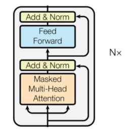
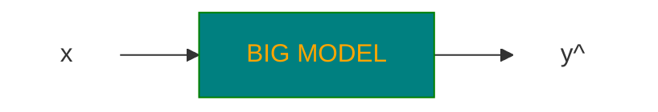
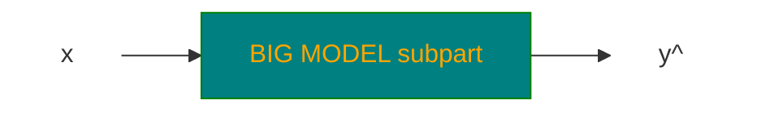
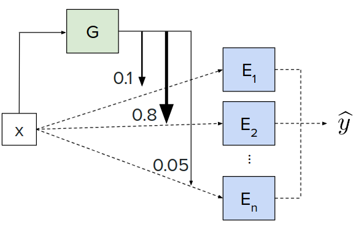
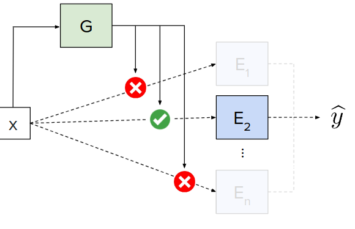
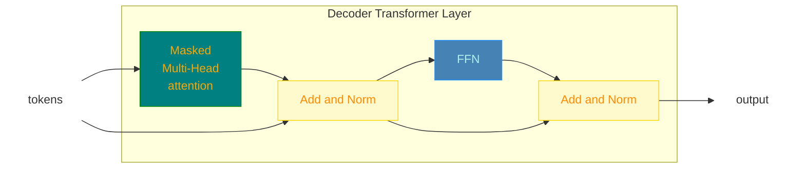
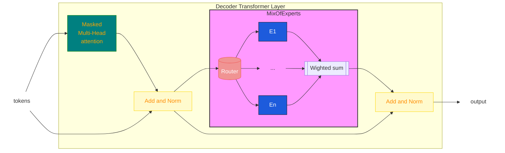

# LLMs

https://www.youtube.com/watch?v=Q5baLehv5So

Slides: https://cme295.stanford.edu/slides/fall25-cme295-lecture3.pdf


## Definition

 > <span style="color: red">**LLM - Large Language Model**</span>
 
> <span style="color: red">**Language Model**</span>: a statistical or machine learning model that assigns probabilities to
sequences of tokens.

> <span style="color: red">**Large**</span>: involves 100s of Bilions of parameter and large computation time for both inference and training

Most of LLMs are <span style="color: red">**decoder-only transformer based**</span>



Despite <u>**BERT which is a encoder-only transformer based model**</u>.



### Examples of LLMs

GPT, Gamma (Google), DeepSeek, LLama etc...

## MoE - Mixture of Experts

The <span style="color: red">**intuition**</span> is of involve only subparts of the model to generate a specific output to reduce the computation overhead 
need by the complete model



> The idea is to divide the model into subparts called <span style="color: red">**experts**</span> $E_i \rightarrow i \in [1,\dots,n]$

> Given the input $x$, the <span style="color: red">**gate or route $G_i(x)$**</span> selects how the corresponding expert contributes in the output generation, so that

$$\hat y=\sum_{i=1}^nG_i(x)E_i(x)$$

The word <span style="color:#FF0000">**expert**</span> represents the concept that each $E_i$ is logically specialized 
on processing a specific category of tokens:

```text
Expert 1 ── perhaps useful for code
Expert 2 ── perhaps useful for mathematics
Expert 3 ── perhaps useful for natural language
Expert 4 ── perhaps useful for factual knowledge
Expert 5 ── perhaps useful for multilingual patterns
...
```

But the <u>categories are not assigned to the model externally</u>, they emerge from the 
training phase, where <span style="color:#FF0000">**routes and experts are trained together**</span>

### Dense MoE

> All available experts are involved in the output generation with a contribution weighted by the applicable gate

$$G_i(x) \in \mathbf{R} [0,1]$$



### Sparse MoE

> Only a <span style="color: red">**top-k**</span> selection of gates is used for the output generation

$K\times G_i(x) \in \mathbf{I}[0,1]$



### Integration of MoE in decoder based LLMs

In a **decoder-only base LLM** such as **GPT**-style models, a **Mixture of Experts (MoE)** replaces the normal dense feed-forward network (**FFN**) in some or all Transformer layers.

> <u>**IDEA**</u>: For each token, the model dynamically chooses a small number of experts instead of running the token through one shared FFN.

Normal Encoder only transformer



Transformer with MoE



So, each token of the input 

`The cat sat on the mathematical matrix.`
this could be a possible number of experts involved for each token (<u>top-2 approach for a sparse MoE</u>)

```text
"The"          → Expert 2, Expert 5
"cat"          → Expert 1, Expert 4
"sat"          → Expert 1, Expert 3
"on"           → Expert 2, Expert 6
"the"          → Expert 2, Expert 5
"mathematical" → Expert 3, Expert 7
"matrix"       → Expert 3, Expert 7
```

### MoE increases parameters without increasing computation

Suppose a normal transformer has FFN of 10B parameters, the corresponding transformer with MoE layer
uses $n \times 10B$ parameters but only $K \times 10B$ parameters in case of top-k sparse MoE

### The load balancing problem

One of the <u>potential problems</u> with MoE networks is that

> Router collapses on some overused experts, despite others are use seldom.

```text
Expert 1   █
Expert 2   █
Expert 3   ███████████████████
Expert 4   █
Expert 5   █
Expert 6   █
...
```
* Expert 3 becomes overloaded.
* Other experts are barely trained.
* The computational advantage disappears.
* The model doesn't use its full capacity.

#### Remedy

MoE training normally includes a load-balancing mechanism encouraging tokens to be distributed among experts.

> During trainig the loss function is modified to point to a more uniform usage of experts

$$loss_{additional}=\alpha N \sum_i^Nf_iP_i$$

* $alpha$: hyperparameter
* $N$ number of experts of MoE
* $f_i$ fraction of tokens routed to expert $i$
* $P_i$ everage probability of token being routed to expert $i$

The picture shows what expert (for each color) is involved in the processing of 
the code snippet below (a more or less uniform distribution of colors)


https://chatgpt.com/c/6a89c687-98f0-83eb-b522-452367a67409
