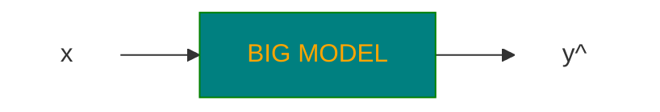
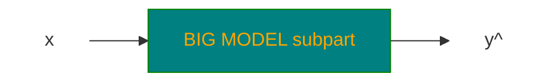
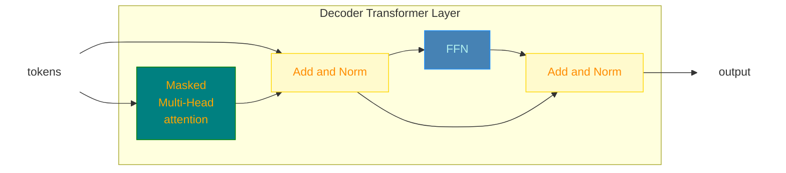

# LLMs

https://www.youtube.com/watch?v=Q5baLehv5So

Slides: https://cme295.stanford.edu/slides/fall25-cme295-lecture3.pdf

## Definition

 > **LLM - Large Language Model**
 
> **Language Model**: a statistical or machine learning model that assigns probabilities to
sequences of tokens.

> **Large**: involves 100s of Bilions of parameter and large computation time for both inference and training

Most of LLMs are **decoder-only transformer based**

Despite <u>**BERT which is a encoder-only transformer based model**</u>.

### Examples of LLMs

GPT, Gamma (Google), DeepSeek, LLama etc...

## MoE - Mixture of Experts

The **intuition** is of involve only subparts of the model to generate a specific output to reduce the computation overhead 
need by the complete model

> The idea is to divide the model into subparts called **experts** $E_i \rightarrow i \in [1,\dots,n]$

> Given the input $x$, the **gate or route $G_i(x)$** selects how the corresponding expert contributes in the output generation, so that

$$\hat y=\sum_{i=1}^nG_i(x)E_i(x)$$

### Dense MoE

> All available experts are involved in the output generation with a contribution weighted by the applicable gate

$$G_i(x) \in \mathbf{R} [0,1]$$

### Sparse MoE

> Only a **top-k** selection of gates is used for the output generation

$K\times G_i(x) \in \mathbf{I}[0,1]$

## Integration of MoE in decoder based LLMs

In a **decoder-only base LLM** such as **GPT**-style models, a **Mixture of Experts (MoE)** replaces the normal dense feed-forward network (**FFN**) in some or all Transformer layers with a collection of specialized FFNs called **experts**.

> <u>**IDEA**</u>: For each token, the model dynamically chooses a small number of experts instead of running the token through one shared FFN.

https://chatgpt.com/c/6a89c687-98f0-83eb-b522-452367a67409

