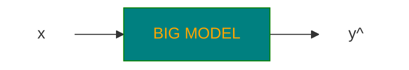
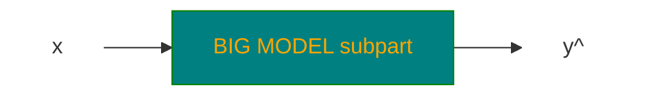
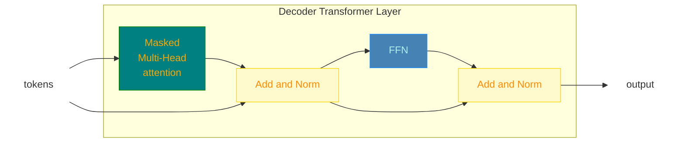
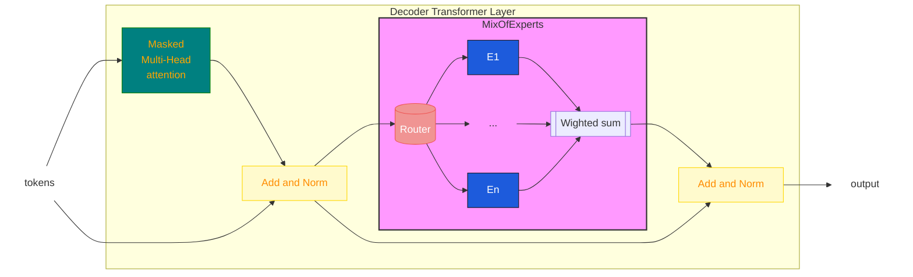
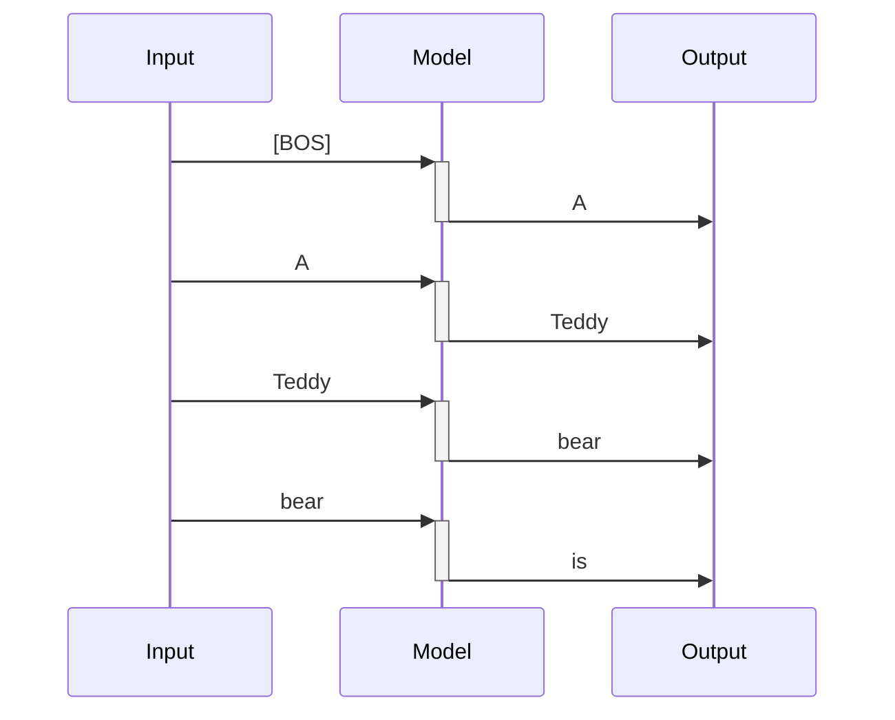
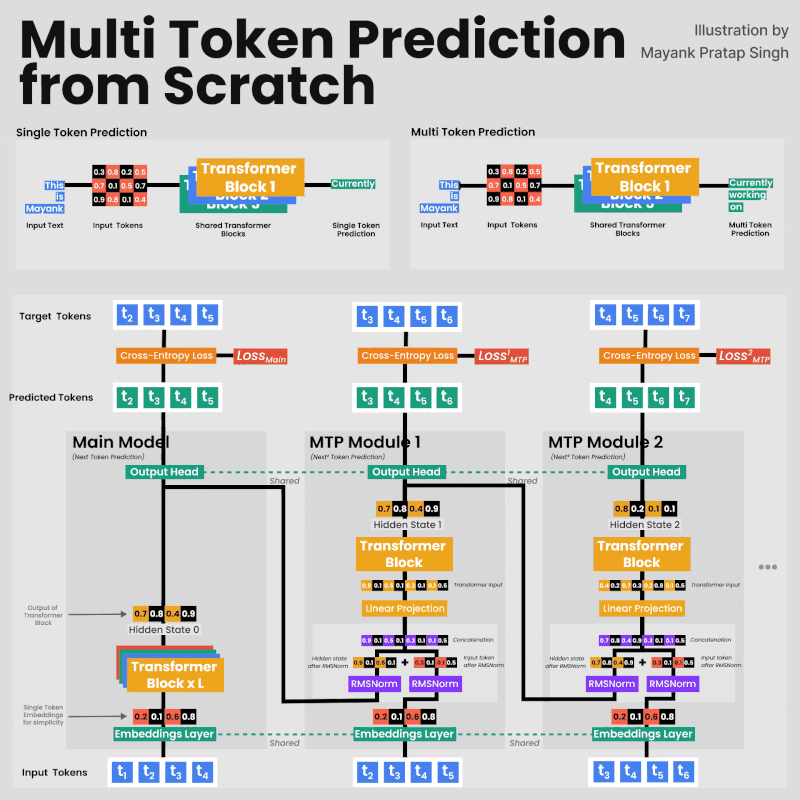
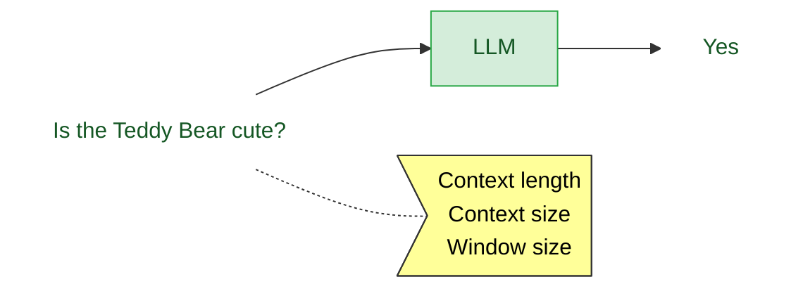

# LLMs

https://www.youtube.com/watch?v=Q5baLehv5So

Slides: https://cme295.stanford.edu/slides/fall25-cme295-lecture3.pdf

## Definition

> <span style="color: red">**LLM - Large Language Model**</span>

> <span style="color: red">**Language Model**</span>: a statistical or machine learning model that assigns probabilities
> to
> sequences of tokens.

> <span style="color: red">**Large**</span>: involves 100s of Bilions of parameter and large computation time for both
> inference and training

Most of LLMs are <span style="color: red">**decoder-only transformer based**</span>


Despite <u>**BERT which is a encoder-only transformer based model**</u>.



### Examples of LLMs

GPT, Gamma (Google), DeepSeek, LLama etc...

## MoE - Mixture of Experts

The <span style="color: red">**intuition**</span> is of involve only subparts of the model to generate a specific output
to reduce the computation overhead
need by the complete model



> The idea is to divide the model into subparts called <span style="color: red">**experts
**</span> $E_i \rightarrow i \in [1,\dots,n]$

> Given the input $x$, the <span style="color: red">**gate or route $G_i(x)$**</span> selects how the corresponding
> expert contributes in the output generation, so that

$$\hat y=\sum_{i=1}^nG_i(x)E_i(x)$$

The word <span style="color:#FF0000">**expert**</span> represents the concept that each $E_i$ is logically specialized
on processing a specific category of tokens:

```text
Expert 1 ── perhaps useful for code
Expert 2 ── perhaps useful for mathematics
Expert 3 ── perhaps useful for natural language
Expert 4 ── perhaps useful for factual knowledge
Expert 5 ── perhaps useful for multilingual patterns
...
```

But the <u>categories are not assigned to the model externally</u>, they emerge from the
training phase, where <span style="color:#FF0000">**routes and experts are trained together**</span>

### Dense MoE

> All available experts are involved in the output generation with a contribution weighted by the applicable gate

$$G_i(x) \in \mathbf{R} [0,1]$$


### Sparse MoE

> Only a <span style="color: red">**top-k**</span> selection of gates is used for the output generation

$K\times G_i(x) \in \mathbf{I}[0,1]$


### Integration of MoE in decoder based LLMs

In a **decoder-only base LLM** such as **GPT**-style models, a **Mixture of Experts (MoE)** replaces the normal dense
feed-forward network (**FFN**) in some or all Transformer layers.

> <u>**IDEA**</u>: For each token, the model dynamically chooses a small number of experts instead of running the token
> through one shared FFN.

Normal Encoder only transformer



Transformer with MoE



So, each token of the input

`The cat sat on the mathematical matrix.`
this could be a possible number of experts involved for each token (<u>top-2 approach for a sparse MoE</u>)

```text
"The"          → Expert 2, Expert 5
"cat"          → Expert 1, Expert 4
"sat"          → Expert 1, Expert 3
"on"           → Expert 2, Expert 6
"the"          → Expert 2, Expert 5
"mathematical" → Expert 3, Expert 7
"matrix"       → Expert 3, Expert 7
```

### MoE increases parameters without increasing computation

Suppose a normal transformer has FFN of 10B parameters, the corresponding transformer with MoE layer
uses $n \times 10B$ parameters but only $K \times 10B$ parameters in case of top-k sparse MoE

### The load balancing problem

One of the <u>potential problems</u> with MoE networks is that

> Router collapses on some overused experts, despite others are use seldom.

```text
Expert 1   █
Expert 2   █
Expert 3   ███████████████████
Expert 4   █
Expert 5   █
Expert 6   █
...
```

* Expert 3 becomes overloaded.
* Other experts are barely trained.
* The computational advantage disappears.
* The model doesn't use its full capacity.

#### Remedy

MoE training normally includes a load-balancing mechanism encouraging tokens to be distributed among experts.

> During trainig the loss function is modified to point to a more uniform usage of experts

$$loss_{additional}=\alpha N \sum_i^Nf_iP_i$$

* $alpha$: hyperparameter
* $N$ number of experts of MoE
* $f_i$ fraction of tokens routed to expert $i$
* $P_i$ average probability of token being routed to expert $i$

The picture shows what expert (for each color) is involved in the processing of
the code snippet below (a more or less uniform distribution of colors)


## Response generation

> A traditional LLM generates a prediction over the next token on the sequence of input in the form of token
> probabilities



The output at every time step is the distribution of probabilities for the next token


### Approach 1: choose the token with the highest probability

`kind`

* **pros**: deterministic approach for the best possible answer
* **drawback**: it always chooses the same output (if we ask ChatGPT or Gemini it always gives different answers)
* **drawback**: the real target of the LLM is to produce the highest quality output sequence
  therefore, <span style="color:red">**it is not guaranteed that each highest prob token produces an overall highest
  probability sequence**</span> <span style="color:red"><u>**not globally optimal**</u></span>

### Approach 2: beam search - keep K paths with higher probabilities

> keep the top $k$ candidate sequences and expand all of them at the next step.

Soppose to start with `The cat is`

The model predicts probabilities for the next token:

| Next token | Probability |
|------------|------------:|
| `sleeping` |        0.40 |
| `eating`   |        0.30 |
| `running`  |        0.15 |
| `playing`  |        0.10 |
| `big`      |        0.05 |

The greedy approach would have just selected `sleeping`, with the beam search and $k=2$ we keep

`The cat is sleeping` (0.4) and `The cat is eating` (0.3)

now prediction is done for both branches
`sleeping`

| Next token   | Conditional probability |
|--------------|------------------------:|
| `on`         |                    0.50 |
| `peacefully` |                    0.30 |
| `now`        |                    0.20 |

and `eating`

| Next token | Conditional probability |
|------------|------------------------:|
| `fish`     |                    0.60 |
| `quickly`  |                    0.25 |
| `the`      |                    0.15 |

Now we have $2×3=6$ candidate sequences.

| # | Predicted sequence               | $P$                 |
|---|----------------------------------|---------------------|
| 1 | `The cat is sleeping on`         | $P=0.40×0.50=0.20$  |
| 2 | `The cat is sleeping peacefully` | $P=0.40×0.30=0.12$  |
| 3 | `The cat is sleeping now`        | $P=0.40×0.20=0.08$  |
| 4 | `The cat is eating fish`         | $P=0.30×0.60=0.18$  |
| 5 | `The cat is eating quickly`      | $P=0.30×0.25=0.075$ |
| 6 | `The cat is eating the`          | $P=0.30×0.15=0.045$ |

So the first two are taken `The cat is sleeping on` (0.20) and `The cat is eating fish` (0.18).

<u>NOTE</u>: Even though, initially, `sleeping` had higher probability, the sequence `The cat is eating fish` became
more competitive ($\Delta_{eating}=0.1$ while $\Delta_{eating,fish}=0.02$)

Continuing the process for `The cat is sleeping on`

| Token | Probability |
|-------|------------:|
| `the` |        0.70 |
| `a`   |        0.20 |
| `my`  |        0.10 |

and `The cat is eating fish`

| Token | Probability |
|-------|------------:|
| `.`   |        0.80 |
| `and` |        0.10 |
| `at`  |        0.10 |

now the sequences

| # | Predicted sequence           | $P$                 |
|---|------------------------------|---------------------|
| 1 | `The cat is sleeping on the` | $P=0.20×0.70=0.14$  |
| 2 | `The cat is sleeping on a`   | $P=0.20×0.20=0.04$  |
| 3 | `The cat is sleeping on my`  | $P=0.20×0.10=0.02$  |
| 4 | `The cat is eating fish.`    | $P=0.18×0.80=0.144$ |
| 5 | `The cat is eating fish and` | $P=0.18×0.10=0.018$ |
| 6 | `The cat is eating fish at`  | $P=0.18×0.10=0.018$ |

Again, keep the top 2:

`The cat is eating fish .` — 0.144
`The cat is sleeping on the` — 0.140

Therefore:
`The cat is eating fish.` is actually slightly more probable as a complete sequence than the alternative.

#### Probabilities vs log probabilities

In order to multiply values <1 producing vanishing results, in real implementations the log is used:

$P(x1,x2,x3)=P(x1)P(x2)P(x3)$ becomes

$log{(P(x1,x2,x3))}=log(P(x1)P(x2)P(x3))=log(P(x1))+log(P(x2))+log(P(x3))$

`The cat is sleeping on` -> $log(0.40) + log(0.50)$

rather than: $0.40 × 0.50$

> <u>Limitation</u>: requires more computation, the output is very likely but less creative

### Approach 2: sample next token from probability distribution


$$\hat w_{t+1} \sim P(w_{t+1}=w | C)$$

The sample algorithm could also select tokens with very low probability, possible solutions are:

* <span style="color:red">**TOP-k**</span>: <u>Sample among top-k probability tokens</u>
  

* <span style="color:red">**TOP-p**</span>: Sample among the smallest set of token with cumulative probability
  where $\sum_iP(w_i) \ge p$


## Output probability computation

We have seen that transformers (encoder or decoder only) produce outputs as next-token predictions within the vocabulary

The process of GPT-like models is more or less:

```text
Input tokens
     │
     ▼
Embeddings (position, segment...)
     │
     ▼
Transformer layers
     │
     ▼
Final hidden state h [d_model] 
     │
     │  Linear projection / LM head
     ▼
Logits z [V] 
     │
     │  divide by temperature T
     ▼
Scaled logits [V]
     │
     │  Softmax
     ▼
Probabilities [V]
     │
     ▼
Select/sample next token
```

> The Transformer <u>doesn't directly output probabilities for the vocabulary</u>. It outputs a hidden representation,
> and the LM head projects that representation into vocabulary space.

in case we have

Suppose we have:

* vocabulary size $V = 50,000$
* model dimension $d_model = 4,096$
* sequence length $N = 100$

At the end of the transformer we have $H \in \mathbf{R}^{N,d_{model}}$ where <u>each row represents the contextual
representation of the same position of the input</u>

```text
H =
[token 1]   [ 4096 numbers ]
[token 2]   [ 4096 numbers ]
[token 3]   [ 4096 numbers ]
...
[token 100] [ 4096 numbers ]
```

The <span style="color:red">**linear projection**</span> changes the output to the vocabulary dimension for each
token $h \in \mathbf{R}^{d_{model}}$

we need a matrix of $W_{out} \in \mathbf{R}^{d_{model}, V}$ so that

$$z=hW_{out} \in \mathbf{R}^{V}$$

```text
z =
[
  z₀,       ← token 0
  z₁,       ← token 1
  z₂,       ← token 2
  ...
  z₄₉₉₉₉    ← token 49,999
]
```

those are <u>logits</u> we need to convert those to a probability distribution with softmax that is scaled by
the <span style="color:red">**temperature**</span>:

$$softmax_i=\frac{e^{z_i/T}}{\sum_je^{z_j/T}}$$

So the pipeline becomes

> $$h \rightarrow z=hW_{out} \rightarrow z=z/T \rightarrow softmax \rightarrow p$$

> The temperature factor does not change the distribution but re-shapes the prob distribution
> * <span style="color:red">**low T**</span>: amplify logit differences -> sharper distribution -> more deterministic
    output
> * <span style="color:red">**high T**</span>: reduce logit differences -> flatten distribution -> more random/diverse
    output

Example with $z=[3,1,0.5]$

| $T$                        | $z/T$            | $p$                | Result                                             |
|----------------------------|------------------|--------------------|----------------------------------------------------|
| 1 (same as no temperature) | $[3,1,0.5]$      | $[0.86,0.12,0.02]$ |                                                    |
| 0.5                        | $[6,2,1]$        | $[0.98,0.02,0.01]$ | sharper: strongest token became even more dominant |
| 2                          | $[1.5,0.5,0.25]$ | $[0.49,0.30,0.22]$ | flat: less likely tokens have gained probability   |


NOTE: $T=0$ would make the sampling of the probabilities deterministic

## Prompting strategies

### CoT - Chain of thought

In LLMs, chain-of-thought (CoT) refers to generating intermediate reasoning steps between the problem and the final answer.

Example:

Normal answer

```text
Question: If a train travels 60 km/h for 2.5 hours, how far does it travel?
Answer: 150 km.
```

With CoT style answer

```text
Speed = 60 km/h
Time = 2.5 h
Distance = speed × time = 60 × 2.5 = 150 km
Answer: 150 km
```

>The LLM is still fundamentally predicting tokens one after another. 
> Chain-of-thought <span style="color:red">**doesn't introduce a special reasoning algorithm into the Transformer**</span>.
 
In order to answer a question, CoT generates the next token of the logical steps to the solution, the generated token enters
the context again with the idea that it is closer to the solution and makes the reasoning more straightforward.

For instance, the answer to the question

```text
What is 17 × 24?
```

could be directly `408` or, with the CoT be like

```text
17 × 20 = 340
17 × 4 = 68
340 + 68 = 408
Therefore, the answer is 408.
```

The process would be then

```text
Question
   │
   ▼
Transformer
   │
   ├── "17"
   ▼
Transformer + "17"
   │
   ├── "×"
   ▼
Transformer + "17 ×"
   │
   ├── "20"
   ▼
...
   │
   ▼
"Therefore, the answer is 408."
```

> The key insight is that the intermediate tokens become additional computational workspace.

> CoT converts some of the reasoning problem into a sequence of token-generation steps.

This way we can see the logical step of the solution, that is not the way the transformer inference internally works (activations, sel attentions etc..)

> the **drawback** is more latency and tokens cost

### Self-consistency

This is applied over CoT: 

> * the model produces several CoT answers (reasoning paths) to the same questions in parallel
> * the final answer correctness is statistically evaluated

Question: `A shirt costs €80 and is discounted by 25%. What is the new price?`

```text
                 ┌── Reasoning path 1 ──→ €60
                 │
Question ────────┼── Reasoning path 2 ──→ €63
                 │
                 ├── Reasoning path 3 ──→ €60
                 │
                 ├── Reasoning path 4 ──→ €65
                 │
                 └── Reasoning path 5 ──→ €60
                 │
                 └── Reasoning path 6 ──→ €60
                              │
                              ▼
                       majority vote
                              │
                              ▼
                            €60
```

Here, even though reasoning paths might be the same, we are interested in the result, because the LLM produces 
tokens with a probability and this can lead to different paths and answers

> The problem of extracting the final answer from the output remains (regex, ask LLM to answer in the last token...), train other LLM to extract the answer

> Trade off between performance and costs

## Inference optimisations

* What redundancy, memory to improve efficiency
* what approximations trade-offs are acceptable to improve efficiency

## Optimization - $K,V$ caching

The transformer uses a <span style="color:red">**masked self-attention layer**</span>, that means that self-attention 
can only attend previous tokens in the sequence

```text
             The   cat   sat
The           ✓     ✗     ✗
cat           ✓     ✓     ✗
sat           ✓     ✓     ✓
```

since the attention is $Attention(Q,K,V)=softmax(\frac{QK^\mathsf{T}+M}{\sqrt{d_k}})V$ 

with $Q=XW_Q$, $K=XW_K$ and $V=XW_V$.

We want to compute the self-attention for the token next to the `The cat sat`

so we need $Q_{new}K^\mathsf{T}$

but the key matrix is just the postposition of 

$$K=
\begin{bmatrix}
K_{The}  \\
K_{cat}  \\
K_{sat}  \\
\end{bmatrix}
$$

> The crucial observation is that these three keys have already been computed.

> <u>Because of causal masking</u>, the new token cannot affect the representations of the old tokens,
> so we can cache all the key matrices for the computation of the new 

The same goes for the $V$ value matrix

## Sharing attention heads

As seen in  [transformer_components.md](../2-Tranformers%20based%20models/transformer_components.md#sharing-attention-head)

## Speculative decoding

> Instead of asking the large model to generate one token at a time, let a cheap model propose several tokens, then use one large-model pass to verify all of them.

With normal LLMs, if we ask `Waht is the capital of France`, we would get the answer 

```text
What is the capital of France?
                    ↓
              Large LLM
                    ↓
                   "The"
                    ↓
              Large LLM
                    ↓
                 "capital"
                    ↓
              Large LLM
                    ↓
                  "is"
                    ↓
              Large LLM
                    ↓
                 "Paris"
```

The generation is serial, only the training can be parallelized. Eeach token is a forward pass through the LLM transformer 

$x_1 \rightarrow x_2 \rightarrow \dots \rightarrow x_n$

Speculative encoding uses two LLMs

* <span style="color:red">**Draft LLM**</span>: small model used to generate the sequence of response tokens sequentially
* <span style="color:red">**Target LLM**</span>: large LLM to estimate probabilities of the generated sequence of tokens (It checks whether the proposed tokens are consistent with what it would generate.).

```text
                  Draft model
                       │
                       ▼
              proposes several tokens
                       │
                       ▼
          The capital of France is Paris
                       │
                       ▼
                 Large model
                  verifies them
```

The idea is to pass the entire answer to the target model, which, 
using the mask self attention layers, will attend to all previous tokens as hidden state, in the generation of the next one.

### Validation rule

There is a more precise acceptance rule that makes speculative decoding preserve the target model's distribution.

Let:

* $q(x)$ = draft model probability
* $p(x)$ = target model probability

$$P=min\left(1,\frac{p(x)}{q(x)}\right)$$

so if a token has $q(x_i)=0.5$ and $q(x_i)=0.8$

the $P(x_i)=min\left(1,\frac{0.8}{0.5}\right)=1$ we accept the token because the target model increased the probability
 
if we have $q(x_i)=0.5$ and $q(x_i)=0.25$

the $P(x_i)=min\left(1,\frac{0.25}{0.5}\right)=0.5$ so we accept the token with probability 0.5 or, otherwise, we take the token from the target LLM

### Example

* Current context: `The capital of France`
* Next <u>Draft LLM</u> generated tokens: `is`, `Paris`, `and`, `it`
* The <u>target LLM</u> receives: `The capital of France | is | Paris | and | it`
* The decoder-only target LLM produces a hidden state for every previous position (because of causal masking) 

```text
position                    target predicts

The                         P(next token | The)
capital                     P(next token | The capital)
of                          P(next token | The capital of)
France                      P(next token | The capital of France)
is                           P(next token | The capital of France is)
Paris                        P(next token | ... Paris)
and                          P(next token | ... and)
it                           P(next token | ... it)
```
So we can compare the probability of the tokens generated by the draft LLM

> The big advantage is that we do multiple passes for the token generation with a small (faster) LLM and the validation with <span style="color:red">**one pass only of the**</span> 
> <span style="color:red">**target LLM**</span>

### MTP - Multi Token Prediction

We have seen that with speculative prediction a draft LLM is used to predict multiple tokens sequencally and a target LLM
validates the prodictions in one inference pass.

> The idea behind MTP is to have the draft LLM embedded in the target LLM


The model has multiple prediction heads concatenating the output from the previous head to increase the number
of predicted tokens per pass.



The input of a LLM is measured in terms is <span style="color:#FF0000">**number of tokens**</span>



### [Context rot](https://www.trychroma.com/research/context-rot)

We now have LLM models (GPT) that can handle <u>up to tens of hundreds of input tokens in a single pass</u>.
The risk with such large numbers is what is called <span style="color:#FF0000">**context rot**</span>.

The test used in the article is called <span style="color:#FF0000">**needle in the haystack**</span>: the answer to the question in the input is buried 
in larger and larger context windows. 


Then the performance of the model to retrieve the answer is retrieved. 

> The conclusion is that the retrieval capability decreases with increasing context lengths.

This is due to the presence of <u>distractors</u> (noise) confusing the model in retrieving the answer.

### Structuring the input

There is a mental model to structure the input to the model to optimize efficiency and effectivness:


* <u>context</u>: we give the model all the knowledge needed to understand the problem
* <u>instructions</u>: clear explanation of what we want to achieve
* <u>input</u>: additional input to the problem
* <u>constraints</u>: how the output should be limited

## ICL In-Context Learning

> This is a way to steer the output of LLMs without training the model (tuning the weights with backpropagation)


In the <u>zero-shot</u> we only give the model the input query without any example. 
In <u>few-shot</u> we give some examples of input/output couples, including the input query but it 
requires effort, increase the latency of the model and its computation.

>In modern models, it's seen that wel structured input tends to produce even better reasoning results than the
few-shots approach, because it does not limit the possibilities of the model generation/reasoning

## Chain of thoughts

Models can be <span style="color:#FF0000">**fine-tuned on datasets containing problems and explanations**</span>, teaching them to produce structured reasoning.

> So, for input query requiring more reasoning, the model can decompose the query into small problesm and produce the logical step to reach the answer

Each logical step is <u>given as additional context to the transformer</u> to contribute to the response generation

The model generates one token at the time and the additional token is given to the transformer as input

Example
```text
What is 17 × 24?
```

With CoT the model could produce

```text
17 × 20 = 340
17 × 4 = 68
340 + 68 = 408
Therefore, the answer is 408.
```

The generation process is then

```text
Question
   │
   ▼
Transformer
   │
   ├── "17"
   ▼
Transformer + "17"
   │
   ├── "×"
   ▼
Transformer + "17 ×"
   │
   ├── "20"
   ▼
...
   │
   ▼
"Therefore, the answer is 408."
```

> CoT converts some of the reasoning problem into a sequence of token-generation steps.

> More token consumption, more latency. 