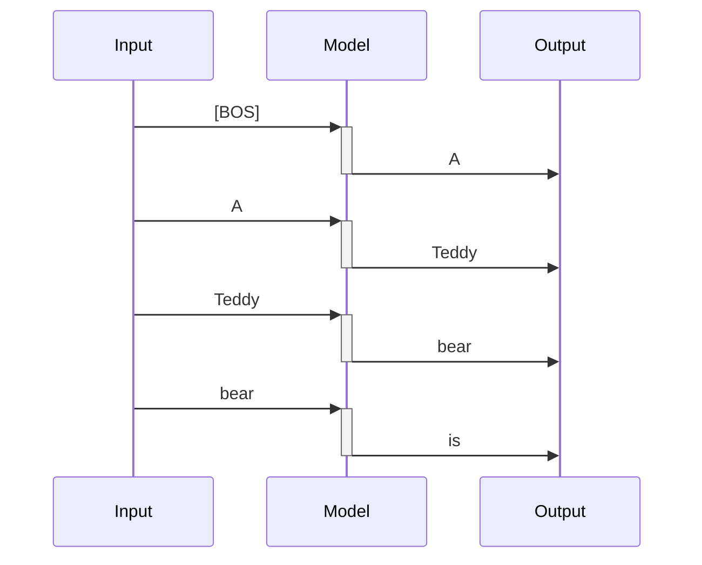
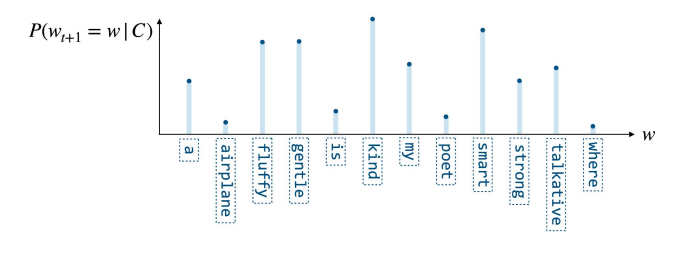
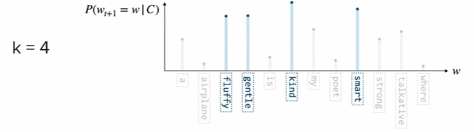
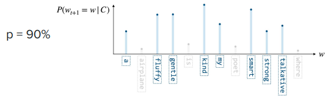

# LLMs

https://www.youtube.com/watch?v=Q5baLehv5So

Slides: https://cme295.stanford.edu/slides/fall25-cme295-lecture3.pdf

## Definition

> <span style="color: red">**LLM - Large Language Model**</span>

> <span style="color: red">**Language Model**</span>: a statistical or machine learning model that assigns probabilities
> to
> sequences of tokens.

> <span style="color: red">**Large**</span>: involves 100s of Bilions of parameter and large computation time for both
> inference and training

Most of LLMs are <span style="color: red">**decoder-only transformer based**</span>


Despite <u>**BERT which is a encoder-only transformer based model**</u>.

```mermaid
flowchart LR
    classDef input fill: none, stroke: none;
    classDef danger fill: #008080, stroke: #008000, color: #FFA500;
    Node1[x]:::input --> Node2[BIG MODEL]:::danger
    Node2 --> Node3[y^]:::input
```

### Examples of LLMs

GPT, Gamma (Google), DeepSeek, LLama etc...

## MoE - Mixture of Experts

The <span style="color: red">**intuition**</span> is of involve only subparts of the model to generate a specific output
to reduce the computation overhead
need by the complete model

```mermaid
flowchart LR
    classDef input fill: none, stroke: none;
    classDef danger fill: #008080, stroke: #008000, color: #FFA500;
    Node1[x]:::input --> Node2[BIG MODEL subpart]:::danger
    Node2 --> Node3[y^]:::input
```

> The idea is to divide the model into subparts called <span style="color: red">**experts
**</span> $E_i \rightarrow i \in [1,\dots,n]$

> Given the input $x$, the <span style="color: red">**gate or route $G_i(x)$**</span> selects how the corresponding
> expert contributes in the output generation, so that

$$\hat y=\sum_{i=1}^nG_i(x)E_i(x)$$

The word <span style="color:#FF0000">**expert**</span> represents the concept that each $E_i$ is logically specialized
on processing a specific category of tokens:

```text
Expert 1 ── perhaps useful for code
Expert 2 ── perhaps useful for mathematics
Expert 3 ── perhaps useful for natural language
Expert 4 ── perhaps useful for factual knowledge
Expert 5 ── perhaps useful for multilingual patterns
...
```

But the <u>categories are not assigned to the model externally</u>, they emerge from the
training phase, where <span style="color:#FF0000">**routes and experts are trained together**</span>

### Dense MoE

> All available experts are involved in the output generation with a contribution weighted by the applicable gate

$$G_i(x) \in \mathbf{R} [0,1]$$


### Sparse MoE

> Only a <span style="color: red">**top-k**</span> selection of gates is used for the output generation

$K\times G_i(x) \in \mathbf{I}[0,1]$


### Integration of MoE in decoder based LLMs

In a **decoder-only base LLM** such as **GPT**-style models, a **Mixture of Experts (MoE)** replaces the normal dense
feed-forward network (**FFN**) in some or all Transformer layers.

> <u>**IDEA**</u>: For each token, the model dynamically chooses a small number of experts instead of running the token
> through one shared FFN.

Normal Encoder only transformer

```mermaid
flowchart LR
    classDef noDecoration fill: none, stroke: none;
    classDef attention fill: #008080, stroke: #008000, color: #FFA500;
    classDef an fill: #FFFACD, stroke: #FFD700, color: #FF8C00;
    classDef ffn fill: #4682B4, stroke: #1E90FF, color: #AFEEEE;
    token[tokens]:::noDecoration --> MMHA

subgraph Trans1 [Decoder Transformer Layer]
direction LR
MMHA[Masked 
        Multi-Head
attention]:::attention--> AN1[Add and Norm]:::an

AN1 --> FFN[FFN]:::ffn
FFN --> AN2[Add and Norm]:::an
AN1 --> AN2

end
token[tokens]:::noDecoration --> AN1
AN2 --> output[output]:::noDecoration

```

Transformer with MoE

```mermaid
flowchart LR
    classDef noDecoration fill: none, stroke: none;
    classDef attention fill: #008080, stroke: #008000, color: #FFA500;
    classDef an fill: #FFFACD, stroke: #FFD700, color: #FF8C00;
    classDef router fill: #f09493, stroke: #ef5554, color: #fefefe;
    classDef expert fill: #1d5bdc, stroke: #171721, color: #fefefe;
    token[tokens]:::noDecoration --> MMHA

subgraph Trans1 [Decoder Transformer Layer]
direction LR
MMHA[Masked 
        Multi-Head
attention]:::attention--> AN1[Add and Norm]:::an
AN1 --> RTR
subgraph MOE [MixOfExperts]
style MOE fill: #f9f,stroke: #333, stroke-width: 2px
direction LR
RTR[(Router)]:::router
RTR --> E1:::expert
RTR --> E[...]:::noDecoration
RTR --> En:::expert
E1 --> WS[[Wighted sum]]
E --> WS
En --> WS
end
WS --> AN2[Add and Norm]:::an
AN1 --> AN2
end


token[tokens]:::noDecoration --> AN1
AN2 --> output[output]:::noDecoration

```

So, each token of the input

`The cat sat on the mathematical matrix.`
this could be a possible number of experts involved for each token (<u>top-2 approach for a sparse MoE</u>)

```text
"The"          → Expert 2, Expert 5
"cat"          → Expert 1, Expert 4
"sat"          → Expert 1, Expert 3
"on"           → Expert 2, Expert 6
"the"          → Expert 2, Expert 5
"mathematical" → Expert 3, Expert 7
"matrix"       → Expert 3, Expert 7
```

### MoE increases parameters without increasing computation

Suppose a normal transformer has FFN of 10B parameters, the corresponding transformer with MoE layer
uses $n \times 10B$ parameters but only $K \times 10B$ parameters in case of top-k sparse MoE

### The load balancing problem

One of the <u>potential problems</u> with MoE networks is that

> Router collapses on some overused experts, despite others are use seldom.

```text
Expert 1   █
Expert 2   █
Expert 3   ███████████████████
Expert 4   █
Expert 5   █
Expert 6   █
...
```

* Expert 3 becomes overloaded.
* Other experts are barely trained.
* The computational advantage disappears.
* The model doesn't use its full capacity.

#### Remedy

MoE training normally includes a load-balancing mechanism encouraging tokens to be distributed among experts.

> During trainig the loss function is modified to point to a more uniform usage of experts

$$loss_{additional}=\alpha N \sum_i^Nf_iP_i$$

* $alpha$: hyperparameter
* $N$ number of experts of MoE
* $f_i$ fraction of tokens routed to expert $i$
* $P_i$ average probability of token being routed to expert $i$

The picture shows what expert (for each color) is involved in the processing of
the code snippet below (a more or less uniform distribution of colors)


## Response generation

> A traditional LLM generates a prediction over the next token on the sequence of input in the form of token
> probabilities



The output at every time step is the distribution of probabilities for the next token



### Approach 1: choose the token with the highest probability

`kind`

* **pros**: deterministic approach for the best possible answer
* **drawback**: it always chooses the same output (if we ask ChatGPT or Gemini it always gives different answers)
* **drawback**: the real target of the LLM is to produce the highest quality output sequence
  therefore, <span style="color:red">**it is not guaranteed that each highest prob token produces an overall highest
  probability sequence**</span> <span style="color:red"><u>**not globally optimal**</u></span>

### Approach 2: beam search - keep K paths with higher probabilities

> keep the top $k$ candidate sequences and expand all of them at the next step.

Soppose to start with `The cat is`

The model predicts probabilities for the next token:

| Next token | Probability |
|------------|------------:|
| `sleeping` |        0.40 |
| `eating`   |        0.30 |
| `running`  |        0.15 |
| `playing`  |        0.10 |
| `big`      |        0.05 |

The greedy approach would have just selected `sleeping`, with the beam search and $k=2$ we keep

`The cat is sleeping` (0.4) and `The cat is eating` (0.3)

now prediction is done for both branches
`sleeping`

| Next token   | Conditional probability |
|--------------|------------------------:|
| `on`         |                    0.50 |
| `peacefully` |                    0.30 |
| `now`        |                    0.20 |

and `eating`

| Next token | Conditional probability |
|------------|------------------------:|
| `fish`     |                    0.60 |
| `quickly`  |                    0.25 |
| `the`      |                    0.15 |

Now we have $2×3=6$ candidate sequences.

| # | Predicted sequence               | $P$                 |
|---|----------------------------------|---------------------|
| 1 | `The cat is sleeping on`         | $P=0.40×0.50=0.20$  |
| 2 | `The cat is sleeping peacefully` | $P=0.40×0.30=0.12$  |
| 3 | `The cat is sleeping now`        | $P=0.40×0.20=0.08$  |
| 4 | `The cat is eating fish`         | $P=0.30×0.60=0.18$  |
| 5 | `The cat is eating quickly`      | $P=0.30×0.25=0.075$ |
| 6 | `The cat is eating the`          | $P=0.30×0.15=0.045$ |

So the first two are taken `The cat is sleeping on` (0.20) and `The cat is eating fish` (0.18).

<u>NOTE</u>: Even though, initially, `sleeping` had higher probability, the sequence `The cat is eating fish` became
more competitive ($\Delta_{eating}=0.1$ while $\Delta_{eating,fish}=0.02$)

Continuing the process for `The cat is sleeping on`

| Token | Probability |
|-------|------------:|
| `the` |        0.70 |
| `a`   |        0.20 |
| `my`  |        0.10 |

and `The cat is eating fish`

| Token | Probability |
|-------|------------:|
| `.`   |        0.80 |
| `and` |        0.10 |
| `at`  |        0.10 |

now the sequences

| # | Predicted sequence           | $P$                 |
|---|------------------------------|---------------------|
| 1 | `The cat is sleeping on the` | $P=0.20×0.70=0.14$  |
| 2 | `The cat is sleeping on a`   | $P=0.20×0.20=0.04$  |
| 3 | `The cat is sleeping on my`  | $P=0.20×0.10=0.02$  |
| 4 | `The cat is eating fish.`    | $P=0.18×0.80=0.144$ |
| 5 | `The cat is eating fish and` | $P=0.18×0.10=0.018$ |
| 6 | `The cat is eating fish at`  | $P=0.18×0.10=0.018$ |

Again, keep the top 2:

`The cat is eating fish .` — 0.144
`The cat is sleeping on the` — 0.140

Therefore:
`The cat is eating fish.` is actually slightly more probable as a complete sequence than the alternative.

#### Probabilities vs log probabilities

In order to multiply values <1 producing vanishing results, in real implementations the log is used:

$P(x1,x2,x3)=P(x1)P(x2)P(x3)$ becomes

$log{(P(x1,x2,x3))}=log(P(x1)P(x2)P(x3))=log(P(x1))+log(P(x2))+log(P(x3))$

`The cat is sleeping on` -> $log(0.40) + log(0.50)$

rather than: $0.40 × 0.50$

> <u>Limitation</u>: requires more computation, the output is very likely but less creative

### Approach 2: sample next token from probability distribution


$$\hat w_{t+1} \sim P(w_{t+1}=w | C)$$

The sample algorithm could also select tokens with very low probability, possible solutions are:

* <span style="color:red">**TOP-k**</span>: <u>Sample among top-k probability tokens</u>
  

* <span style="color:red">**TOP-p**</span>: Sample among the smallest set of token with cumulative probability
  where $\sum_iP(w_i) \ge p$



## Output probability computation

We have seen that transformers (encoder or decoder only) produce outputs as next-token predictions within the vocabulary

The process of GPT-like models is more or less:

```text
Input tokens
     │
     ▼
Embeddings (position, segment...)
     │
     ▼
Transformer layers
     │
     ▼
Final hidden state h [d_model] 
     │
     │  Linear projection / LM head
     ▼
Logits z [V] 
     │
     │  divide by temperature T
     ▼
Scaled logits [V]
     │
     │  Softmax
     ▼
Probabilities [V]
     │
     ▼
Select/sample next token
```

> The Transformer <u>doesn't directly output probabilities for the vocabulary</u>. It outputs a hidden representation,
> and the LM head projects that representation into vocabulary space.

in case we have

Suppose we have:

* vocabulary size $V = 50,000$
* model dimension $d_model = 4,096$
* sequence length $N = 100$

At the end of the transformer we have $H \in \mathbf{R}^{N,d_{model}}$ where <u>each row represents the contextual
representation of the same position of the input</u>

```text
H =
[token 1]   [ 4096 numbers ]
[token 2]   [ 4096 numbers ]
[token 3]   [ 4096 numbers ]
...
[token 100] [ 4096 numbers ]
```

The <span style="color:red">**linear projection**</span> changes the output to the vocabulary dimension for each
token $h \in \mathbf{R}^{d_{model}}$

we need a matrix of $W_{out} \in \mathbf{R}^{d_{model}, V}$ so that

$$z=hW_{out} \in \mathbf{R}^{V}$$

```text
z =
[
  z₀,       ← token 0
  z₁,       ← token 1
  z₂,       ← token 2
  ...
  z₄₉₉₉₉    ← token 49,999
]
```

those are <u>logits</u> we need to convert those to a probability distribution with softmax that is scaled by
the <span style="color:red">**temperature**</span>:

$$softmax_i=\frac{e^{z_i/T}}{\sum_je^{z_j/T}}$$

So the pipeline becomes

> $$h \rightarrow z=hW_{out} \rightarrow z=z/T \rightarrow softmax \rightarrow p$$

> The temperature factor does not change the distribution but re-shapes the prob distribution
> * <span style="color:red">**low T**</span>: amplify logit differences -> sharper distribution -> more deterministic
    output
> * <span style="color:red">**high T**</span>: reduce logit differences -> flatten distribution -> more random/diverse
    output

Example with $z=[3,1,0.5]$

| $T$                        | $z/T$            | $p$                | Result                                             |
|----------------------------|------------------|--------------------|----------------------------------------------------|
| 1 (same as no temperature) | $[3,1,0.5]$      | $[0.86,0.12,0.02]$ |                                                    |
| 0.5                        | $[6,2,1]$        | $[0.98,0.02,0.01]$ | sharper: strongest token became even more dominant |
| 2                          | $[1.5,0.5,0.25]$ | $[0.49,0.30,0.22]$ | flat: less likely tokens have gained probability   |


NOTE: $T=0$ would make the sampling of the probabilities deterministic

## Prompting strategies

