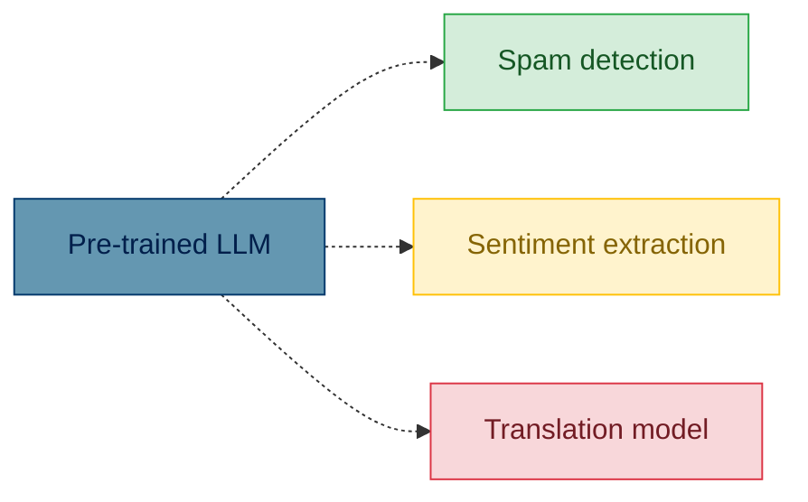
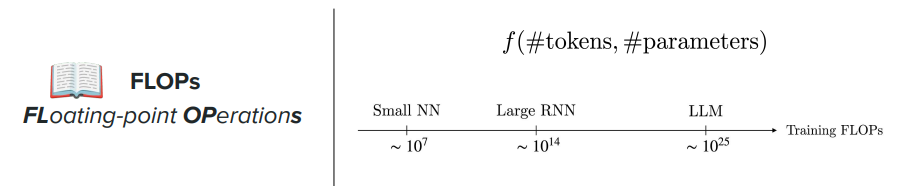
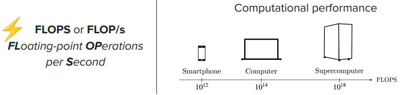
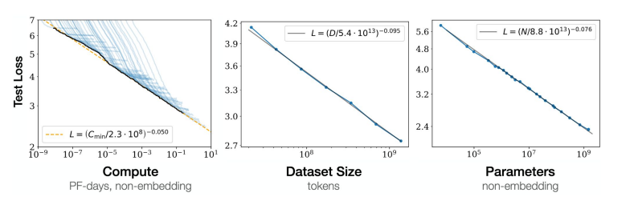
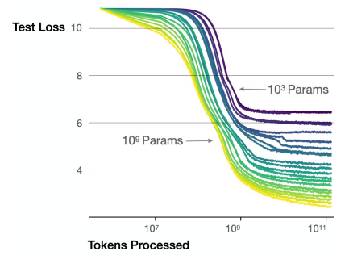
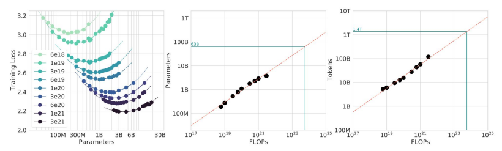
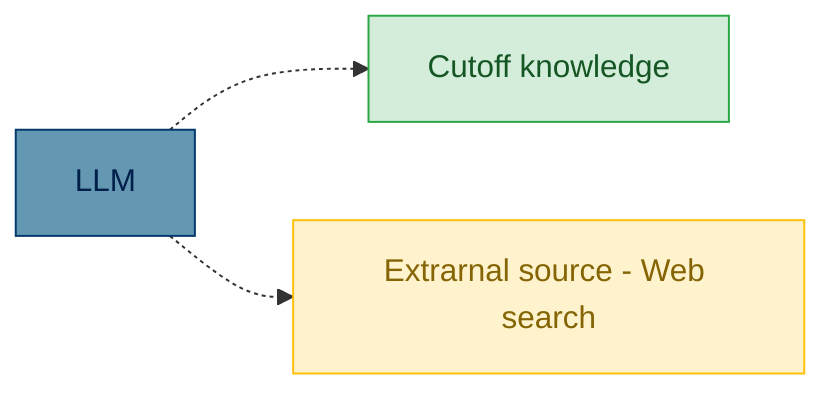

# LLM training

The traditional way of training language model was to train on a specific task

Training language models is highly expensive, so the idea is to use a pre-trained model and fine tune it for the 
specific task

This is what BERT does as explained here: [bert_deep_dive.md](../2-Tranformers%20based%20models/bert_deep_dive.md)

>So the pretrained model is trained with (MLM or NSP) to learn the "basics" of the target language. Then the same model is trained with the specific task trianing set

> The pre-training is <u>always</u> to predict the next token.

## Training data for pre-trained models

* natural language 
  * Common crawl (https://commoncrawl.org/) - Over 300 billion pages spanning 19 years.
  * Wikipedia
* Code
  * Github
  * StackOverflow

Examples are:

* GPT-3 trained on a training set of 300Bi of tokens
* Llama 3 15 Trilions

## Notation FLOP, FLOPS

## Performance 

How the model performance evolves as function of the model size and the training size

The following picture shows that for a certain amount of input tokens on the x-axis, a bigger model (the colors towards yellow)
produce less loss, therefore better performance

### Chinchilla law

Based on a fix amount of compute (FLOPS) what are the ideal model size and training set size.

The coloured lines are per compute size.

As a rule of thumbs, the ideal sizes are <u>training set size 20 times the model size</u>.

### Knowledge cutoff

> The knowledge of the model is updated up to the time of the update time of the training data provided.

This means that if the question is about information after that date the model can retrieve that info from 
external sources

